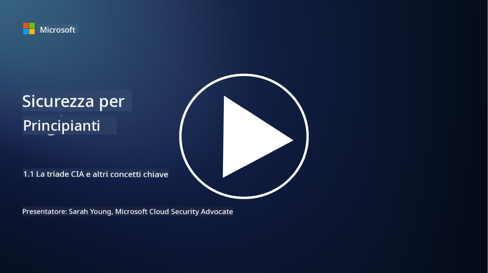
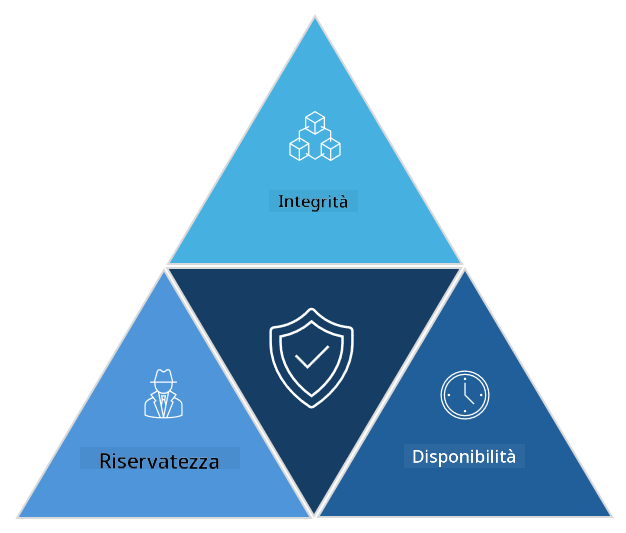

<!--
CO_OP_TRANSLATOR_METADATA:
{
  "original_hash": "16a76f9fa372fb63cffb6d76b855f023",
  "translation_date": "2025-09-03T21:41:13+00:00",
  "source_file": "1.1 The CIA triad and other key concepts.md",
  "language_code": "it"
}
-->
# La triade CIA e altri concetti chiave

## Introduzione

In questa lezione, tratteremo:

 - Cos'è la cybersecurity?
   
 
 - Cos'è la triade CIA della cybersecurity?

   

 - Cosa sono autenticità, non ripudio e privacy nel contesto della cybersecurity?

## Cos'è la cybersecurity?

La cybersecurity, nota anche come sicurezza delle informazioni, è la pratica di proteggere sistemi informatici, reti, dispositivi e dati da attacchi digitali, accessi non autorizzati, danni o furti. L'obiettivo principale della cybersecurity è garantire la riservatezza, l'integrità e la disponibilità degli asset e delle informazioni digitali. I professionisti della cybersecurity progettano e implementano controlli di sicurezza per proteggere asset, dati e informazioni. Con l'aumento della digitalizzazione e della vita online, la cybersecurity è diventata una priorità sia per i privati che per le organizzazioni.

## Cos'è la triade CIA della cybersecurity?

La triade della cybersecurity si riferisce al modello che incorpora le tre principali considerazioni per qualsiasi lavoro di cybersecurity o progettazione di un sistema/ambiente:

### Riservatezza

Questa è la considerazione che la maggior parte delle persone associa alla "cybersecurity": la riservatezza è il processo di protezione dei dati e delle informazioni da tentativi di accesso non autorizzati, ovvero solo le persone che hanno bisogno di vedere le informazioni possono accedervi. Tuttavia, non tutti i dati sono uguali, e i dati vengono solitamente classificati e protetti in base al danno che potrebbe verificarsi se fossero accessibili da persone non autorizzate.

### Integrità

Si riferisce alla protezione dell'accuratezza e dell'affidabilità dei dati contenuti negli ambienti, impedendo che i dati vengano alterati o modificati da individui non autorizzati. Ad esempio, uno studente modifica la propria data di nascita nel registro della motorizzazione per sembrare più grande e ottenere una nuova patente con una data di nascita precedente per acquistare alcolici.

### Disponibilità

Questa è una considerazione che riguarda l'IT operativo, ma la disponibilità è anche importante per la cybersecurity. Esistono tipi specifici di attacchi che mirano alla disponibilità e contro i quali i professionisti della sicurezza devono proteggersi (ad esempio, attacchi di tipo distributed denial of service – DDoS).

**Triade CIA della Cybersecurity**

## Cosa sono autenticità, non ripudio e privacy nel contesto della cybersecurity?

Questi sono concetti aggiuntivi importanti che riguardano la sicurezza e l'affidabilità di sistemi e dati:

**Autenticità** - si riferisce alla garanzia che l'informazione, la comunicazione o l'entità con cui si interagisce sia genuina e non sia stata manomessa o alterata da parti non autorizzate.

**Non ripudio** - è il concetto che garantisce che una parte non possa negare la propria partecipazione o l'autenticità di una transazione o comunicazione. Impedisce a qualcuno di affermare di non aver inviato un messaggio o compiuto un'azione particolare quando ci sono prove contrarie.

**Privacy** - si riferisce alla protezione delle informazioni sensibili e identificabili personalmente da accessi, utilizzi, divulgazioni o manipolazioni non autorizzati. Implica il controllo su chi ha accesso ai dati personali e su come tali dati vengono raccolti, archiviati e condivisi.

## Letture aggiuntive

[What Is Information Security (InfoSec)? | Microsoft Security](https://www.microsoft.com/security/business/security-101/what-is-information-security-infosec#:~:text=Three%20pillars%20of%20information%20security%3A%20the%20CIA%20triad,as%20guiding%20principles%20for%20implementing%20an%20InfoSec%20plan.)

---

**Disclaimer**:  
Questo documento è stato tradotto utilizzando il servizio di traduzione automatica [Co-op Translator](https://github.com/Azure/co-op-translator). Sebbene ci impegniamo per garantire l'accuratezza, si prega di notare che le traduzioni automatiche possono contenere errori o imprecisioni. Il documento originale nella sua lingua nativa dovrebbe essere considerato la fonte autorevole. Per informazioni critiche, si raccomanda una traduzione professionale effettuata da un traduttore umano. Non siamo responsabili per eventuali incomprensioni o interpretazioni errate derivanti dall'uso di questa traduzione.