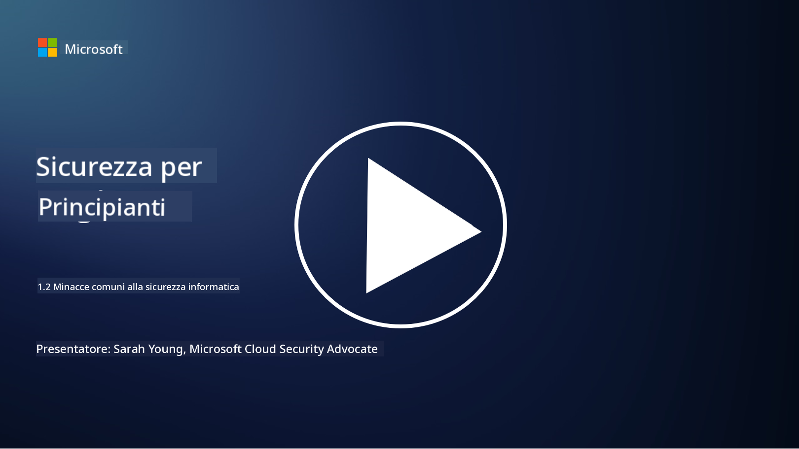

<!--
CO_OP_TRANSLATOR_METADATA:
{
  "original_hash": "6fc3030323139d7134a4ca9d03eccac9",
  "translation_date": "2025-09-03T20:15:58+00:00",
  "source_file": "1.2 Common cybersecurity threats.md",
  "language_code": "it"
}
-->
# Minacce comuni alla cybersecurity

## Introduzione

In questa lezione, tratteremo:

- Cos'è una minaccia alla cybersecurity?

- Perché gli attori malevoli vogliono compromettere dati e sistemi IT?

- Quali sono i tipi più comuni di minacce alla cybersecurity?

- Cos'è il framework MITRE ATT&CK?

- Dove posso rimanere aggiornato sul panorama delle minacce alla cybersecurity?

## Cos'è una minaccia alla cybersecurity?

Una minaccia alla cybersecurity si riferisce a qualsiasi potenziale pericolo o rischio che potrebbe compromettere la riservatezza, l'integrità o la disponibilità di dati o sistemi IT. Queste minacce sono poste da attori malevoli che cercano di sfruttare vulnerabilità per ottenere accesso non autorizzato, rubare informazioni sensibili, interrompere operazioni o causare danni a individui, organizzazioni o persino intere nazioni. Le minacce alla cybersecurity possono assumere diverse forme e colpire vari aspetti dei sistemi digitali e dei dati.

## Perché gli attori malevoli vogliono compromettere dati e sistemi IT?

Gli attori malevoli compromettono dati e sistemi IT per una varietà di motivi, spesso guidati da guadagni personali, motivazioni ideologiche o il desiderio di causare disordini. Comprendere queste motivazioni può aiutare organizzazioni e individui a difendersi meglio dalle minacce informatiche. Alcuni dei motivi comuni per cui gli attori malevoli intraprendono attacchi informatici includono:

1. **Guadagno finanziario**: Molti attacchi sono motivati dal desiderio di profitto economico. Gli attori malevoli possono rubare informazioni sensibili come numeri di carte di credito, dettagli di conti bancari o informazioni personali per commettere frodi, furti d'identità, chiedere un riscatto o vendere i dati rubati sul dark web.

2. **Spionaggio**: Stati nazionali, concorrenti o altre entità possono impegnarsi in spionaggio informatico per rubare dati sensibili governativi, aziendali o di ricerca per vantaggi politici, economici o militari.

3. **Interruzione e sabotaggio**: Alcuni attacchi mirano a interrompere infrastrutture critiche, servizi o operazioni per motivi politici o ideologici. Questi attacchi possono causare caos diffuso, perdite finanziarie e danni alla reputazione.

4. **Motivazioni ideologiche**: Hacktivisti e gruppi con motivazioni ideologiche o politiche possono compromettere sistemi per sensibilizzare su determinati temi, promuovere le loro convinzioni o protestare contro azioni o organizzazioni specifiche.

5. **Azioni involontarie**: Non tutte le azioni malevoli sono intenzionali; alcune persone possono contribuire inconsapevolmente alle minacce informatiche cadendo vittime di ingegneria sociale o facendo parte di una rete compromessa.

In definitiva, le motivazioni per compromettere dati e sistemi IT possono variare ampiamente, e l'impatto di questi attacchi può essere grave. È importante che individui, organizzazioni e governi prendano seriamente la cybersecurity e implementino misure per proteggersi da queste minacce.

## Quali sono i tipi più comuni di minacce alla cybersecurity?

Esistono diversi tipi comuni di attacchi informatici che gli attori malevoli utilizzano per compromettere sistemi, rubare dati e causare interruzioni. Ecco alcuni dei tipi più diffusi al momento della stesura:

1. **Phishing**:

Il phishing consiste nell'invio di email o messaggi ingannevoli che sembrano provenire da fonti legittime per indurre i destinatari a rivelare informazioni sensibili, come password, numeri di carte di credito o dettagli personali. Il phishing può anche portare le vittime su siti web malevoli o a scaricare malware.

2. **Malware**:

Il malware (software malevolo) comprende una gamma di programmi dannosi progettati per infettare sistemi, rubare dati o causare danni. Tipi di malware includono:

- **Ransomware**: Cifra i file e richiede un riscatto per la loro decrittazione.

- **Trojan**: Mascherati da software legittimi, consentono agli attaccanti accesso non autorizzato.

- **Virus**: Programmi auto-replicanti che si attaccano ai file e si diffondono.

- **Worms**: Programmi auto-replicanti che si diffondono attraverso le reti.

3. **Denial of Service (DoS) e Distributed Denial of Service (DDoS)**:

Gli attacchi DoS sovraccaricano un sistema bersaglio, rendendolo inaccessibile agli utenti. Gli attacchi DDoS coinvolgono una rete di dispositivi compromessi per inondare un bersaglio di traffico, rendendo difficile il funzionamento del sistema o bloccandolo completamente.

4. **SQL Injection**:

In questo attacco, gli attaccanti manipolano i campi di input di un'applicazione web per iniettare query SQL malevoli, ottenendo potenzialmente accesso non autorizzato a database e dati sensibili.

5. **Cross-Site Scripting (XSS)**:

Gli attaccanti iniettano script malevoli nelle applicazioni web, che vengono poi eseguiti dai browser degli utenti ignari. Questo può portare al furto di dati degli utenti e/o alla diffusione di malware.

6. **Ingegneria sociale**:

L'ingegneria sociale sfrutta la psicologia umana per manipolare le persone a divulgare informazioni riservate o compiere azioni che compromettono la sicurezza.

7. **Exploits Zero-Day (0day)**:

Questi attacchi prendono di mira vulnerabilità in software o hardware che non sono ancora conosciute dal fornitore o dal pubblico. Gli attaccanti sfruttano queste vulnerabilità prima che vengano sviluppate patch. Molte organizzazioni temono gli zero-day poiché non esiste una patch per affrontarli, ma non sono così comuni come gli altri attacchi in questa lista. Quando viene scoperto uno zero-day, i ricercatori di sicurezza lavorano rapidamente per creare una patch, rendendo gli zero-day generalmente di breve durata.

8. **Attacchi alle credenziali**:

Questi attacchi includono attacchi brute force, in cui gli attaccanti indovinano ripetutamente le password, e attacchi di credential stuffing, in cui credenziali rubate da un sito vengono utilizzate per tentare l'accesso su altri siti.

## Cos'è il framework MITRE ATT&CK?

Il [framework MITRE ATT&CK](https://attack.mitre.org/) (Adversarial Tactics, Techniques, and Common Knowledge) è un framework che cataloga e categorizza le tattiche, tecniche e procedure (TTPs) che gli avversari utilizzano durante gli attacchi informatici. Il framework è stato creato dalla MITRE Corporation, un'organizzazione senza scopo di lucro che gestisce centri di ricerca e sviluppo per varie agenzie governative.

Il framework MITRE ATT&CK fornisce un modo standardizzato per descrivere e analizzare le minacce informatiche, consentendo ai professionisti della cybersecurity di comprendere meglio e difendersi da varie tecniche di attacco. È ampiamente utilizzato da team di sicurezza, cacciatori di minacce e rispondenti agli incidenti per:

1. **Comprendere il comportamento degli avversari**: Il framework documenta comportamenti di attacco reali, delineando i passaggi che gli attaccanti compiono dall'ingresso iniziale al raggiungimento dei loro obiettivi. Copre una vasta gamma di tecniche di attacco utilizzate da diversi gruppi di minacce.

2. **Pianificare e implementare strategie di difesa**: I team di sicurezza possono utilizzare il framework per sviluppare strategie di difesa proattive che si allineano alle specifiche tattiche e tecniche che gli avversari potrebbero impiegare.

3. **Risposta agli incidenti e caccia alle minacce**: Durante le indagini sugli incidenti o la caccia alle minacce, i professionisti della sicurezza possono fare riferimento al framework per identificare e mitigare tecniche specifiche utilizzate dagli attaccanti.

Il framework MITRE ATT&CK è organizzato in matrici che raggruppano tecniche di attacco basate su piattaforme e ambienti specifici, come Windows, macOS, Linux e servizi cloud. Ogni matrice è divisa in tattiche (obiettivi di alto livello) e tecniche (metodi specifici utilizzati per raggiungere quegli obiettivi). Per ogni tecnica, il framework fornisce informazioni su come funziona, potenziali mitigazioni e riferimenti rilevanti a gruppi di minacce reali che hanno utilizzato la tecnica.

Il framework viene continuamente aggiornato e ampliato man mano che vengono raccolte nuove informazioni sulle minacce e il panorama della cybersecurity evolve. È una risorsa preziosa per migliorare la postura di cybersecurity di un'organizzazione, consentendo una comprensione più approfondita di come operano gli attaccanti e come difendersi dalle loro tattiche.

## Dove posso rimanere aggiornato sul panorama delle minacce alla cybersecurity?

Esistono molte fonti che possono essere utilizzate per rimanere aggiornati sulle minacce alla cybersecurity, ecco una selezione:

- [Open Web Application Security Project (OWASP) top 10 vulnerabilities](https://owasp.org/Top10/)
- [Common Vulnerabilities and Exposures (CVEs)](https://www.bing.com/ck/a?!&&p=53df6007f017bca2JmltdHM9MTY5MjU3NjAwMCZpZ3VpZD0zYmY4N2RiYS1jYWI1LTYwMDgtMWY1YS02ZmYyY2JjNjYxZWUmaW5zaWQ9NTc2OQ&ptn=3&hsh=3&fclid=3bf87dba-cab5-6008-1f5a-6ff2cbc661ee&psq=cve&u=a1aHR0cHM6Ly9iaW5nLmNvbS9hbGluay9saW5rP3VybD1odHRwcyUzYSUyZiUyZmN2ZS5taXRyZS5vcmclMmYmc291cmNlPXNlcnAtcnImaD1BZXN4S0VBWTNnbGhNZEFpd3daMlNSZkZQNTlrODhIUnYxRUtlSkY1RTk0JTNkJnA9a2NvZmZjaWFsd2Vic2l0ZQ&ntb=1 "Common Vulnerabilities and Exposures")
- [Microsoft Security Response Center blogs](https://msrc.microsoft.com/blog/)
- [National Institute of Standards and Technology (NIST)](https://www.dhs.gov/topics/cybersecurity): NIST fornisce risorse, avvisi e aggiornamenti sulle potenziali minacce alla cybersecurity.
- [Cybersecurity and Infrastructure Security Agency (CISA)](https://www.cisa.gov/resources-tools/resources/free-cybersecurity-services-and-tools): CISA fornisce risorse di cybersecurity e migliori pratiche per aziende, agenzie governative e altre organizzazioni. CISA condivide informazioni aggiornate sui tipi di attività di sicurezza ad alto impatto che interessano la comunità e analisi approfondite su nuove ed emergenti minacce informatiche.
- [National Cybersecurity Center of Excellence (NCCoE)](https://www.dhs.gov/topics/cybersecurity): NCCoE è un hub che fornisce soluzioni pratiche di cybersecurity applicabili in situazioni reali.
- [US-CERT](https://www.cisa.gov/resources-tools/resources/free-cybersecurity-services-and-tools): Il United States Computer Emergency Readiness Team (US-CERT) offre una varietà di risorse di cybersecurity, inclusi avvisi, suggerimenti e altro.
- Il CERT del tuo paese

---

**Disclaimer**:  
Questo documento è stato tradotto utilizzando il servizio di traduzione automatica [Co-op Translator](https://github.com/Azure/co-op-translator). Sebbene ci impegniamo per garantire l'accuratezza, si prega di notare che le traduzioni automatiche possono contenere errori o imprecisioni. Il documento originale nella sua lingua nativa dovrebbe essere considerato la fonte autorevole. Per informazioni critiche, si raccomanda una traduzione professionale effettuata da un traduttore umano. Non siamo responsabili per eventuali incomprensioni o interpretazioni errate derivanti dall'uso di questa traduzione.