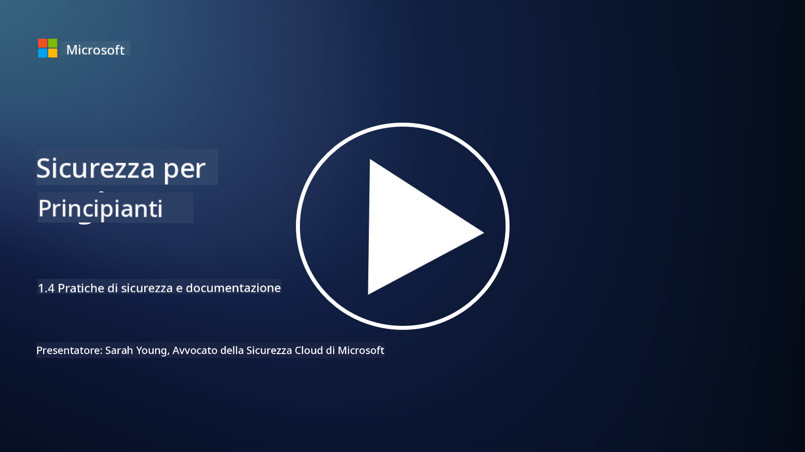

<!--
CO_OP_TRANSLATOR_METADATA:
{
  "original_hash": "d33500902124e52870935bdce4546fcc",
  "translation_date": "2025-09-03T21:01:11+00:00",
  "source_file": "1.4 Security practices and documentation.md",
  "language_code": "it"
}
-->
# Pratiche di sicurezza e documentazione

Potresti aver sentito le frasi "politica di sicurezza", "standard di sicurezza", ecc., ma la realtà è che molti professionisti della cybersecurity non le usano correttamente. In questa sezione spiegheremo cosa significano ciascuna di queste frasi e perché un'organizzazione le utilizza.

## Introduzione

In questa lezione, tratteremo:

- Cos'è una politica di sicurezza?

- Cos'è uno standard di sicurezza?

- Cos'è un baseline di sicurezza?

- Cos'è una linea guida di sicurezza?

- Cos'è una procedura di sicurezza?

- Cosa sono le leggi e i regolamenti nel contesto della cybersecurity?

Questi termini sono spesso utilizzati nel contesto della cybersecurity per definire diversi livelli di documentazione e pratiche di sicurezza all'interno di un'organizzazione. Chiarifichiamo ciascun termine:

## Cos'è una politica di sicurezza?

Una politica di sicurezza è un documento di alto livello che delinea gli obiettivi, i principi e le linee guida generali di sicurezza di un'organizzazione. Fornisce un quadro per prendere decisioni relative alla sicurezza e stabilisce il tono per l'approccio alla sicurezza dell'organizzazione. Le politiche di sicurezza generalmente trattano argomenti come l'uso accettabile delle risorse, la protezione dei dati, il controllo degli accessi, la risposta agli incidenti e altro. Una politica è indipendente da soluzioni e tecnologie. Un esempio di politica di sicurezza che molti conoscono potrebbe essere la politica di utilizzo accettabile di un'organizzazione.

## Cos'è uno standard di sicurezza?

Uno standard di sicurezza è un documento più dettagliato e specifico che fornisce linee guida e requisiti per implementare controlli e misure di sicurezza all'interno di un'organizzazione. Gli standard sono più concreti e tecnici rispetto alle politiche, offrendo istruzioni e raccomandazioni specifiche per configurare e mantenere sistemi, reti e processi al fine di raggiungere obiettivi di sicurezza. Un esempio di standard di sicurezza potrebbe essere _"Tutti i dati interni devono essere crittografati sia a riposo che in transito."_

## Cos'è un baseline di sicurezza?

Un baseline di sicurezza è un insieme di configurazioni minime di sicurezza considerate essenziali per un determinato sistema, applicazione o ambiente in un dato momento. Definisce un punto di partenza per la sicurezza che dovrebbe essere implementato in tutte le istanze pertinenti. I baseline di sicurezza aiutano a garantire coerenza e un certo livello di sicurezza nell'infrastruttura IT di un'organizzazione. Un esempio di baseline di sicurezza potrebbe essere _"Le VM di Azure non devono avere accesso diretto a Internet."_

## Cos'è una linea guida di sicurezza?

Una linea guida di sicurezza è un documento che offre raccomandazioni e indicazioni quando uno standard di sicurezza specifico non si applica. Le linee guida cercano di affrontare le "zone grigie" che emergono quando uno standard non copre, o copre solo parzialmente, una questione.

## Cos'è una procedura di sicurezza?

Una procedura di sicurezza è una guida dettagliata passo-passo che delinea le azioni e i compiti specifici che devono essere eseguiti per portare a termine un processo o un'attività legata alla sicurezza. Le procedure sono documenti pratici e attuabili che forniscono una sequenza chiara di azioni da seguire durante la risposta agli incidenti, la manutenzione dei sistemi, l'onboarding degli utenti e altre attività legate alla sicurezza. Un esempio di procedura di sicurezza potrebbe essere _"Quando un incidente di sicurezza P1 viene generato da Microsoft Sentinel, il centro operativo di sicurezza (SOC) deve informare immediatamente il responsabile della sicurezza di turno e inviare i dettagli dell'incidente a quest'ultimo."_

In sintesi, questi termini rappresentano diversi livelli di documentazione e orientamento all'interno del framework di cybersecurity di un'organizzazione. Le politiche di sicurezza stabiliscono gli obiettivi di alto livello, gli standard forniscono requisiti dettagliati, i baseline definiscono configurazioni minime di sicurezza, le linee guida offrono migliori pratiche e le procedure forniscono passaggi attuabili per i processi di sicurezza.

## Cosa sono le leggi/regolamenti nel contesto della cybersecurity?

Le leggi e i regolamenti si riferiscono a quadri legali stabiliti da governi e organismi regolatori per definire e far rispettare regole, standard e requisiti per la protezione dei sistemi digitali, dei dati e delle informazioni. Queste leggi e regolamenti variano a seconda della giurisdizione e si concentrano su diversi aspetti della cybersecurity, inclusa la protezione dei dati, la privacy, la segnalazione degli incidenti e la sicurezza delle infrastrutture critiche. Ecco alcuni esempi di leggi e regolamenti relativi alla cybersecurity: ad esempio, il Regolamento Generale sulla Protezione dei Dati (GDPR), la Legge sulla Portabilità e Responsabilità dell'Assicurazione Sanitaria (HIPAA), il California Consumer Privacy Act (CCPA), lo Standard di Sicurezza dei Dati per l'Industria delle Carte di Pagamento (PCI DSS).

## Ulteriori letture

[Modelli di Politica di Sicurezza delle Informazioni | SANS Institute](https://www.sans.org/information-security-policy/)

[Conformità con le Leggi e i Regolamenti sulla Cybersecurity e la Privacy | NIST](https://www.nist.gov/mep/cybersecurity-resources-manufacturers/compliance-cybersecurity-and-privacy-laws-and-regulations)

---

**Disclaimer**:  
Questo documento è stato tradotto utilizzando il servizio di traduzione automatica [Co-op Translator](https://github.com/Azure/co-op-translator). Sebbene ci impegniamo per garantire l'accuratezza, si prega di notare che le traduzioni automatiche possono contenere errori o imprecisioni. Il documento originale nella sua lingua nativa dovrebbe essere considerato la fonte autorevole. Per informazioni critiche, si raccomanda una traduzione professionale effettuata da un traduttore umano. Non siamo responsabili per eventuali incomprensioni o interpretazioni errate derivanti dall'uso di questa traduzione.