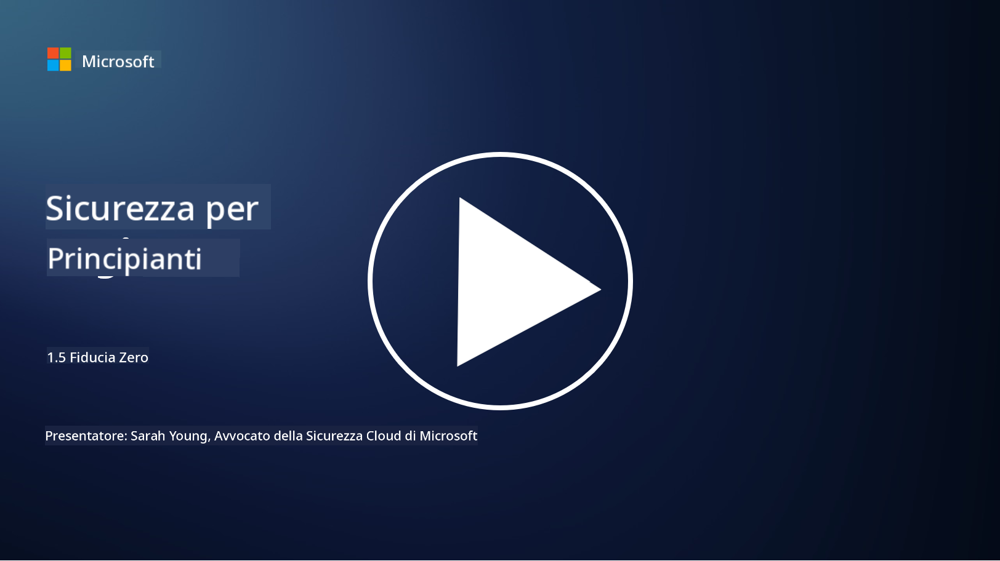
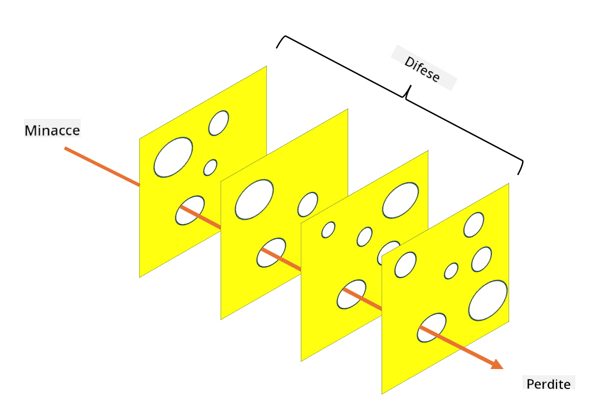

<!--
CO_OP_TRANSLATOR_METADATA:
{
  "original_hash": "75f77f972d2233c584f87c1eb96c983b",
  "translation_date": "2025-09-03T20:33:27+00:00",
  "source_file": "1.5 Zero trust.md",
  "language_code": "it"
}
-->
# Zero Trust

"Zero trust" è una frase molto utilizzata nei circoli di sicurezza al giorno d'oggi. Ma cosa significa, è solo una parola alla moda? In questa lezione, approfondiremo esattamente cosa sia il modello zero trust.

## Introduzione

- In questa lezione, tratteremo:

- Cos'è il modello zero trust?

- In che modo il modello zero trust differisce dalle architetture di sicurezza tradizionali?

- Cos'è la difesa in profondità?

## Zero Trust

Zero Trust è un approccio alla cybersecurity che sfida la tradizionale nozione di "fidarsi ma verificare", assumendo che nessuna entità, sia interna che esterna alla rete di un'organizzazione, debba essere intrinsecamente considerata affidabile. Invece, Zero Trust promuove la verifica di ogni utente, dispositivo e applicazione che tenta di accedere alle risorse, indipendentemente dalla loro posizione. Il principio fondamentale di Zero Trust è minimizzare la "superficie di attacco" e ridurre l'impatto potenziale delle violazioni di sicurezza.

Nel modello Zero Trust, vengono enfatizzati i seguenti principi:

1. **Verifica dell'identità**: L'autenticazione e l'autorizzazione vengono applicate rigorosamente a tutti gli utenti e dispositivi, indipendentemente dalla loro posizione. Ricorda che un'identità non è necessariamente umana: può essere un dispositivo, un'applicazione, ecc.

2. **Minimo privilegio**: Agli utenti e ai dispositivi viene concesso il livello minimo di accesso necessario per svolgere i loro compiti, riducendo i danni potenziali in caso di compromissione.

3. **Micro-segmentazione**: Le risorse di rete vengono suddivise in segmenti più piccoli per limitare i movimenti laterali all'interno della rete in caso di violazione.

4. **Monitoraggio continuo**: Viene condotto un monitoraggio e un'analisi costante del comportamento di utenti e dispositivi per rilevare anomalie e minacce potenziali. Le moderne tecniche di monitoraggio utilizzano anche machine learning, intelligenza artificiale e intelligence sulle minacce per fornire ulteriori dettagli e contesto.

5. **Crittografia dei dati**: I dati vengono crittografati sia durante il transito che a riposo per prevenire accessi non autorizzati.

6. **Controllo rigoroso degli accessi**: I controlli di accesso vengono applicati in base al contesto, come i ruoli degli utenti, lo stato di salute dei dispositivi e la posizione della rete.

Microsoft suddivide il modello zero trust in cinque pilastri, che discuteremo in una lezione successiva.

## Differenze rispetto alle architetture di sicurezza tradizionali

Zero Trust differisce dalle architetture di sicurezza tradizionali, come i modelli basati sul perimetro, in diversi modi:

1. **Perimetro vs. Identità-Centrico**: I modelli tradizionali si concentrano sulla protezione del perimetro della rete, assumendo che utenti e dispositivi interni possano essere considerati affidabili una volta all'interno. Zero Trust, invece, assume che le minacce possano provenire sia dall'interno che dall'esterno della rete e applica controlli rigorosi basati sull'identità.

2. **Fiducia implicita vs. esplicita**: I modelli tradizionali si basano sulla fiducia implicita verso dispositivi e utenti all'interno della rete fino a prova contraria. Zero Trust verifica esplicitamente le identità e monitora continuamente per rilevare anomalie.

3. **Rete piatta vs. segmentata**: Le architetture tradizionali spesso prevedono reti piatte in cui gli utenti interni hanno accesso ampio. Zero Trust promuove la segmentazione della rete in zone più piccole e isolate per contenere eventuali violazioni.

4. **Reattivo vs. Proattivo**: La sicurezza tradizionale si basa spesso su misure reattive come firewall perimetrali e sistemi di rilevamento delle intrusioni. Zero Trust adotta un approccio proattivo, assumendo che le violazioni siano probabili e minimizzandone l'impatto.

## Difesa in profondità

La difesa in profondità, nota anche come sicurezza stratificata, è una strategia di cybersecurity che prevede l'implementazione di più livelli di controlli e misure di sicurezza per proteggere le risorse di un'organizzazione. L'obiettivo è creare livelli di difesa sovrapposti, in modo che se un livello viene violato, gli altri possano comunque fornire protezione. Ogni livello si concentra su un aspetto diverso della sicurezza e aumenta la postura complessiva di sicurezza di un'organizzazione.

La difesa in profondità prevede una combinazione di misure di sicurezza tecniche, procedurali e fisiche. Queste possono includere firewall, sistemi di rilevamento delle intrusioni, controlli di accesso, crittografia, formazione degli utenti, politiche di sicurezza e altro. L'idea è creare più barriere che, collettivamente, rendano difficile per gli attaccanti penetrare nei sistemi e nelle reti di un'organizzazione. Questo modello è talvolta noto come "modello del formaggio svizzero", utilizzato anche nella prevenzione degli incidenti in altri settori (ad esempio, trasporti).

## Ulteriori letture

[Cos'è il modello Zero Trust?](https://learn.microsoft.com/security/zero-trust/zero-trust-overview?WT.mc_id=academic-96948-sayoung)

[Zero Trust in evoluzione – Documento di posizione Microsoft](https://query.prod.cms.rt.microsoft.com/cms/api/am/binary/RWJJdT?WT.mc_id=academic-96948-sayoung)

[Zero Trust e BeyondCorp Google Cloud | Blog di Google Cloud](https://cloud.google.com/blog/topics/developers-practitioners/zero-trust-and-beyondcorp-google-cloud)

---

**Disclaimer**:  
Questo documento è stato tradotto utilizzando il servizio di traduzione automatica [Co-op Translator](https://github.com/Azure/co-op-translator). Sebbene ci impegniamo per garantire l'accuratezza, si prega di notare che le traduzioni automatiche possono contenere errori o imprecisioni. Il documento originale nella sua lingua nativa dovrebbe essere considerato la fonte autorevole. Per informazioni critiche, si raccomanda una traduzione professionale effettuata da un traduttore umano. Non siamo responsabili per eventuali incomprensioni o interpretazioni errate derivanti dall'uso di questa traduzione.