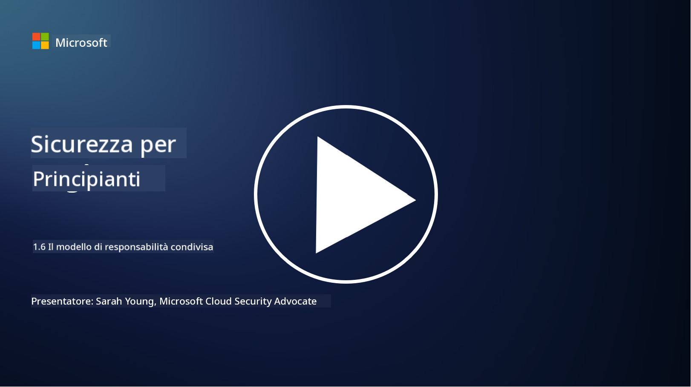

<!--
CO_OP_TRANSLATOR_METADATA:
{
  "original_hash": "a48db640d80c786b928ca178c414f084",
  "translation_date": "2025-09-03T21:06:25+00:00",
  "source_file": "1.6 Shared responsibility model.md",
  "language_code": "it"
}
-->
# Il modello di responsabilità condivisa

La responsabilità condivisa è un concetto relativamente nuovo nell'IT, nato con l'avvento del cloud computing. Dal punto di vista della cybersecurity, è fondamentale comprendere chi fornisce quali controlli di sicurezza, in modo da evitare lacune nella difesa.

## Introduzione

In questa lezione, tratteremo:

 - Cos'è la responsabilità condivisa nel contesto della cybersecurity?
   
 - Qual è la differenza nella responsabilità condivisa per i controlli di sicurezza
   tra IaaS, PaaS e SaaS?

   

 - Dove puoi trovare informazioni sui controlli di sicurezza forniti dalla tua piattaforma cloud?

   
 

 - Cosa significa "fidarsi ma verificare"?

## Cos'è la responsabilità condivisa nel contesto della cybersecurity?

La responsabilità condivisa nella cybersecurity si riferisce alla distribuzione delle responsabilità di sicurezza tra un fornitore di servizi cloud (CSP) e i suoi clienti. Negli ambienti di cloud computing, come Infrastructure as a Service (IaaS), Platform as a Service (PaaS) e Software as a Service (SaaS), sia il CSP che il cliente hanno ruoli da svolgere per garantire la sicurezza dei dati, delle applicazioni e dei sistemi.

## Qual è la differenza nella responsabilità condivisa per i controlli di sicurezza tra IaaS, PaaS e SaaS?

La divisione delle responsabilità dipende generalmente dal tipo di servizio cloud utilizzato:

 - **IaaS (Infrastructure as a Service)**: Il CSP fornisce l'infrastruttura di base (server, rete, archiviazione), mentre il cliente è responsabile della gestione dei sistemi operativi, delle applicazioni e delle configurazioni di sicurezza su quell'infrastruttura.
   
   
 - **PaaS (Platform as a Service):** Il CSP offre una piattaforma su cui i clienti possono costruire e distribuire applicazioni. Il CSP gestisce l'infrastruttura sottostante, mentre il cliente si concentra sullo sviluppo delle applicazioni e sulla sicurezza dei dati.

   

 - **SaaS (Software as a Service)**: Il CSP fornisce applicazioni completamente funzionali accessibili via internet. In questo caso, il CSP è responsabile della sicurezza dell'applicazione e dell'infrastruttura, mentre il cliente gestisce l'accesso degli utenti e l'utilizzo dei dati.

Comprendere la responsabilità condivisa è cruciale perché chiarisce quali aspetti della sicurezza sono coperti dal CSP e quali devono essere affrontati dal cliente. Aiuta a prevenire malintesi e garantisce che le misure di sicurezza siano implementate in modo olistico.

## Dove puoi trovare informazioni sui controlli di sicurezza forniti dalla tua piattaforma cloud?

Per scoprire quali controlli di sicurezza offre la tua piattaforma cloud, devi fare riferimento alla documentazione e alle risorse del fornitore di servizi cloud. Questi includono:

 - **Sito web e documentazione del CSP**: il sito web del CSP conterrà informazioni sulle funzionalità di sicurezza e sui controlli offerti come parte dei loro servizi. I CSP solitamente offrono documentazione dettagliata che spiega le loro pratiche di sicurezza, i controlli e le raccomandazioni. Questo potrebbe includere whitepaper, guide di sicurezza e documentazione tecnica.
   
 - **Valutazioni e audit di sicurezza**: la maggior parte dei CSP sottopone i propri controlli di sicurezza a valutazioni da parte di esperti e organizzazioni indipendenti. Queste revisioni possono fornire informazioni sulla qualità delle misure di sicurezza del CSP. A volte questo porta il CSP a ottenere un certificato di conformità alla sicurezza (vedi il punto successivo).
 - **Certificazioni di conformità alla sicurezza**: la maggior parte dei CSP ottiene certificazioni come ISO:27001, SOC 2 e FedRAMP, ecc. Queste certificazioni dimostrano che il fornitore soddisfa specifici standard di sicurezza e conformità.

Ricorda che il livello di dettaglio e la disponibilità delle informazioni possono variare tra i fornitori di cloud. Assicurati sempre di consultare risorse ufficiali e aggiornate fornite dal fornitore di servizi cloud per prendere decisioni informate sulla sicurezza dei tuoi asset basati sul cloud.

## Cosa significa "fidarsi ma verificare"?

Nel contesto dell'utilizzo di un CSP, software di terze parti o altri servizi di sicurezza IT, un'organizzazione potrebbe inizialmente fidarsi delle affermazioni del fornitore riguardo alle misure di sicurezza. Tuttavia, per garantire realmente la sicurezza dei propri dati e sistemi, dovrebbe verificare queste affermazioni attraverso valutazioni di sicurezza, test di penetrazione e una revisione dei controlli di sicurezza della parte esterna prima di integrare completamente il software o il servizio nelle proprie operazioni. Tutti gli individui e le organizzazioni dovrebbero cercare di fidarsi ma verificare i controlli di sicurezza di cui non sono direttamente responsabili.

## Responsabilità condivisa all'interno di un'organizzazione

Ricorda, la responsabilità condivisa per la sicurezza all'interno di un'organizzazione tra i diversi team deve essere presa in considerazione. Il team di sicurezza raramente implementerà tutti i controlli da solo e avrà bisogno di collaborare con i team operativi, gli sviluppatori e altre parti dell'azienda per implementare tutti i controlli di sicurezza necessari per mantenere un'organizzazione sicura.

## Ulteriori letture
- [Shared responsibility in the cloud - Microsoft Azure | Microsoft Learn](https://learn.microsoft.com/azure/security/fundamentals/shared-responsibility?WT.mc_id=academic-96948-sayoung)
- [What is shared responsibility model? – Definition from TechTarget.com](https://www.techtarget.com/searchcloudcomputing/definition/shared-responsibility-model)
- [The shared responsibility model explained and what it means for cloud security | CSO Online](https://www.csoonline.com/article/570779/the-shared-responsibility-model-explained-and-what-it-means-for-cloud-security.html)
- [Shared Responsibility for Cloud Security: What You Need to Know (cisecurity.org)](https://www.cisecurity.org/insights/blog/shared-responsibility-cloud-security-what-you-need-to-know)

---

**Disclaimer**:  
Questo documento è stato tradotto utilizzando il servizio di traduzione automatica [Co-op Translator](https://github.com/Azure/co-op-translator). Sebbene ci impegniamo per garantire l'accuratezza, si prega di notare che le traduzioni automatiche possono contenere errori o imprecisioni. Il documento originale nella sua lingua nativa dovrebbe essere considerato la fonte autorevole. Per informazioni critiche, si raccomanda una traduzione professionale effettuata da un traduttore umano. Non siamo responsabili per eventuali fraintendimenti o interpretazioni errate derivanti dall'uso di questa traduzione.