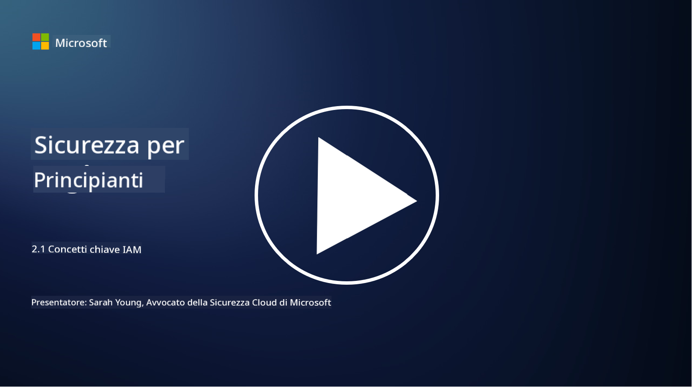

<!--
CO_OP_TRANSLATOR_METADATA:
{
  "original_hash": "2e3864e3d579f0dbb4ac2ec8c5f82acf",
  "translation_date": "2025-09-03T19:38:26+00:00",
  "source_file": "2.1 IAM key concepts.md",
  "language_code": "it"
}
-->
# Concetti chiave di IAM

Hai mai effettuato l'accesso a un computer o a un sito web? Certo che sì! Questo significa che hai già utilizzato controlli di identità nella tua vita quotidiana. La gestione delle identità e degli accessi (IAM) è un pilastro fondamentale della sicurezza, ne approfondiremo il significato nelle prossime lezioni.

**Introduzione**

In questa lezione, tratteremo:

- Cosa intendiamo per gestione delle identità e degli accessi (IAM) nel
  contesto della cybersicurezza?
  
- Qual è il principio del minimo privilegio?
  
- Cos'è la separazione dei compiti?
  
- Cosa sono l'autenticazione e l'autorizzazione?

## Cosa intendiamo per gestione delle identità e degli accessi (IAM) nel contesto della cybersicurezza?

La gestione delle identità e degli accessi (IAM) si riferisce a un insieme di processi, tecnologie e politiche implementati per garantire che le persone giuste abbiano accesso appropriato alle risorse all'interno dell'ambiente digitale di un'organizzazione. IAM implica la gestione delle identità digitali (utenti, dipendenti, partner) e del loro accesso a sistemi, applicazioni, dati e reti. L'obiettivo principale di IAM è migliorare la sicurezza, semplificare l'accesso degli utenti e garantire la conformità alle politiche e normative aziendali. Le soluzioni IAM generalmente includono autenticazione degli utenti, autorizzazione, provisioning delle identità, controllo degli accessi e gestione del ciclo di vita degli utenti (assicurandosi che gli account vengano eliminati quando non sono più utilizzati).

## Qual è il principio del minimo privilegio?

Il principio del minimo privilegio è un concetto fondamentale che promuove la concessione agli utenti e ai sistemi solo dei privilegi minimi necessari per svolgere i loro compiti o ruoli previsti. Questo principio aiuta a limitare i danni potenziali in caso di violazione della sicurezza o minaccia interna. Seguendo il principio del minimo privilegio, le organizzazioni riducono la superficie di attacco e minimizzano il rischio di accessi non autorizzati, violazioni dei dati e uso improprio accidentale dei privilegi. In pratica, ciò significa che agli utenti viene concesso l'accesso solo alle risorse e alle funzionalità specifiche necessarie per il loro ruolo lavorativo, e nulla di più. Ad esempio, se hai bisogno solo di leggere un documento, sarebbe eccessivo concederti privilegi amministrativi completi su quel documento.

## Cos'è la separazione dei compiti?

La separazione dei compiti è un principio volto a prevenire conflitti di interesse e ridurre il rischio di frodi ed errori distribuendo compiti e responsabilità critici tra diverse persone all'interno di un'organizzazione. Nel contesto della cybersicurezza, la separazione dei compiti implica garantire che nessun individuo abbia il controllo su tutti gli aspetti di un processo o sistema critico. L'obiettivo è creare un sistema di controlli e bilanciamenti che impedisca a una singola persona di avere la capacità di eseguire sia la fase di configurazione che quella di approvazione di un processo. Ad esempio, nei sistemi finanziari, ciò potrebbe significare che la persona che inserisce le transazioni nel sistema non dovrebbe essere la stessa che approva quelle transazioni. Questo riduce il rischio che azioni non autorizzate o fraudolente passino inosservate.

## Cosa sono l'autenticazione e l'autorizzazione?

Autenticazione e autorizzazione sono due concetti fondamentali nella cybersicurezza che svolgono un ruolo cruciale nel garantire la sicurezza e l'integrità dei sistemi informatici e dei dati. Vengono spesso utilizzati insieme per controllare l'accesso alle risorse e proteggere le informazioni sensibili.

**1. Autenticazione**: L'autenticazione è il processo di verifica dell'identità di un utente, sistema o entità che tenta di accedere a un sistema informatico o a una risorsa specifica. Garantisce che l'identità dichiarata sia autentica e accurata. I metodi di autenticazione generalmente coinvolgono l'uso di uno o più dei seguenti fattori:
    
    a. Qualcosa che conosci: Include password, PIN o altre informazioni segrete che solo l'utente autorizzato dovrebbe possedere.
    
    b. Qualcosa che possiedi: Coinvolge token fisici o dispositivi come smart card, token di sicurezza o telefoni cellulari utilizzati per confermare l'identità dell'utente.
    
    c. Qualcosa che sei: Si riferisce a fattori biometrici come impronte digitali, riconoscimento facciale o scansioni retiniche uniche per un individuo.
    

I meccanismi di autenticazione vengono utilizzati per confermare che un utente è chi dichiara di essere prima di consentire l'accesso a un sistema o risorsa. Aiuta a prevenire accessi non autorizzati e garantisce che solo gli utenti legittimi possano eseguire azioni all'interno di un sistema.

**2. Autorizzazione**: L'autorizzazione è il processo di concessione o negazione di permessi e privilegi specifici agli utenti o entità autenticati una volta verificata la loro identità. Determina quali azioni o operazioni un utente è autorizzato a eseguire all'interno di un sistema o su risorse specifiche. L'autorizzazione si basa spesso su politiche predefinite, regole di controllo degli accessi e ruoli assegnati agli utenti.

L'autorizzazione può essere vista come la risposta alla domanda: "Cosa può fare un utente autenticato?" Implica la definizione e l'applicazione di politiche di controllo degli accessi per proteggere dati e risorse sensibili da accessi o modifiche non autorizzati.

**In sintesi:**

- L'autenticazione stabilisce l'identità degli utenti o delle entità.
- L'autorizzazione determina quali azioni e risorse gli utenti autenticati possono accedere o manipolare.

## Ulteriori letture

- [Describe identity concepts - Training | Microsoft Learn](https://learn.microsoft.com/training/modules/describe-identity-principles-concepts/?WT.mc_id=academic-96948-sayoung)
- [Introduction to identity - Microsoft Entra | Microsoft Learn](https://learn.microsoft.com/azure/active-directory/fundamentals/identity-fundamental-concepts?WT.mc_id=academic-96948-sayoung)
- [What is Identity Access Management (IAM)? | Microsoft Security](https://www.microsoft.com/security/business/security-101/what-is-identity-access-management-iam?WT.mc_id=academic-96948-sayoung)
- [What is IAM? Identity and access management explained | CSO Online](https://www.csoonline.com/article/518296/what-is-iam-identity-and-access-management-explained.html)
- [What is IAM? (auth0.com)](https://auth0.com/blog/what-is-iam/)
- [Security+: implementing Identity and Access Management (IAM) controls [updated 2021] | Infosec (infosecinstitute.com)](https://resources.infosecinstitute.com/certifications/securityplus/security-implementing-identity-and-access-management-iam-controls/)
- [least privilege - Glossary | CSRC (nist.gov)](https://csrc.nist.gov/glossary/term/least_privilege)
- [Security: The Principle of Least Privilege (POLP) - Microsoft Community Hub](https://techcommunity.microsoft.com/t5/azure-sql-blog/security-the-principle-of-least-privilege-polp/ba-p/2067390?WT.mc_id=academic-96948-sayoung)
- [Principle of least privilege | CERT NZ](https://www.cert.govt.nz/it-specialists/critical-controls/principle-of-least-privilege/)
- [Why is separation of duties required by NIST 800-171 and CMMC? - (totem.tech)](https://www.totem.tech/cmmc-separation-of-duties/)

---

**Disclaimer**:  
Questo documento è stato tradotto utilizzando il servizio di traduzione automatica [Co-op Translator](https://github.com/Azure/co-op-translator). Sebbene ci impegniamo per garantire l'accuratezza, si prega di notare che le traduzioni automatiche possono contenere errori o imprecisioni. Il documento originale nella sua lingua nativa dovrebbe essere considerato la fonte autorevole. Per informazioni critiche, si raccomanda una traduzione professionale effettuata da un traduttore umano. Non siamo responsabili per eventuali incomprensioni o interpretazioni errate derivanti dall'uso di questa traduzione.