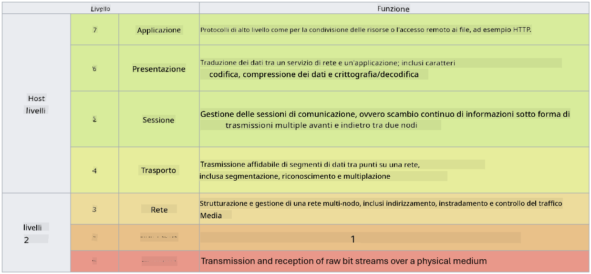

<!--
CO_OP_TRANSLATOR_METADATA:
{
  "original_hash": "252724eceeb183fb9018f88c5e1a3f0c",
  "translation_date": "2025-09-03T22:06:46+00:00",
  "source_file": "3.1 Networking key concepts.md",
  "language_code": "it"
}
-->
# Concetti chiave di networking

Se hai lavorato in ambito IT, è probabile che tu abbia avuto a che fare con concetti di networking. Sebbene utilizziamo l'identità come principale controllo perimetrale negli ambienti moderni, ciò non significa che i controlli di rete siano superflui. Anche se si tratta di un argomento vasto, in questa lezione tratteremo alcuni concetti chiave di networking.

In questa lezione parleremo di:

 - Cos'è l'indirizzamento IP?
   
 - Cos'è il modello OSI?

 

 - Cos'è TCP/UDP?

   
 

 - Cosa sono i numeri di porta?

   
  

 - Cos'è la crittografia a riposo e in transito?

## Cos'è l'indirizzamento IP?

L'indirizzamento IP, o indirizzamento del Protocollo Internet, è un'etichetta numerica assegnata a ogni dispositivo connesso a una rete informatica che utilizza il Protocollo Internet per la comunicazione. Serve come identificatore unico per i dispositivi all'interno di una rete, consentendo loro di inviare e ricevere dati attraverso internet o altre reti interconnesse. Esistono due principali versioni di indirizzamento IP: IPv4 (versione 4 del Protocollo Internet) e IPv6 (versione 6 del Protocollo Internet). Un indirizzo IP è solitamente rappresentato nel formato IPv4 (es. 192.168.1.1) o nel formato IPv6 (es. 2001:0db8:85a3:0000:0000:8a2e:0370:7334).

## Cos'è il modello OSI?

Il modello OSI (Open Systems Interconnection) è un framework concettuale che standardizza le funzioni di un sistema di comunicazione in sette livelli distinti. Ogni livello svolge compiti specifici e comunica con i livelli adiacenti per garantire una comunicazione efficiente e affidabile tra dispositivi in una rete. I livelli, dal basso verso l'alto, sono i seguenti:

 1. Livello Fisico
    
 
 2. Livello di Collegamento Dati

    
    

 1. Livello di Rete

    
   

 1. Livello di Trasporto

    

 1. Livello di Sessione

    
   

 1. Livello di Presentazione

    
    

 1. Livello Applicativo

Il modello OSI fornisce un riferimento comune per comprendere come i protocolli e le tecnologie di networking interagiscono, indipendentemente dalle implementazioni hardware o software specifiche.

_ref: https://en.wikipedia.org/wiki/OSI_model_

## Cos'è TCP/UDP?

TCP (Transmission Control Protocol) e UDP (User Datagram Protocol) sono due protocolli fondamentali del livello di trasporto utilizzati nelle reti informatiche per facilitare la comunicazione tra dispositivi su internet o all'interno di una rete locale. Sono responsabili della suddivisione dei dati in pacchetti per la trasmissione e della ricostruzione di quei pacchetti nei dati originali sul dispositivo ricevente. Tuttavia, differiscono per caratteristiche e casi d'uso.

**TCP (Transmission Control Protocol)**:

TCP è un protocollo orientato alla connessione che garantisce una consegna affidabile e ordinata dei dati tra dispositivi. Stabilisce una connessione tra il mittente e il destinatario prima che inizi lo scambio di dati. TCP assicura che i pacchetti di dati arrivino nell'ordine corretto e può gestire la ritrasmissione dei pacchetti persi per garantire l'integrità e la completezza dei dati. Questo rende TCP adatto per applicazioni che richiedono una consegna affidabile dei dati, come la navigazione web, la posta elettronica, il trasferimento di file (FTP) e la comunicazione con database.

**UDP (User Datagram Protocol)**:

UDP è un protocollo senza connessione che offre una trasmissione dei dati più veloce ma non garantisce lo stesso livello di affidabilità di TCP. Non stabilisce una connessione formale prima di inviare i dati e non include meccanismi per riconoscere o ritrasmettere i pacchetti persi. UDP è adatto per applicazioni in cui velocità ed efficienza sono più importanti della consegna garantita, come la comunicazione in tempo reale, lo streaming multimediale, i giochi online e le query DNS.

In sintesi, TCP dà priorità all'affidabilità e alla consegna ordinata, rendendolo adatto per applicazioni che richiedono precisione nei dati, mentre UDP enfatizza velocità ed efficienza, rendendolo appropriato per applicazioni in cui una minima perdita di dati o un riordino dei pacchetti è accettabile in cambio di una latenza ridotta. La scelta tra TCP e UDP dipende dai requisiti specifici dell'applicazione o del servizio utilizzato.

## Cosa sono i numeri di porta?

Nel networking, un numero di porta è un identificatore numerico utilizzato per distinguere tra diversi servizi o applicazioni che sono in esecuzione su un singolo dispositivo all'interno di una rete. Le porte aiutano a indirizzare i dati in arrivo all'applicazione appropriata. I numeri di porta sono interi senza segno a 16 bit, il che significa che vanno da 0 a 65535. Sono divisi in tre intervalli:

- Porte Ben Note (0-1023): Riservate per servizi standard come HTTP (porta 80) e FTP (porta 21).

- Porte Registrate (1024-49151): Utilizzate per applicazioni e servizi che non fanno parte dell'intervallo ben noto ma sono ufficialmente registrate.

- Porte Dinamiche/Private (49152-65535): Disponibili per uso temporaneo o privato da parte delle applicazioni.

## Cos'è la crittografia a riposo e in transito?

La crittografia è il processo di conversione dei dati in un formato sicuro per proteggerli da accessi non autorizzati o manomissioni. La crittografia può essere applicata ai dati sia "a riposo" (quando sono archiviati su un dispositivo o server) sia "in transito" (quando vengono trasmessi tra dispositivi o su reti).

Crittografia a Riposo: Questa consiste nel crittografare i dati archiviati su dispositivi, server o sistemi di archiviazione. Anche se un attaccante ottiene accesso fisico al supporto di archiviazione, non può accedere ai dati senza le chiavi di crittografia. Questo è fondamentale per proteggere i dati sensibili in caso di furto del dispositivo, violazioni dei dati o accessi non autorizzati.

Crittografia in Transito: Questa consiste nel crittografare i dati mentre viaggiano tra dispositivi o su reti. Questo impedisce intercettazioni e accessi non autorizzati ai dati durante la trasmissione. I protocolli comuni per la crittografia in transito includono HTTPS per la comunicazione web e TLS/SSL per proteggere vari tipi di traffico di rete.

## Ulteriori letture
- [How Do IP Addresses Work? (howtogeek.com)](https://www.howtogeek.com/341307/how-do-ip-addresses-work/)
- [Understanding IP Address: An Introductory Guide (geekflare.com)](https://geekflare.com/understanding-ip-address/)
- [What is the OSI model? The 7 layers of OSI explained (techtarget.com)](https://www.techtarget.com/searchnetworking/definition/OSI)
- [The OSI Model – The 7 Layers of Networking Explained in Plain English (freecodecamp.org)](https://www.freecodecamp.org/news/osi-model-networking-layers-explained-in-plain-english/)
- [TCP/IP protocols - IBM Documentation](https://www.ibm.com/docs/en/aix/7.3?topic=protocol-tcpip-protocols)
- [Common Ports Cheat Sheet: The Ultimate Ports & Protocols List (stationx.net)](https://www.stationx.net/common-ports-cheat-sheet/)
- [Azure Data Encryption-at-Rest - Azure Security | Microsoft Learn](https://learn.microsoft.com/azure/security/fundamentals/encryption-atrest?WT.mc_id=academic-96948-sayoung)

---

**Disclaimer**:  
Questo documento è stato tradotto utilizzando il servizio di traduzione automatica [Co-op Translator](https://github.com/Azure/co-op-translator). Sebbene ci impegniamo per garantire l'accuratezza, si prega di notare che le traduzioni automatiche possono contenere errori o imprecisioni. Il documento originale nella sua lingua nativa dovrebbe essere considerato la fonte autorevole. Per informazioni critiche, si raccomanda una traduzione professionale effettuata da un traduttore umano. Non siamo responsabili per eventuali incomprensioni o interpretazioni errate derivanti dall'uso di questa traduzione.