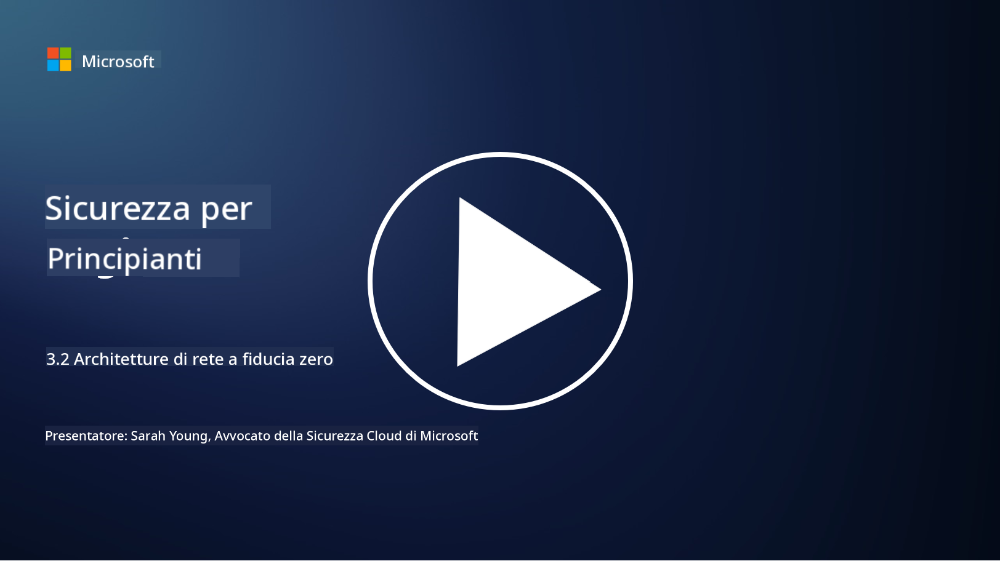

<!--
CO_OP_TRANSLATOR_METADATA:
{
  "original_hash": "680d6e14d9d33fc471c22f44679713f8",
  "translation_date": "2025-09-03T21:16:31+00:00",
  "source_file": "3.2 Networking zero trust architecture.md",
  "language_code": "it"
}
-->
# Architetture di rete Zero Trust

La rete fornisce uno strato cruciale nei controlli Zero Trust. In questa lezione approfondiremo i seguenti argomenti:

- Cos'è la segmentazione della rete?  
- In che modo la segmentazione della rete aiuta a implementare lo Zero Trust?  
- Cos'è la crittografia end-to-end?

## Cos'è la segmentazione della rete?

La segmentazione della rete è la pratica di dividere una rete in segmenti o sottoreti più piccoli e isolati. Ogni segmento è separato dagli altri e l'accesso tra i segmenti è controllato e limitato in base a specifiche politiche di sicurezza. La segmentazione della rete viene utilizzata per migliorare la sicurezza, contenendo l'impatto di eventuali violazioni e limitando i movimenti laterali degli attaccanti all'interno della rete.

Implementando la segmentazione della rete, un'organizzazione può creare "zone" che separano diversi tipi di utenti, applicazioni e dati. Questo riduce la superficie di attacco e minimizza i danni potenziali causati da un incidente di sicurezza. La segmentazione della rete può essere realizzata attraverso tecnologie come VLAN (reti locali virtuali), firewall e controlli di accesso.

## In che modo la segmentazione della rete aiuta a implementare lo Zero Trust?

La segmentazione della rete è strettamente allineata ai principi del modello Zero Trust. In un'architettura Zero Trust, la segmentazione della rete aiuta a far rispettare il principio del "minimo privilegio", garantendo che utenti e dispositivi abbiano accesso solo alle risorse e ai servizi specifici necessari per svolgere i loro compiti. Suddividendo la rete in zone più piccole, le organizzazioni possono implementare controlli di accesso rigorosi, isolare risorse critiche e prevenire i movimenti laterali degli attaccanti.

La segmentazione della rete supporta anche l'applicazione di controlli di accesso basati sull'identità, in cui utenti e dispositivi vengono autenticati e autorizzati in modo approfondito prima di accedere a segmenti specifici. Questo impedisce l'accesso non autorizzato a risorse sensibili e mitiga l'impatto potenziale di credenziali compromesse.

## Cos'è la crittografia end-to-end?

La crittografia end-to-end (E2E) è una misura di sicurezza che garantisce che i dati rimangano crittografati durante l'intero percorso dal mittente al destinatario. In questo processo, i dati vengono crittografati all'origine dal mittente e solo il destinatario possiede la chiave di decrittazione per sbloccare e leggere i dati. I processi di crittografia e decrittazione avvengono ai punti terminali, rendendo estremamente difficile per parti non autorizzate, inclusi fornitori di servizi e intermediari, accedere ai dati in chiaro.

La crittografia E2E offre un elevato livello di riservatezza e sicurezza per la trasmissione dei dati, anche se questi passano attraverso vari sistemi o reti intermedie. È comunemente utilizzata in app di messaggistica sicura, servizi di posta elettronica e altre piattaforme di comunicazione per proteggere informazioni sensibili da intercettazioni e accessi non autorizzati.

Questo metodo di crittografia garantisce che, anche se gli attaccanti riescono ad accedere ai dati in transito, vedrebbero solo contenuti crittografati privi di significato senza la chiave di decrittazione. La crittografia end-to-end svolge un ruolo cruciale nel salvaguardare la privacy degli utenti e nel proteggere informazioni sensibili dall'esposizione a parti non autorizzate.

## Cos'è il SASE?

SASE, acronimo di "Secure Access Service Edge", è un framework e un'architettura di cybersecurity che combina sicurezza di rete e funzionalità di rete WAN (Wide Area Network) in un unico servizio basato su cloud. Il SASE è progettato per fornire accesso sicuro e scalabile a risorse di rete, applicazioni e dati per utenti remoti e mobili, semplificando al contempo la gestione della rete e riducendo la complessità delle architetture di rete e sicurezza tradizionali.

Caratteristiche principali e componenti del SASE:

1. **Basato su cloud:** Il SASE è erogato come servizio cloud, il che significa che le funzioni di sicurezza e rete sono fornite dal cloud anziché fare affidamento su hardware e dispositivi tradizionali on-premises.

2. **Integrazione di sicurezza e rete:** Il SASE integra vari servizi di sicurezza come secure web gateways (SWG), firewall as a service (FWaaS), data loss prevention (DLP), zero-trust network access (ZTNA) e ottimizzazione WAN con funzionalità di rete WAN. Questa integrazione aiuta a semplificare le operazioni di sicurezza e rete.

3. **Zero Trust:** Il SASE opera secondo il principio dello Zero Trust, il che significa che applica controlli di accesso rigorosi e politiche di minimo privilegio. Utenti e dispositivi non sono considerati affidabili di default e devono essere autenticati e autorizzati prima di accedere alle risorse.

4. **Centrato sull'identità:** Il SASE si concentra sulle identità di utenti e dispositivi come base per il controllo degli accessi. Politiche basate sull'identità e sul contesto vengono utilizzate per determinare i permessi di accesso, adattandosi dinamicamente in base al comportamento e al contesto dell'utente.

5. **Scalabilità e flessibilità:** Il SASE può scalare facilmente per supportare un gran numero di utenti e dispositivi, rendendolo adatto a organizzazioni con esigenze di rete e sicurezza diversificate ed in evoluzione.

Il SASE è particolarmente rilevante nell'era moderna del lavoro remoto e dell'adozione del cloud, poiché offre un approccio completo e agile per proteggere e gestire l'accesso alla rete. Aiuta le organizzazioni ad adattarsi ai requisiti di sicurezza e rete in continuo cambiamento, mantenendo un forte focus su modelli di sicurezza centrati sull'utente e Zero Trust.

## Ulteriori letture

- [What Is Network Segmentation? - Cisco](https://www.cisco.com/c/en/us/products/security/what-is-network-segmentation.html#~benefits)  
- [What Is Micro-Segmentation? - Cisco](https://www.cisco.com/c/en/us/products/security/what-is-microsegmentation.html)  
- [Implementing Network Segmentation and Segregation | Cyber.gov.au](https://www.cyber.gov.au/resources-business-and-government/maintaining-devices-and-systems/system-hardening-and-administration/network-hardening/implementing-network-segmentation-and-segregation)  
- [What Is Network Segmentation and Why It Matters | CompTIA](https://www.comptia.org/blog/security-awareness-training-network-segmentation)  
- [Network Segmentation: Concepts and Practices (cmu.edu)](https://insights.sei.cmu.edu/blog/network-segmentation-concepts-and-practices/)  
- [Secure networks with Zero Trust | Microsoft Learn](https://learn.microsoft.com/security/zero-trust/deploy/networks?WT.mc_id=academic-96948-sayoung)  
- [What is end-to-end encryption? | IBM](https://www.ibm.com/topics/end-to-end-encryption)  
- [What Is End-to-End Encryption, and Why Does It Matter? (howtogeek.com)](https://www.howtogeek.com/711656/what-is-end-to-end-encryption-and-why-does-it-matter/)  
- [Definition of Secure Access Service Edge (SASE) - Gartner Information Technology Glossary](https://www.gartner.com/en/information-technology/glossary/secure-access-service-edge-sase)  
- [What Is Secure Access Service Edge (SASE)? | Microsoft Security](https://www.microsoft.com/security/business/security-101/what-is-sase?WT.mc_id=academic-96948-sayoung)  

---

**Disclaimer**:  
Questo documento è stato tradotto utilizzando il servizio di traduzione automatica [Co-op Translator](https://github.com/Azure/co-op-translator). Sebbene ci impegniamo per garantire l'accuratezza, si prega di notare che le traduzioni automatiche possono contenere errori o imprecisioni. Il documento originale nella sua lingua nativa dovrebbe essere considerato la fonte autorevole. Per informazioni critiche, si raccomanda una traduzione professionale effettuata da un traduttore umano. Non siamo responsabili per eventuali incomprensioni o interpretazioni errate derivanti dall'uso di questa traduzione.