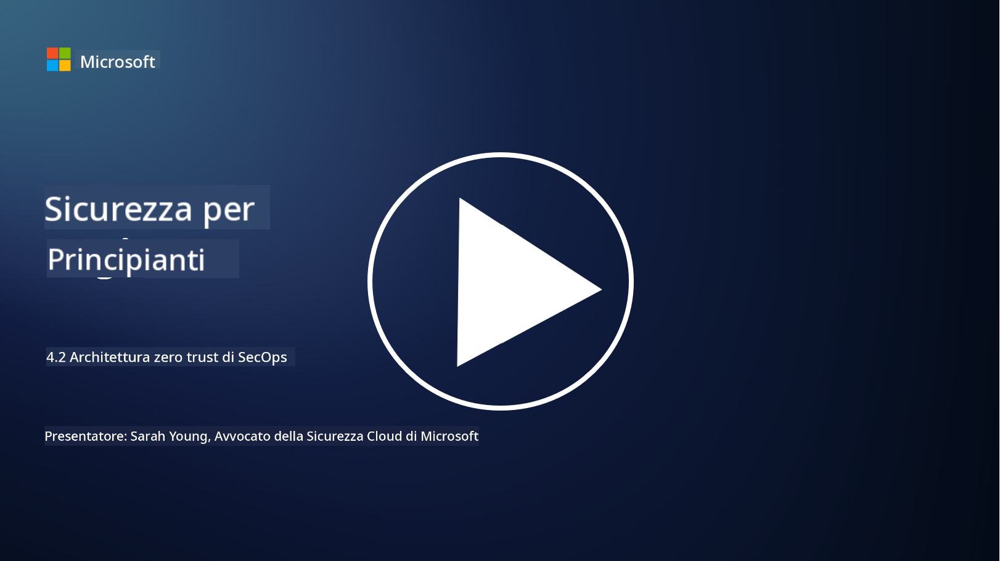

<!--
CO_OP_TRANSLATOR_METADATA:
{
  "original_hash": "45bbdc114e70936816b0b3e7c40189cf",
  "translation_date": "2025-09-03T21:21:18+00:00",
  "source_file": "4.2 SecOps zero trust architecture.md",
  "language_code": "it"
}
-->
# Architettura zero trust per le operazioni di sicurezza

Le operazioni di sicurezza costituiscono due parti dell'architettura zero trust e in questa lezione impareremo entrambe:

- Come devono essere costruite le architetture IT per consentire la raccolta centralizzata dei log?

- Quali sono le migliori pratiche per le operazioni di sicurezza negli ambienti IT moderni?

## Come devono essere costruite le architetture IT per consentire la raccolta centralizzata dei log?

La raccolta centralizzata dei log è un componente fondamentale delle operazioni di sicurezza moderne. Consente alle organizzazioni di aggregare log e dati provenienti da varie fonti, come server, applicazioni, dispositivi di rete e strumenti di sicurezza, in un repository centrale per analisi, monitoraggio e risposta agli incidenti. Ecco alcune migliori pratiche per costruire architetture IT che supportino la raccolta centralizzata dei log:

1. **Integrazione delle fonti di log**:

- Assicurarsi che tutti i dispositivi e i sistemi rilevanti siano configurati per generare log. Questo include server, firewall, router, switch, applicazioni e dispositivi di sicurezza.

- Configurare le fonti di log per inviare i log a un sistema di raccolta o gestione centralizzato.

2. **Selezionare il giusto strumento SIEM (Security Information and Event Management)**:

- Scegliere una soluzione SIEM che sia in linea con le esigenze e la scala dell'organizzazione.

- Assicurarsi che la soluzione scelta supporti la raccolta, l'aggregazione, l'analisi e la generazione di report sui log.

3. **Scalabilità e ridondanza**:

- Progettare l'architettura per essere scalabile e gestire un numero crescente di fonti di log e un volume di log in aumento.

- Implementare la ridondanza per garantire alta disponibilità e prevenire interruzioni dovute a guasti hardware o di rete.

4. **Trasporto sicuro dei log**:

- Utilizzare protocolli sicuri come TLS/SSL o IPsec per trasportare i log dalle fonti al repository centralizzato.

- Implementare autenticazione e controlli di accesso per garantire che solo dispositivi autorizzati possano inviare log.

5. **Normalizzazione**:

- Standardizzare i formati dei log e normalizzare i dati per garantire coerenza e facilità di analisi.

6. **Archiviazione e conservazione**:

- Determinare il periodo di conservazione appropriato per i log in base ai requisiti di conformità e sicurezza.

- Archiviare i log in modo sicuro, proteggendoli da accessi non autorizzati e manomissioni.

## Quali sono le migliori pratiche per le operazioni di sicurezza negli ambienti IT moderni?

Oltre alla raccolta centralizzata dei log, ecco alcune migliori pratiche per le operazioni di sicurezza negli ambienti IT moderni:

1. **Monitoraggio continuo**: Implementare il monitoraggio continuo delle attività di rete e di sistema per rilevare e rispondere alle minacce in tempo reale.

2. **Intelligence sulle minacce**: Rimanere informati sulle minacce emergenti e sulle vulnerabilità utilizzando feed e servizi di intelligence sulle minacce.

3. **Formazione degli utenti**: Condurre regolarmente corsi di sensibilizzazione sulla sicurezza per i dipendenti, al fine di mitigare i rischi associati a tecniche di ingegneria sociale e attacchi di phishing.

4. **Piano di risposta agli incidenti**: Sviluppare e testare un piano di risposta agli incidenti per garantire una reazione rapida ed efficace agli incidenti di sicurezza.

5. **Automazione della sicurezza**: Utilizzare strumenti di automazione e orchestrazione della sicurezza per semplificare la risposta agli incidenti e le attività ripetitive.

6. **Backup e ripristino**: Implementare soluzioni robuste di backup e ripristino per garantire la disponibilità dei dati in caso di perdita di dati o attacchi ransomware.

## Ulteriori letture

- [Microsoft Security Best Practices module: Security operations | Microsoft Learn](https://learn.microsoft.com/security/operations/security-operations-videos-and-decks?WT.mc_id=academic-96948-sayoung)
- [Security operations - Cloud Adoption Framework | Microsoft Learn](https://learn.microsoft.com/azure/cloud-adoption-framework/secure/security-operations?WT.mc_id=academic-96948-sayoung)
- [What is Security Operations and Analytics Platform Architecture? A Definition of SOAPA, How It Works, Benefits, and More (digitalguardian.com)](https://www.digitalguardian.com/blog/what-security-operations-and-analytics-platform-architecture-definition-soapa-how-it-works#:~:text=All%20in%20all%2C%20security%20operations%20and%20analytics%20platform,become%20more%20efficient%20and%20operative%20with%20your%20security.)

---

**Disclaimer**:  
Questo documento è stato tradotto utilizzando il servizio di traduzione automatica [Co-op Translator](https://github.com/Azure/co-op-translator). Sebbene ci impegniamo per garantire l'accuratezza, si prega di notare che le traduzioni automatiche possono contenere errori o imprecisioni. Il documento originale nella sua lingua nativa dovrebbe essere considerato la fonte autorevole. Per informazioni critiche, si raccomanda una traduzione professionale effettuata da un traduttore umano. Non siamo responsabili per eventuali incomprensioni o interpretazioni errate derivanti dall'uso di questa traduzione.