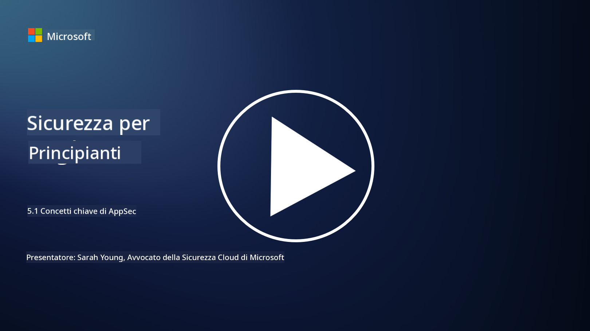

<!--
CO_OP_TRANSLATOR_METADATA:
{
  "original_hash": "e4b56bb23078d3ffb7ad407d280b0c36",
  "translation_date": "2025-09-03T21:10:40+00:00",
  "source_file": "5.1 AppSec key concepts.md",
  "language_code": "it"
}
-->
# Concetti chiave di AppSec

La sicurezza delle applicazioni è una specializzazione della sicurezza a sé stante. In questa parte del corso approfondiremo la sicurezza delle applicazioni.

## Introduzione

In questa lezione, tratteremo:

- Cos'è la sicurezza delle applicazioni?

- Quali sono i concetti/principi chiave della sicurezza delle applicazioni?

## Cos'è la sicurezza delle applicazioni?

La sicurezza delle applicazioni, spesso abbreviata come "AppSec," si riferisce alla pratica di proteggere le applicazioni software da minacce, vulnerabilità e attacchi. Comprende i processi, le tecniche e gli strumenti utilizzati per identificare, mitigare e prevenire i rischi di sicurezza durante il ciclo di sviluppo, distribuzione e manutenzione di un'applicazione.

La sicurezza delle applicazioni è fondamentale perché le applicazioni sono bersagli comuni per gli attacchi informatici. Gli attori malintenzionati sfruttano vulnerabilità e debolezze nel software per ottenere accesso non autorizzato, rubare dati, interrompere servizi o eseguire altre attività dannose. Una sicurezza efficace delle applicazioni aiuta a garantire la riservatezza, l'integrità e la disponibilità di un'applicazione e dei dati associati.

## Quali sono i concetti/principi chiave della sicurezza delle applicazioni?

I concetti e principi chiave che sottendono la sicurezza delle applicazioni includono:

1. **Sicurezza per Progettazione**:

- La sicurezza dovrebbe essere integrata nella progettazione e architettura dell'applicazione fin dall'inizio, piuttosto che essere aggiunta successivamente.

2. **Validazione degli Input**:

- Tutti gli input degli utenti devono essere validati per garantire che rispettino i formati previsti e siano privi di codice o dati dannosi.

3. **Codifica degli Output**:

- I dati inviati al client devono essere correttamente codificati per prevenire vulnerabilità come il cross-site scripting (XSS).

4. **Autenticazione e Autorizzazione**:

- Autenticare gli utenti e autorizzare il loro accesso alle risorse in base ai ruoli e alle autorizzazioni.

5. **Protezione dei Dati**:

- I dati sensibili devono essere crittografati durante l'archiviazione, la trasmissione e l'elaborazione per prevenire accessi non autorizzati.

6. **Gestione delle Sessioni**:

- Una gestione sicura delle sessioni garantisce che le sessioni degli utenti siano protette da dirottamenti e accessi non autorizzati.

7. **Dipendenze Sicure**:

- Mantenere tutte le dipendenze software aggiornate con le patch di sicurezza per prevenire vulnerabilità.

8. **Gestione degli Errori e Logging**:

- Implementare una gestione sicura degli errori per evitare di rivelare informazioni sensibili e garantire pratiche di logging sicure.

9. **Test di Sicurezza**:

- Testare regolarmente le applicazioni per individuare vulnerabilità utilizzando metodi come test di penetrazione, revisioni del codice e strumenti di scansione automatizzati.

10. **Ciclo di Vita dello Sviluppo Software Sicuro (SDLC)**:

- Integrare pratiche di sicurezza in ogni fase del ciclo di vita dello sviluppo software, dai requisiti alla distribuzione e manutenzione.

## Ulteriori letture

- [SheHacksPurple: What is Application Security? - YouTube](https://www.youtube.com/watch?v=eNmccQNzSSY)
- [What Is Application Security? - Cisco](https://www.cisco.com/c/en/us/solutions/security/application-first-security/what-is-application-security.html#~how-does-it-work)
- [What is application security? A process and tools for securing software | CSO Online](https://www.csoonline.com/article/566471/what-is-application-security-a-process-and-tools-for-securing-software.html)
- [OWASP Cheat Sheet Series | OWASP Foundation](https://owasp.org/www-project-cheat-sheets/)

---

**Disclaimer**:  
Questo documento è stato tradotto utilizzando il servizio di traduzione automatica [Co-op Translator](https://github.com/Azure/co-op-translator). Sebbene ci impegniamo per garantire l'accuratezza, si prega di notare che le traduzioni automatiche possono contenere errori o imprecisioni. Il documento originale nella sua lingua nativa dovrebbe essere considerato la fonte autorevole. Per informazioni critiche, si raccomanda una traduzione professionale effettuata da un traduttore umano. Non siamo responsabili per eventuali incomprensioni o interpretazioni errate derivanti dall'uso di questa traduzione.