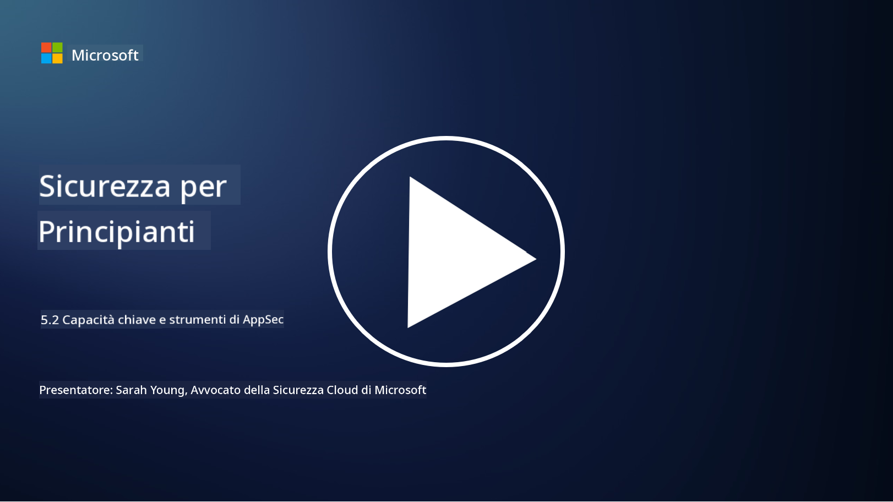

<!--
CO_OP_TRANSLATOR_METADATA:
{
  "original_hash": "790a3fa7e535ec60bb51bde13e759781",
  "translation_date": "2025-09-03T21:26:15+00:00",
  "source_file": "5.2 AppSec key capabilities.md",
  "language_code": "it"
}
-->
In questa sezione, approfondiremo i dettagli sugli strumenti e le capacità fondamentali utilizzati nella sicurezza delle applicazioni:

## Introduzione

In questa lezione, esamineremo quali sono le principali capacità e strumenti utilizzati nella sicurezza delle applicazioni.

## Capacità e strumenti chiave per la sicurezza delle applicazioni

Le capacità e gli strumenti chiave utilizzati nella sicurezza delle applicazioni sono essenziali per identificare, mitigare e prevenire vulnerabilità e minacce alla sicurezza nelle applicazioni software. Ecco alcuni dei più importanti:

**1. Static Application Security Testing (SAST)**:

- **Capacità**: Analizza il codice sorgente, il bytecode o il codice binario per identificare vulnerabilità di sicurezza nella base di codice dell'applicazione.

- **Strumenti**: Esempi includono Fortify, Checkmarx e Veracode.

**2. Dynamic Application Security Testing (DAST)**:

- **Capacità**: Scansiona un'applicazione in esecuzione per identificare vulnerabilità inviando richieste di input e analizzando le risposte.

- **Strumenti**: Esempi includono ZAP, Burp Suite e Qualys Web Application Scanning.

**3. Interactive Application Security Testing (IAST)**:

- **Capacità**: Combina elementi di SAST e DAST per analizzare il codice durante l'esecuzione, fornendo risultati più accurati e riducendo i falsi positivi.

- **Strumenti**: Esempi includono Contrast Security e HCL AppScan.

**4. Runtime Application Self-Protection (RASP)**:

- **Capacità**: Monitora e protegge le applicazioni in tempo reale, rilevando e rispondendo alle minacce di sicurezza mentre si verificano.

- **Strumenti**: Esempi includono Veracode Runtime Protection e F5 Advanced WAF con RASP.

**5. Web Application Firewalls (WAFs)**:

- **Capacità**: Fornisce uno strato protettivo tra l'applicazione e Internet, filtrando il traffico in entrata e bloccando le richieste dannose.

- **Strumenti**: Esempi includono ModSecurity, AWS WAF e Akamai Kona Site Defender.

**6. Scansione delle dipendenze**:

- **Capacità**: Identifica vulnerabilità nelle librerie e nei componenti di terze parti utilizzati nell'applicazione.

- **Strumenti**: Esempi includono OWASP Dependency-Check e Snyk.

**7. Test di penetrazione (Pen Testing)**:

- **Capacità**: Simula attacchi reali per scoprire vulnerabilità e valutare la sicurezza di un'applicazione.

- **Strumenti**: Eseguito da hacker etici certificati e professionisti della sicurezza utilizzando vari strumenti come Metasploit e Nmap.

**8. Scansione e analisi della sicurezza**:

- **Capacità**: Scansiona per vulnerabilità note, errori di configurazione e configurazioni di sicurezza errate.

- **Strumenti**: Esempi includono Nessus, Qualys Vulnerability Management e OpenVAS.

**9. Strumenti per la sicurezza dei container**:

- **Capacità**: Si concentrano sulla sicurezza delle applicazioni containerizzate e dei loro ambienti.

- **Strumenti**: Esempi includono Docker Security Scanning e Aqua Security.

**10. Formazione sullo sviluppo sicuro**:

- **Capacità**: Fornisce programmi di formazione e sensibilizzazione per i team di sviluppo per promuovere pratiche di codifica sicura.

- **Strumenti**: Programmi di formazione personalizzati e piattaforme.

**11. Framework di test di sicurezza**:

- **Capacità**: Fornisce framework di test completi per diverse esigenze di test di sicurezza delle applicazioni.

- **Strumenti**: OWASP Amass, OWASP OWTF e FrAppSec.

**12. Strumenti per la revisione del codice sicuro**:

- **Capacità**: Revisiona il codice sorgente per vulnerabilità di sicurezza e migliori pratiche di codifica.

- **Strumenti**: Esempi includono SonarQube e Checkmarx.

**13. Strumenti per API e microservizi sicuri**:

- **Capacità**: Si concentrano sulla sicurezza di API e microservizi, inclusi autenticazione, autorizzazione e protezione dei dati.

- **Strumenti**: Esempi includono Apigee, AWS API Gateway e Istio.

## Letture aggiuntive

- [What Is Application Security? Concepts, Tools & Best Practices | HackerOne](https://www.hackerone.com/knowledge-center/what-application-security-concepts-tools-best-practices)
- [What is IAST? (Interactive Application Security Testing) (comparitech.com)](https://www.comparitech.com/net-admin/what-is-iast/)
- [10 Types of Application Security Testing Tools: When and How to Use Them (cmu.edu)](https://insights.sei.cmu.edu/blog/10-types-of-application-security-testing-tools-when-and-how-to-use-them/)
- [Shifting the Balance of Cybersecurity Risk: Principles and Approaches for Security-by-Design and Default | Cyber.gov.au](https://www.cyber.gov.au/about-us/view-all-content/publications/principles-and-approaches-for-security-by-design-and-default)

---

**Disclaimer**:  
Questo documento è stato tradotto utilizzando il servizio di traduzione AI [Co-op Translator](https://github.com/Azure/co-op-translator). Sebbene ci impegniamo per garantire l'accuratezza, si prega di notare che le traduzioni automatizzate possono contenere errori o imprecisioni. Il documento originale nella sua lingua nativa dovrebbe essere considerato la fonte autorevole. Per informazioni critiche, si raccomanda una traduzione professionale effettuata da un esperto umano. Non siamo responsabili per eventuali incomprensioni o interpretazioni errate derivanti dall'uso di questa traduzione.