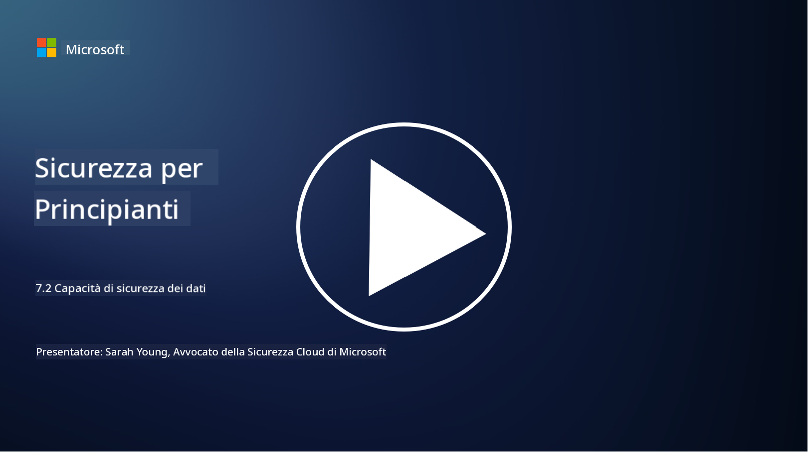

<!--
CO_OP_TRANSLATOR_METADATA:
{
  "original_hash": "50697add9758e54693442d502d2d5f8a",
  "translation_date": "2025-09-03T21:30:16+00:00",
  "source_file": "7.2 Data security capabilities.md",
  "language_code": "it"
}
-->
# Capacità di sicurezza dei dati

In questa sezione, approfondiremo gli strumenti e le funzionalità principali utilizzati nella sicurezza dei dati:

**Introduzione**

In questa lezione, tratteremo:

- Cosa sono gli strumenti di prevenzione della perdita di dati?

- Cosa sono gli strumenti di gestione del rischio interno?

- Quali strumenti di conservazione dei dati sono disponibili?

## Cosa sono gli strumenti di prevenzione della perdita di dati?

Gli strumenti di Prevenzione della Perdita di Dati (DLP) si riferiscono a un insieme di soluzioni software e tecnologie progettate per prevenire l'accesso non autorizzato, la condivisione o la perdita di dati sensibili o riservati all'interno di un'organizzazione. Questi strumenti utilizzano l'ispezione dei contenuti, l'applicazione delle politiche e il monitoraggio per identificare e proteggere i dati sensibili dall'esposizione o dall'uso improprio. Esempi di prodotti DLP includono: Symantec Data Loss Prevention, McAfee Total Protection for Data Loss Prevention, Microsoft 365 DLP**: Si integra con le applicazioni Microsoft 365 per aiutare le organizzazioni a identificare e proteggere i dati sensibili all'interno di email, documenti e messaggi.

## Cosa sono gli strumenti di gestione del rischio interno?

Gli strumenti di Gestione del Rischio Interno aiutano le organizzazioni a identificare e mitigare i rischi posti da dipendenti, collaboratori o partner che potrebbero compromettere intenzionalmente o involontariamente la sicurezza dei dati. Questi strumenti monitorano il comportamento degli utenti, i modelli di accesso e l'utilizzo dei dati per rilevare attività sospette e potenziali minacce interne. Esempi di prodotti di gestione del rischio interno includono: Microsoft Insider Risk Management (parte di Microsoft 365), Forcepoint Insider Threat Data Protection, Varonis Insider Threat Detection.

## Quali strumenti di conservazione dei dati sono disponibili?

Gli strumenti di conservazione dei dati includono software e soluzioni progettate per gestire la conservazione e l'eliminazione dei dati in conformità con le politiche di conservazione dei dati e i requisiti legali di un'organizzazione. Questi strumenti aiutano ad automatizzare il processo di conservazione dei dati per durate specifiche e a eliminarli in modo sicuro quando non sono più necessari. Esempi di prodotti di conservazione dei dati includono: Veritas Enterprise Vault, Commvault Complete Data Protection, Microsoft data lifecycle management. Queste soluzioni aiutano le organizzazioni a mantenere il controllo sulla conservazione e lo smaltimento dei dati, garantendo la conformità alle normative sulla protezione dei dati e gestendo efficacemente i dati durante tutto il loro ciclo di vita.

## Ulteriori letture

- [Guida alla gestione della postura di sicurezza dei dati (DSPM) | CSA (cloudsecurityalliance.org)](https://cloudsecurityalliance.org/blog/2023/03/31/the-big-guide-to-data-security-posture-management-dspm/)
- [Prevenzione della perdita di dati su endpoint, app e servizi | Microsoft Purview](https://youtu.be/hvqq8L_0kgI)
- [18 Migliori strumenti software per la prevenzione della perdita di dati 2023 (Gratis + A pagamento) (comparitech.com)](https://www.comparitech.com/data-privacy-management/data-loss-prevention-tools-software/)
- [Prevenzione della perdita di dati (nist.gov)](https://tsapps.nist.gov/publication/get_pdf.cfm?pub_id=904672)
- [Scopri la gestione del rischio interno | Microsoft Learn](https://learn.microsoft.com/purview/insider-risk-management?WT.mc_id=academic-96948-sayoung)
- [Gestione del ciclo di vita dei dati | IBM](https://www.ibm.com/topics/data-lifecycle-management)
- [Cos'è la gestione del ciclo di vita dei dati (DLM)? | Migliori pratiche 2023 (selecthub.com)](https://www.selecthub.com/big-data-analytics/data-lifecycle-management/)

---

**Disclaimer**:  
Questo documento è stato tradotto utilizzando il servizio di traduzione automatica [Co-op Translator](https://github.com/Azure/co-op-translator). Sebbene ci impegniamo per garantire l'accuratezza, si prega di notare che le traduzioni automatiche potrebbero contenere errori o imprecisioni. Il documento originale nella sua lingua nativa dovrebbe essere considerato la fonte autorevole. Per informazioni critiche, si raccomanda una traduzione professionale effettuata da un traduttore umano. Non siamo responsabili per eventuali incomprensioni o interpretazioni errate derivanti dall'uso di questa traduzione.