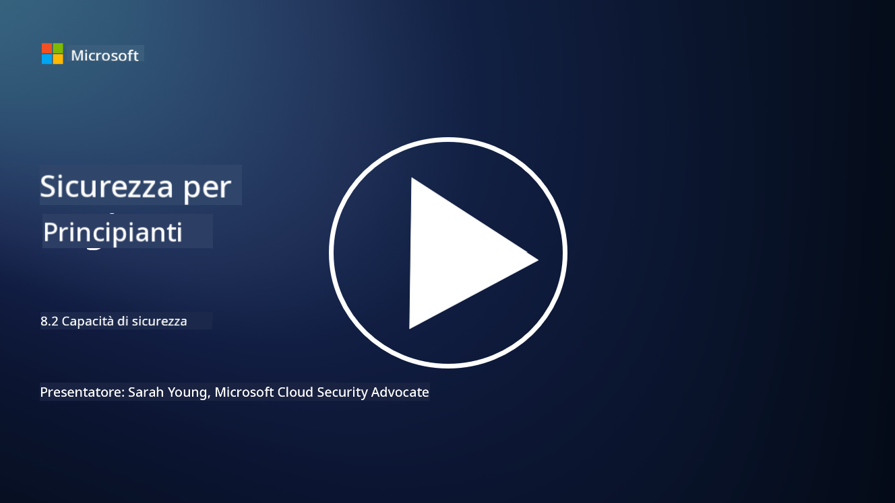

<!--
CO_OP_TRANSLATOR_METADATA:
{
  "original_hash": "b6bb7175672298d1e2f73ba7e0006f95",
  "translation_date": "2025-09-03T21:37:14+00:00",
  "source_file": "8.2 AI security capabilities.md",
  "language_code": "it"
}
-->
# Capacità di sicurezza dell'IA

## Quali strumenti e capacità abbiamo attualmente per proteggere i sistemi di IA?

Attualmente, ci sono diversi strumenti e capacità disponibili per proteggere i sistemi di IA:

-   **Counterfit**: Uno strumento open-source di automazione per il test di sicurezza dei sistemi di IA, progettato per aiutare le organizzazioni a condurre valutazioni del rischio di sicurezza dell'IA e garantire la robustezza dei loro algoritmi.
-   **Strumenti di Machine Learning Avversario**: Questi strumenti valutano la robustezza dei modelli di machine learning contro attacchi avversari, aiutando a identificare e mitigare le vulnerabilità.
-   **Kit di Strumenti per la Sicurezza dell'IA**: Sono disponibili kit di strumenti open-source che offrono risorse per proteggere i sistemi di IA, inclusi librerie e framework per implementare misure di sicurezza.
-   **Piattaforme Collaborative**: Collaborazioni tra aziende e comunità di IA per sviluppare scanner di sicurezza specifici per l'IA e altri strumenti per proteggere la catena di approvvigionamento dell'IA.

Questi strumenti e capacità fanno parte di un campo in crescita dedicato a migliorare la sicurezza dei sistemi di IA contro una varietà di minacce. Rappresentano una combinazione di ricerca, strumenti pratici e collaborazione industriale mirata ad affrontare le sfide uniche poste dalle tecnologie di IA.

## E per quanto riguarda il red teaming dell'IA? In cosa differisce dal red teaming tradizionale?

Il red teaming dell'IA differisce dal red teaming tradizionale in diversi aspetti chiave:

-   **Focus sui Sistemi di IA**: Il red teaming dell'IA si concentra sulle vulnerabilità uniche dei sistemi di IA, come i modelli di machine learning e le pipeline di dati, piuttosto che sull'infrastruttura IT tradizionale.
-   **Test del Comportamento dell'IA**: Comporta il test di come i sistemi di IA rispondono a input insoliti o inattesi, rivelando vulnerabilità che potrebbero essere sfruttate dagli attaccanti.
-   **Esplorazione dei Fallimenti dell'IA**: Il red teaming dell'IA esamina sia i fallimenti malevoli che quelli benigni, considerando un insieme più ampio di scenari e potenziali fallimenti del sistema oltre alle violazioni di sicurezza.
-   **Injection di Prompt e Generazione di Contenuti**: Include anche l'analisi di fallimenti come l'injection di prompt, dove gli attaccanti manipolano i sistemi di IA per produrre contenuti dannosi o non fondati.
-   **Etica e Responsabilità dell'IA**: Fa parte dell'assicurare un'IA responsabile per design, garantendo che i sistemi di IA siano robusti contro tentativi di farli comportare in modi non intenzionali.

In generale, il red teaming dell'IA è una pratica ampliata che non solo copre l'analisi delle vulnerabilità di sicurezza, ma include anche il test di altri tipi di fallimenti specifici delle tecnologie di IA. È una parte cruciale dello sviluppo di sistemi di IA più sicuri, comprendendo e mitigando i rischi nuovi associati alla loro implementazione.

## Ulteriori letture

 - [Microsoft AI Red Team building future of safer AI | Microsoft Security Blog](https://www.microsoft.com/en-us/security/blog/2023/08/07/microsoft-ai-red-team-building-future-of-safer-ai/?WT.mc_id=academic-96948-sayoung)
 - [Announcing Microsoft’s open automation framework to red team generative AI Systems | Microsoft Security Blog](https://www.microsoft.com/en-us/security/blog/2024/02/22/announcing-microsofts-open-automation-framework-to-red-team-generative-ai-systems/?WT.mc_id=academic-96948-sayoung)
 - [AI Security Tools: The Open-Source Toolkit | Wiz](https://www.wiz.io/academy/ai-security-tools)

---

**Disclaimer**:  
Questo documento è stato tradotto utilizzando il servizio di traduzione automatica [Co-op Translator](https://github.com/Azure/co-op-translator). Sebbene ci impegniamo per garantire l'accuratezza, si prega di notare che le traduzioni automatiche possono contenere errori o imprecisioni. Il documento originale nella sua lingua nativa dovrebbe essere considerato la fonte autorevole. Per informazioni critiche, si raccomanda una traduzione professionale effettuata da un traduttore umano. Non siamo responsabili per eventuali fraintendimenti o interpretazioni errate derivanti dall'uso di questa traduzione.