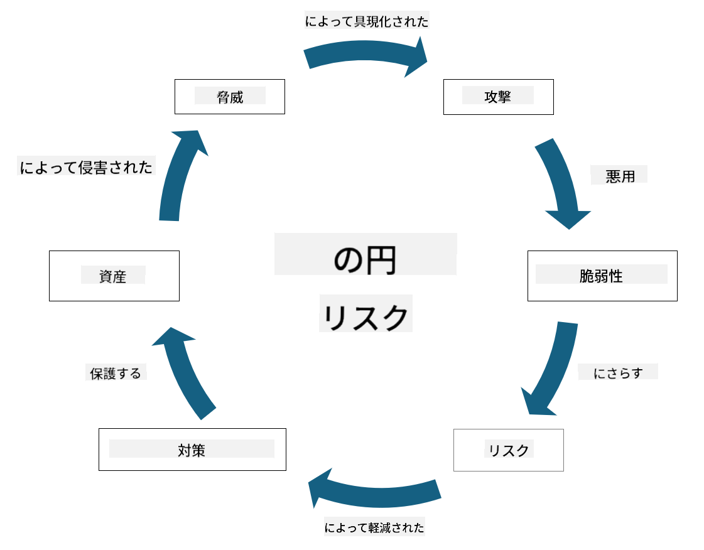

<!--
CO_OP_TRANSLATOR_METADATA:
{
  "original_hash": "fcca304f072cabf206388199e8e2e578",
  "translation_date": "2025-09-03T21:57:41+00:00",
  "source_file": "1.3 Understanding risk management.md",
  "language_code": "ja"
}
-->
# リスク管理の理解

## はじめに

このレッスンでは以下を学びます：

- よく使われるセキュリティ用語の定義

- セキュリティコントロールの種類

- セキュリティリスクの評価

## よく使われるセキュリティ用語の定義

これらの用語は、サイバーセキュリティとリスク管理の分野で基本的な概念です。それぞれの用語とその関係性を詳しく見ていきましょう：

1. **脅威エージェント**:

脅威エージェントとは、システムやネットワークの脆弱性を悪用して損害を与える可能性のある個人、グループ、組織、または自動化されたシステムのことです。脅威エージェントには、ハッカー、マルウェア作成者、不満を抱えた従業員、その他情報や技術システムにリスクをもたらす存在が含まれます。

2. **脅威**:

脅威とは、システムの脆弱性を悪用して資産に損害を与える可能性のあるイベントや行動のことです。脅威には、ハッキング、データ漏洩、サービス拒否攻撃などが含まれます。脅威は、組織の資産に対して潜在的に損害を与える「何か」を指します。

3. **脆弱性**:

脆弱性とは、システムの設計、実装、または構成における弱点や欠陥であり、脅威エージェントによって悪用される可能性があります。脆弱性は、ソフトウェア、ハードウェア、プロセス、または人間の行動に存在することがあります。脆弱性を特定し対処することは、攻撃の成功を最小限に抑えるために重要です。

4. **リスク**:

リスクとは、脅威と脆弱性の相互作用によって生じる損失、損害、または被害の可能性のことです。脅威エージェントが脆弱性を悪用して負の影響を与える可能性を指します。リスクは、その潜在的な影響と発生の可能性に基づいて評価されます。

5. **資産**:

資産とは、組織が保護しようとする価値のあるものを指します。資産には、物理的なオブジェクト（コンピュータやサーバーなど）、データ（顧客情報、財務記録）、知的財産（企業秘密、特許）、さらには人的資源（従業員のスキルや知識）などが含まれます。資産を保護することは、サイバーセキュリティの重要な目標です。

6. **露出**:

露出とは、潜在的な脅威に対して脆弱である状態を指します。これは、脆弱性が存在し、それが脅威エージェントによって悪用される可能性がある場合に発生します。露出は、システムやネットワークに脆弱性が存在することによるリスクを強調します。

7. **コントロール**:

コントロールとは、脆弱性や脅威に関連するリスクを軽減するために設置される対策のことです。コントロールは、技術的、手続き的、または管理的な性質を持つことがあります。これらは、脅威や脆弱性を防止、検出、または軽減するために設計されています。例として、ファイアウォール、アクセスコントロール、暗号化、セキュリティポリシー、従業員トレーニングなどがあります。

これらの用語の関係をまとめると、脅威エージェントは脆弱性を悪用して脅威を実行し、それがリスクを引き起こし、価値ある資産に損害を与える可能性があります。脆弱性が存在すると露出が発生し、コントロールは脅威が資産に与える影響を防止または軽減することでリスクを減少させます。このフレームワークは、サイバーセキュリティリスク管理の基礎を形成し、組織が情報システムや資産に対する潜在的なリスクを特定、評価、対処する際の指針となります。

## セキュリティコントロールの種類

セキュリティコントロールは、情報システムや資産をさまざまな脅威や脆弱性から保護するために実施される対策や保護手段です。これらは、その焦点や目的に基づいていくつかのカテゴリに分類されます。以下は、一般的なセキュリティコントロールの種類です：

1. **管理的コントロール**:

これらのコントロールは、組織のセキュリティ慣行やユーザー行動を管理するポリシー、手続き、ガイドラインに関連しています。

- セキュリティポリシーと手続き：組織内でセキュリティを維持する方法を定義する文書化されたガイドライン。

- セキュリティ意識とトレーニング：従業員にセキュリティのベストプラクティスや潜在的な脅威について教育するプログラム。

- インシデント対応と管理：セキュリティインシデントに対応し、軽減するための計画。

2. **技術的コントロール**:

技術的コントロールは、セキュリティ対策を実施し、システムやデータを保護するための技術の使用を含みます。技術的コントロールの例は以下の通りです：

- アクセスコントロール：役割や権限に基づいてユーザーのリソースへのアクセスを制限する対策。

- 暗号化：データを安全な形式に変換し、不正アクセスを防止する技術。

- ファイアウォール：ネットワークセキュリティデバイスで、入出力トラフィックをフィルタリングし制御する。

- 侵入検知および防止システム（IDPS）：ネットワークトラフィックを監視し、不審な活動を検出するツール。

- ウイルス対策およびマルウェア対策ソフトウェア：悪意のあるソフトウェアを検出し削除するプログラム。

- 認証メカニズム：パスワード、生体認証、多要素認証など、ユーザーの身元を確認する方法。

- パッチ管理：既知の脆弱性に対処するためにソフトウェアを定期的に更新するプロセス。

3. **物理的コントロール**:

物理的コントロールは、物理的な資産や施設を保護するための対策です。

- 警備員とアクセスコントロール担当者：物理的な敷地へのアクセスを監視し制御する人員。

- 監視カメラ：活動を監視し記録するビデオ監視システム。

- 鍵や物理的障壁：機密エリアへのアクセスを制限する物理的な手段。

- 環境コントロール：機器やデータセンターに影響を与える温度、湿度などの環境要因を調整する対策。

4. **運用的コントロール**:

これらのコントロールは、システムの継続的なセキュリティを確保するための日常的な運用や活動に関連しています。

- 変更管理：システムや構成の変更を追跡し承認するプロセス。

- バックアップと災害復旧：システム障害や災害時のデータバックアップと復旧計画。

- ログ記録と監査：セキュリティとコンプライアンス目的でシステム活動を監視し記録する。

- 安全なコーディングプラクティス：脆弱性を最小限に抑えるためのソフトウェア作成ガイドライン。

5. **法的および規制的コントロール**:

これらのコントロールは、関連する法律、規制、業界標準への準拠を確保します。組織が準拠する必要がある基準は、管轄区域、業界分野、その他の要因によって異なります。

- データ保護規制：GDPR、HIPAA、CCPAなどの法律への準拠。

- 業界固有の標準：PCI DSSなどの支払いカードデータセキュリティ標準への準拠。

これらのセキュリティコントロールのカテゴリは、組織の包括的なセキュリティ態勢を構築し、システム、データ、資産をさまざまな脅威から保護するのに役立ちます。

## セキュリティリスクの評価

一部のセキュリティ専門家は、リスク管理はリスク専門家に任せるべきだと考えていますが、セキュリティリスク管理のプロセスを理解することは、セキュリティ専門家が組織全体で理解し行動できる言語でセキュリティリスクを表現するのに役立ちます。

組織は常にセキュリティリスクを評価し、ビジネスに対するリスクに対してどのような行動を取るべきか（または取らないべきか）を決定する必要があります。以下は、通常行われるプロセスの概要です。このプロセスは通常、組織内の複数のチームによって実施されます。一つのチームがリスク管理の全工程を担当することは稀です。

1. **資産と脅威の特定**:

組織は保護したい資産を特定します。これには、データ、システム、ハードウェア、ソフトウェア、知的財産などが含まれます。次に、これらの資産を標的とする可能性のある脅威を特定します。

2. **脆弱性の評価**:

組織は、脅威によって悪用される可能性のあるシステムやプロセスの脆弱性や弱点を特定します。これらの脆弱性は、ソフトウェアの欠陥、構成ミス、セキュリティコントロールの欠如、人為的ミスなどから生じることがあります。

3. **発生可能性の評価**:

組織は、各脅威が発生する可能性を評価します。これには、過去のデータ、脅威インテリジェンス、業界の傾向、内部要因を考慮します。発生可能性は、低、中、高のカテゴリで分類されることがあります。

4. **影響の評価**:

次に、脅威が脆弱性を悪用した場合の潜在的な影響を組織が判断します。影響には、財務的損失、業務の中断、評判の損害、法的な結果などが含まれます。影響も、低、中、高のカテゴリで分類されることがあります。

5. **リスクの計算**:

発生可能性と影響の評価を組み合わせて、各脅威の全体的なリスクレベルを計算します。これは、発生可能性と影響レベルに数値や定性的な記述を割り当てるリスクマトリックスを使用して行われることが多いです。得られたリスクレベルは、どのリスクに優先的に対応すべきかを判断するのに役立ちます。

6. **優先順位付けと意思決定**:

組織は、発生可能性と影響の値が最も高いリスクに焦点を当ててリスクを優先順位付けします。これにより、リソースを効果的に配分し、コントロールを実施することができます。高リスクの脅威は即時対応が必要であり、低リスクの脅威は長期的に対応することができます。

7. **リスクの処理**:

リスク評価に基づいて、組織は各リスクを軽減または管理する方法を決定します。これには、セキュリティコントロールの実施、保険によるリスクの移転、または管理可能/修正が困難と判断された残存リスクの受け入れが含まれることがあります。

8. **継続的な監視とレビュー**:

リスク評価は一度きりのプロセスではありません。組織の環境に大きな変化がある場合や定期的に実施されるべきです。継続的な監視により、新たな脅威、脆弱性、またはビジネス環境の変化が考慮されます。

このように構造化された方法でセキュリティリスクを評価することで、組織はリソース配分、セキュリティコントロール、全体的なリスク管理戦略について情報に基づいた意思決定を行うことができます。目標は、組織の全体的なリスク露出を減少させ、セキュリティ対策を組織のビジネス目標や目的に合わせることです。

---

**免責事項**:  
この文書は、AI翻訳サービス [Co-op Translator](https://github.com/Azure/co-op-translator) を使用して翻訳されています。正確性を追求しておりますが、自動翻訳には誤りや不正確な部分が含まれる可能性があることをご承知ください。元の言語で記載された文書が正式な情報源とみなされるべきです。重要な情報については、専門の人間による翻訳を推奨します。この翻訳の使用に起因する誤解や誤解釈について、当社は責任を負いません。