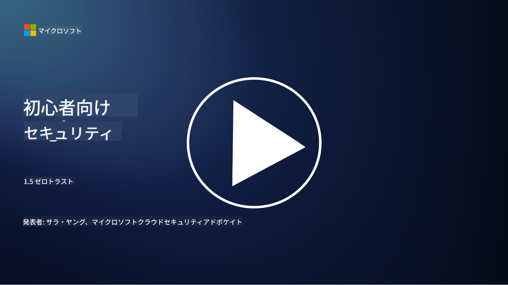
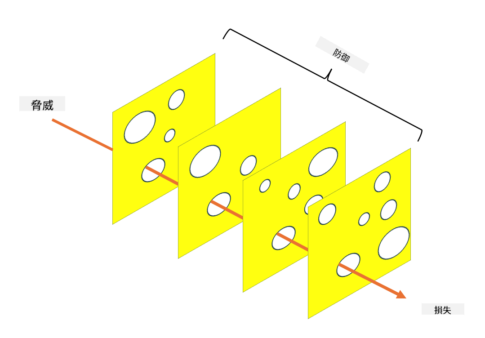

<!--
CO_OP_TRANSLATOR_METADATA:
{
  "original_hash": "75f77f972d2233c584f87c1eb96c983b",
  "translation_date": "2025-09-03T20:33:44+00:00",
  "source_file": "1.5 Zero trust.md",
  "language_code": "ja"
}
-->
# ゼロトラスト

「ゼロトラスト」という言葉は、最近セキュリティ分野でよく耳にするようになりました。しかし、それは具体的に何を意味するのでしょうか？単なる流行語なのでしょうか？このレッスンでは、ゼロトラストが何であるかを詳しく掘り下げていきます。

## はじめに

 - このレッスンで学ぶ内容:
   
   
 - ゼロトラストとは何か？

   
  

 - ゼロトラストは従来のセキュリティアーキテクチャとどう違うのか？

   
   

 - ディフェンスインデプスとは何か？

## ゼロトラスト

ゼロトラストは、従来の「信頼して検証する」という考え方を否定し、組織のネットワーク内外を問わず、いかなるエンティティも本質的に信頼しないというサイバーセキュリティのアプローチです。ゼロトラストは、ユーザー、デバイス、アプリケーションがリソースにアクセスしようとする際に、その場所に関係なくすべてを検証することを推奨します。ゼロトラストの核心的な原則は、「攻撃対象領域」を最小化し、セキュリティ侵害の影響を軽減することです。

ゼロトラストモデルでは、以下の原則が重視されます：

1. **アイデンティティの検証**: ユーザーやデバイスに対して、場所に関係なく厳格な認証と認可を適用します。アイデンティティは必ずしも人間とは限らず、デバイスやアプリケーションなども含まれます。

2. **最小権限**: ユーザーやデバイスには、必要最低限のアクセス権のみを付与し、侵害された場合の被害を軽減します。

3. **マイクロセグメンテーション**: ネットワークリソースを小さなセグメントに分割し、侵害が発生した場合の横方向の移動を制限します。

4. **継続的な監視**: ユーザーやデバイスの行動を継続的に監視・分析し、異常や潜在的な脅威を検出します。最新の監視技術では、機械学習、AI、脅威インテリジェンスを活用して、監視にさらなる詳細とコンテキストを提供します。

5. **データ暗号化**: データを転送中および保存中に暗号化し、不正アクセスを防ぎます。

6. **厳格なアクセス制御**: ユーザーの役割、デバイスの状態、ネットワークの場所などのコンテキストに基づいてアクセス制御を実施します。

Microsoftはゼロトラストを5つの柱に分けており、これについては後のレッスンで詳しく説明します。

## 従来のセキュリティアーキテクチャとの違い

ゼロトラストは、従来のセキュリティアーキテクチャ（例えば、境界ベースのモデル）とはいくつかの点で異なります：

1. **境界 vs. アイデンティティ中心**: 従来のモデルはネットワークの境界を保護し、内部のユーザーやデバイスが一度内部に入れば信頼できると仮定します。一方、ゼロトラストは脅威がネットワーク内外のどちらからでも発生する可能性があると仮定し、厳格なアイデンティティベースの制御を実施します。

2. **暗黙の信頼 vs. 明示的な信頼**: 従来のモデルは、ネットワーク内のデバイスやユーザーを暗黙的に信頼し、問題が発生するまでそのままにします。ゼロトラストはアイデンティティを明示的に検証し、異常を継続的に監視します。

3. **フラットネットワーク vs. セグメント化されたネットワーク**: 従来のアーキテクチャでは、内部ユーザーが広範なアクセス権を持つフラットなネットワークが一般的です。ゼロトラストはネットワークを小さく分離されたゾーンに分割し、侵害を封じ込めることを推奨します。

4. **リアクティブ vs. プロアクティブ**: 従来のセキュリティは、境界ファイアウォールや侵入検知などのリアクティブな対策に依存することが多いです。ゼロトラストは侵害が発生する可能性が高いと仮定し、その影響を最小化するプロアクティブなアプローチを取ります。

## ディフェンスインデプス

ディフェンスインデプス（層状防御）は、組織の資産を保護するために複数のセキュリティ対策を重ねて配置するサイバーセキュリティ戦略です。この戦略の目的は、1つの層が侵害されても、他の層が保護を提供できるようにすることです。各層はセキュリティの異なる側面に焦点を当て、組織全体のセキュリティ態勢を向上させます。

ディフェンスインデプスは、技術的、手続き的、物理的なセキュリティ対策の組み合わせを含みます。これには、ファイアウォール、侵入検知システム、アクセス制御、暗号化、ユーザー教育、セキュリティポリシーなどが含まれます。このアイデアは、複数の障壁を作り、攻撃者が組織のシステムやネットワークに侵入するのを困難にすることです。また、これは他の業界（例：輸送業界）で事故防止に使用される「スイスチーズモデル」とも呼ばれることがあります。

## さらなる学習

[ゼロトラストとは？](https://learn.microsoft.com/security/zero-trust/zero-trust-overview?WT.mc_id=academic-96948-sayoung)

[ゼロトラストの進化 – Microsoftのポジションペーパー](https://query.prod.cms.rt.microsoft.com/cms/api/am/binary/RWJJdT?WT.mc_id=academic-96948-sayoung)

[ゼロトラストとBeyondCorp Google Cloud | Google Cloud Blog](https://cloud.google.com/blog/topics/developers-practitioners/zero-trust-and-beyondcorp-google-cloud)

---

**免責事項**:  
この文書は、AI翻訳サービス [Co-op Translator](https://github.com/Azure/co-op-translator) を使用して翻訳されています。正確性を追求しておりますが、自動翻訳には誤りや不正確な部分が含まれる可能性があることをご承知ください。元の言語で記載された文書が正式な情報源とみなされるべきです。重要な情報については、専門の人間による翻訳を推奨します。この翻訳の使用に起因する誤解や誤った解釈について、当方は責任を負いません。