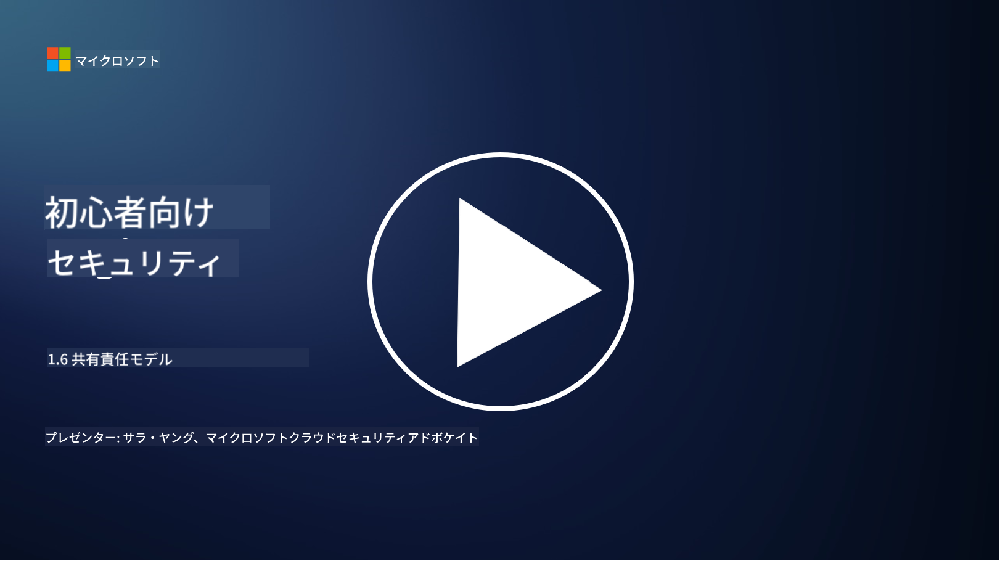

<!--
CO_OP_TRANSLATOR_METADATA:
{
  "original_hash": "a48db640d80c786b928ca178c414f084",
  "translation_date": "2025-09-03T21:06:47+00:00",
  "source_file": "1.6 Shared responsibility model.md",
  "language_code": "ja"
}
-->
# 共有責任モデル

共有責任は、クラウドコンピューティングの登場により生まれたITの新しい概念です。サイバーセキュリティの観点から、どのセキュリティコントロールを誰が提供しているのかを理解することは、防御の隙間を防ぐために重要です。

## はじめに

このレッスンでは以下を学びます：

- サイバーセキュリティの文脈での共有責任とは何か？

- IaaS、PaaS、SaaS間でのセキュリティコントロールにおける共有責任の違いは何か？

- クラウドプラットフォームが提供するセキュリティコントロールをどこで確認できるか？

- 「信頼するが検証する」とは何か？

## サイバーセキュリティの文脈での共有責任とは？

サイバーセキュリティにおける共有責任とは、クラウドサービスプロバイダー（CSP）とその顧客の間でセキュリティ責任を分担することを指します。IaaS（Infrastructure as a Service）、PaaS（Platform as a Service）、SaaS（Software as a Service）などのクラウドコンピューティング環境では、データ、アプリケーション、システムのセキュリティを確保するために、CSPと顧客の双方が役割を果たす必要があります。

## IaaS、PaaS、SaaS間でのセキュリティコントロールにおける共有責任の違いは何か？

責任の分担は通常、利用しているクラウドサービスの種類によって異なります：

- **IaaS（Infrastructure as a Service）**: CSPは基盤となるインフラ（サーバー、ネットワーク、ストレージ）を提供し、顧客はそのインフラ上のオペレーティングシステム、アプリケーション、セキュリティ設定を管理する責任があります。

- **PaaS（Platform as a Service）**: CSPは顧客がアプリケーションを構築・展開できるプラットフォームを提供します。CSPは基盤となるインフラを管理し、顧客はアプリケーション開発とデータセキュリティに集中します。

- **SaaS（Software as a Service）**: CSPはインターネット経由でアクセス可能な完全な機能を持つアプリケーションを提供します。この場合、CSPはアプリケーションのセキュリティとインフラを管理し、顧客はユーザーアクセスとデータ使用を管理します。

共有責任を理解することは、CSPがカバーするセキュリティ面と顧客が対処する必要があるセキュリティ面を明確にするために重要です。これにより誤解を防ぎ、セキュリティ対策が包括的に実施されることを保証します。

## クラウドプラットフォームが提供するセキュリティコントロールをどこで確認できるか？

クラウドプラットフォームが提供するセキュリティコントロールを確認するには、クラウドサービスプロバイダーのドキュメントやリソースを参照する必要があります。これには以下が含まれます：

- **CSPのウェブサイトとドキュメント**: CSPのウェブサイトには、サービスの一部として提供されるセキュリティ機能とコントロールに関する情報があります。CSPは通常、セキュリティの実践、コントロール、推奨事項を説明する詳細なドキュメントを提供します。これにはホワイトペーパー、セキュリティガイド、技術ドキュメントが含まれることがあります。

- **セキュリティ評価と監査**: 多くのCSPは、独立したセキュリティ専門家や組織によるセキュリティコントロールの評価を受けています。これらのレビューは、CSPのセキュリティ対策の品質に関する洞察を提供します。場合によっては、CSPがセキュリティコンプライアンス証明書を取得することもあります（次の項目を参照）。

- **セキュリティコンプライアンス認証**: 多くのCSPは、ISO:27001、SOC 2、FedRAMPなどの認証を取得しています。これらの認証は、プロバイダーが特定のセキュリティおよびコンプライアンス基準を満たしていることを示します。

クラウドプロバイダーによって情報の詳細度や利用可能性は異なる場合があります。クラウドベースの資産のセキュリティについて情報に基づいた決定を下すために、常に公式で最新のリソースを参照するようにしてください。

## 「信頼するが検証する」とは何か？

CSP、サードパーティソフトウェア、その他のITセキュリティサービスを利用する際、組織はプロバイダーのセキュリティ対策に関する主張を最初は信頼するかもしれません。しかし、データやシステムの安全性を真に確保するためには、セキュリティ評価、ペネトレーションテスト、外部のセキュリティコントロールのレビューを通じてこれらの主張を検証する必要があります。すべての個人や組織は、自分が責任を負わないセキュリティコントロールについて「信頼するが検証する」姿勢を取るべきです。

## 組織内での共有責任

組織内でのセキュリティに関する共有責任も考慮する必要があります。セキュリティチームがすべてのコントロールを自分たちで実施することは稀であり、運用チーム、開発者、その他のビジネス部門と協力して、組織を安全に保つために必要なすべてのセキュリティコントロールを実施する必要があります。

## 参考資料
- [Shared responsibility in the cloud - Microsoft Azure | Microsoft Learn](https://learn.microsoft.com/azure/security/fundamentals/shared-responsibility?WT.mc_id=academic-96948-sayoung)
- [What is shared responsibility model? – Definition from TechTarget.com](https://www.techtarget.com/searchcloudcomputing/definition/shared-responsibility-model)
- [The shared responsibility model explained and what it means for cloud security | CSO Online](https://www.csoonline.com/article/570779/the-shared-responsibility-model-explained-and-what-it-means-for-cloud-security.html)
- [Shared Responsibility for Cloud Security: What You Need to Know (cisecurity.org)](https://www.cisecurity.org/insights/blog/shared-responsibility-cloud-security-what-you-need-to-know)

---

**免責事項**:  
この文書は、AI翻訳サービス [Co-op Translator](https://github.com/Azure/co-op-translator) を使用して翻訳されています。正確性を追求しておりますが、自動翻訳には誤りや不正確な部分が含まれる可能性があることをご承知ください。元の言語で記載された文書が正式な情報源とみなされるべきです。重要な情報については、専門の人間による翻訳を推奨します。この翻訳の使用に起因する誤解や誤った解釈について、当方は責任を負いません。