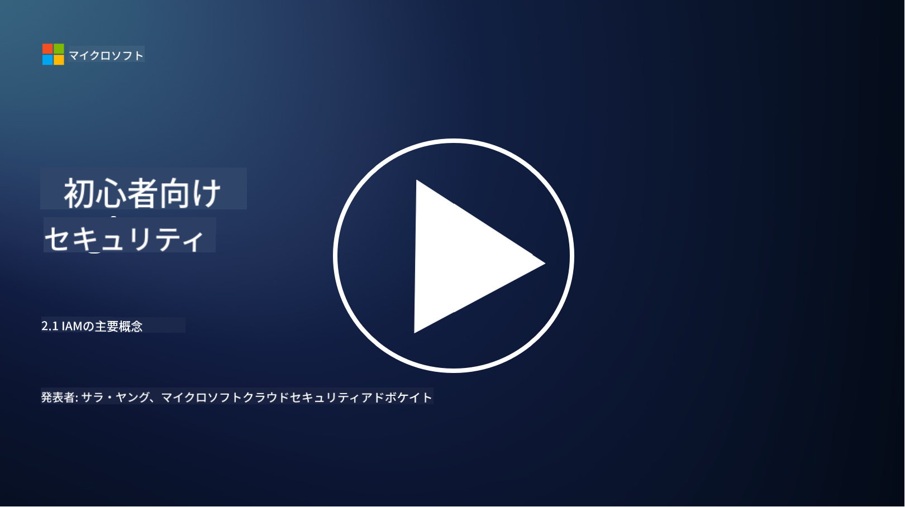

<!--
CO_OP_TRANSLATOR_METADATA:
{
  "original_hash": "2e3864e3d579f0dbb4ac2ec8c5f82acf",
  "translation_date": "2025-09-03T19:38:46+00:00",
  "source_file": "2.1 IAM key concepts.md",
  "language_code": "ja"
}
-->
# IAMの基本概念

コンピュータやウェブサイトにログインしたことはありますか？もちろんありますよね！それは、日常生活の中で既にアイデンティティ管理を利用しているということです。アイデンティティとアクセス管理（IAM）はセキュリティの重要な柱であり、次のレッスンでさらに詳しく学んでいきます。

**はじめに**

このレッスンでは以下について学びます：

- サイバーセキュリティの文脈で、アイデンティティとアクセス管理（IAM）とは何を意味するのか？
- 最小権限の原則とは何か？
- 職務分離とは何か？
- 認証と認可とは何か？

## サイバーセキュリティの文脈で、アイデンティティとアクセス管理（IAM）とは何を意味するのか？

アイデンティティとアクセス管理（IAM）とは、組織のデジタル環境内で適切な個人が適切なリソースにアクセスできるようにするために実施されるプロセス、技術、ポリシーのセットを指します。IAMは、デジタルアイデンティティ（ユーザー、従業員、パートナー）と、それらのシステム、アプリケーション、データ、ネットワークへのアクセスを管理することを含みます。IAMの主な目的は、セキュリティを強化し、ユーザーアクセスを効率化し、組織のポリシーや規制への準拠を確保することです。IAMソリューションには通常、ユーザー認証、認可、アイデンティティプロビジョニング、アクセス制御、ユーザーライフサイクル管理（使用されなくなったアカウントの削除を含む）が含まれます。

## 最小権限の原則とは何か？

最小権限の原則は、ユーザーやシステムに対して、意図されたタスクや役割を実行するために必要最低限の権限のみを付与することを推奨する基本的な概念です。この原則は、セキュリティ侵害や内部脅威が発生した場合の潜在的な被害を制限するのに役立ちます。最小権限の原則を遵守することで、組織は攻撃対象領域を減らし、不正アクセス、データ漏洩、権限の誤使用のリスクを最小限に抑えることができます。実際には、ユーザーにはその職務に必要な特定のリソースや機能へのアクセスのみが付与され、それ以上の権限は与えられません。例えば、単に文書を読むだけであれば、その文書に対する完全な管理者権限を与えるのは過剰です。

## 職務分離とは何か？

職務分離は、利害の衝突を防ぎ、詐欺やエラーのリスクを軽減するために、重要なタスクや責任を組織内の異なる個人に分散させる原則です。サイバーセキュリティの文脈では、職務分離は、重要なプロセスやシステムのすべての側面を単一の個人が管理できないようにすることを意味します。この目的は、プロセスの設定と承認の両方を単一の人物が行える状況を防ぐためのチェックアンドバランスの仕組みを作ることです。例えば、財務システムでは、取引をシステムに入力する人と、その取引を承認する人が同一であってはならないとされる場合があります。これにより、不正行為や不正な操作が見逃されるリスクを軽減します。

## 認証と認可とは何か？

認証と認可は、コンピュータシステムやデータのセキュリティと整合性を確保する上で重要な役割を果たす、サイバーセキュリティの基本的な概念です。これらは、リソースへのアクセスを制御し、機密情報を保護するために連携して使用されます。

**1. 認証**:  
認証とは、コンピュータシステムや特定のリソースにアクセスしようとするユーザー、システム、またはエンティティのアイデンティティを確認するプロセスです。これにより、主張されたアイデンティティが正当であることが保証されます。認証方法には通常、以下のいずれか、または複数の要素が含まれます：

a. 知っているもの: パスワード、PIN、または認可されたユーザーのみが知っている秘密情報。  
b. 所有しているもの: スマートカード、セキュリティトークン、モバイルデバイスなど、ユーザーのアイデンティティを確認するための物理的なトークンやデバイス。  
c. 自分自身であるもの: 指紋、顔認証、網膜スキャンなど、個人に固有の生体認証要素。  

認証メカニズムは、ユーザーが主張するアイデンティティを確認し、システムやリソースへのアクセスを許可する前に使用されます。これにより、不正アクセスを防ぎ、正当なユーザーのみがシステム内で操作を行えるようにします。

**2. 認可**:  
認可とは、認証されたユーザーやエンティティに対して、特定の権限や特権を付与または拒否するプロセスです。これにより、システム内でユーザーが実行できる操作やアクセスできるリソースが決定されます。認可は通常、事前に定義されたポリシー、アクセス制御ルール、およびユーザーに割り当てられた役割に基づいて行われます。

認可は、「認証されたユーザーが何をできるのか？」という質問に答えるものと考えることができます。これにより、機密データやリソースが不正アクセスや改ざんから保護されるよう、アクセス制御ポリシーを定義し、施行します。

**まとめ:**

- 認証は、ユーザーやエンティティのアイデンティティを確立します。  
- 認可は、認証されたユーザーがアクセスまたは操作できるアクションやリソースを決定します。

## さらなる学習

- [Describe identity concepts - Training | Microsoft Learn](https://learn.microsoft.com/training/modules/describe-identity-principles-concepts/?WT.mc_id=academic-96948-sayoung)  
- [Introduction to identity - Microsoft Entra | Microsoft Learn](https://learn.microsoft.com/azure/active-directory/fundamentals/identity-fundamental-concepts?WT.mc_id=academic-96948-sayoung)  
- [What is Identity Access Management (IAM)? | Microsoft Security](https://www.microsoft.com/security/business/security-101/what-is-identity-access-management-iam?WT.mc_id=academic-96948-sayoung)  
- [What is IAM? Identity and access management explained | CSO Online](https://www.csoonline.com/article/518296/what-is-iam-identity-and-access-management-explained.html)  
- [What is IAM? (auth0.com)](https://auth0.com/blog/what-is-iam/)  
- [Security+: implementing Identity and Access Management (IAM) controls [updated 2021] | Infosec (infosecinstitute.com)](https://resources.infosecinstitute.com/certifications/securityplus/security-implementing-identity-and-access-management-iam-controls/)  
- [least privilege - Glossary | CSRC (nist.gov)](https://csrc.nist.gov/glossary/term/least_privilege)  
- [Security: The Principle of Least Privilege (POLP) - Microsoft Community Hub](https://techcommunity.microsoft.com/t5/azure-sql-blog/security-the-principle-of-least-privilege-polp/ba-p/2067390?WT.mc_id=academic-96948-sayoung)  
- [Principle of least privilege | CERT NZ](https://www.cert.govt.nz/it-specialists/critical-controls/principle-of-least-privilege/)  
- [Why is separation of duties required by NIST 800-171 and CMMC? - (totem.tech)](https://www.totem.tech/cmmc-separation-of-duties/)  

---

**免責事項**:  
この文書は、AI翻訳サービス [Co-op Translator](https://github.com/Azure/co-op-translator) を使用して翻訳されています。正確性を追求しておりますが、自動翻訳には誤りや不正確な部分が含まれる可能性があることをご承知ください。元の言語で記載された文書が正式な情報源とみなされるべきです。重要な情報については、専門の人間による翻訳を推奨します。この翻訳の使用に起因する誤解や誤った解釈について、当方は責任を負いません。