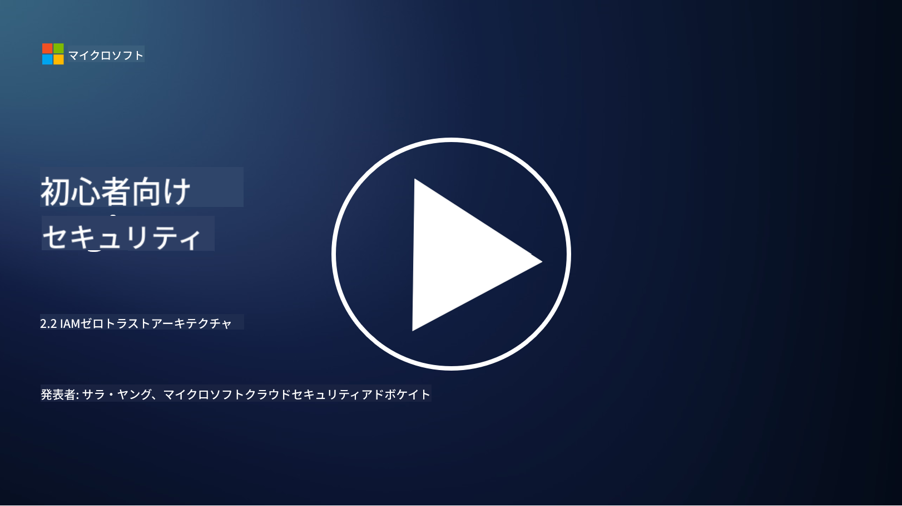

<!--
CO_OP_TRANSLATOR_METADATA:
{
  "original_hash": "4774a978af123f72ebb872199c4c4d4f",
  "translation_date": "2025-09-03T20:28:40+00:00",
  "source_file": "2.2 IAM zero trust architecture.md",
  "language_code": "ja"
}
-->
# IAMゼロトラストアーキテクチャ

アイデンティティはゼロトラストアーキテクチャを実現し、IT環境の境界を構築する上で重要な要素です。このセクションでは、ゼロトラストを実現するためにアイデンティティ制御を使用することがなぜ重要なのかを探ります。

## はじめに

このレッスンでは以下を取り上げます：

- 現代のIT環境でアイデンティティを境界として使用する必要がある理由

- 従来のITアーキテクチャとどのように異なるのか？

- アイデンティティがゼロトラストアーキテクチャを実現するためにどのように使用されるのか？

## 現代のIT環境でアイデンティティを境界として使用する必要がある理由

現代のIT環境では、サイバー脅威に対する防御の第一線として、ファイアウォールやネットワーク境界などのツールを使用する従来の物理的な境界の概念が、技術の複雑化、リモートワークの増加、クラウドサービスの採用により効果が薄れています。その代わりに、組織はアイデンティティを新しい境界として使用する方向にシフトしています。これにより、物理的な場所に関係なく、リソースにアクセスしようとするユーザー、デバイス、アプリケーションのアイデンティティを検証・管理することがセキュリティの中心となります。

現代のIT環境でアイデンティティを境界として使用することが重要な理由は以下の通りです：

**リモートワークフォース**: リモートワークやモバイルデバイスが一般的になり、ユーザーはさまざまな場所やデバイスからリソースにアクセスします。従来の境界アプローチは、ユーザーが物理的なオフィスに限定されない場合には機能しません。

**クラウドとハイブリッド環境**: 組織はクラウドサービスやハイブリッド環境をますます採用しています。データやアプリケーションが組織の敷地内に限定されなくなり、従来の境界防御が関連性を失っています。

**ゼロトラストセキュリティ**: ゼロトラストセキュリティの概念では、ネットワーク内外を問わず、いかなるエンティティも自動的に信頼されるべきではないとされています。アイデンティティは、アクセス要求を検証する基盤となります。

**脅威の状況**: サイバー脅威は進化しており、攻撃者は従来の境界防御を回避する方法を見つけています。フィッシング、ソーシャルエンジニアリング、内部脅威は、ネットワーク境界を突破するのではなく、人間の脆弱性を利用することが多いです。

**データ中心のアプローチ**: 機密データの保護が最重要です。アイデンティティに焦点を当てることで、誰がどのデータにアクセスできるかを制御し、データ漏洩のリスクを軽減します。

## 従来のITアーキテクチャとどのように異なるのか？

従来のITアーキテクチャは、ファイアウォールやネットワーク境界が脅威を防ぐ重要な役割を果たす境界ベースのセキュリティモデルに大きく依存していました。従来のアプローチとアイデンティティ中心のアプローチの主な違いは以下の通りです：

|      項目                   |      従来のITアーキテクチャ                                                                 |      アイデンティティ中心のアプローチ                                                                     |
|-----------------------------|--------------------------------------------------------------------------------------------|------------------------------------------------------------------------------------------------------------|
|     焦点                   |     境界に焦点: ファイアウォールやアクセス制御などの境界防御に依存。                          |     アイデンティティ検証に焦点: ネットワーク境界からユーザー/デバイスのアイデンティティ検証へシフト。       |
|     場所                   |     場所依存: セキュリティが物理的なオフィスの場所やネットワーク境界に結びついている。         |     場所非依存: 特定の場所に縛られず、どこからでもアクセス可能なセキュリティ。                             |
|     信頼の仮定             |     信頼の仮定: ネットワーク境界内のユーザー/デバイスを信頼することを前提としている。         |     ゼロトラストアプローチ: 信頼は決して仮定されず、アイデンティティとコンテキストに基づいてアクセスを検証。 |
|     デバイスの考慮         |     デバイスの多様性: ネットワーク境界内のデバイスが安全であると仮定。                        |     デバイスの認識: 場所に関係なく、デバイスの健康状態やセキュリティ状況を考慮。                           |
|     データ保護             |     データ保護: データ保護のためにネットワーク境界のセキュリティに焦点を当てる。               |     データ中心の保護: アイデンティティとデータの機密性に基づいてデータアクセスを制御。                     |
|                             |                                                                                            |                                                                                                            |

## アイデンティティがゼロトラストアーキテクチャを実現するためにどのように使用されるのか？

ゼロトラストアーキテクチャでは、ネットワーク境界内外を問わず、いかなるエンティティも自動的に信頼されるべきではないという基本原則があります。アイデンティティは、リソースへのアクセスを試みるエンティティを継続的に検証することで、ゼロトラストアプローチを実現する上で中心的な役割を果たします。現代のアイデンティティセキュリティ制御により、リソースへのアクセスを求めるすべてのユーザー、デバイス、アプリケーション、サービスは、アクセスが許可される前に徹底的に識別・認証される必要があります。これには、ユーザー名/パスワードの組み合わせ、多要素認証（MFA）、生体認証、その他の強力な認証メカニズムを使用してデジタルアイデンティティを検証することが含まれます。

## さらなる学習

- [Securing identity with Zero Trust | Microsoft Learn](https://learn.microsoft.com/security/zero-trust/deploy/identity?WT.mc_id=academic-96948-sayoung)
- [Zero Trust Principles and Guidance for Identity and Access | CSA (cloudsecurityalliance.org)](https://cloudsecurityalliance.org/artifacts/zero-trust-principles-and-guidance-for-iam/)
- [Zero Trust Identity Controls - Essentials Series - Episode 2 - YouTube](https://www.youtube.com/watch?v=fQZQznIKcGM&list=PLXtHYVsvn_b_gtX1-NB62wNervQx1Fhp4&index=13)

---

**免責事項**:  
この文書は、AI翻訳サービス [Co-op Translator](https://github.com/Azure/co-op-translator) を使用して翻訳されています。正確性を追求しておりますが、自動翻訳には誤りや不正確な部分が含まれる可能性があります。元の言語で記載された文書が正式な情報源とみなされるべきです。重要な情報については、専門の人間による翻訳を推奨します。この翻訳の使用に起因する誤解や誤解について、当社は責任を負いません。