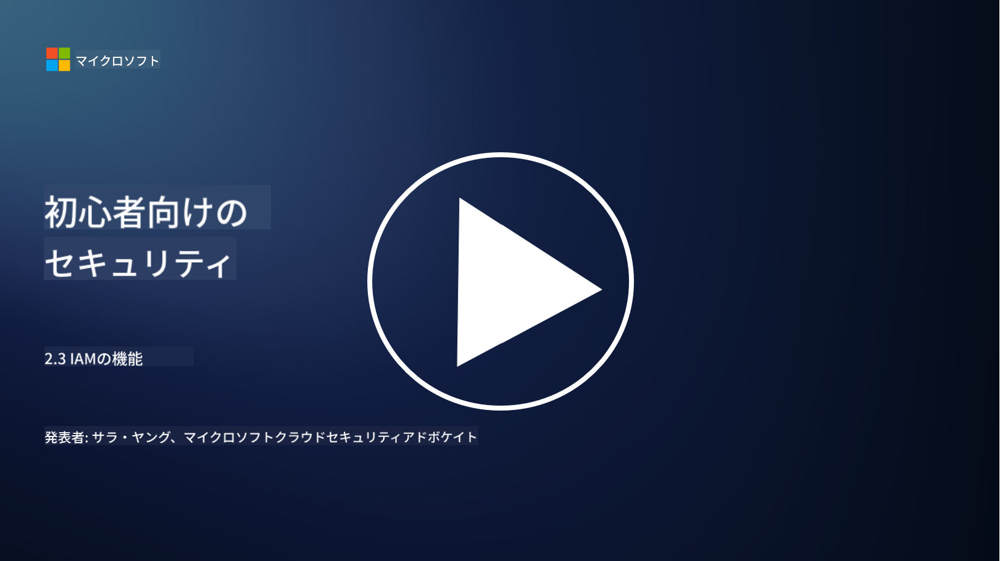

<!--
CO_OP_TRANSLATOR_METADATA:
{
  "original_hash": "bf0b8a54f2c69951744df5a94bc923f7",
  "translation_date": "2025-09-03T22:12:31+00:00",
  "source_file": "2.3 IAM capabilities.md",
  "language_code": "ja"
}
-->
# IAMの機能

このセクションでは、アイデンティティセキュリティに使用される主要なツールと機能について詳しく説明します。

## はじめに

このレッスンでは以下を学びます：

 - ディレクトリサービスとは何か？
      
     
    
 - アイデンティティを保護するために使用できる機能はどのようなものか？
>
>        多要素認証 (MFA)
> 
>        シングルサインオン (SSO)
> 
>        ロールベースアクセス制御 (RBAC)
> 
>        アダプティブ認証
> 
>        生体認証
> 
>        特権アクセス管理 (PAM)
> 
>        アイデンティティガバナンスと管理 (IGA)
> 
>        行動分析

## ディレクトリサービスとは何か？

ディレクトリサービスは、ユーザー、グループ、デバイス、アプリケーション、その他のオブジェクトを含むネットワークリソースに関する情報を保存・管理するための専門的なデータベースです。これはアイデンティティとアクセスに関連するデータの集中型リポジトリとして機能し、組織がユーザー認証、認可、その他のセキュリティ関連のタスクを効率的に管理・制御できるようにします。

ディレクトリサービスは、現代のIT環境において重要な役割を果たしており、アイデンティティとアクセス管理 (IAM) ソリューションの基盤を提供します。これにより、リソースへの安全なアクセスが可能になり、アクセスポリシーが強制され、管理タスクが簡素化されます。最もよく知られているディレクトリサービスの1つはMicrosoft Active Directoryですが、LDAP (Lightweight Directory Access Protocol) ディレクトリなど、同様の目的を果たす他のソリューションも存在します。

サイバーセキュリティの観点でのディレクトリサービスの主な機能と特徴は以下の通りです：

 - **ユーザー認証**: ディレクトリサービスは、ユーザー名やパスワードなどのユーザー資格情報を検証し、認可されたユーザーのみがネットワークとそのリソースにアクセスできるようにします。
 - **ユーザー認可**: ユーザーの役割、グループメンバーシップ、その他の属性に基づいて、各ユーザーのアクセスレベルを決定します。これにより、ユーザーが許可されたリソースのみを利用できるようになります。
 - **グループ管理**: ディレクトリサービスは、管理者がユーザーを論理的なグループに整理することを可能にし、アクセス制御管理を簡素化します。権限は個々のユーザーではなくグループに割り当てることができます。
 - **パスワードポリシー**: パスワードの複雑さや有効期限のルールを強制し、ユーザーアカウントのセキュリティを向上させます。
 - **シングルサインオン (SSO)**: 一部のディレクトリサービスはSSOをサポートしており、ユーザーが1つの資格情報セットで複数のアプリケーションやサービスにアクセスできるようにします。
 - **集中型ユーザー管理**: ディレクトリサービスはユーザー情報を集中管理し、1つの場所からユーザーアカウント、プロファイル、属性を管理しやすくします。
 - **監査とログ記録**: ユーザー認証やアクセス活動を記録し、セキュリティ監査やコンプライアンスの取り組みを支援します。

## アイデンティティを保護するために使用できる機能はどのようなものか？

**多要素認証 (MFA)**

MFAは、アクセスを許可する前に複数の検証方法を要求します。これには通常、ユーザーが知っているもの（パスワード）、ユーザーが持っているもの（スマートフォンやセキュリティトークン）、ユーザー自身（指紋や顔認識などの生体データ）が含まれます。

**シングルサインオン (SSO)**

SSOは、ユーザーが1つの資格情報セットで複数のアプリケーションやシステムにアクセスできるようにします。これによりユーザー体験が向上し、複数のパスワードを管理するリスクが軽減されます。

**ロールベースアクセス制御 (RBAC)**

RBACは、事前に定義された役割に基づいて権限を割り当てます。ユーザーは組織内での役割に基づいてアクセス権を付与されます。

**アダプティブ認証**

アダプティブ認証は、位置情報、デバイス、アクセス時間、ユーザー行動などのリスク要因を評価し、必要な認証レベルを動的に調整します。リクエストが疑わしい場合、追加の認証ステップが要求されることがあります。

**生体認証**

生体認証は、指紋、顔の特徴、声のパターン、さらにはタイピング速度などの行動特性といった、ユニークな生物学的特徴を使用してアイデンティティを確認します。

**特権アクセス管理 (PAM)**

PAMは、重要なシステムやデータへのアクセスを保護することに焦点を当て、特権アカウントに厳格な制御を適用します。これには、必要な時だけのアクセスやセッション監視などの機能が含まれます。

**アイデンティティガバナンスと管理 (IGA)**

IGAソリューションは、ユーザーのアイデンティティとリソースへのアクセスをライフサイクル全体にわたって管理します。これには、オンボーディング、プロビジョニング、ロールベースアクセス制御、デプロビジョニングが含まれます。

**行動分析**

行動分析は、ユーザーの行動を監視し、基準となるパターンを確立します。通常と異なる行動が検出された場合、さらなる調査のためのアラートが発生します。

# 参考資料
- [Microsoft Entra の基礎に関するドキュメント - Microsoft Entra | Microsoft Learn](https://learn.microsoft.com/azure/active-directory/fundamentals/?WT.mc_id=academic-96948-sayoung)
- [Microsoft Entra とは - Microsoft Entra | Microsoft Learn](https://learn.microsoft.com/azure/active-directory/fundamentals/whatis?WT.mc_id=academic-96948-sayoung)
- [Manage your multi-cloud identity infrastructure with Microsoft Entra - YouTube](https://www.youtube.com/watch?v=9qQiq3wTS2Y&list=PLXtHYVsvn_b_gtX1-NB62wNervQx1Fhp4&index=18)

---

**免責事項**:  
この文書は、AI翻訳サービス [Co-op Translator](https://github.com/Azure/co-op-translator) を使用して翻訳されています。正確性を追求しておりますが、自動翻訳には誤りや不正確な部分が含まれる可能性があります。元の言語で記載された文書が正式な情報源とみなされるべきです。重要な情報については、専門の人間による翻訳を推奨します。この翻訳の使用に起因する誤解や誤解釈について、当方は一切の責任を負いません。
