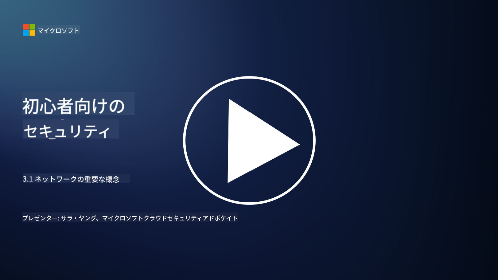
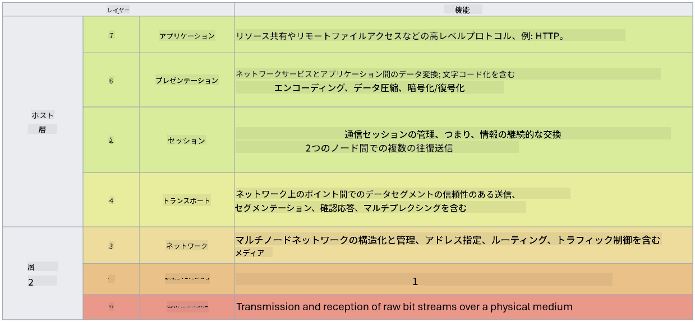

<!--
CO_OP_TRANSLATOR_METADATA:
{
  "original_hash": "252724eceeb183fb9018f88c5e1a3f0c",
  "translation_date": "2025-09-03T22:07:09+00:00",
  "source_file": "3.1 Networking key concepts.md",
  "language_code": "ja"
}
-->
# ネットワークの重要な概念

ITの仕事をしたことがあるなら、ネットワークの概念に触れたことがあるでしょう。現代の環境ではアイデンティティを主要な境界制御として使用しますが、それでもネットワーク制御が不要になるわけではありません。このレッスンでは、ネットワークの重要な概念について学びます。

このレッスンで学ぶ内容:

- IPアドレスとは何か？

- OSIモデルとは何か？

- TCP/UDPとは何か？

- ポート番号とは何か？

- 保存時および転送時の暗号化とは何か？

## IPアドレスとは何か？

IPアドレス（インターネットプロトコルアドレス）は、インターネットプロトコルを使用して通信するコンピュータネットワークに接続されたすべてのデバイスに割り当てられる数値ラベルです。ネットワーク内のデバイスを一意に識別し、インターネットや他のネットワーク間でデータを送受信できるようにします。IPアドレスには主に2つのバージョンがあります: IPv4（インターネットプロトコルバージョン4）とIPv6（インターネットプロトコルバージョン6）。IPアドレスは通常、IPv4形式（例: 192.168.1.1）またはIPv6形式（例: 2001:0db8:85a3:0000:0000:8a2e:0370:7334）で表されます。

## OSIモデルとは何か？

OSI（オープンシステム相互接続）モデルは、通信システムの機能を7つの異なる層に標準化する概念的なフレームワークです。各層は特定のタスクを実行し、隣接する層と通信して、ネットワーク内のデバイス間で効率的かつ信頼性の高いデータ通信を実現します。層は下から上に向かって以下の通りです:

1. 物理層

2. データリンク層

3. ネットワーク層

4. トランスポート層

5. セッション層

6. プレゼンテーション層

7. アプリケーション層

OSIモデルは、特定のハードウェアやソフトウェアの実装に関係なく、ネットワークプロトコルや技術がどのように相互作用するかを理解するための共通の参照を提供します。

_ref: https://en.wikipedia.org/wiki/OSI_model_

## TCP/UDPとは何か？

TCP（Transmission Control Protocol）とUDP（User Datagram Protocol）は、インターネットやローカルネットワーク内でデバイス間の通信を促進するために使用される、コンピュータネットワークの基本的なトランスポート層プロトコルです。これらはデータをパケットに分割して送信し、受信側で元のデータに再構築する役割を果たします。ただし、それぞれの特性と使用ケースは異なります。

**TCP（Transmission Control Protocol）**:

TCPは接続指向のプロトコルで、デバイス間で信頼性が高く順序付けられたデータ配信を提供します。データ交換が始まる前に送信者と受信者の間で接続を確立します。TCPはデータパケットが正しい順序で到着することを保証し、失われたパケットの再送信を処理してデータの完全性を確保します。そのため、TCPはウェブブラウジング、電子メール、ファイル転送（FTP）、データベース通信など、信頼性の高いデータ配信が必要なアプリケーションに適しています。

**UDP（User Datagram Protocol）**:

UDPは接続レスのプロトコルで、TCPほどの信頼性は提供しませんが、より高速なデータ送信を可能にします。データ送信前に正式な接続を確立せず、失われたパケットの確認や再送信の仕組みを含みません。UDPはリアルタイム通信、ストリーミングメディア、オンラインゲーム、DNSクエリなど、速度と効率が重要で、データの完全な配信が必須ではないアプリケーションに適しています。

まとめると、TCPは信頼性と順序付けを重視し、データの正確性が必要なアプリケーションに適しており、UDPは速度と効率を重視し、多少のデータ損失や順序の入れ替えが許容されるアプリケーションに適しています。TCPとUDPの選択は、使用するアプリケーションやサービスの具体的な要件によります。

## ポート番号とは何か？

ネットワークにおいて、ポート番号は、ネットワーク内の単一デバイス上で実行されている異なるサービスやアプリケーションを区別するために使用される数値識別子です。ポートは、受信データを適切なアプリケーションにルーティングする役割を果たします。ポート番号は16ビットの符号なし整数であり、0から65535までの範囲があります。これらは以下の3つの範囲に分けられます:

- ウェルノウンポート（0-1023）：HTTP（ポート80）やFTP（ポート21）などの標準サービスに予約されています。

- 登録ポート（1024-49151）：ウェルノウン範囲に属さないが公式に登録されたアプリケーションやサービスに使用されます。

- 動的/プライベートポート（49152-65535）：アプリケーションによる一時的またはプライベートな使用に利用可能です。

## 保存時および転送時の暗号化とは何か？

暗号化は、データを安全な形式に変換し、不正アクセスや改ざんから保護するプロセスです。暗号化は、データが「保存時」（デバイスやサーバーに保存されている場合）と「転送時」（デバイス間やネットワーク上で送信されている場合）の両方に適用できます。

保存時の暗号化: デバイス、サーバー、またはストレージシステムに保存されているデータを暗号化します。攻撃者がストレージメディアに物理的にアクセスした場合でも、暗号化キーがなければデータにアクセスできません。これは、デバイスの盗難、データ漏洩、不正アクセスの場合に機密データを保護するために重要です。

転送時の暗号化: デバイス間やネットワーク上でデータが移動する際に暗号化します。これにより、送信中のデータの盗聴や不正な傍受を防ぎます。転送時の暗号化に一般的なプロトコルには、ウェブ通信のためのHTTPSや、さまざまな種類のネットワークトラフィックを保護するTLS/SSLがあります。

## 参考資料
- [How Do IP Addresses Work? (howtogeek.com)](https://www.howtogeek.com/341307/how-do-ip-addresses-work/)
- [Understanding IP Address: An Introductory Guide (geekflare.com)](https://geekflare.com/understanding-ip-address/)
- [What is the OSI model? The 7 layers of OSI explained (techtarget.com)](https://www.techtarget.com/searchnetworking/definition/OSI)
- [The OSI Model – The 7 Layers of Networking Explained in Plain English (freecodecamp.org)](https://www.freecodecamp.org/news/osi-model-networking-layers-explained-in-plain-english/)
- [TCP/IP protocols - IBM Documentation](https://www.ibm.com/docs/en/aix/7.3?topic=protocol-tcpip-protocols)
- [Common Ports Cheat Sheet: The Ultimate Ports & Protocols List (stationx.net)](https://www.stationx.net/common-ports-cheat-sheet/)
- [Azure Data Encryption-at-Rest - Azure Security | Microsoft Learn](https://learn.microsoft.com/azure/security/fundamentals/encryption-atrest?WT.mc_id=academic-96948-sayoung)

---

**免責事項**:  
この文書はAI翻訳サービス[Co-op Translator](https://github.com/Azure/co-op-translator)を使用して翻訳されています。正確性を追求しておりますが、自動翻訳には誤りや不正確な部分が含まれる可能性があります。元の言語で記載された文書が正式な情報源とみなされるべきです。重要な情報については、専門の人間による翻訳を推奨します。この翻訳の使用に起因する誤解や誤解釈について、当社は責任を負いません。