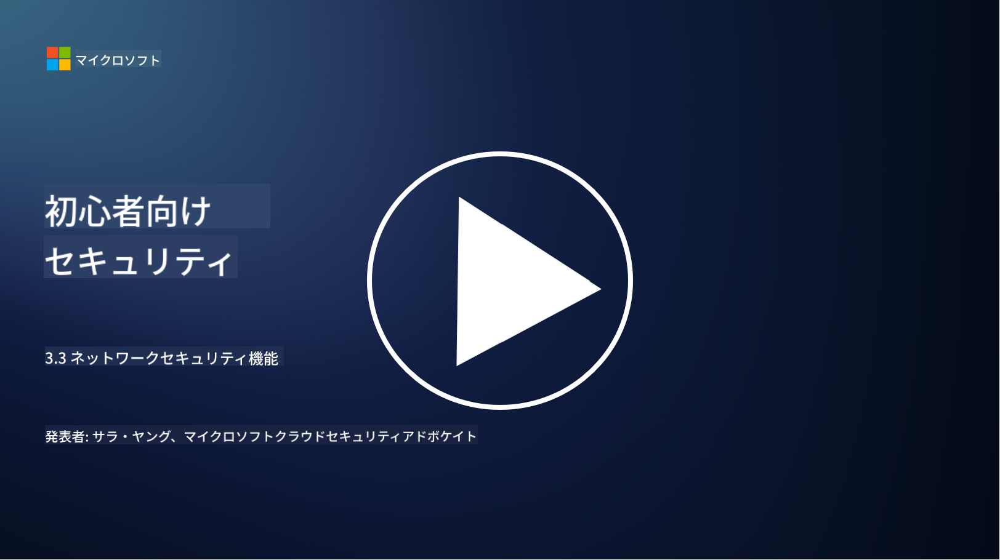

<!--
CO_OP_TRANSLATOR_METADATA:
{
  "original_hash": "c3aba077bb98eebc925dd58d870229ab",
  "translation_date": "2025-09-03T20:22:19+00:00",
  "source_file": "3.3 Network security capabilities.md",
  "language_code": "ja"
}
-->
# ネットワークセキュリティの機能

このレッスンでは、ネットワークを保護するために使用できる以下の機能について学びます：

 - 従来型ファイアウォール
 - Webアプリケーションファイアウォール
 - クラウドセキュリティグループ
 - CDN
 - ロードバランサー
 - バスティオンホスト
 - VPN
 - DDoS保護

## 従来型ファイアウォール

従来型ファイアウォールは、事前に定義されたセキュリティルールに基づいて、ネットワークの入出力トラフィックを制御・監視するセキュリティデバイスです。信頼された内部ネットワークと信頼されていない外部ネットワークの間に障壁を作り、トラフィックをフィルタリングして不正アクセスや潜在的な脅威を防ぎます。

## Webアプリケーションファイアウォール

Webアプリケーションファイアウォール（WAF）は、SQLインジェクションやクロスサイトスクリプティングなどの攻撃からWebアプリケーションを保護するために設計された専門的なファイアウォールです。HTTPリクエストとレスポンスを分析し、Webアプリケーションを標的とする悪意のあるトラフィックを特定してブロックします。

## クラウドセキュリティグループ

セキュリティグループは、クラウドサービスプロバイダーが提供する基本的なネットワークセキュリティ機能です。これらは仮想ファイアウォールとして機能し、仮想マシン（VM）やインスタンスなどのクラウドリソースへの入出力トラフィックを制御します。セキュリティグループは、許可されるトラフィックの種類と拒否されるトラフィックの種類を定義するルールを設定することで、クラウド展開に追加の防御層を提供します。

## コンテンツ配信ネットワーク (CDN)

コンテンツ配信ネットワーク（CDN）は、地理的に分散したサーバーのネットワークです。CDNはコンテンツをキャッシュし、ユーザーに近いサーバーから配信することで、Webサイトのパフォーマンスと可用性を向上させます。また、トラフィックを複数のサーバーに分散させることで、DDoS攻撃に対する一定の保護を提供します。

## ロードバランサー

ロードバランサーは、ネットワークに流入するトラフィックを複数のサーバーに分散させ、リソースの利用を最適化し、高可用性を確保し、アプリケーションのパフォーマンスを向上させます。これにより、サーバーの過負荷を防ぎ、効率的な応答時間を維持し、ネットワークの回復力を強化します。

## バスティオンホスト

バスティオンホストは、外部の信頼されていないネットワーク（例えばインターネット）からネットワークへのアクセスを制御するための、高度にセキュアで隔離されたサーバーです。これらは管理者が内部システムに安全にアクセスするための入口として機能します。バスティオンホストは通常、攻撃対象を最小化するために強力なセキュリティ対策が施されています。

## 仮想プライベートネットワーク (VPN)

VPNは、ユーザーのデバイスとリモートサーバー間に暗号化されたトンネルを作成し、インターネットのような潜在的に安全でないネットワーク上で安全でプライベートな通信を確保します。VPNは、内部ネットワークへのリモートアクセスを提供するために一般的に使用され、ユーザーが物理的に同じネットワーク上にいるかのようにリソースにアクセスできるようにします。

## DDoS保護ツール

DDoS（分散型サービス拒否）保護ツールとサービスは、複数の侵害されたデバイスがネットワークやサービスを圧倒する目的でトラフィックを集中させるDDoS攻撃の影響を軽減するために設計されています。DDoS保護ソリューションは悪意のあるトラフィックを特定してフィルタリングし、正当なトラフィックが目的地に到達できるようにします。

## 参考資料

- [What Is a Firewall? - Cisco](https://www.cisco.com/c/en/us/products/security/firewalls/what-is-a-firewall.html#~types-of-firewalls)
- [What Does a Firewall Actually Do? (howtogeek.com)](https://www.howtogeek.com/144269/htg-explains-what-firewalls-actually-do/)
- [What is a Firewall? How Firewalls Work & Types of Firewalls (kaspersky.com)](https://www.kaspersky.com/resource-center/definitions/firewall)
- [ネットワーク セキュリティ グループによってネットワーク トラフィックをフィルター処理する方法 | Microsoft Learn](https://learn.microsoft.com/azure/virtual-network/network-security-group-how-it-works)
- [Azure Front Door の概要 | Microsoft Learn](https://learn.microsoft.com/training/modules/intro-to-azure-content-delivery-network/?WT.mc_id=academic-96948-sayoung)
- [Azure 上のコンテンツ配信ネットワーク(CDN)とは | Microsoft Learn](https://learn.microsoft.com/azure/cdn/cdn-overview?WT.mc_id=academic-96948-sayoung)
- [What Is Load Balancing? How Load Balancers Work (nginx.com)](https://www.nginx.com/resources/glossary/load-balancing/)
- [Bastion hosts vs. VPNs · Tailscale](https://tailscale.com/learn/bastion-hosts-vs-vpns/)
- [What is VPN? How It Works, Types of VPN (kaspersky.com)](https://www.kaspersky.com/resource-center/definitions/what-is-a-vpn)
- [Azure DDoS Protection のドキュメント | Microsoft Learn](https://learn.microsoft.com/training/modules/introduction-azure-ddos-protection/?WT.mc_id=academic-96948-sayoung)
- [What Is a DDoS Attack? | Microsoft Security](https://www.microsoft.com/security/business/security-101/what-is-a-ddos-attack?WT.mc_id=academic-96948-sayoung)

---

**免責事項**:  
この文書は、AI翻訳サービス [Co-op Translator](https://github.com/Azure/co-op-translator) を使用して翻訳されています。正確性を追求しておりますが、自動翻訳には誤りや不正確な部分が含まれる可能性があります。元の言語で記載された文書が正式な情報源とみなされるべきです。重要な情報については、専門の人間による翻訳を推奨します。この翻訳の使用に起因する誤解や誤った解釈について、当方は一切の責任を負いません。
