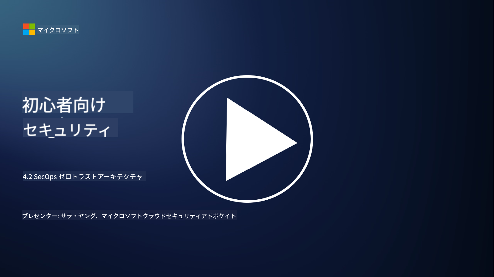

<!--
CO_OP_TRANSLATOR_METADATA:
{
  "original_hash": "45bbdc114e70936816b0b3e7c40189cf",
  "translation_date": "2025-09-03T21:21:32+00:00",
  "source_file": "4.2 SecOps zero trust architecture.md",
  "language_code": "ja"
}
-->
# SecOps ゼロトラストアーキテクチャ

セキュリティオペレーションはゼロトラストアーキテクチャの重要な部分を構成しており、このレッスンでは以下の2つについて学びます：

- 集中型ログ収集を可能にするために、ITアーキテクチャはどのように構築されるべきか？

- 現代のIT環境におけるセキュリティオペレーションのベストプラクティスは何か？

## 集中型ログ収集を可能にするために、ITアーキテクチャはどのように構築されるべきか？

集中型ログ収集は、現代のセキュリティオペレーションにおいて重要な要素です。これにより、サーバー、アプリケーション、ネットワークデバイス、セキュリティツールなど、さまざまなソースからログやデータを集約し、分析、監視、インシデント対応のための中央リポジトリに保存することができます。以下は、集中型ログ収集をサポートするITアーキテクチャを構築するためのベストプラクティスです：

1. **ログソースの統合**:

- サーバー、ファイアウォール、ルーター、スイッチ、アプリケーション、セキュリティ機器など、関連するすべてのデバイスやシステムがログを生成するように設定します。

- ログソースを設定して、ログを集中型ログ収集システムまたは管理システムに転送します。

2. **適切なSIEMツールの選定**:

- 組織のニーズと規模に合ったSIEM（Security Information and Event Management）ソリューションを選択します。

- 選定したソリューションがログ収集、集約、分析、レポートをサポートしていることを確認します。

3. **スケーラビリティと冗長性**:

- ログソースの増加やログ量の増加に対応できるよう、アーキテクチャをスケーラブルに設計します。

- ハードウェアやネットワーク障害による中断を防ぐため、高可用性のための冗長性を実装します。

4. **ログの安全な転送**:

- TLS/SSLやIPsecなどの安全なプロトコルを使用して、ログをソースから中央リポジトリに転送します。

- 認証とアクセス制御を実装し、許可されたデバイスのみがログを送信できるようにします。

5. **正規化**:

- ログ形式を標準化し、データを正規化して、一貫性を保ち分析を容易にします。

6. **保存と保持**:

- コンプライアンスやセキュリティ要件に基づいて、ログの適切な保持期間を決定します。

- ログを安全に保存し、不正アクセスや改ざんから保護します。

## 現代のIT環境におけるセキュリティオペレーションのベストプラクティスは何か？

集中型ログ収集に加えて、以下は現代のIT環境におけるセキュリティオペレーションのベストプラクティスです：

1. **継続的な監視**: ネットワークやシステムの活動を継続的に監視し、リアルタイムで脅威を検出して対応します。

2. **脅威インテリジェンス**: 脅威インテリジェンスフィードやサービスを活用して、新たな脅威や脆弱性に関する情報を常に把握します。

3. **ユーザー教育**: 社員に対して定期的なセキュリティ意識向上トレーニングを実施し、ソーシャルエンジニアリングやフィッシング攻撃のリスクを軽減します。

4. **インシデント対応計画**: セキュリティインシデントに迅速かつ効果的に対応するためのインシデント対応計画を策定し、テストします。

5. **セキュリティの自動化**: セキュリティの自動化およびオーケストレーションツールを活用して、インシデント対応や繰り返し作業を効率化します。

6. **バックアップと復旧**: データ損失やランサムウェア攻撃に備え、堅牢なバックアップおよび災害復旧ソリューションを実装します。

## 参考資料

- [Microsoft Security Best Practices module: Security operations | Microsoft Learn](https://learn.microsoft.com/security/operations/security-operations-videos-and-decks?WT.mc_id=academic-96948-sayoung)
- [Security operations - Cloud Adoption Framework | Microsoft Learn](https://learn.microsoft.com/azure/cloud-adoption-framework/secure/security-operations?WT.mc_id=academic-96948-sayoung)
- [What is Security Operations and Analytics Platform Architecture? A Definition of SOAPA, How It Works, Benefits, and More (digitalguardian.com)](https://www.digitalguardian.com/blog/what-security-operations-and-analytics-platform-architecture-definition-soapa-how-it-works#:~:text=All%20in%20all%2C%20security%20operations%20and%20analytics%20platform,become%20more%20efficient%20and%20operative%20with%20your%20security.)

---

**免責事項**:  
この文書は、AI翻訳サービス [Co-op Translator](https://github.com/Azure/co-op-translator) を使用して翻訳されています。正確性を追求しておりますが、自動翻訳には誤りや不正確な部分が含まれる可能性があることをご承知ください。元の言語で記載された文書が正式な情報源とみなされるべきです。重要な情報については、専門の人間による翻訳を推奨します。この翻訳の使用に起因する誤解や誤解釈について、当方は一切の責任を負いません。