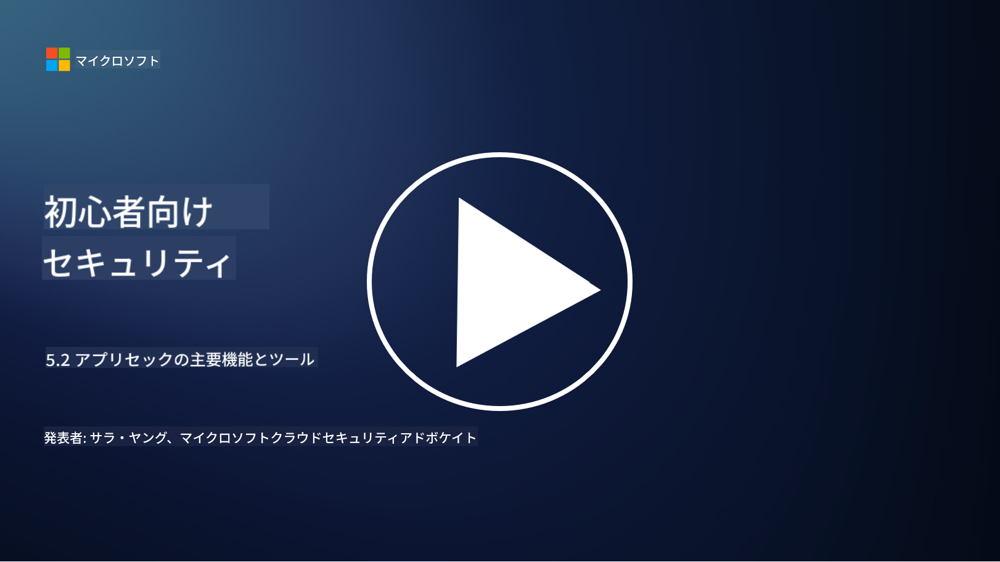

<!--
CO_OP_TRANSLATOR_METADATA:
{
  "original_hash": "790a3fa7e535ec60bb51bde13e759781",
  "translation_date": "2025-09-03T21:26:29+00:00",
  "source_file": "5.2 AppSec key capabilities.md",
  "language_code": "ja"
}
-->
このセクションでは、アプリケーションセキュリティで使用される主要なツールと機能について詳しく説明します。

## はじめに

このレッスンでは、アプリケーションセキュリティで使用される主要な機能とツールについて学びます。

## アプリケーションセキュリティの主要な機能とツール

アプリケーションセキュリティで使用される主要な機能とツールは、ソフトウェアアプリケーションのセキュリティ脆弱性や脅威を特定、軽減、防止するために不可欠です。以下はその中でも重要なものです：

**1. 静的アプリケーションセキュリティテスト (SAST)**:

- **機能**: ソースコード、バイトコード、またはバイナリコードを分析し、アプリケーションのコードベースにおけるセキュリティ脆弱性を特定します。

- **ツール**: Fortify、Checkmarx、Veracode など。

**2. 動的アプリケーションセキュリティテスト (DAST)**:

- **機能**: 実行中のアプリケーションをスキャンし、入力リクエストを送信して応答を分析することで脆弱性を特定します。

- **ツール**: ZAP、Burp Suite、Qualys Web Application Scanning など。

**3. インタラクティブアプリケーションセキュリティテスト (IAST)**:

- **機能**: SASTとDASTの要素を組み合わせ、実行時にコードを分析することで、より正確な結果を提供し、誤検知を減らします。

- **ツール**: Contrast Security、HCL AppScan など。

**4. 実行時アプリケーション自己保護 (RASP)**:

- **機能**: 実行中のアプリケーションをリアルタイムで監視・保護し、発生するセキュリティ脅威を検出して対応します。

- **ツール**: Veracode Runtime Protection、F5 Advanced WAF with RASP など。

**5. Webアプリケーションファイアウォール (WAF)**:

- **機能**: アプリケーションとインターネットの間に保護層を提供し、受信トラフィックをフィルタリングして悪意のあるリクエストをブロックします。

- **ツール**: ModSecurity、AWS WAF、Akamai Kona Site Defender など。

**6. 依存関係スキャン**:

- **機能**: アプリケーションで使用されるサードパーティライブラリやコンポーネントの脆弱性を特定します。

- **ツール**: OWASP Dependency-Check、Snyk など。

**7. ペネトレーションテスト (ペンテスト)**:

- **機能**: 実際の攻撃をシミュレーションして脆弱性を発見し、アプリケーションのセキュリティを評価します。

- **ツール**: Metasploit、Nmap などを使用して、認定された倫理的ハッカーやセキュリティ専門家が実施します。

**8. セキュリティスキャンと分析**:

- **機能**: 既知の脆弱性、構成エラー、セキュリティの誤設定をスキャンします。

- **ツール**: Nessus、Qualys Vulnerability Management、OpenVAS など。

**9. コンテナセキュリティツール**:

- **機能**: コンテナ化されたアプリケーションとその環境のセキュリティに焦点を当てます。

- **ツール**: Docker Security Scanning、Aqua Security など。

**10. 安全な開発トレーニング**:

- **機能**: 開発チームに安全なコーディングの実践を促進するためのトレーニングと意識向上プログラムを提供します。

- **ツール**: カスタマイズされたトレーニングプログラムやプラットフォーム。

**11. セキュリティテストフレームワーク**:

- **機能**: さまざまなアプリケーションセキュリティテストのニーズに対応する包括的なテストフレームワークを提供します。

- **ツール**: OWASP Amass、OWASP OWTF、FrAppSec など。

**12. 安全なコードレビューツール**:

- **機能**: ソースコードをレビューし、セキュリティ脆弱性やコーディングのベストプラクティスを確認します。

- **ツール**: SonarQube、Checkmarx など。

**13. 安全なAPIとマイクロサービスツール**:

- **機能**: APIとマイクロサービスのセキュリティに焦点を当て、認証、認可、データ保護を含みます。

- **ツール**: Apigee、AWS API Gateway、Istio など。

## さらなる学習

- [What Is Application Security? Concepts, Tools & Best Practices | HackerOne](https://www.hackerone.com/knowledge-center/what-application-security-concepts-tools-best-practices)
- [What is IAST? (Interactive Application Security Testing) (comparitech.com)](https://www.comparitech.com/net-admin/what-is-iast/)
- [10 Types of Application Security Testing Tools: When and How to Use Them (cmu.edu)](https://insights.sei.cmu.edu/blog/10-types-of-application-security-testing-tools-when-and-how-to-use-them/)
- [Shifting the Balance of Cybersecurity Risk: Principles and Approaches for Security-by-Design and Default | Cyber.gov.au](https://www.cyber.gov.au/about-us/view-all-content/publications/principles-and-approaches-for-security-by-design-and-default)

---

**免責事項**:  
この文書はAI翻訳サービス[Co-op Translator](https://github.com/Azure/co-op-translator)を使用して翻訳されています。正確性を追求しておりますが、自動翻訳には誤りや不正確な部分が含まれる可能性があります。元の言語で記載された文書が正式な情報源とみなされるべきです。重要な情報については、専門の人間による翻訳を推奨します。この翻訳の使用に起因する誤解や誤認について、当方は責任を負いません。