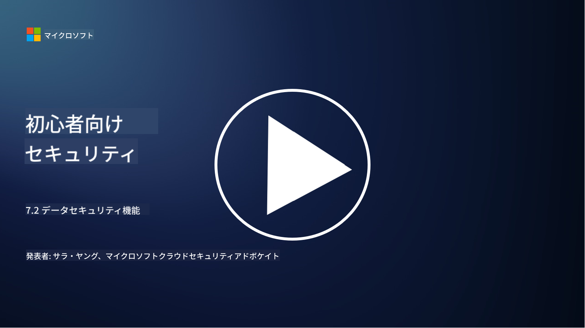

<!--
CO_OP_TRANSLATOR_METADATA:
{
  "original_hash": "50697add9758e54693442d502d2d5f8a",
  "translation_date": "2025-09-03T21:30:43+00:00",
  "source_file": "7.2 Data security capabilities.md",
  "language_code": "ja"
}
-->
# データセキュリティ機能

このセクションでは、データセキュリティに使用される主要なツールと機能について詳しく説明します。

**はじめに**

このレッスンでは以下を学びます：

- データ損失防止ツールとは何か？

- 内部リスク管理ツールとは何か？

- どのようなデータ保持ツールが利用可能か？

## データ損失防止ツールとは何か？

データ損失防止 (DLP) ツールは、組織内で機密データや重要データへの不正アクセス、共有、漏洩を防ぐためのソフトウェアソリューションや技術を指します。これらのツールは、コンテンツ検査、ポリシーの適用、監視を通じて機密データを特定し、保護する役割を果たします。DLP製品の例には以下が含まれます：  
Symantec Data Loss Prevention、McAfee Total Protection for Data Loss Prevention、Microsoft 365 DLP**: Microsoft 365アプリケーションと統合し、組織がメール、ドキュメント、メッセージ内の機密データを特定し保護するのを支援します。

## 内部リスク管理ツールとは何か？

内部リスク管理ツールは、従業員、契約者、またはパートナーが意図的または偶発的にデータセキュリティを損なうリスクを特定し、軽減するのを支援します。これらのツールは、ユーザーの行動、アクセスパターン、データ使用状況を監視し、疑わしい活動や潜在的な内部脅威を検出します。内部リスク管理製品の例には以下が含まれます：  
Microsoft Insider Risk Management (Microsoft 365の一部)、Forcepoint Insider Threat Data Protection、Varonis Insider Threat Detection。

## どのようなデータ保持ツールが利用可能か？

データ保持ツールは、組織のデータ保持ポリシーや法的要件に従ってデータの保持と削除を管理するためのソフトウェアやソリューションを指します。これらのツールは、特定の期間データを保持し、不要になった際に安全に削除するプロセスを自動化するのに役立ちます。データ保持製品の例には以下が含まれます：  
Veritas Enterprise Vault、Commvault Complete Data Protection、Microsoft data lifecycle management。これらのツールは、データ保持と廃棄を管理し、データ保護規制への準拠を確保しながら、データのライフサイクル全体を効率的に管理するのを支援します。

## さらに読む

- [Guide to Data Security Posture Management (DSPM) | CSA (cloudsecurityalliance.org)](https://cloudsecurityalliance.org/blog/2023/03/31/the-big-guide-to-data-security-posture-management-dspm/)
- [Data Loss Prevention across endpoints, apps, & services | Microsoft Purview](https://youtu.be/hvqq8L_0kgI)
- [18 Best Data Loss Prevention Software Tools 2023 (Free + Paid) (comparitech.com)](https://www.comparitech.com/data-privacy-management/data-loss-prevention-tools-software/)
- [Data Loss Prevention (nist.gov)](https://tsapps.nist.gov/publication/get_pdf.cfm?pub_id=904672)
- [Learn about insider risk management | Microsoft Learn](https://learn.microsoft.com/purview/insider-risk-management?WT.mc_id=academic-96948-sayoung)
- [Data Lifecycle Management | IBM](https://www.ibm.com/topics/data-lifecycle-management)
- [What Is Data Lifecycle Management (DLM)? | 2023 Best Practices (selecthub.com)](https://www.selecthub.com/big-data-analytics/data-lifecycle-management/)

---

**免責事項**:  
この文書はAI翻訳サービス[Co-op Translator](https://github.com/Azure/co-op-translator)を使用して翻訳されています。正確性を追求しておりますが、自動翻訳には誤りや不正確な部分が含まれる可能性があります。元の言語で記載された文書が正式な情報源とみなされるべきです。重要な情報については、専門の人間による翻訳を推奨します。この翻訳の使用に起因する誤解や誤解釈について、当社は責任を負いません。