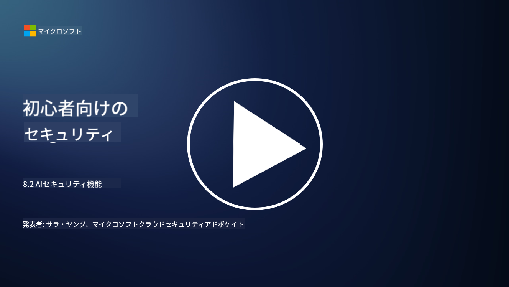

<!--
CO_OP_TRANSLATOR_METADATA:
{
  "original_hash": "b6bb7175672298d1e2f73ba7e0006f95",
  "translation_date": "2025-09-03T21:37:26+00:00",
  "source_file": "8.2 AI security capabilities.md",
  "language_code": "ja"
}
-->
# AIのセキュリティ機能

## 現在、AIシステムを保護するためのツールや機能にはどのようなものがありますか？

現在、AIシステムを保護するためのいくつかのツールや機能が利用可能です：

-   **Counterfit**: AIシステムのセキュリティテストを自動化するオープンソースツールで、組織がAIセキュリティリスク評価を実施し、アルゴリズムの堅牢性を確保するのを支援します。
-   **敵対的機械学習ツール**: 機械学習モデルが敵対的攻撃に対してどれだけ堅牢であるかを評価し、脆弱性を特定して軽減するのに役立つツールです。
-   **AIセキュリティツールキット**: AIシステムを保護するためのリソースを提供するオープンソースのツールキットで、セキュリティ対策を実装するためのライブラリやフレームワークが含まれています。
-   **協力プラットフォーム**: 企業とAIコミュニティが協力して、AI特有のセキュリティスキャナーやその他のツールを開発し、AIサプライチェーンを保護する取り組みです。

これらのツールや機能は、AIシステムをさまざまな脅威から守るためのセキュリティ分野の成長を示しています。これらは研究、実用的なツール、業界の協力を組み合わせたもので、AI技術がもたらす独自の課題に対処することを目的としています。

## AIレッドチーミングとは何ですか？従来のセキュリティレッドチーミングとはどう違うのですか？

AIレッドチーミングは従来のセキュリティレッドチーミングといくつかの重要な点で異なります：

-   **AIシステムへの特化**: AIレッドチーミングは、従来のITインフラではなく、機械学習モデルやデータパイプラインなど、AIシステム特有の脆弱性を対象とします。
-   **AIの挙動のテスト**: AIシステムが異常な入力や予期しない入力にどのように反応するかをテストし、攻撃者に悪用される可能性のある脆弱性を明らかにします。
-   **AIの失敗の探求**: AIレッドチーミングは、悪意のある失敗だけでなく、善意の失敗も検討し、セキュリティ侵害だけでなく、より広範なシステムの失敗を考慮します。
-   **プロンプトインジェクションとコンテンツ生成**: プロンプトインジェクションのような失敗を調査し、攻撃者がAIシステムを操作して有害なコンテンツや根拠のないコンテンツを生成させる可能性を探ります。
-   **倫理的かつ責任あるAI**: 責任あるAI設計の一環として、AIシステムが意図しない挙動を取らないようにするための堅牢性を確保します。

全体として、AIレッドチーミングはセキュリティ脆弱性の調査だけでなく、AI技術特有のシステム失敗をテストすることを含む拡張された実践です。AIの展開に伴う新たなリスクを理解し、軽減することで、より安全なAIシステムを開発するための重要な取り組みとなっています。

## さらに読む

 - [Microsoft AI Red Team building future of safer AI | Microsoft Security Blog](https://www.microsoft.com/en-us/security/blog/2023/08/07/microsoft-ai-red-team-building-future-of-safer-ai/?WT.mc_id=academic-96948-sayoung)
 - [Announcing Microsoft’s open automation framework to red team generative AI Systems | Microsoft Security Blog](https://www.microsoft.com/en-us/security/blog/2024/02/22/announcing-microsofts-open-automation-framework-to-red-team-generative-ai-systems/?WT.mc_id=academic-96948-sayoung)
 - [AI Security Tools: The Open-Source Toolkit | Wiz](https://www.wiz.io/academy/ai-security-tools)

---

**免責事項**:  
この文書は、AI翻訳サービス [Co-op Translator](https://github.com/Azure/co-op-translator) を使用して翻訳されています。正確性を追求しておりますが、自動翻訳には誤りや不正確な部分が含まれる可能性があります。元の言語で記載された文書が正式な情報源とみなされるべきです。重要な情報については、専門の人間による翻訳を推奨します。この翻訳の使用に起因する誤解や誤った解釈について、当方は責任を負いません。