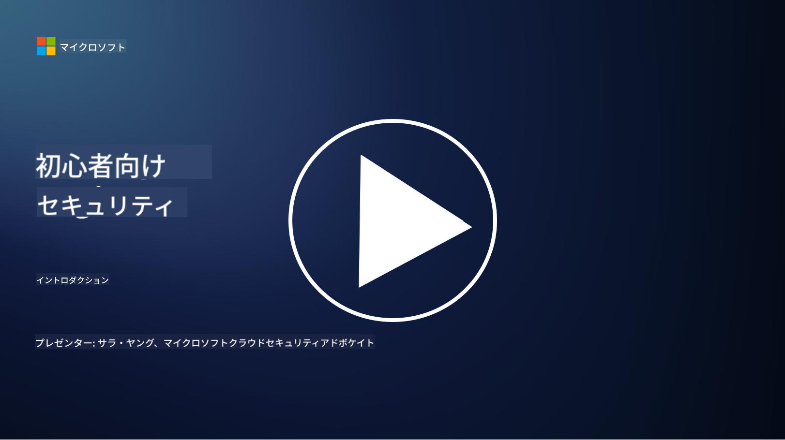

<!--
CO_OP_TRANSLATOR_METADATA:
{
  "original_hash": "fc3d47b5af0cc4fc954ae5d2ea2f7811",
  "translation_date": "2025-10-24T08:59:06+00:00",
  "source_file": "README.md",
  "language_code": "ja"
}
-->
  
  
  
  
  
  

### 🌐 多言語対応

#### GitHub Actionによるサポート (自動化＆常に最新)

<!-- CO-OP TRANSLATOR LANGUAGES TABLE START -->
[アラビア語](../ar/README.md) | [ベンガル語](../bn/README.md) | [ブルガリア語](../bg/README.md) | [ビルマ語 (ミャンマー)](../my/README.md) | [中国語 (簡体字)](../zh/README.md) | [中国語 (繁体字、香港)](../hk/README.md) | [中国語 (繁体字、マカオ)](../mo/README.md) | [中国語 (繁体字、台湾)](../tw/README.md) | [クロアチア語](../hr/README.md) | [チェコ語](../cs/README.md) | [デンマーク語](../da/README.md) | [オランダ語](../nl/README.md) | [エストニア語](../et/README.md) | [フィンランド語](../fi/README.md) | [フランス語](../fr/README.md) | [ドイツ語](../de/README.md) | [ギリシャ語](../el/README.md) | [ヘブライ語](../he/README.md) | [ヒンディー語](../hi/README.md) | [ハンガリー語](../hu/README.md) | [インドネシア語](../id/README.md) | [イタリア語](../it/README.md) | [日本語](./README.md) | [韓国語](../ko/README.md) | [リトアニア語](../lt/README.md) | [マレー語](../ms/README.md) | [マラーティー語](../mr/README.md) | [ネパール語](../ne/README.md) | [ノルウェー語](../no/README.md) | [ペルシャ語 (ファルシー)](../fa/README.md) | [ポーランド語](../pl/README.md) | [ポルトガル語 (ブラジル)](../br/README.md) | [ポルトガル語 (ポルトガル)](../pt/README.md) | [パンジャブ語 (グルムキー)](../pa/README.md) | [ルーマニア語](../ro/README.md) | [ロシア語](../ru/README.md) | [セルビア語 (キリル文字)](../sr/README.md) | [スロバキア語](../sk/README.md) | [スロベニア語](../sl/README.md) | [スペイン語](../es/README.md) | [スワヒリ語](../sw/README.md) | [スウェーデン語](../sv/README.md) | [タガログ語 (フィリピン)](../tl/README.md) | [タミル語](../ta/README.md) | [タイ語](../th/README.md) | [トルコ語](../tr/README.md) | [ウクライナ語](../uk/README.md) | [ウルドゥー語](../ur/README.md) | [ベトナム語](../vi/README.md)  
<!-- CO-OP TRANSLATOR LANGUAGES TABLE END -->

**追加の翻訳言語を希望する場合は、[こちら](https://github.com/Azure/co-op-translator/blob/main/getting_started/supported-languages.md)に記載されています。**

#### コミュニティに参加しよう  

# 🚀 初心者向けサイバーセキュリティ – カリキュラム

AI技術の採用が急速に進む時代において、ITシステムを保護する方法を理解することはますます重要です。このコースは、セキュリティ学習を始めるための基本的なサイバーセキュリティの概念を教えることを目的としています。ベンダーに依存せず、30～60分程度で完了する小さなレッスンに分かれています。各レッスンには小さなクイズと、さらに深く学びたい場合の追加資料へのリンクが含まれています。

このコースで学べること 📚

- 🔐 CIAトライアドやリスクと脅威の違いなど、基本的なサイバーセキュリティの概念  
- 🛡️ セキュリティコントロールとは何か、その形態についての理解  
- 🌐 ゼロトラストとは何か、現代のサイバーセキュリティにおいてなぜ重要なのかの理解  
- 🔑 アイデンティティ、ネットワーキング、セキュリティ運用、インフラストラクチャ、データセキュリティに関する主要な概念とテーマの理解  
- 🔧 セキュリティコントロールを実装するためのツールの例  

このコースで学べないこと 🙅‍♂️

- 🚫 特定のセキュリティツールの使い方  
- 🚫 ハッキングやレッドチーミング/攻撃的セキュリティの方法  
- 🚫 特定のコンプライアンス基準についての学習  

このコースを修了したら、Microsoft Learnモジュールのいくつかに進むことができます。学習を続けるには、[Microsoft Security, Compliance, and Identity Fundamentals](https://learn.microsoft.com/training/paths/describe-concepts-of-security-compliance-identity/?WT.mc_id=academic-96948-sayoung)をお勧めします。

最終的には、[Exam SC-900: Microsoft Security, Compliance, and Identity Fundamentals exam](https://learn.microsoft.com/credentials/certifications/exams/sc-900/?WT.mc_id=academic-96948-sayoung)を受験することを検討することもできます。

> 💁 このコースに関するフィードバックや欠けているコンテンツについての提案があれば、ぜひお聞かせください！

## モジュール概要 📝  
| **モジュール番号** | **モジュール名**                           | **学習内容**                  | **学習目標**                                                                                          |
|-------------------|-------------------------------------------|--------------------------------------|-----------------------------------------------------------------------------------------------------------------|
| **1.1**           | 基本的なセキュリティ概念                   | [CIAトライアド](https://github.com/microsoft/Security-101/blob/main/1.1%20The%20CIA%20triad%20and%20other%20key%20concepts.md)                        | 機密性、可用性、完全性について学びます。また、真正性、否認防止、プライバシーについても学びます。 |
| **1.2**           | 基本的なセキュリティ概念                   | [一般的なサイバーセキュリティの脅威](https://github.com/microsoft/Security-101/blob/main/1.2%20Common%20cybersecurity%20threats.md)        | 個人や組織が直面する一般的なサイバーセキュリティの脅威について学びます。                             |
| **1.3**           | 基本的なセキュリティ概念                   | [リスク管理の理解](https://github.com/microsoft/Security-101/blob/main/1.3%20Understanding%20risk%20management.md)       | リスクの評価と理解 – 影響/可能性とコントロールの実施について学びます。                                                                                                               | |
| **1.4**           | 基本的なセキュリティ概念                   | [セキュリティの実践と文書化](https://github.com/microsoft/Security-101/blob/main/1.4%20Security%20practices%20and%20documentation.md) | ポリシー、手順、標準、規制/法律の違いについて学びます。                         |
| **1.5**           | 基本的なセキュリティ概念                   | [ゼロトラスト](https://github.com/microsoft/Security-101/blob/main/1.5%20Zero%20trust.md)                           | ゼロトラストとは何か、それがアーキテクチャにどのように影響するのかについて学びます。ディフェンスインデプスとは何かについても学びます。                   |
| **1.6**           | 基本的なセキュリティ概念                   | [共有責任モデル](https://github.com/microsoft/Security-101/blob/main/1.6%20Shared%20responsibility%20model.md)                           | 共有責任モデルとは何か、それがサイバーセキュリティにどのように影響するのかについて学びます。                  |
| **1.7**           | [モジュール終了時のクイズ](https://github.com/microsoft/Security-101/blob/main/1.7%20End%20of%20module%20quiz.md)                        |                                      |                                                                                                                 |
| **2.1**           | アイデンティティ＆アクセス管理の基礎 | [IAMの主要概念](https://github.com/microsoft/Security-101/blob/main/2.1%20IAM%20key%20concepts.md)                     | 最小権限の原則、職務分離、IAMがゼロトラストをどのようにサポートするかについて学びます。               |
| **2.2**           | アイデンティティ＆アクセス管理の基礎 | [IAMゼロトラストアーキテクチャ](https://github.com/microsoft/Security-101/blob/main/2.2%20IAM%20zero%20trust%20architecture.md)          | 現代のIT環境におけるアイデンティティが新しい境界線である理由と、それが軽減する脅威について学びます。          |
| **2.3**           | アイデンティティ＆アクセス管理の基礎 | [IAMの機能](https://github.com/microsoft/Security-101/blob/main/2.3%20IAM%20capabilities.md)                     | アイデンティティを保護するためのIAMの機能とコントロールについて学びます。                                                  |
| **2.4**           | [モジュール終了時のクイズ](https://github.com/microsoft/Security-101/blob/main/2.4%20End%20of%20module%20quiz.md)                        |                                      |                                                                                                                 |
| **3.1**           | ネットワークセキュリティの基礎             | [ネットワーキングの主要概念](https://github.com/microsoft/Security-101/blob/main/3.1%20Networking%20key%20concepts.md)              | ネットワーキングの概念 (IPアドレス、ポート番号、暗号化など) について学びます。                                 |
| **3.2**           | ネットワークセキュリティの基礎             | [ネットワーキングゼロトラストアーキテクチャ](https://github.com/microsoft/Security-101/blob/main/3.2%20Networking%20zero%20trust%20architecture.md)   | ネットワーキングがE2Eゼロトラストアーキテクチャにどのように貢献し、それが軽減する脅威について学びます。                  |
| **3.3**           | ネットワークセキュリティの基礎             | [ネットワークセキュリティの機能](https://github.com/microsoft/Security-101/blob/main/3.3%20Network%20security%20capabilities.md)        | ネットワークセキュリティツール – ファイアウォール、WAF、DDoS保護などについて学びます。                                    |
| **3.4**           | [モジュール終了時のクイズ](https://github.com/microsoft/Security-101/blob/main/3.4%20End%20of%20module%20quiz.md)                        |                                      |                                                                                                                 |
| **4.1**           | セキュリティ運用の基礎          | [SecOpsの主要概念](https://github.com/microsoft/Security-101/blob/main/4.1%20SecOps%20key%20concepts.md)                  | セキュリティ運用が重要である理由と、それが通常のIT運用チームとどのように異なるかについて学びます。                  |
| **4.2**           | セキュリティ運用の基礎          | [SecOpsゼロトラストアーキテクチャ](https://github.com/microsoft/Security-101/blob/main/4.2%20SecOps%20zero%20trust%20architecture.md)       | SecOpsがE2Eゼロトラストアーキテクチャにどのように貢献し、それが軽減する脅威について学びます。                      |
| **4.3**           | セキュリティ運用の基礎          | [SecOpsの機能](https://github.com/microsoft/Security-101/blob/main/4.3%20SecOps%20capabilities.md)                  | SecOpsツール – SIEM、XDRなどについて学びます。                                                                    |
| **4.4**           | [モジュール終了時のクイズ](https://github.com/microsoft/Security-101/blob/main/4.4%20End%20of%20module%20quiz.md)                        |                                      |                                                                                                                 |
| **5.1**           | アプリケーションセキュリティの基礎         | [AppSecの主要概念](https://github.com/microsoft/Security-101/blob/main/5.1%20AppSec%20key%20concepts.md)                  | AppSecの概念 (設計によるセキュリティ、入力検証など) について学びます。                                    |
| **5.2**           | アプリケーションセキュリティの基本         | [AppSecの機能](https://github.com/microsoft/Security-101/blob/main/5.2%20AppSec%20key%20capabilities.md)                  | AppSecツールについて学ぶ: パイプラインセキュリティツール、コードスキャン、秘密情報スキャンなど                       |
| **5.3**           | [モジュール終了時のクイズ](https://github.com/microsoft/Security-101/blob/main/5.3%20End%20of%20module%20quiz.md)                        |                                      |                                                                                                                 |
| **6.1**           | インフラセキュリティの基本      | [インフラセキュリティの重要な概念](https://github.com/microsoft/Security-101/blob/main/6.1%20Infrastructure%20security%20key%20concepts.md) | システムの強化、パッチ適用、セキュリティ衛生、コンテナセキュリティについて学ぶ                                  |
| **6.2**           | インフラセキュリティの基本      | [インフラセキュリティの機能](https://github.com/microsoft/Security-101/blob/main/6.2%20Infrastructure%20security%20capabilities.md) | インフラセキュリティを支援するツールについて学ぶ (例: CSPM、コンテナセキュリティなど)            |
| **6.3**           | [モジュール終了時のクイズ](https://github.com/microsoft/Security-101/blob/main/6.3%20End%20of%20module%20quiz.md)                        |                                      |                                                                                                                 |
| **7.1**           | データセキュリティの基本                | [データセキュリティの重要な概念](https://github.com/microsoft/Security-101/blob/main/7.1%20Data%20security%20key%20concepts.md)           | データ分類と保持について学び、これが組織にとってなぜ重要なのかを理解する                     |
| **7.2**           | データセキュリティの基本                | [データセキュリティの機能](https://github.com/microsoft/Security-101/blob/main/7.2%20Data%20security%20capabilities.md)           | データセキュリティツールについて学ぶ – DLP、内部リスク管理、データガバナンスなど                          |
| **7.3**           | [モジュール終了時のクイズ](https://github.com/microsoft/Security-101/blob/main/7.3%20End%20of%20module%20quiz.md)                        |
| **8.1**           | AIセキュリティの基本                | [AIセキュリティの重要な概念](https://github.com/microsoft/Security-101/blob/main/8.1%20AI%20security%20key%20concepts.md)          | 従来のセキュリティとAIセキュリティの違いと類似点について学ぶ                 |
| **8.2**           | AIセキュリティの基本                | [AIセキュリティの機能](https://github.com/microsoft/Security-101/blob/main/8.2%20AI%20security%20capabilities.md)           | AIセキュリティツールとAIを保護するために使用できるコントロールについて学ぶ                         |
| **8.3**           | AIセキュリティの基本                | [責任あるAI](https://github.com/microsoft/Security-101/blob/main/8.3%20Responsible%20AI.md)          | 責任あるAIとは何か、セキュリティ専門家が認識すべきAI特有のリスクについて学ぶ                          |
| **8.4**           | [モジュール終了時のクイズ](https://github.com/microsoft/Security-101/blob/main/8.4%20End%20of%20module%20quiz.md)     

## 🎒 その他のコース 

私たちのチームは他にもコースを提供しています！ぜひチェックしてください:

<!-- CO-OP TRANSLATOR OTHER COURSES START -->
### Azure / Edge / MCP / エージェント

---
 
### 生成AIシリーズ

[-9333EA?style=for-the-badge&labelColor=E5E7EB&color=9333EA)](https://github.com/microsoft/Generative-AI-for-beginners-dotnet?WT.mc_id=academic-105485-koreyst)
[-C084FC?style=for-the-badge&labelColor=E5E7EB&color=C084FC)](https://github.com/microsoft/generative-ai-for-beginners-java?WT.mc_id=academic-105485-koreyst)
[-E879F9?style=for-the-badge&labelColor=E5E7EB&color=E879F9)](https://github.com/microsoft/generative-ai-with-javascript?WT.mc_id=academic-105485-koreyst)

---
 
### 基本学習

---
 
### Copilotシリーズ

<!-- CO-OP TRANSLATOR OTHER COURSES END -->

## ヘルプを求める

AIアプリの構築で行き詰まったり質問がある場合は、以下に参加してください:

製品のフィードバックや構築中のエラーについては以下を訪問してください:

---

**免責事項**:  
この文書はAI翻訳サービス[Co-op Translator](https://github.com/Azure/co-op-translator)を使用して翻訳されています。正確性を追求しておりますが、自動翻訳には誤りや不正確な部分が含まれる可能性があります。元の言語で記載された文書を正式な情報源としてお考えください。重要な情報については、専門の人間による翻訳を推奨します。この翻訳の使用に起因する誤解や誤認について、当社は一切の責任を負いません。