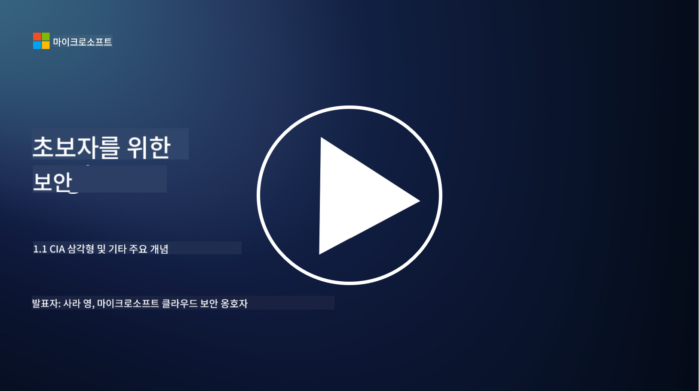
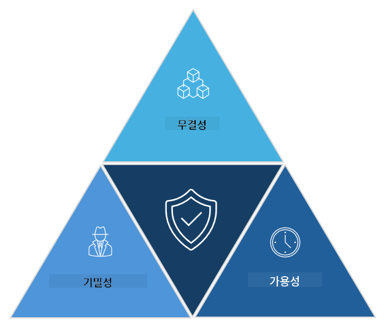

<!--
CO_OP_TRANSLATOR_METADATA:
{
  "original_hash": "16a76f9fa372fb63cffb6d76b855f023",
  "translation_date": "2025-09-03T18:47:39+00:00",
  "source_file": "1.1 The CIA triad and other key concepts.md",
  "language_code": "ko"
}
-->
# CIA 삼원칙과 기타 주요 개념

## 소개

이 강의에서는 다음 내용을 다룹니다:

 - 사이버 보안이란 무엇인가?
   
 - 사이버 보안 CIA 삼원칙이란 무엇인가?

 - 사이버 보안의 맥락에서 진정성, 부인 방지, 프라이버시란 무엇인가?

## 사이버 보안이란 무엇인가?

사이버 보안, 또는 정보 보안은 컴퓨터 시스템, 네트워크, 장치 및 데이터를 디지털 공격, 무단 접근, 손상 또는 도난으로부터 보호하는 실천입니다. 사이버 보안의 주요 목표는 디지털 자산과 정보의 기밀성, 무결성, 가용성을 보장하는 것입니다. 사이버 보안 전문가들은 자산, 데이터 및 정보를 보호하기 위해 보안 통제를 설계하고 구현합니다. 우리의 삶이 점점 더 디지털화되고 온라인화됨에 따라, 사이버 보안은 개인과 조직 모두에게 중요한 관심사가 되었습니다.

## 사이버 보안 CIA 삼원칙이란 무엇인가?

사이버 보안 삼원칙은 모든 사이버 보안 작업이나 시스템/환경 설계에서 고려해야 할 세 가지 주요 요소를 포함하는 모델을 말합니다:

### 기밀성

사람들이 "사이버 보안"을 생각할 때 가장 익숙할 수 있는 요소입니다. 기밀성은 데이터와 정보를 무단 접근 시도로부터 보호하는 과정입니다. 즉, 정보가 필요한 사람만이 접근할 수 있도록 하는 것입니다. 하지만 모든 데이터가 동일하게 생성되는 것은 아니며, 데이터는 잘못된 사람이 접근했을 때 발생할 수 있는 피해 정도에 따라 분류되고 보호됩니다.

### 무결성

환경 내 데이터의 정확성과 신뢰성을 보호하고, 무단 개인이 데이터를 변경하거나 수정하지 못하도록 하는 것을 의미합니다. 예를 들어, 학생이 DMV에서 자신의 운전 기록에 생년월일을 수정하여 나이를 더 많게 만들어, 생년월일이 더 이른 날짜로 인쇄된 면허증을 재발급받아 술을 구매하려는 경우를 들 수 있습니다.

### 가용성

운영 IT 전반에서 중요한 고려 사항이지만, 가용성은 사이버 보안에서도 중요합니다. 보안 전문가들이 보호해야 하는 특정 유형의 공격이 가용성을 목표로 합니다(예: 분산 서비스 거부 – DDoS – 공격).

**사이버 보안 CIA 삼원칙**

## 사이버 보안의 맥락에서 진정성, 부인 방지, 프라이버시란 무엇인가?

이들은 시스템과 데이터의 보안과 신뢰성을 보장하는 데 관련된 추가적인 중요한 개념들입니다:

**진정성** - 상호작용하는 정보, 통신 또는 엔티티가 진짜이며 무단 당사자에 의해 변조되거나 수정되지 않았음을 보장하는 것을 의미합니다.

**부인 방지** - 당사자가 특정 거래나 통신의 진정성을 부인할 수 없도록 하는 개념입니다. 이는 누군가가 메시지를 보내지 않았거나 특정 행동을 하지 않았다고 주장하는 것을 방지하며, 그에 반하는 증거가 있을 때 이를 입증합니다.

**프라이버시** - 민감하고 개인 식별이 가능한 정보를 무단 접근, 사용, 공개 또는 조작으로부터 보호하는 것을 의미합니다. 이는 개인 데이터에 누가 접근할 수 있는지, 그 데이터가 어떻게 수집, 저장, 공유되는지를 제어하는 것을 포함합니다.

## 추가 읽기

[What Is Information Security (InfoSec)? | Microsoft Security](https://www.microsoft.com/security/business/security-101/what-is-information-security-infosec#:~:text=Three%20pillars%20of%20information%20security%3A%20the%20CIA%20triad,as%20guiding%20principles%20for%20implementing%20an%20InfoSec%20plan.)

---

**면책 조항**:  
이 문서는 AI 번역 서비스 [Co-op Translator](https://github.com/Azure/co-op-translator)를 사용하여 번역되었습니다. 정확성을 위해 최선을 다하고 있으나, 자동 번역에는 오류나 부정확성이 포함될 수 있습니다. 원본 문서를 해당 언어로 작성된 상태에서 권위 있는 자료로 간주해야 합니다. 중요한 정보의 경우, 전문적인 인간 번역을 권장합니다. 이 번역 사용으로 인해 발생하는 오해나 잘못된 해석에 대해 당사는 책임을 지지 않습니다.  