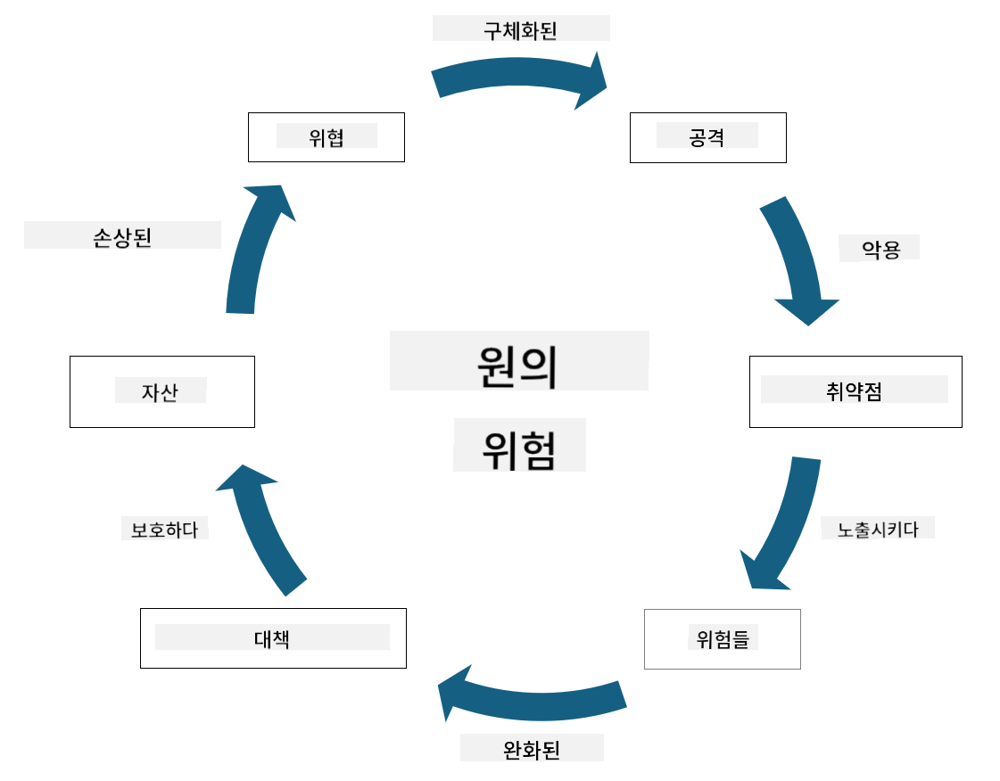

<!--
CO_OP_TRANSLATOR_METADATA:
{
  "original_hash": "fcca304f072cabf206388199e8e2e578",
  "translation_date": "2025-09-03T18:53:54+00:00",
  "source_file": "1.3 Understanding risk management.md",
  "language_code": "ko"
}
-->
# 리스크 관리 이해하기

## 소개

이 강의에서는 다음 내용을 다룹니다:

- 일반적으로 사용되는 보안 용어의 정의  
- 보안 통제의 유형  
- 보안 리스크 평가  

## 일반적으로 사용되는 보안 용어의 정의

이 용어들은 사이버 보안 및 리스크 관리 분야에서 기본적인 개념입니다. 각 용어와 그들 간의 관계를 살펴보겠습니다:

1. **위협 행위자**:

위협 행위자는 시스템이나 네트워크의 취약점을 악용하여 피해를 주거나 손상을 일으킬 가능성이 있는 개인, 그룹, 조직 또는 자동화된 시스템을 말합니다. 위협 행위자는 해커, 악성코드 제작자, 불만을 가진 직원 또는 정보 및 기술 시스템에 위험을 초래하는 모든 주체일 수 있습니다.

2. **위협**:

위협은 시스템의 취약점을 악용하여 자산에 피해를 줄 수 있는 잠재적인 사건이나 행동을 의미합니다. 위협에는 해킹, 데이터 유출, 서비스 거부 공격 등이 포함될 수 있습니다. 위협은 조직의 자산에 가해질 수 있는 잠재적 피해를 나타냅니다.

3. **취약점**:

취약점은 시스템의 설계, 구현 또는 구성에서 발생하는 약점이나 결함으로, 위협 행위자가 이를 악용하여 시스템 보안을 손상시킬 수 있는 요소를 말합니다. 취약점은 소프트웨어, 하드웨어, 프로세스 또는 인간의 행동에서 발생할 수 있습니다. 취약점을 식별하고 해결하는 것은 성공적인 공격의 위험을 최소화하는 데 필수적입니다.

4. **리스크**:

리스크는 위협과 취약점 간의 상호작용으로 인해 발생할 수 있는 손실, 피해 또는 손상의 가능성을 의미합니다. 이는 위협 행위자가 취약점을 악용하여 부정적인 영향을 미칠 가능성을 나타냅니다. 리스크는 잠재적 영향과 발생 가능성 측면에서 평가됩니다.

5. **자산**:

자산은 조직이 보호하려는 가치 있는 모든 것을 의미합니다. 자산에는 물리적 객체(컴퓨터, 서버), 데이터(고객 정보, 재무 기록), 지적 재산(영업 비밀, 특허), 그리고 인적 자원(직원의 기술과 지식) 등이 포함됩니다. 자산 보호는 사이버 보안의 주요 목표입니다.

6. **노출**:

노출은 잠재적 위협에 취약한 상태를 의미합니다. 이는 시스템이나 네트워크에 취약점이 존재할 때 발생합니다. 노출은 시스템이나 네트워크에 취약점이 존재함으로 인해 발생하는 리스크를 강조합니다.

7. **통제**:

통제는 취약점과 위협과 관련된 리스크를 줄이기 위해 마련된 조치를 말합니다. 통제는 기술적, 절차적, 관리적 성격을 가질 수 있으며, 위협과 취약점의 영향을 예방, 탐지 또는 완화하기 위해 설계됩니다. 예로는 방화벽, 접근 통제, 암호화, 보안 정책, 직원 교육 등이 있습니다.

이 용어들 간의 관계를 요약하면 다음과 같습니다: 위협 행위자는 취약점을 악용하여 위협을 실행하며, 이는 자산에 피해를 줄 수 있는 리스크를 초래합니다. 취약점이 존재할 때 노출이 발생하며, 통제는 위협이 자산에 미치는 영향을 예방하거나 완화하여 리스크를 줄이기 위해 마련됩니다. 이 프레임워크는 사이버 보안 리스크 관리의 기초를 형성하며, 조직이 정보 시스템과 자산에 대한 잠재적 리스크를 식별, 평가 및 해결하는 데 도움을 줍니다.

## 보안 통제의 유형

보안 통제는 정보 시스템과 자산을 다양한 위협과 취약점으로부터 보호하기 위해 구현된 조치 또는 보호 수단입니다. 보안 통제는 초점과 목적에 따라 여러 범주로 분류될 수 있습니다. 다음은 일반적인 보안 통제 유형입니다:

1. **관리적 통제**:

이 통제는 조직의 보안 관행과 사용자 행동을 관리하는 정책, 절차 및 지침과 관련이 있습니다.

- 보안 정책 및 절차: 조직 내에서 보안을 유지하는 방법을 정의하는 문서화된 지침.  
- 보안 인식 및 교육: 직원들에게 보안 모범 사례와 잠재적 위협에 대해 교육하는 프로그램.  
- 사고 대응 및 관리: 보안 사고에 대응하고 이를 완화하기 위한 계획.  

2. **기술적 통제**:

기술적 통제는 기술을 사용하여 보안 조치를 시행하고 시스템과 데이터를 보호하는 것을 포함합니다. 기술적 통제의 예는 다음과 같습니다:

- 접근 통제: 사용자 역할과 권한에 따라 자원 접근을 제한하는 조치.  
- 암호화: 데이터를 안전한 형식으로 변환하여 무단 접근을 방지.  
- 방화벽: 네트워크 보안 장치로, 들어오고 나가는 트래픽을 필터링하고 제어.  
- 침입 탐지 및 방지 시스템(IDPS): 네트워크 트래픽을 모니터링하여 의심스러운 활동을 탐지.  
- 안티바이러스 및 악성코드 방지 소프트웨어: 악성 소프트웨어를 탐지하고 제거하는 프로그램.  
- 인증 메커니즘: 비밀번호, 생체 인식, 다중 인증 등 사용자 신원을 확인하는 방법.  
- 패치 관리: 알려진 취약점을 해결하기 위해 소프트웨어를 정기적으로 업데이트.  

3. **물리적 통제**:

물리적 통제는 물리적 자산과 시설을 보호하기 위한 조치입니다.

- 보안 요원 및 접근 통제 인력: 물리적 장소에 대한 접근을 모니터링하고 통제하는 인력.  
- 감시 카메라: 활동을 모니터링하고 기록하는 비디오 감시 시스템.  
- 잠금 장치 및 물리적 장벽: 민감한 영역에 대한 접근을 제한하는 물리적 조치.  
- 환경 통제: 장비와 데이터 센터에 영향을 미치는 온도, 습도 등의 환경 요인을 조절하는 조치.  

4. **운영적 통제**:

운영적 통제는 시스템의 지속적인 보안을 보장하는 일상적인 운영 및 활동과 관련이 있습니다.

- 변경 관리: 시스템 및 구성 변경을 추적하고 승인하는 프로세스.  
- 백업 및 재난 복구: 시스템 장애나 재난 발생 시 데이터 백업 및 복구 계획.  
- 로깅 및 감사: 보안 및 규정 준수를 위해 시스템 활동을 모니터링하고 기록.  
- 안전한 코딩 관행: 취약점을 최소화하기 위해 소프트웨어를 작성하는 지침.  

5. **법적 및 규제적 통제**:

이 통제는 관련 법률, 규정 및 산업 표준을 준수하도록 보장합니다. 조직이 준수해야 하는 표준은 관할권, 산업 분야 및 기타 요인에 따라 달라집니다.

- 데이터 보호 규정: GDPR, HIPAA, CCPA와 같은 법률 준수.  
- 산업별 표준: 결제 카드 데이터 보안을 위한 PCI DSS와 같은 표준 준수.  

이러한 보안 통제 범주는 조직의 시스템, 데이터 및 자산을 다양한 위협으로부터 보호하기 위해 협력하여 포괄적인 보안 태세를 형성합니다.

## 보안 리스크 평가

일부 보안 전문가들은 리스크 관리를 리스크 전문가에게 맡겨야 한다고 생각하지만, 보안 리스크 관리 과정을 이해하는 것은 보안 전문가가 조직 내 다른 사람들이 이해하고 실행할 수 있는 언어로 보안 리스크를 표현하는 데 중요합니다.

조직은 보안 리스크를 지속적으로 평가하고 비즈니스에 대한 리스크에 대해 어떤 조치를 취할지(혹은 취하지 않을지) 결정해야 합니다. 아래는 일반적으로 수행되는 과정의 개요입니다. 이 과정은 조직 내 여러 팀이 협력하여 수행하는 경우가 많으며, 한 팀이 리스크 관리의 처음부터 끝까지 책임지는 경우는 드뭅니다.

1. **자산 및 위협 식별**:

조직은 보호하려는 자산을 식별합니다. 여기에는 데이터, 시스템, 하드웨어, 소프트웨어, 지적 재산 등이 포함될 수 있습니다. 다음으로, 이러한 자산을 대상으로 할 수 있는 잠재적 위협을 식별합니다.

2. **취약점 평가**:

조직은 위협이 악용할 수 있는 시스템이나 프로세스의 취약점 또는 약점을 식별합니다. 이러한 취약점은 소프트웨어 결함, 잘못된 구성, 보안 통제 부족, 인간의 실수에서 비롯될 수 있습니다.

3. **발생 가능성 평가**:

조직은 각 위협이 발생할 가능성을 평가합니다. 여기에는 과거 데이터, 위협 정보, 산업 동향 및 내부 요인을 고려하는 것이 포함됩니다. 발생 가능성은 낮음, 중간, 높음으로 분류될 수 있습니다.

4. **영향 평가**:

다음으로, 조직은 각 위협이 취약점을 악용할 경우 발생할 수 있는 잠재적 영향을 결정합니다. 영향에는 재정적 손실, 운영 중단, 평판 손상, 법적 결과 등이 포함될 수 있습니다. 영향은 잠재적 결과에 따라 낮음, 중간, 높음으로 분류될 수 있습니다.

5. **리스크 계산**:

발생 가능성과 영향 평가를 결합하여 각 위협에 대한 전체 리스크 수준을 계산합니다. 이는 발생 가능성과 영향 수준에 숫자 값 또는 정성적 설명자를 할당하는 리스크 매트릭스를 사용하여 수행됩니다. 결과 리스크 수준은 즉각적인 주의가 필요한 리스크를 우선적으로 식별하는 데 도움을 줍니다.

6. **우선순위 설정 및 의사 결정**:

조직은 발생 가능성과 영향 값이 가장 높은 리스크에 집중하여 리스크를 우선적으로 처리합니다. 이를 통해 자원을 효과적으로 배분하고 통제를 구현할 수 있습니다. 높은 리스크 위협은 즉각적인 조치가 필요하며, 낮은 리스크 위협은 더 긴 시간 동안 처리될 수 있습니다.

7. **리스크 처리**:

리스크 평가를 기반으로 조직은 각 리스크를 완화하거나 관리하는 방법을 결정합니다. 여기에는 보안 통제를 구현하거나, 보험을 통해 리스크를 이전하거나, 관리 가능한 수준의 잔여 리스크를 수용하는 것이 포함될 수 있습니다.

8. **지속적인 모니터링 및 검토**:

리스크 평가는 한 번으로 끝나는 과정이 아닙니다. 조직 환경에 중요한 변화가 있을 때마다 정기적으로 수행되어야 합니다. 지속적인 모니터링은 새로운 위협, 취약점 또는 비즈니스 환경의 변화를 반영할 수 있도록 보장합니다.

이러한 구조화된 방식으로 보안 리스크를 평가함으로써 조직은 자원 배분, 보안 통제 및 전체적인 리스크 관리 전략에 대해 정보에 입각한 결정을 내릴 수 있습니다. 목표는 조직의 전체적인 리스크 노출을 줄이는 동시에 보안 노력을 조직의 비즈니스 목표와 목적에 맞추는 것입니다.

---

**면책 조항**:  
이 문서는 AI 번역 서비스 [Co-op Translator](https://github.com/Azure/co-op-translator)를 사용하여 번역되었습니다. 정확성을 위해 최선을 다하고 있으나, 자동 번역에는 오류나 부정확성이 포함될 수 있습니다. 원본 문서의 원어 버전을 신뢰할 수 있는 권위 있는 자료로 간주해야 합니다. 중요한 정보의 경우, 전문적인 인간 번역을 권장합니다. 이 번역 사용으로 인해 발생하는 오해나 잘못된 해석에 대해 책임을 지지 않습니다.