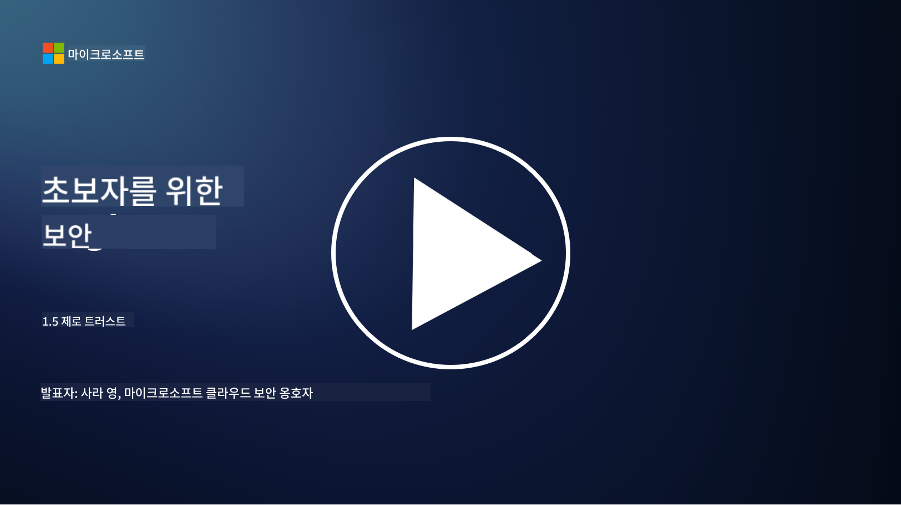
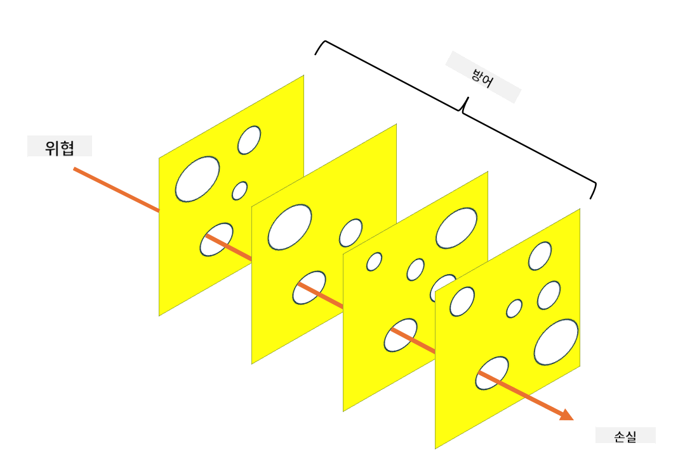

<!--
CO_OP_TRANSLATOR_METADATA:
{
  "original_hash": "75f77f972d2233c584f87c1eb96c983b",
  "translation_date": "2025-09-03T18:24:32+00:00",
  "source_file": "1.5 Zero trust.md",
  "language_code": "ko"
}
-->
# 제로 트러스트

"제로 트러스트"는 요즘 보안 분야에서 자주 사용되는 표현입니다. 하지만 이것이 무엇을 의미하는지, 단순한 유행어인지 궁금하지 않으신가요? 이번 강의에서는 제로 트러스트가 정확히 무엇인지 깊이 알아보겠습니다.

## 소개

 - 이번 강의에서 다룰 내용:
   
   
 - 제로 트러스트란 무엇인가?

   
  

 - 제로 트러스트는 기존 보안 아키텍처와 어떻게 다른가?

   
   

 - 심층 방어란 무엇인가?

## 제로 트러스트

제로 트러스트는 "신뢰 후 검증"이라는 기존의 개념을 도전적으로 바꾸며, 조직 네트워크 내부든 외부든 어떤 엔터티도 본질적으로 신뢰해서는 안 된다는 가정을 기반으로 하는 사이버 보안 접근 방식입니다. 제로 트러스트는 사용자, 디바이스, 애플리케이션이 자원에 접근하려고 할 때마다 위치에 관계없이 검증을 요구합니다. 제로 트러스트의 핵심 원칙은 "공격 표면"을 최소화하고 보안 침해의 잠재적 영향을 줄이는 것입니다.

제로 트러스트 모델에서는 다음과 같은 원칙이 강조됩니다:

1. **신원 검증**: 모든 사용자와 디바이스에 대해 위치에 관계없이 엄격한 인증 및 권한 부여가 적용됩니다. 신원은 반드시 사람이 아닐 수도 있습니다. 디바이스, 애플리케이션 등이 될 수 있습니다.

2. **최소 권한**: 사용자와 디바이스는 작업을 수행하는 데 필요한 최소한의 접근 권한만 부여받아, 침해 시 피해를 줄입니다.

3. **마이크로 세그멘테이션**: 네트워크 자원을 더 작은 세그먼트로 나누어 침해 발생 시 네트워크 내에서의 횡적 이동을 제한합니다.

4. **지속적인 모니터링**: 사용자와 디바이스의 행동을 지속적으로 모니터링하고 분석하여 이상 징후와 잠재적 위협을 감지합니다. 현대적인 모니터링 기술은 머신 러닝, AI, 위협 인텔리전스를 활용하여 모니터링에 추가적인 세부 정보와 컨텍스트를 제공합니다.

5. **데이터 암호화**: 데이터는 전송 중이든 저장 중이든 암호화되어 무단 접근을 방지합니다.

6. **엄격한 접근 제어**: 사용자 역할, 디바이스 상태, 네트워크 위치 등 컨텍스트를 기반으로 접근 제어가 시행됩니다.

Microsoft는 제로 트러스트를 다섯 가지 기둥으로 나누며, 이는 이후 강의에서 논의할 예정입니다.

## 기존 보안 아키텍처와의 차이점

제로 트러스트는 기존의 보안 아키텍처, 예를 들어 경계 기반 모델과 여러 면에서 다릅니다:

1. **경계 중심 vs. 신원 중심**: 기존 모델은 네트워크 경계를 보호하고 내부 사용자와 디바이스가 내부에 들어오면 신뢰할 수 있다고 가정합니다. 반면 제로 트러스트는 위협이 네트워크 내부와 외부에서 모두 발생할 수 있다고 가정하며 엄격한 신원 기반 통제를 시행합니다.

2. **암묵적 신뢰 vs. 명시적 신뢰**: 기존 모델은 네트워크 내부의 디바이스와 사용자를 암묵적으로 신뢰합니다. 제로 트러스트는 신원을 명시적으로 검증하고 이상 징후를 지속적으로 모니터링합니다.

3. **평면 네트워크 vs. 세분화된 네트워크**: 기존 아키텍처는 내부 사용자가 광범위한 접근 권한을 가지는 평면 네트워크를 포함하는 경우가 많습니다. 제로 트러스트는 네트워크를 더 작은, 격리된 영역으로 나누어 잠재적 침해를 제한합니다.

4. **반응적 vs. 선제적**: 기존 보안은 종종 경계 방화벽과 침입 탐지와 같은 반응적 조치에 의존합니다. 제로 트러스트는 침해가 발생할 가능성을 가정하고 그 영향을 최소화하는 선제적 접근 방식을 취합니다.

## 심층 방어

심층 방어, 또는 계층적 보안은 조직의 자산을 보호하기 위해 여러 계층의 보안 통제와 조치를 배치하는 사이버 보안 전략입니다. 목표는 하나의 계층이 침해되더라도 다른 계층이 여전히 보호를 제공할 수 있도록 중첩된 방어 계층을 만드는 것입니다. 각 계층은 보안의 다른 측면에 초점을 맞추며 조직의 전반적인 보안 태세를 강화합니다.

심층 방어는 기술적, 절차적, 물리적 보안 조치의 조합을 포함합니다. 여기에는 방화벽, 침입 탐지 시스템, 접근 통제, 암호화, 사용자 교육, 보안 정책 등이 포함될 수 있습니다. 이 아이디어는 여러 장벽을 만들어 공격자가 조직의 시스템과 네트워크를 침투하기 어렵게 만드는 것입니다. 이는 또한 다른 산업(예: 운송)에서 사고 예방에 사용되는 "스위스 치즈" 모델로도 알려져 있습니다.

## 추가 읽을거리

[제로 트러스트란 무엇인가?](https://learn.microsoft.com/security/zero-trust/zero-trust-overview?WT.mc_id=academic-96948-sayoung)

[제로 트러스트의 진화 – Microsoft 입장 문서](https://query.prod.cms.rt.microsoft.com/cms/api/am/binary/RWJJdT?WT.mc_id=academic-96948-sayoung)

[제로 트러스트와 BeyondCorp Google Cloud | Google Cloud 블로그](https://cloud.google.com/blog/topics/developers-practitioners/zero-trust-and-beyondcorp-google-cloud)

---

**면책 조항**:  
이 문서는 AI 번역 서비스 [Co-op Translator](https://github.com/Azure/co-op-translator)를 사용하여 번역되었습니다. 정확성을 위해 최선을 다하고 있지만, 자동 번역에는 오류나 부정확성이 포함될 수 있습니다. 원본 문서의 원어 버전을 권위 있는 출처로 간주해야 합니다. 중요한 정보의 경우, 전문적인 인간 번역을 권장합니다. 이 번역 사용으로 인해 발생하는 오해나 잘못된 해석에 대해 책임을 지지 않습니다.