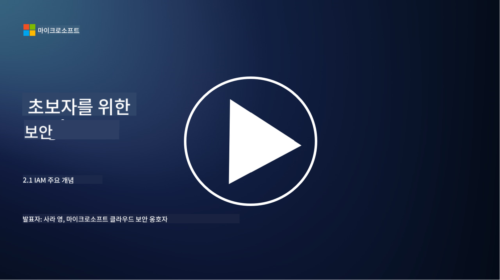

<!--
CO_OP_TRANSLATOR_METADATA:
{
  "original_hash": "2e3864e3d579f0dbb4ac2ec8c5f82acf",
  "translation_date": "2025-09-03T18:05:33+00:00",
  "source_file": "2.1 IAM key concepts.md",
  "language_code": "ko"
}
-->
# IAM 주요 개념

컴퓨터나 웹사이트에 로그인해 본 적이 있나요? 물론 있겠죠! 이는 이미 일상생활에서 신원 관리 기능을 사용해 본 경험이 있다는 뜻입니다. 신원 및 접근 관리(IAM)는 보안의 핵심 요소로, 다음 몇 가지 수업에서 더 자세히 알아보겠습니다.

**소개**

이번 수업에서는 다음 내용을 다룹니다:

- 사이버 보안의 맥락에서 신원 및 접근 관리(IAM)가 무엇을 의미하는지
- 최소 권한 원칙이란 무엇인지
- 직무 분리가 무엇인지
- 인증과 권한 부여란 무엇인지

## 사이버 보안의 맥락에서 신원 및 접근 관리(IAM)가 무엇을 의미하나요?

신원 및 접근 관리(IAM)는 조직의 디지털 환경 내에서 적절한 개인이 적절한 자원에 접근할 수 있도록 보장하기 위해 구현되는 프로세스, 기술, 정책의 집합을 말합니다. IAM은 디지털 신원(사용자, 직원, 파트너)과 이들의 시스템, 애플리케이션, 데이터, 네트워크 접근을 관리하는 것을 포함합니다. IAM의 주요 목표는 보안을 강화하고 사용자 접근을 간소화하며 조직 정책 및 규정을 준수하는 것입니다. IAM 솔루션은 일반적으로 사용자 인증, 권한 부여, 신원 프로비저닝, 접근 제어, 사용자 라이프사이클 관리(더 이상 사용되지 않는 계정을 삭제하는 것 포함)를 포함합니다.

## 최소 권한 원칙이란 무엇인가요?

최소 권한 원칙은 사용자가 자신의 역할이나 작업을 수행하는 데 필요한 최소한의 권한만 부여받아야 한다는 기본 개념입니다. 이 원칙은 보안 침해나 내부 위협이 발생했을 때 피해를 제한하는 데 도움을 줍니다. 최소 권한 원칙을 준수함으로써 조직은 공격 표면을 줄이고 무단 접근, 데이터 유출, 권한 오용의 위험을 최소화할 수 있습니다. 실제로는 사용자가 자신의 직무에 필요한 특정 자원과 기능에만 접근할 수 있도록 하고, 그 이상은 허용하지 않는 것을 의미합니다. 예를 들어, 문서를 읽기만 하면 되는 경우 해당 문서에 대한 전체 관리자 권한을 부여받는 것은 과도한 권한입니다.

## 직무 분리란 무엇인가요?

직무 분리는 이해 충돌을 방지하고 중요한 작업과 책임을 조직 내 여러 사람에게 분배함으로써 사기와 오류의 위험을 줄이는 원칙입니다. 사이버 보안의 맥락에서 직무 분리는 한 개인이 중요한 프로세스나 시스템의 모든 측면을 통제하지 못하도록 하는 것을 포함합니다. 목표는 설정 단계와 승인 단계를 모두 수행할 수 있는 권한을 한 사람이 가지지 않도록 하는 견제와 균형 시스템을 만드는 것입니다. 예를 들어, 금융 시스템에서는 거래를 시스템에 입력하는 사람이 해당 거래를 승인하는 사람이 되어서는 안 됩니다. 이는 무단 또는 사기 행위가 감지되지 않고 발생할 위험을 줄여줍니다.

## 인증과 권한 부여란 무엇인가요?

인증과 권한 부여는 컴퓨터 시스템과 데이터를 보호하고 보안을 유지하는 데 중요한 역할을 하는 사이버 보안의 두 가지 기본 개념입니다. 이들은 자원 접근을 제어하고 민감한 정보를 보호하기 위해 함께 사용됩니다.

**1. 인증**:  
인증은 컴퓨터 시스템이나 특정 자원에 접근하려는 사용자, 시스템, 또는 엔티티의 신원을 확인하는 과정입니다. 이는 주장된 신원이 진짜이고 정확한지 확인합니다. 인증 방법은 일반적으로 다음 요소 중 하나 이상을 포함합니다:

   a. 알고 있는 것: 비밀번호, PIN, 또는 권한 있는 사용자만 알고 있어야 하는 비밀 정보.  
   b. 가지고 있는 것: 스마트 카드, 보안 토큰, 또는 사용자의 신원을 확인하는 데 사용되는 모바일 기기와 같은 물리적 장치.  
   c. 본인 자체: 지문, 얼굴 인식, 또는 개인에게 고유한 홍채 스캔과 같은 생체 정보.  

인증 메커니즘은 사용자가 주장하는 신원이 진짜임을 확인한 후 시스템이나 자원에 접근할 수 있도록 합니다. 이를 통해 무단 접근을 방지하고 합법적인 사용자만 시스템 내에서 작업을 수행할 수 있도록 보장합니다.

**2. 권한 부여**:  
권한 부여는 인증된 사용자나 엔티티의 신원이 확인된 후 특정 권한과 접근 권한을 부여하거나 거부하는 과정입니다. 이는 사용자가 시스템 내에서 또는 특정 자원에서 수행할 수 있는 작업이나 운영을 결정합니다. 권한 부여는 일반적으로 사전 정의된 정책, 접근 제어 규칙, 사용자에게 할당된 역할을 기반으로 이루어집니다.

권한 부여는 "인증된 사용자가 무엇을 할 수 있는가?"라는 질문에 답하는 것으로 생각할 수 있습니다. 이는 민감한 데이터와 자원을 무단 접근이나 수정으로부터 보호하기 위해 접근 제어 정책을 정의하고 시행하는 것을 포함합니다.

**요약:**

- 인증은 사용자나 엔티티의 신원을 확인합니다.  
- 권한 부여는 인증된 사용자가 접근하거나 조작할 수 있는 작업과 자원을 결정합니다.

## 추가 읽기 자료

- [Describe identity concepts - Training | Microsoft Learn](https://learn.microsoft.com/training/modules/describe-identity-principles-concepts/?WT.mc_id=academic-96948-sayoung)  
- [Introduction to identity - Microsoft Entra | Microsoft Learn](https://learn.microsoft.com/azure/active-directory/fundamentals/identity-fundamental-concepts?WT.mc_id=academic-96948-sayoung)  
- [What is Identity Access Management (IAM)? | Microsoft Security](https://www.microsoft.com/security/business/security-101/what-is-identity-access-management-iam?WT.mc_id=academic-96948-sayoung)  
- [What is IAM? Identity and access management explained | CSO Online](https://www.csoonline.com/article/518296/what-is-iam-identity-and-access-management-explained.html)  
- [What is IAM? (auth0.com)](https://auth0.com/blog/what-is-iam/)  
- [Security+: implementing Identity and Access Management (IAM) controls [updated 2021] | Infosec (infosecinstitute.com)](https://resources.infosecinstitute.com/certifications/securityplus/security-implementing-identity-and-access-management-iam-controls/)  
- [least privilege - Glossary | CSRC (nist.gov)](https://csrc.nist.gov/glossary/term/least_privilege)  
- [Security: The Principle of Least Privilege (POLP) - Microsoft Community Hub](https://techcommunity.microsoft.com/t5/azure-sql-blog/security-the-principle-of-least-privilege-polp/ba-p/2067390?WT.mc_id=academic-96948-sayoung)  
- [Principle of least privilege | CERT NZ](https://www.cert.govt.nz/it-specialists/critical-controls/principle-of-least-privilege/)  
- [Why is separation of duties required by NIST 800-171 and CMMC? - (totem.tech)](https://www.totem.tech/cmmc-separation-of-duties/)  

---

**면책 조항**:  
이 문서는 AI 번역 서비스 [Co-op Translator](https://github.com/Azure/co-op-translator)를 사용하여 번역되었습니다. 정확성을 위해 최선을 다하고 있으나, 자동 번역에는 오류나 부정확성이 포함될 수 있습니다. 원본 문서의 원어 버전이 권위 있는 출처로 간주되어야 합니다. 중요한 정보의 경우, 전문적인 인간 번역을 권장합니다. 이 번역 사용으로 인해 발생하는 오해나 잘못된 해석에 대해 당사는 책임을 지지 않습니다.