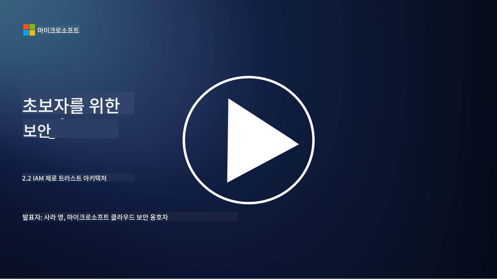

<!--
CO_OP_TRANSLATOR_METADATA:
{
  "original_hash": "4774a978af123f72ebb872199c4c4d4f",
  "translation_date": "2025-09-03T18:22:40+00:00",
  "source_file": "2.2 IAM zero trust architecture.md",
  "language_code": "ko"
}
-->
# IAM 제로 트러스트 아키텍처

아이덴티티는 제로 트러스트 아키텍처를 구현하고 IT 환경의 경계를 구축하는 데 중요한 요소입니다. 이 섹션에서는 제로 트러스트를 구현하기 위해 아이덴티티 제어를 사용하는 것이 왜 중요한지 살펴보겠습니다.

## 소개

이 강의에서는 다음 내용을 다룹니다:

 - 현대 IT 환경에서 왜 아이덴티티를 경계로 사용해야 할까요?
   
 - 전통적인 IT 아키텍처와 어떻게 다를까요?

 - 아이덴티티가 제로 트러스트 아키텍처를 구현하는 데 어떻게 사용될까요?

## 현대 IT 환경에서 왜 아이덴티티를 경계로 사용해야 할까요?

현대 IT 환경에서는 사이버 위협에 대한 주요 방어선으로 방화벽과 네트워크 경계와 같은 도구를 사용하는 물리적 경계 개념이 점점 더 효과를 잃어가고 있습니다. 이는 기술의 복잡성이 증가하고, 원격 근무가 확산되며, 클라우드 서비스가 채택됨에 따라 발생하는 변화입니다. 이에 따라 조직들은 아이덴티티를 새로운 경계로 사용하는 방향으로 전환하고 있습니다. 이는 사용자의 물리적 위치와 관계없이 리소스에 접근하려는 사용자, 디바이스, 애플리케이션의 아이덴티티를 확인하고 관리하는 데 초점을 맞추는 보안 방식입니다.

현대 IT 환경에서 아이덴티티를 경계로 사용하는 것이 중요한 이유는 다음과 같습니다:

**원격 근무**: 원격 근무와 모바일 디바이스가 일반화되면서 사용자는 다양한 위치와 디바이스에서 리소스에 접근할 수 있습니다. 전통적인 경계 접근 방식은 사용자가 더 이상 물리적 사무실에 국한되지 않는 상황에서 효과적이지 않습니다.

**클라우드 및 하이브리드 환경**: 조직들은 클라우드 서비스와 하이브리드 환경을 점점 더 많이 채택하고 있습니다. 데이터와 애플리케이션이 더 이상 조직의 내부에만 존재하지 않기 때문에 전통적인 경계 방어는 덜 중요해졌습니다.

**제로 트러스트 보안**: 제로 트러스트 보안 개념은 네트워크 내부든 외부든 어떤 엔티티도 자동으로 신뢰해서는 안 된다는 것을 전제로 합니다. 아이덴티티는 접근 요청을 확인하는 기반이 됩니다.

**위협 환경**: 사이버 위협은 진화하고 있으며, 공격자는 전통적인 경계 방어를 우회하는 방법을 찾고 있습니다. 피싱, 사회 공학, 내부 위협은 네트워크 경계를 침투하려는 대신 인간의 취약점을 악용하는 경우가 많습니다.

**데이터 중심 접근**: 민감한 데이터를 보호하는 것이 중요합니다. 아이덴티티에 초점을 맞춤으로써 조직은 누가 어떤 데이터에 접근할 수 있는지를 제어하여 데이터 유출 위험을 줄일 수 있습니다.

## 전통적인 IT 아키텍처와 어떻게 다를까요?

전통적인 IT 아키텍처는 방화벽과 네트워크 경계와 같은 경계 기반 보안 모델에 크게 의존했습니다. 전통적인 접근 방식과 아이덴티티 중심 접근 방식의 주요 차이점은 다음과 같습니다:

|      측면                   |      전통적인 IT 아키텍처                                                                          |      아이덴티티 중심 접근 방식                                                                           |
|-----------------------------|----------------------------------------------------------------------------------------------------|------------------------------------------------------------------------------------------------------------|
|     초점                   |     경계 중심: 방화벽과 접근 제어와 같은 경계 방어에 의존.                                         |     아이덴티티 확인 중심: 네트워크 경계에서 사용자/디바이스 아이덴티티 확인으로 전환.                     |
|     위치                  |     위치 의존성: 보안이 물리적 사무실 위치와 네트워크 경계에 연결됨.                                |     위치 독립성: 특정 위치에 국한되지 않고 어디서든 접근 가능.                                           |
|     신뢰 가정              |     신뢰 가정: 네트워크 경계 내의 사용자/디바이스를 신뢰한다고 가정.                                |     제로 트러스트 접근: 신뢰를 가정하지 않고 아이덴티티와 컨텍스트를 기반으로 접근 확인.                 |
|     디바이스 고려          |     디바이스 다양성: 네트워크 경계 내의 디바이스가 안전하다고 가정.                                |     디바이스 인식: 위치와 관계없이 디바이스 상태와 보안 상태를 고려.                                     |
|     데이터 보호            |     데이터 보호: 네트워크 경계를 통해 데이터 보호에 초점.                                          |     데이터 중심 보호: 아이덴티티와 데이터 민감도를 기반으로 데이터 접근 제어.                            |
|                             |                                                                                                    |                                                                                                            |

## 아이덴티티가 제로 트러스트 아키텍처를 구현하는 데 어떻게 사용될까요?

제로 트러스트 아키텍처에서 기본 원칙은 네트워크 경계 내부든 외부든 어떤 엔티티도 자동으로 신뢰하지 않는 것입니다. 아이덴티티는 제로 트러스트 접근 방식을 구현하는 데 중심적인 역할을 하며, 리소스에 접근하려는 엔티티를 지속적으로 확인할 수 있도록 합니다. 현대적인 아이덴티티 보안 제어를 통해 모든 사용자, 디바이스, 애플리케이션, 서비스는 리소스에 접근하기 전에 철저히 식별되고 인증되어야 합니다. 이는 사용자 이름/비밀번호 조합, 다중 인증(MFA), 생체 인식, 기타 강력한 인증 메커니즘을 통해 디지털 아이덴티티를 확인하는 과정을 포함합니다.

## 추가 읽을거리

- [Securing identity with Zero Trust | Microsoft Learn](https://learn.microsoft.com/security/zero-trust/deploy/identity?WT.mc_id=academic-96948-sayoung)
- [Zero Trust Principles and Guidance for Identity and Access | CSA (cloudsecurityalliance.org)](https://cloudsecurityalliance.org/artifacts/zero-trust-principles-and-guidance-for-iam/)
- [Zero Trust Identity Controls - Essentials Series - Episode 2 - YouTube](https://www.youtube.com/watch?v=fQZQznIKcGM&list=PLXtHYVsvn_b_gtX1-NB62wNervQx1Fhp4&index=13)

---

**면책 조항**:  
이 문서는 AI 번역 서비스 [Co-op Translator](https://github.com/Azure/co-op-translator)를 사용하여 번역되었습니다. 정확성을 위해 최선을 다하고 있지만, 자동 번역에는 오류나 부정확성이 포함될 수 있습니다. 원본 문서의 원어 버전을 권위 있는 출처로 간주해야 합니다. 중요한 정보의 경우, 전문적인 인간 번역을 권장합니다. 이 번역 사용으로 인해 발생하는 오해나 잘못된 해석에 대해 책임을 지지 않습니다.