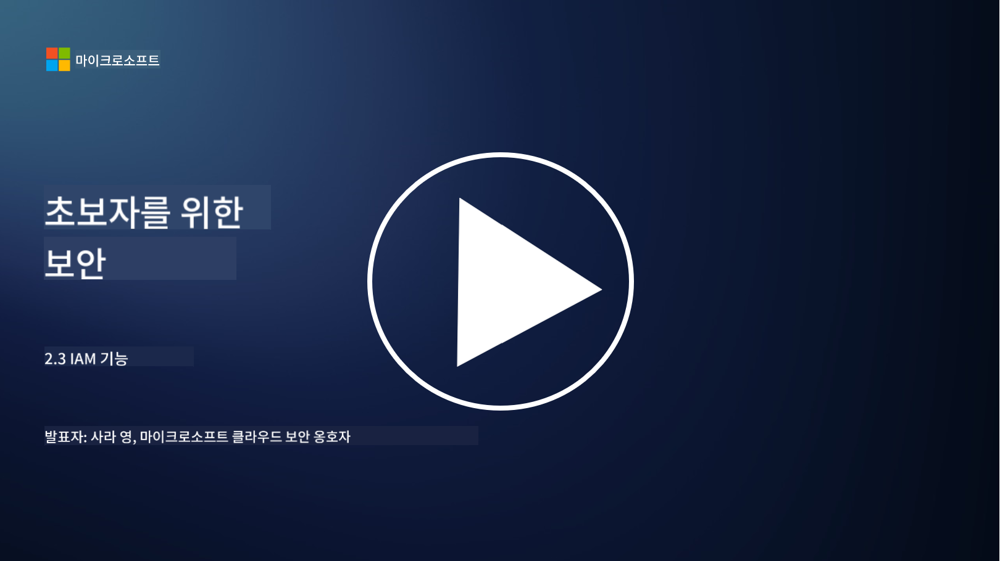

<!--
CO_OP_TRANSLATOR_METADATA:
{
  "original_hash": "bf0b8a54f2c69951744df5a94bc923f7",
  "translation_date": "2025-09-03T18:59:26+00:00",
  "source_file": "2.3 IAM capabilities.md",
  "language_code": "ko"
}
-->
# IAM 기능

이 섹션에서는 ID 보안에 사용되는 핵심 도구와 기능에 대해 자세히 알아보겠습니다.

## 소개

이 강의에서는 다음 내용을 다룹니다:

 - 디렉터리 서비스란 무엇인가?
      
     
    
 - ID를 보호하기 위해 사용할 수 있는 기능은 무엇인가?
>
>        다중 인증(MFA)
> 
>        싱글 사인온(SSO)
> 
>        역할 기반 액세스 제어(RBAC)
> 
>        적응형 인증
> 
>        생체 인증
> 
>        특권 액세스 관리(PAM)
> 
>        ID 거버넌스 및 관리(IGA)
> 
>        행동 분석

## 디렉터리 서비스란 무엇인가?

디렉터리 서비스는 사용자, 그룹, 장치, 애플리케이션 및 기타 객체를 포함한 네트워크 리소스에 대한 정보를 저장하고 관리하는 전문 데이터베이스입니다. 이는 ID 및 액세스 관련 데이터를 중앙 집중화된 저장소로 제공하여 조직이 사용자 인증, 권한 부여 및 기타 보안 관련 작업을 효율적으로 관리하고 제어할 수 있도록 합니다.

디렉터리 서비스는 현대 IT 환경에서 ID 및 액세스 관리(IAM) 솔루션의 기반을 제공함으로써 중요한 역할을 합니다. 이를 통해 리소스에 대한 안전한 액세스를 제공하고, 액세스 정책을 시행하며, 관리 작업을 간소화합니다. 가장 잘 알려진 디렉터리 서비스 중 하나는 Microsoft Active Directory이며, LDAP(Lightweight Directory Access Protocol) 디렉터리와 같은 다른 솔루션도 유사한 목적을 제공합니다.

사이버 보안 관점에서 디렉터리 서비스의 주요 기능과 특징은 다음과 같습니다:

 - **사용자 인증**: 디렉터리 서비스는 사용자 이름과 비밀번호와 같은 사용자 자격 증명을 검증하여 승인된 사용자만 네트워크와 리소스에 액세스할 수 있도록 합니다.
 - **사용자 권한 부여**: 사용자의 역할, 그룹 멤버십 및 기타 속성을 기반으로 각 사용자의 액세스 수준을 결정합니다. 이를 통해 사용자가 자신에게 허용된 리소스만 액세스할 수 있도록 보장합니다.
 - **그룹 관리**: 디렉터리 서비스는 관리자가 사용자를 논리적 그룹으로 조직할 수 있도록 하여 액세스 제어 관리를 간소화합니다. 권한은 개별 사용자 대신 그룹에 할당될 수 있습니다.
 - **비밀번호 정책**: 비밀번호 복잡성과 만료 규칙을 시행하여 사용자 계정의 보안을 강화합니다.
 - **싱글 사인온(SSO)**: 일부 디렉터리 서비스는 SSO를 지원하여 사용자가 단일 자격 증명 세트를 사용하여 여러 애플리케이션과 서비스를 액세스할 수 있도록 합니다.
 - **중앙 집중식 사용자 관리**: 디렉터리 서비스는 사용자 정보를 중앙 집중화하여 단일 위치에서 사용자 계정, 프로필 및 속성을 관리하기 쉽게 만듭니다.
 - **감사 및 로깅**: 사용자 인증 및 액세스 활동을 기록하여 보안 감사 및 규정 준수를 지원합니다.

## ID를 보호하기 위해 사용할 수 있는 기능은 무엇인가?

**다중 인증(MFA)**

MFA는 액세스를 허용하기 전에 사용자가 여러 형태의 검증을 제공하도록 요구합니다. 일반적으로 사용자가 알고 있는 것(비밀번호), 사용자가 가지고 있는 것(스마트폰 또는 보안 토큰), 사용자의 생체 정보(지문 또는 얼굴 인식)가 포함됩니다.

**싱글 사인온(SSO)**

SSO는 사용자가 단일 자격 증명 세트를 사용하여 여러 애플리케이션과 시스템에 액세스할 수 있도록 합니다. 이는 사용자 경험을 개선하고 여러 비밀번호를 관리하는 데 따른 위험을 줄여줍니다.

**역할 기반 액세스 제어(RBAC)**

RBAC는 미리 정의된 역할에 따라 권한을 할당합니다. 사용자는 조직 내에서 자신의 역할에 따라 액세스 권한을 부여받습니다.

**적응형 인증**

적응형 인증은 위치, 장치, 액세스 시간 및 사용자 행동과 같은 위험 요소를 평가하여 필요한 인증 수준을 동적으로 조정합니다. 요청이 의심스러워 보이는 경우 추가 인증 단계가 트리거될 수 있습니다.

**생체 인증**

생체 인증은 지문, 얼굴 특징, 음성 패턴 및 타이핑 속도와 같은 행동 특성과 같은 고유한 생물학적 특성을 사용하여 ID를 확인합니다.

**특권 액세스 관리(PAM)**

PAM은 특권 계정에 대한 엄격한 제어를 시행하여 중요한 시스템과 데이터에 대한 액세스를 보호하는 데 중점을 둡니다. 여기에는 필요 시 액세스 및 세션 모니터링과 같은 기능이 포함됩니다.

**ID 거버넌스 및 관리(IGA)**

IGA 솔루션은 사용자 ID와 리소스에 대한 액세스를 수명 주기 동안 관리합니다. 여기에는 온보딩, 프로비저닝, 역할 기반 액세스 제어 및 프로비저닝 해제가 포함됩니다.

**행동 분석**

행동 분석은 사용자 행동을 모니터링하고 기준 패턴을 설정합니다. 정상적인 패턴에서 벗어난 행동은 추가 조사를 위한 경고를 트리거할 수 있습니다.

# 추가 읽기
- [Azure Active Directory fundamentals documentation - Microsoft Entra | Microsoft Learn](https://learn.microsoft.com/azure/active-directory/fundamentals/?WT.mc_id=academic-96948-sayoung)
- [What is Azure Active Directory? - Microsoft Entra | Microsoft Learn](https://learn.microsoft.com/azure/active-directory/fundamentals/whatis?WT.mc_id=academic-96948-sayoung)
- [Manage your multi-cloud identity infrastructure with Microsoft Entra - YouTube](https://www.youtube.com/watch?v=9qQiq3wTS2Y&list=PLXtHYVsvn_b_gtX1-NB62wNervQx1Fhp4&index=18)

---

**면책 조항**:  
이 문서는 AI 번역 서비스 [Co-op Translator](https://github.com/Azure/co-op-translator)를 사용하여 번역되었습니다. 정확성을 위해 최선을 다하고 있으나, 자동 번역에는 오류나 부정확성이 포함될 수 있습니다. 원본 문서를 해당 언어로 작성된 상태에서 권위 있는 자료로 간주해야 합니다. 중요한 정보의 경우, 전문적인 인간 번역을 권장합니다. 이 번역 사용으로 인해 발생할 수 있는 오해나 잘못된 해석에 대해 당사는 책임을 지지 않습니다.  