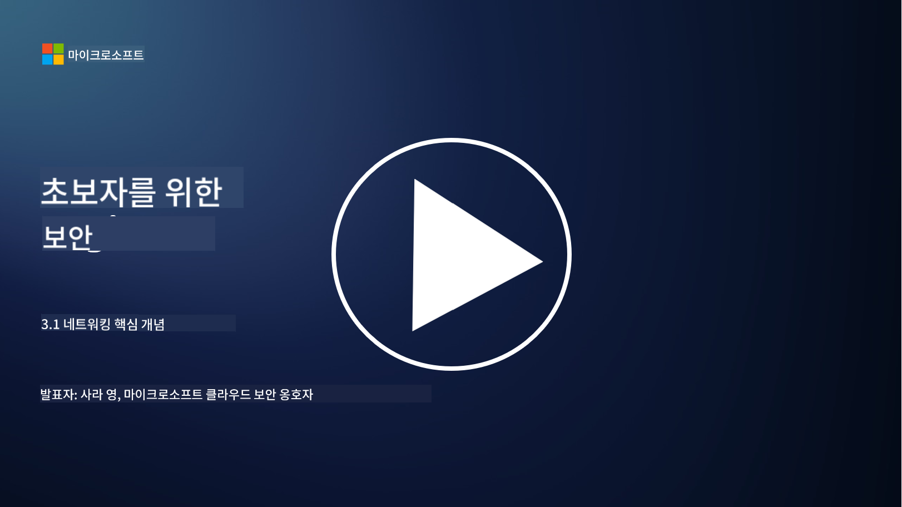
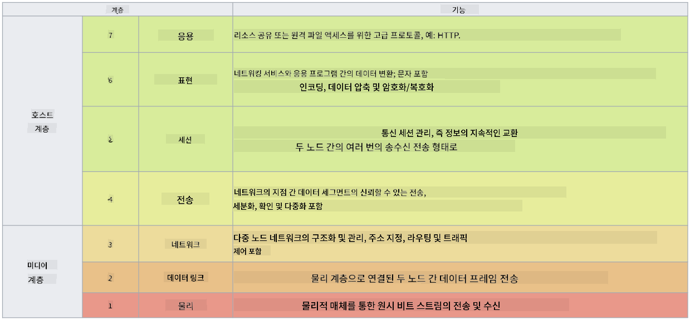

<!--
CO_OP_TRANSLATOR_METADATA:
{
  "original_hash": "252724eceeb183fb9018f88c5e1a3f0c",
  "translation_date": "2025-09-03T18:57:30+00:00",
  "source_file": "3.1 Networking key concepts.md",
  "language_code": "ko"
}
-->
# 네트워킹 핵심 개념

IT 분야에서 일을 해본 경험이 있다면 네트워킹 개념에 대해 접해본 적이 있을 것입니다. 현대 환경에서는 주로 신원(identity)을 주요 경계 제어로 사용하지만, 그렇다고 해서 네트워크 제어가 불필요하다는 뜻은 아닙니다. 이 주제는 매우 방대하지만, 이번 강의에서는 몇 가지 핵심 네트워킹 개념을 다룰 것입니다.

이번 강의에서는 다음을 다룹니다:

 - IP 주소란 무엇인가?
   
 - OSI 모델이란 무엇인가?

 

 - TCP/UDP란 무엇인가?

   
 

 - 포트 번호란 무엇인가?

   
  

 - 데이터 암호화(저장 시 및 전송 중)란 무엇인가?

## IP 주소란 무엇인가?

IP 주소(Internet Protocol 주소)는 인터넷 프로토콜을 사용하여 통신하는 컴퓨터 네트워크에 연결된 모든 장치에 할당되는 숫자 라벨입니다. 이는 네트워크 내에서 장치를 고유하게 식별하며, 인터넷 또는 다른 연결된 네트워크를 통해 데이터를 송수신할 수 있도록 합니다. IP 주소에는 두 가지 주요 버전이 있습니다: IPv4(인터넷 프로토콜 버전 4)와 IPv6(인터넷 프로토콜 버전 6). IP 주소는 일반적으로 IPv4 형식(예: 192.168.1.1) 또는 IPv6 형식(예: 2001:0db8:85a3:0000:0000:8a2e:0370:7334)으로 표현됩니다.

## OSI 모델이란 무엇인가?

OSI(Open Systems Interconnection) 모델은 통신 시스템의 기능을 7개의 독립적인 계층으로 표준화한 개념적 프레임워크입니다. 각 계층은 특정 작업을 수행하며, 인접한 계층과 상호작용하여 네트워크 내 장치 간 효율적이고 신뢰할 수 있는 데이터 통신을 보장합니다. 계층은 아래에서 위로 다음과 같습니다:

 1. 물리 계층
    
 
 2. 데이터 링크 계층

    
    

 1. 네트워크 계층

    
   

 1. 전송 계층

    

 1. 세션 계층

    
   

 1. 표현 계층

    
    

 1. 응용 계층

OSI 모델은 특정 하드웨어나 소프트웨어 구현에 관계없이 네트워킹 프로토콜과 기술이 어떻게 상호작용하는지 이해하기 위한 공통 참조를 제공합니다.

_ref: https://en.wikipedia.org/wiki/OSI_model_

## TCP/UDP란 무엇인가?

TCP(Transmission Control Protocol)와 UDP(User Datagram Protocol)는 인터넷 또는 로컬 네트워크 내에서 장치 간 통신을 가능하게 하는 두 가지 기본적인 전송 계층 프로토콜입니다. 이들은 데이터를 패킷으로 분할하여 전송하고, 수신 측에서 원래 데이터로 재구성하는 역할을 합니다. 하지만 두 프로토콜은 특성과 사용 사례에서 차이가 있습니다.

**TCP(Transmission Control Protocol)**:

TCP는 연결 지향 프로토콜로, 장치 간 신뢰할 수 있고 순서가 보장된 데이터 전달을 제공합니다. 데이터 교환이 시작되기 전에 송신자와 수신자 간 연결을 설정합니다. TCP는 데이터 패킷이 올바른 순서로 도착하도록 보장하며, 손실된 패킷을 재전송하여 데이터의 무결성과 완전성을 보장할 수 있습니다. 따라서 TCP는 웹 브라우징, 이메일, 파일 전송(FTP), 데이터베이스 통신 등 신뢰할 수 있는 데이터 전달이 필요한 애플리케이션에 적합합니다.

**UDP(User Datagram Protocol)**:

UDP는 연결 없는 프로토콜로, 더 빠른 데이터 전송을 제공하지만 TCP와 같은 신뢰성을 제공하지는 않습니다. 데이터 전송 전에 공식적인 연결을 설정하지 않으며, 손실된 패킷에 대한 확인 또는 재전송 메커니즘을 포함하지 않습니다. UDP는 실시간 통신, 스트리밍 미디어, 온라인 게임, DNS 쿼리 등 속도와 효율성이 신뢰성보다 중요한 애플리케이션에 적합합니다.

요약하자면, TCP는 신뢰성과 순서 보장을 우선시하여 데이터 정확성이 필요한 애플리케이션에 적합하며, UDP는 속도와 효율성을 강조하여 약간의 데이터 손실이나 순서 변경이 허용되는 애플리케이션에 적합합니다. TCP와 UDP 중 어떤 것을 선택할지는 사용 중인 애플리케이션이나 서비스의 특정 요구 사항에 따라 달라집니다.

## 포트 번호란 무엇인가?

네트워킹에서 포트 번호는 네트워크 내에서 단일 장치에서 실행 중인 다양한 서비스나 애플리케이션을 구분하기 위해 사용되는 숫자 식별자입니다. 포트는 들어오는 데이터를 적절한 애플리케이션으로 라우팅하는 데 도움을 줍니다. 포트 번호는 16비트 부호 없는 정수로, 0에서 65535까지의 범위를 가집니다. 포트 번호는 다음 세 가지 범위로 나뉩니다:

- 잘 알려진 포트(0-1023): HTTP(포트 80), FTP(포트 21)와 같은 표준 서비스에 예약됨.

- 등록된 포트(1024-49151): 잘 알려진 범위에 속하지 않지만 공식적으로 등록된 애플리케이션 및 서비스에 사용됨.

- 동적/개인 포트(49152-65535): 애플리케이션에서 임시 또는 개인적으로 사용 가능.

## 데이터 암호화(저장 시 및 전송 중)란 무엇인가?

암호화는 데이터를 안전한 형식으로 변환하여 무단 접근이나 변조로부터 보호하는 과정입니다. 암호화는 "저장 시"(장치나 서버에 저장된 경우)와 "전송 중"(장치 간 또는 네트워크를 통해 전송되는 경우) 모두 적용될 수 있습니다.

저장 시 암호화: 장치, 서버 또는 저장 시스템에 저장된 데이터를 암호화하는 것을 포함합니다. 공격자가 저장 매체에 물리적으로 접근하더라도 암호화 키 없이는 데이터를 접근할 수 없습니다. 이는 장치 도난, 데이터 유출, 무단 접근의 경우 민감한 데이터를 보호하는 데 중요합니다.

전송 중 암호화: 장치 간 또는 네트워크를 통해 데이터를 전송할 때 데이터를 암호화하는 것을 포함합니다. 이는 전송 중 데이터 도청 및 무단 가로채기를 방지합니다. 전송 중 암호화를 위한 일반적인 프로토콜에는 웹 통신을 위한 HTTPS와 다양한 네트워크 트래픽을 보호하기 위한 TLS/SSL이 포함됩니다.

## 추가 읽기 자료
- [How Do IP Addresses Work? (howtogeek.com)](https://www.howtogeek.com/341307/how-do-ip-addresses-work/)
- [Understanding IP Address: An Introductory Guide (geekflare.com)](https://geekflare.com/understanding-ip-address/)
- [What is the OSI model? The 7 layers of OSI explained (techtarget.com)](https://www.techtarget.com/searchnetworking/definition/OSI)
- [The OSI Model – The 7 Layers of Networking Explained in Plain English (freecodecamp.org)](https://www.freecodecamp.org/news/osi-model-networking-layers-explained-in-plain-english/)
- [TCP/IP protocols - IBM Documentation](https://www.ibm.com/docs/en/aix/7.3?topic=protocol-tcpip-protocols)
- [Common Ports Cheat Sheet: The Ultimate Ports & Protocols List (stationx.net)](https://www.stationx.net/common-ports-cheat-sheet/)
- [Azure Data Encryption-at-Rest - Azure Security | Microsoft Learn](https://learn.microsoft.com/azure/security/fundamentals/encryption-atrest?WT.mc_id=academic-96948-sayoung)

---

**면책 조항**:  
이 문서는 AI 번역 서비스 [Co-op Translator](https://github.com/Azure/co-op-translator)를 사용하여 번역되었습니다. 정확성을 위해 최선을 다하고 있지만, 자동 번역에는 오류나 부정확성이 포함될 수 있습니다. 원본 문서의 원어 버전을 권위 있는 자료로 간주해야 합니다. 중요한 정보의 경우, 전문 번역가에 의한 번역을 권장합니다. 이 번역 사용으로 인해 발생하는 오해나 잘못된 해석에 대해 당사는 책임을 지지 않습니다.  