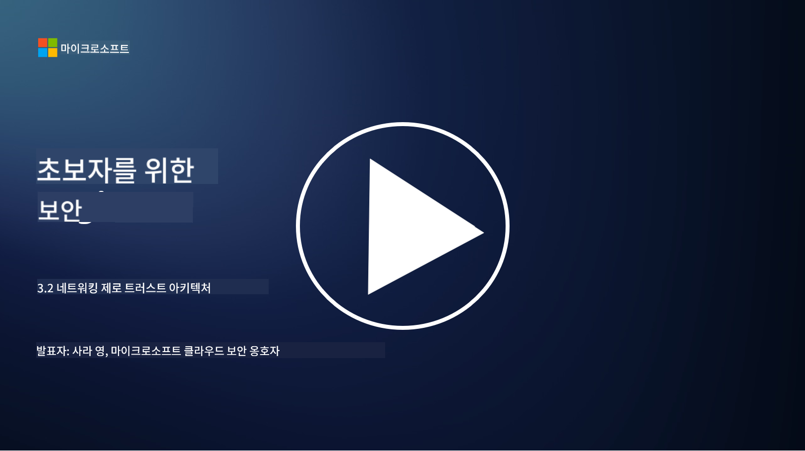

<!--
CO_OP_TRANSLATOR_METADATA:
{
  "original_hash": "680d6e14d9d33fc471c22f44679713f8",
  "translation_date": "2025-09-03T18:39:09+00:00",
  "source_file": "3.2 Networking zero trust architecture.md",
  "language_code": "ko"
}
-->
# 네트워킹 제로 트러스트 아키텍처

네트워크는 제로 트러스트 통제를 위한 중요한 계층을 제공합니다. 이번 강의에서는 다음 내용을 배웁니다:

- 네트워크 세분화란 무엇인가?  
- 네트워크 세분화가 제로 트러스트 구현에 어떻게 도움이 되는가?  
- 종단 간 암호화란 무엇인가?  

## 네트워크 세분화란 무엇인가?

네트워크 세분화는 네트워크를 더 작은, 격리된 세그먼트 또는 서브네트워크로 나누는 관행입니다. 각 세그먼트는 다른 세그먼트와 격리되어 있으며, 세그먼트 간 접근은 특정 보안 정책에 따라 통제되고 제한됩니다. 네트워크 세분화는 잠재적인 침해의 영향을 제한하고 네트워크 내에서 공격자의 횡적 이동을 최소화함으로써 보안을 강화하는 데 사용됩니다.

네트워크 세분화를 구현함으로써 조직은 서로 다른 유형의 사용자, 애플리케이션, 데이터를 분리하는 "존"을 만들 수 있습니다. 이를 통해 공격 표면을 줄이고 보안 사고로 인한 잠재적 피해를 최소화할 수 있습니다. 네트워크 세분화는 가상 LAN(VLAN), 방화벽, 접근 통제와 같은 기술을 통해 이루어질 수 있습니다.

## 네트워크 세분화가 제로 트러스트 구현에 어떻게 도움이 되는가?

네트워크 세분화는 제로 트러스트 모델의 원칙과 밀접하게 연관됩니다. 제로 트러스트 아키텍처에서는 네트워크 세분화를 통해 "최소 권한" 원칙을 강화할 수 있습니다. 이를 통해 사용자와 장치가 자신의 작업을 수행하는 데 필요한 특정 리소스와 서비스에만 접근할 수 있도록 합니다. 네트워크를 더 작은 존으로 세분화함으로써 조직은 엄격한 접근 통제를 구현하고, 중요한 자산을 격리하며, 공격자의 횡적 이동을 방지할 수 있습니다.

네트워크 세분화는 또한 사용자와 장치가 특정 세그먼트에 접근하기 전에 철저히 인증되고 권한이 부여되는 신원 기반 접근 통제를 강화하는 데 도움을 줍니다. 이를 통해 민감한 리소스에 대한 무단 접근을 방지하고, 자격 증명이 손상되었을 때의 잠재적 영향을 완화할 수 있습니다.

## 종단 간 암호화란 무엇인가?

종단 간(E2E) 암호화는 데이터가 송신자에서 수신자까지 전체 경로를 따라 암호화된 상태로 유지되도록 보장하는 보안 조치입니다. 이 과정에서 데이터는 송신자의 끝에서 암호화되며, 수신자만이 데이터를 해독하고 읽을 수 있는 복호화 키를 소유합니다. 암호화와 복호화 과정은 끝점에서 이루어지며, 서비스 제공자나 중간 매개체를 포함한 무단 당사자가 평문 데이터를 접근하기 어렵게 만듭니다.

종단 간 암호화는 데이터가 다양한 중간 시스템이나 네트워크를 통과하더라도 높은 수준의 기밀성과 보안을 제공합니다. 이는 민감한 정보를 가로채거나 무단 접근으로부터 보호하기 위해 보안 메시징 앱, 이메일 서비스, 기타 통신 플랫폼에서 일반적으로 사용됩니다.

이 암호화 방법은 공격자가 데이터 전송 중에 접근하더라도 복호화 키 없이는 의미 없는 암호화된 콘텐츠만 볼 수 있도록 보장합니다. 종단 간 암호화는 사용자 프라이버시를 보호하고 민감한 정보가 무단 당사자에게 노출되는 것을 방지하는 데 중요한 역할을 합니다.

## SASE란 무엇인가?

SASE는 "Secure Access Service Edge"의 약자로, 네트워크 보안과 광역 네트워킹(WAN) 기능을 단일 클라우드 기반 서비스로 결합한 사이버 보안 프레임워크 및 아키텍처입니다. SASE는 원격 및 모바일 사용자가 네트워크 리소스, 애플리케이션, 데이터에 안전하고 확장 가능한 접근을 제공하면서 네트워크 관리와 기존 네트워크 및 보안 아키텍처의 복잡성을 줄이는 데 초점을 맞추고 있습니다.

SASE의 주요 특징과 구성 요소는 다음과 같습니다:

1. **클라우드 기반:** SASE는 클라우드 서비스로 제공되며, 보안 및 네트워킹 기능이 기존의 온프레미스 하드웨어와 장비에 의존하지 않고 클라우드에서 제공됩니다.

2. **보안과 네트워킹의 통합:** SASE는 보안 웹 게이트웨이(SWG), 서비스형 방화벽(FWaaS), 데이터 손실 방지(DLP), 제로 트러스트 네트워크 접근(ZTNA), WAN 최적화와 같은 다양한 보안 서비스를 광역 네트워킹 기능과 통합합니다. 이를 통해 보안 및 네트워킹 운영을 간소화할 수 있습니다.

3. **제로 트러스트:** SASE는 제로 트러스트 원칙에 따라 작동하며, 엄격한 접근 통제와 최소 권한 접근 정책을 시행합니다. 사용자와 장치는 기본적으로 신뢰되지 않으며, 리소스에 접근하기 전에 인증과 권한 부여를 받아야 합니다.

4. **신원 중심:** SASE는 접근 통제의 기반으로 사용자와 장치의 신원에 초점을 맞춥니다. 신원 및 컨텍스트 기반 정책을 사용하여 접근 권한을 결정하며, 이러한 정책은 사용자 행동과 컨텍스트에 따라 동적으로 적응합니다.

5. **확장성과 유연성:** SASE는 많은 사용자와 장치를 수용할 수 있도록 쉽게 확장할 수 있어, 다양한 네트워킹 및 보안 요구를 가진 조직에 적합합니다.

SASE는 원격 근무와 클라우드 도입이 증가하는 현대 시대에 특히 중요하며, 네트워크 접근을 안전하고 효율적으로 관리하기 위한 포괄적이고 민첩한 접근 방식을 제공합니다. 이는 사용자 중심 및 제로 트러스트 보안 모델에 강력한 초점을 유지하면서 조직이 변화하는 보안 및 네트워킹 요구에 적응할 수 있도록 돕습니다.

## 추가 읽기

- [What Is Network Segmentation? - Cisco](https://www.cisco.com/c/en/us/products/security/what-is-network-segmentation.html#~benefits)  
- [What Is Micro-Segmentation? - Cisco](https://www.cisco.com/c/en/us/products/security/what-is-microsegmentation.html)  
- [Implementing Network Segmentation and Segregation | Cyber.gov.au](https://www.cyber.gov.au/resources-business-and-government/maintaining-devices-and-systems/system-hardening-and-administration/network-hardening/implementing-network-segmentation-and-segregation)  
- [What Is Network Segmentation and Why It Matters | CompTIA](https://www.comptia.org/blog/security-awareness-training-network-segmentation)  
- [Network Segmentation: Concepts and Practices (cmu.edu)](https://insights.sei.cmu.edu/blog/network-segmentation-concepts-and-practices/)  
- [Secure networks with Zero Trust | Microsoft Learn](https://learn.microsoft.com/security/zero-trust/deploy/networks?WT.mc_id=academic-96948-sayoung)  
- [What is end-to-end encryption? | IBM](https://www.ibm.com/topics/end-to-end-encryption)  
- [What Is End-to-End Encryption, and Why Does It Matter? (howtogeek.com)](https://www.howtogeek.com/711656/what-is-end-to-end-encryption-and-why-does-it-matter/)  
- [Definition of Secure Access Service Edge (SASE) - Gartner Information Technology Glossary](https://www.gartner.com/en/information-technology/glossary/secure-access-service-edge-sase)  
- [What Is Secure Access Service Edge (SASE)? | Microsoft Security](https://www.microsoft.com/security/business/security-101/what-is-sase?WT.mc_id=academic-96948-sayoung)  

---

**면책 조항**:  
이 문서는 AI 번역 서비스 [Co-op Translator](https://github.com/Azure/co-op-translator)를 사용하여 번역되었습니다. 정확성을 위해 최선을 다하고 있으나, 자동 번역에는 오류나 부정확성이 포함될 수 있습니다. 원본 문서의 원어 버전을 권위 있는 출처로 간주해야 합니다. 중요한 정보의 경우, 전문적인 인간 번역을 권장합니다. 이 번역 사용으로 인해 발생하는 오해나 잘못된 해석에 대해 당사는 책임을 지지 않습니다.