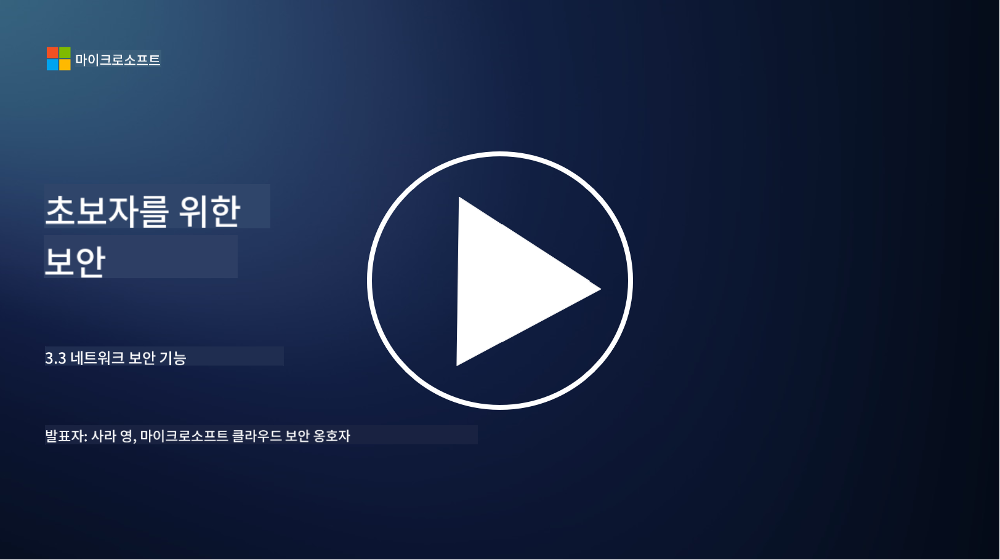

<!--
CO_OP_TRANSLATOR_METADATA:
{
  "original_hash": "c3aba077bb98eebc925dd58d870229ab",
  "translation_date": "2025-09-03T18:20:25+00:00",
  "source_file": "3.3 Network security capabilities.md",
  "language_code": "ko"
}
-->
# 네트워크 보안 기능

이 강의에서는 네트워크를 보호하기 위해 사용할 수 있는 다음 기능들에 대해 배웁니다:

 - 전통적인 방화벽
 - 웹 애플리케이션 방화벽
 - 클라우드 보안 그룹
 - CDN
 - 로드 밸런서
 - 배스천 호스트
 - VPN
 - DDoS 보호

## 전통적인 방화벽

전통적인 방화벽은 미리 정의된 보안 규칙에 따라 들어오고 나가는 네트워크 트래픽을 제어하고 모니터링하는 보안 장치입니다. 신뢰할 수 있는 내부 네트워크와 신뢰할 수 없는 외부 네트워크 사이에 장벽 역할을 하며, 트래픽을 필터링하여 무단 접근과 잠재적 위협을 방지합니다.

## 웹 애플리케이션 방화벽

웹 애플리케이션 방화벽(WAF)은 SQL 인젝션, 크로스 사이트 스크립팅 등 다양한 공격으로부터 웹 애플리케이션을 보호하기 위해 설계된 전문 방화벽입니다. HTTP 요청과 응답을 분석하여 웹 애플리케이션을 대상으로 하는 악성 트래픽을 식별하고 차단합니다.

## 클라우드 보안 그룹

보안 그룹은 클라우드 서비스 제공자가 제공하는 기본적인 네트워크 보안 기능입니다. 가상 방화벽 역할을 하며, 가상 머신(VM) 및 인스턴스와 같은 클라우드 리소스로 들어오고 나가는 트래픽을 제어합니다. 보안 그룹은 허용 및 차단할 트래픽 유형을 결정하는 규칙을 정의할 수 있어 클라우드 배포에 추가적인 방어 계층을 제공합니다.

## 콘텐츠 전송 네트워크 (CDN)

콘텐츠 전송 네트워크는 다양한 지리적 위치에 분산된 서버 네트워크입니다. CDN은 콘텐츠를 캐싱하고 사용자와 가까운 서버에서 제공함으로써 웹사이트의 성능과 가용성을 향상시킵니다. 또한 트래픽을 여러 서버 위치에 분산시켜 DDoS 공격에 대한 일정 수준의 보호를 제공합니다.

## 로드 밸런서

로드 밸런서는 들어오는 네트워크 트래픽을 여러 서버에 분산시켜 자원 활용을 최적화하고, 높은 가용성을 보장하며, 애플리케이션 성능을 향상시킵니다. 서버 과부하를 방지하고 효율적인 응답 시간을 유지하여 네트워크의 복원력을 강화합니다.

## 배스천 호스트

배스천 호스트는 외부의 신뢰할 수 없는 네트워크(예: 인터넷)에서 네트워크로의 접근을 제어하는 고도로 안전하고 격리된 서버입니다. 관리자가 내부 시스템에 안전하게 접근할 수 있는 진입점 역할을 합니다. 배스천 호스트는 공격 표면을 최소화하기 위해 강력한 보안 조치로 구성됩니다.

## 가상 사설망 (VPN)

VPN은 사용자의 장치와 원격 서버 간에 암호화된 터널을 생성하여 인터넷과 같은 잠재적으로 안전하지 않은 네트워크에서 안전하고 개인적인 통신을 보장합니다. VPN은 일반적으로 내부 네트워크에 원격으로 접근할 수 있도록 사용되며, 사용자가 물리적으로 동일한 네트워크에 있는 것처럼 리소스에 접근할 수 있게 합니다.

## DDoS 보호 도구

DDoS(분산 서비스 거부) 보호 도구와 서비스는 네트워크 또는 서비스를 압도하려는 다수의 감염된 장치가 트래픽을 유발하는 DDoS 공격의 영향을 완화하기 위해 설계되었습니다. DDoS 보호 솔루션은 악성 트래픽을 식별하고 필터링하여 합법적인 트래픽이 의도된 목적지에 도달할 수 있도록 합니다.

## 추가 읽을거리

- [What Is a Firewall? - Cisco](https://www.cisco.com/c/en/us/products/security/firewalls/what-is-a-firewall.html#~types-of-firewalls)
- [What Does a Firewall Actually Do? (howtogeek.com)](https://www.howtogeek.com/144269/htg-explains-what-firewalls-actually-do/)
- [What is a Firewall? How Firewalls Work & Types of Firewalls (kaspersky.com)](https://www.kaspersky.com/resource-center/definitions/firewall)
- [Network security group - how it works | Microsoft Learn](https://learn.microsoft.com/azure/virtual-network/network-security-group-how-it-works)
- [Introduction to Azure Content Delivery Network (CDN) - Training | Microsoft Learn](https://learn.microsoft.com/training/modules/intro-to-azure-content-delivery-network/?WT.mc_id=academic-96948-sayoung)
- [What is a content delivery network (CDN)? - Azure | Microsoft Learn](https://learn.microsoft.com/azure/cdn/cdn-overview?WT.mc_id=academic-96948-sayoung)
- [What Is Load Balancing? How Load Balancers Work (nginx.com)](https://www.nginx.com/resources/glossary/load-balancing/)
- [Bastion hosts vs. VPNs · Tailscale](https://tailscale.com/learn/bastion-hosts-vs-vpns/)
- [What is VPN? How It Works, Types of VPN (kaspersky.com)](https://www.kaspersky.com/resource-center/definitions/what-is-a-vpn)
- [Introduction to Azure DDoS Protection - Training | Microsoft Learn](https://learn.microsoft.com/training/modules/introduction-azure-ddos-protection/?WT.mc_id=academic-96948-sayoung)
- [What Is a DDoS Attack? | Microsoft Security](https://www.microsoft.com/security/business/security-101/what-is-a-ddos-attack?WT.mc_id=academic-96948-sayoung)

---

**면책 조항**:  
이 문서는 AI 번역 서비스 [Co-op Translator](https://github.com/Azure/co-op-translator)를 사용하여 번역되었습니다. 정확성을 위해 최선을 다하고 있지만, 자동 번역에는 오류나 부정확성이 포함될 수 있습니다. 원본 문서의 원어 버전을 권위 있는 출처로 간주해야 합니다. 중요한 정보의 경우, 전문적인 인간 번역을 권장합니다. 이 번역 사용으로 인해 발생하는 오해나 잘못된 해석에 대해 책임을 지지 않습니다.