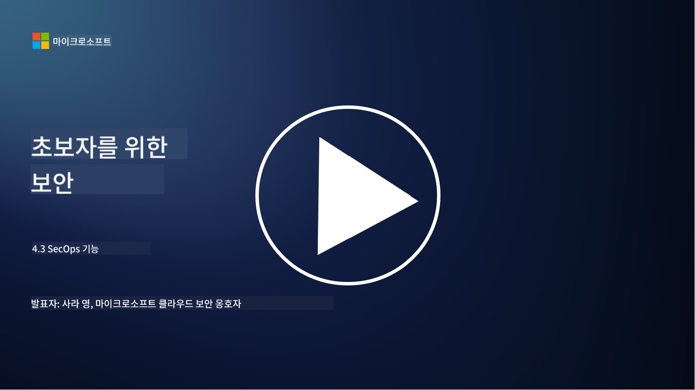

<!--
CO_OP_TRANSLATOR_METADATA:
{
  "original_hash": "553eb694c89f1caca0694e8d8ab89e0e",
  "translation_date": "2025-09-03T18:50:24+00:00",
  "source_file": "4.3 SecOps capabilities.md",
  "language_code": "ko"
}
-->
# SecOps 기능

이 섹션에서는 보안 운영에 사용할 수 있는 핵심 도구와 기능에 대해 자세히 알아봅니다.

이 강의에서는 다음 내용을 다룹니다:

- 보안 정보 및 이벤트 관리(SIEM) 도구란 무엇인가?

- XDR이란 무엇인가?

- 보안 운영을 강화하기 위해 사용할 수 있는 기능은 무엇인가?

## 보안 정보 및 이벤트 관리(SIEM) 도구란 무엇인가?

보안 정보 및 이벤트 관리(SIEM) 도구는 조직의 IT 환경 전반에서 생성된 보안 경고를 분석하는 데 사용됩니다. 이 도구는 네트워크 장치, 서버, 애플리케이션, 보안 시스템 등 다양한 소스에서 로그 데이터와 보안 이벤트를 수집, 집계, 상관 분석합니다.

SIEM 도구의 주요 기능과 특징은 다음과 같습니다:

1. **로그 수집**: SIEM 도구는 방화벽, 침입 탐지 시스템, 안티바이러스 소프트웨어 등 다양한 장치, 시스템, 애플리케이션에서 로그와 보안 이벤트 데이터를 수집합니다.

2. **데이터 정규화**: 로그 데이터를 공통 형식으로 정규화하여 분석과 상관 관계를 용이하게 합니다.

3. **이벤트 상관 분석**: SIEM 도구는 이벤트를 상관 분석하여 보안 사고나 위협을 나타낼 수 있는 패턴과 이상 징후를 식별합니다.

4. **경고 및 알림**: 의심스러운 활동이나 보안 위반이 감지되면 실시간으로 경고와 알림을 생성하여 즉각적인 대응이 가능하도록 합니다.

5. **사고 탐지**: 무단 액세스, 데이터 유출, 악성코드 감염, 내부 위협 등 보안 사고를 탐지할 수 있도록 지원합니다.

6. **사용자 및 엔터티 행동 분석(UEBA)**: 일부 SIEM 도구는 UEBA 기능을 통합하여 계정 탈취나 내부 위협을 나타낼 수 있는 비정상적인 사용자 및 엔터티 행동을 식별합니다.

7. **위협 인텔리전스 통합**: SIEM 도구는 위협 인텔리전스 피드와 통합하여 알려진 침해 지표(IOCs)를 네트워크 활동과 비교함으로써 위협 탐지를 강화합니다.

8. **자동화 및 오케스트레이션**: SIEM의 자동화 기능은 일반적인 보안 사고에 대한 대응을 자동화하여 응답 시간과 수작업을 줄입니다.

9. **대시보드 및 시각화**: 보안 데이터를 모니터링하고 맞춤형 보고서를 생성할 수 있는 대시보드와 시각화 도구를 제공합니다.

10. **다른 보안 도구와의 통합**: SIEM 도구는 종종 엔드포인트 탐지 및 대응(EDR) 솔루션과 같은 다른 보안 도구 및 기술과 통합되어 조직의 보안 상태를 전체적으로 파악할 수 있도록 합니다.

## XDR이란 무엇인가?

XDR(확장 탐지 및 대응)은 기존의 엔드포인트 탐지 및 대응(EDR) 기능을 확장하고, 다양한 소스에서 수집된 보안 텔레메트리를 결합하여 조직의 보안 상태를 보다 포괄적으로 파악할 수 있도록 하는 기술입니다. XDR은 EDR, SIEM 또는 기타 개별 보안 도구에만 의존하는 것의 한계를 극복하여 위협 탐지, 사고 대응, 전반적인 보안을 개선하는 것을 목표로 합니다.

XDR의 주요 특징과 구성 요소는 다음과 같습니다:

1. **데이터 통합**: XDR은 엔드포인트, 네트워크 트래픽, 클라우드 서비스, 이메일 등 다양한 소스에서 데이터를 통합합니다. 이러한 포괄적인 데이터 집계는 위협 탐지와 분석에 더 넓은 맥락을 제공합니다.

2. **고급 분석**: XDR은 고급 분석, 머신러닝, 행동 분석을 활용하여 보안 위협을 식별하고 우선순위를 지정합니다. 통합된 데이터에서 패턴과 이상 징후를 찾아 알려진 위협과 알려지지 않은 위협을 모두 탐지합니다.

3. **자동화된 위협 탐지**: XDR은 다양한 소스에서 정보를 상관 분석하여 보안 위협과 이상 징후를 자동으로 탐지합니다. 여러 벡터에 걸친 복잡한 공격 체인을 식별할 수 있습니다.

4. **사고 조사 및 대응**: XDR은 사고 조사 및 대응 도구를 제공하여 보안 팀이 사고의 범위와 영향을 신속히 평가하고 적절한 조치를 취할 수 있도록 돕습니다.

5. **위협 인텔리전스 통합**: 위협 인텔리전스 피드와 데이터를 통합하여 알려진 침해 지표(IOCs)를 조직의 네트워크 및 엔드포인트 활동과 비교함으로써 위협 탐지를 강화합니다.

6. **통합 콘솔**: XDR은 일반적으로 보안 팀이 다양한 소스에서 발생한 보안 경고와 사고를 중앙에서 관리할 수 있는 통합 콘솔 또는 대시보드를 제공합니다.

7. **크로스 플랫폼 커버리지**: XDR 솔루션은 엔드포인트, 서버, 클라우드 환경, 모바일 장치 등 다양한 플랫폼을 포괄하여 현대적인 다중 플랫폼 IT 환경에 적합합니다.

## 보안 운영을 강화하기 위해 사용할 수 있는 기능은 무엇인가?

보안 운영을 강화하기 위해 조직은 SIEM 도구 외에도 다음과 같은 기능을 활용할 수 있습니다:

1. **머신러닝 및 인공지능**: 진화하는 위협을 탐지하고 위협 헌팅을 자동화하기 위해 고급 분석, 머신러닝, AI를 구현합니다.

2. **사용자 및 엔터티 행동 분석(UEBA)**: 사용자 및 엔터티 행동을 분석하여 이상 징후와 내부 위협을 탐지합니다.

3. **위협 인텔리전스 피드**: 최신 위협과 침해 지표에 대한 정보를 유지하기 위해 위협 인텔리전스 피드를 통합합니다.

4. **보안 오케스트레이션, 자동화 및 대응(SOAR)**: SOAR 플랫폼을 구현하여 사고 대응을 자동화하고 보안 운영 워크플로를 간소화합니다.

5. **기만 기술**: 네트워크 내에서 공격자를 혼란시키고 탐지하기 위해 기만 기술을 배포합니다.

## 추가 읽을거리

- [What is SIEM? | Microsoft Security](https://www.microsoft.com/security/business/security-101/what-is-siem?WT.mc_id=academic-96948-sayoung)
- [What Is SIEM? - Security Information and Event Management - Cisco](https://www.cisco.com/c/en/us/products/security/what-is-siem.html)
- [Security information and event management - Wikipedia](https://en.wikipedia.org/wiki/Security_information_and_event_management)
- [What Is XDR? | Microsoft Security](https://www.microsoft.com/security/business/security-101/what-is-xdr?WT.mc_id=academic-96948-sayoung)
- [XDR & XDR Security (kaspersky.com.au)](https://www.kaspersky.com.au/resource-center/definitions/what-is-xdr)
- [The Power of SecOps: Redefining Core Security Capabilities - The New Stack](https://thenewstack.io/the-power-of-secops-redefining-core-security-capabilities/)
- [Seven Steps to Improve Your Security Operations and Response (securityintelligence.com)](https://securityintelligence.com/seven-steps-to-improve-your-security-operations-and-response/)

---

**면책 조항**:  
이 문서는 AI 번역 서비스 [Co-op Translator](https://github.com/Azure/co-op-translator)를 사용하여 번역되었습니다. 정확성을 위해 최선을 다하고 있으나, 자동 번역에는 오류나 부정확성이 포함될 수 있습니다. 원본 문서를 해당 언어로 작성된 상태에서 권위 있는 자료로 간주해야 합니다. 중요한 정보의 경우, 전문적인 인간 번역을 권장합니다. 이 번역 사용으로 인해 발생하는 오해나 잘못된 해석에 대해 당사는 책임을 지지 않습니다.  