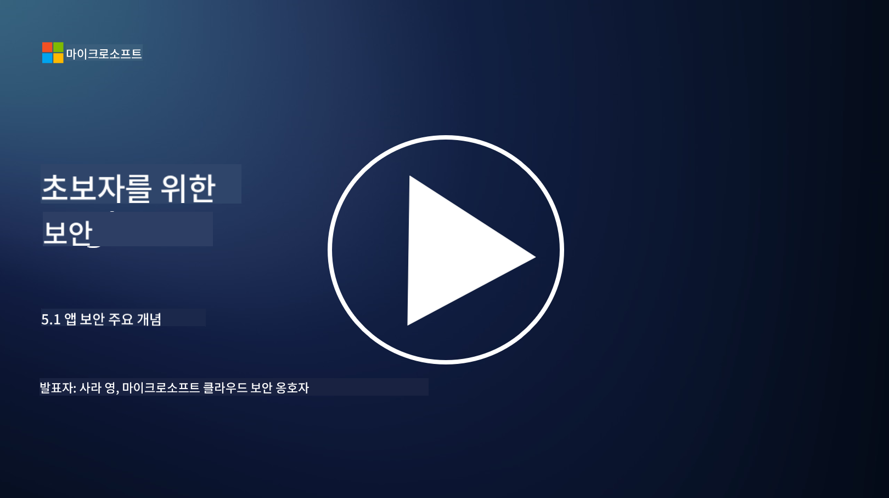

<!--
CO_OP_TRANSLATOR_METADATA:
{
  "original_hash": "e4b56bb23078d3ffb7ad407d280b0c36",
  "translation_date": "2025-09-03T18:37:08+00:00",
  "source_file": "5.1 AppSec key concepts.md",
  "language_code": "ko"
}
-->
# AppSec 주요 개념

애플리케이션 보안은 독립적인 보안 전문 분야입니다. 이 과정의 이 부분에서는 애플리케이션 보안에 대해 더 자세히 살펴보겠습니다.

## 소개

이 강의에서는 다음 내용을 다룹니다:

- 애플리케이션 보안이란 무엇인가?

- 애플리케이션 보안의 주요 개념/원칙은 무엇인가?

## 애플리케이션 보안이란 무엇인가?

애플리케이션 보안, 흔히 "AppSec"이라고 줄여 부르는 것은 소프트웨어 애플리케이션을 보안 위협, 취약점, 공격으로부터 보호하는 실천을 의미합니다. 이는 애플리케이션의 개발, 배포, 유지보수 라이프사이클 전반에 걸쳐 보안 위험을 식별, 완화, 예방하기 위해 사용되는 프로세스, 기술, 도구를 포함합니다.

애플리케이션 보안은 매우 중요합니다. 애플리케이션은 사이버 공격의 흔한 대상이기 때문입니다. 악의적인 행위자는 소프트웨어의 취약점과 약점을 악용하여 무단 접근, 데이터 탈취, 서비스 중단 또는 기타 악의적인 활동을 실행합니다. 효과적인 애플리케이션 보안은 애플리케이션과 관련 데이터의 기밀성, 무결성, 가용성을 보장하는 데 도움을 줍니다.

## 애플리케이션 보안의 주요 개념/원칙은 무엇인가?

애플리케이션 보안을 뒷받침하는 주요 개념과 원칙은 다음과 같습니다:

1. **설계 단계에서의 보안**:

- 보안은 애플리케이션의 설계와 아키텍처 단계에서부터 통합되어야 하며, 나중에 추가되는 것이 아니라 처음부터 고려되어야 합니다.

2. **입력 검증**:

- 모든 사용자 입력은 예상되는 형식에 맞는지 확인하고 악성 코드나 데이터를 포함하지 않도록 검증해야 합니다.

3. **출력 인코딩**:

- 클라이언트로 전송되는 데이터는 적절히 인코딩되어야 하며, 이를 통해 크로스 사이트 스크립팅(XSS)과 같은 취약점을 방지할 수 있습니다.

4. **인증 및 권한 부여**:

- 사용자를 인증하고, 그들의 역할과 권한에 따라 자원에 대한 접근을 허가해야 합니다.

5. **데이터 보호**:

- 민감한 데이터는 저장, 전송, 처리 시 암호화되어야 하며, 이를 통해 무단 접근을 방지해야 합니다.

6. **세션 관리**:

- 안전한 세션 관리는 사용자 세션이 탈취되거나 무단 접근으로부터 보호되도록 보장합니다.

7. **안전한 종속성 관리**:

- 모든 소프트웨어 종속성을 최신 보안 패치로 유지하여 취약점을 방지해야 합니다.

8. **오류 처리 및 로깅**:

- 민감한 정보를 노출하지 않도록 안전한 오류 처리를 구현하고, 안전한 로깅 관행을 보장해야 합니다.

9. **보안 테스트**:

- 침투 테스트, 코드 리뷰, 자동화된 스캐닝 도구와 같은 방법을 사용하여 애플리케이션의 취약점을 정기적으로 테스트해야 합니다.

10. **안전한 소프트웨어 개발 생명주기(SDLC)**:

- 요구사항부터 배포 및 유지보수에 이르기까지 소프트웨어 개발 생명주기의 모든 단계에 보안 관행을 통합해야 합니다.

## 추가 읽을거리

- [SheHacksPurple: What is Application Security? - YouTube](https://www.youtube.com/watch?v=eNmccQNzSSY)
- [What Is Application Security? - Cisco](https://www.cisco.com/c/en/us/solutions/security/application-first-security/what-is-application-security.html#~how-does-it-work)
- [What is application security? A process and tools for securing software | CSO Online](https://www.csoonline.com/article/566471/what-is-application-security-a-process-and-tools-for-securing-software.html)
- [OWASP Cheat Sheet Series | OWASP Foundation](https://owasp.org/www-project-cheat-sheets/)

---

**면책 조항**:  
이 문서는 AI 번역 서비스 [Co-op Translator](https://github.com/Azure/co-op-translator)를 사용하여 번역되었습니다. 정확성을 위해 최선을 다하고 있지만, 자동 번역에는 오류나 부정확성이 포함될 수 있습니다. 원본 문서의 원어 버전을 권위 있는 출처로 간주해야 합니다. 중요한 정보의 경우, 전문적인 인간 번역을 권장합니다. 이 번역 사용으로 인해 발생하는 오해나 잘못된 해석에 대해 책임을 지지 않습니다.