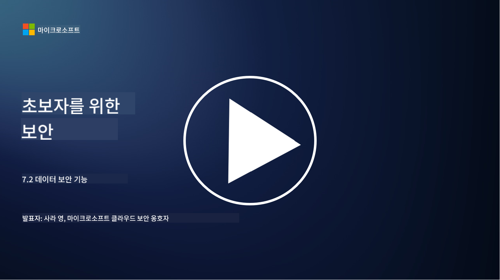

<!--
CO_OP_TRANSLATOR_METADATA:
{
  "original_hash": "50697add9758e54693442d502d2d5f8a",
  "translation_date": "2025-09-03T18:43:45+00:00",
  "source_file": "7.2 Data security capabilities.md",
  "language_code": "ko"
}
-->
# 데이터 보안 기능

이 섹션에서는 데이터 보안에 사용되는 핵심 도구와 기능에 대해 자세히 알아보겠습니다.

**소개**

이 강의에서는 다음 내용을 다룹니다:

- 데이터 손실 방지 도구란 무엇인가?

- 내부 위험 관리 도구란 무엇인가?

- 어떤 데이터 보존 도구를 사용할 수 있는가?

## 데이터 손실 방지 도구란 무엇인가?

데이터 손실 방지(DLP) 도구는 조직 내에서 민감하거나 기밀 데이터의 무단 접근, 공유, 유출을 방지하기 위해 설계된 소프트웨어 솔루션 및 기술을 말합니다. 이러한 도구는 콘텐츠 검사, 정책 시행, 모니터링을 통해 민감한 데이터를 식별하고 보호하여 노출되거나 오용되지 않도록 합니다. DLP 제품의 예로는 다음이 있습니다: Symantec Data Loss Prevention, McAfee Total Protection for Data Loss Prevention, Microsoft 365 DLP**: Microsoft 365 애플리케이션과 통합되어 이메일, 문서, 메시지 내의 민감한 데이터를 식별하고 보호하도록 조직을 지원합니다.

## 내부 위험 관리 도구란 무엇인가?

내부 위험 관리 도구는 직원, 계약자, 파트너가 의도적이든 비의도적이든 데이터 보안을 위협할 수 있는 위험을 식별하고 완화하도록 조직을 지원합니다. 이러한 도구는 사용자 행동, 접근 패턴, 데이터 사용을 모니터링하여 의심스러운 활동과 잠재적인 내부 위협을 감지합니다. 내부 위험 관리 제품의 예로는 다음이 있습니다: Microsoft Insider Risk Management (Microsoft 365의 일부), Forcepoint Insider Threat Data Protection, Varonis Insider Threat Detection.

## 어떤 데이터 보존 도구를 사용할 수 있는가?

데이터 보존 도구는 조직의 데이터 보존 정책 및 법적 요구 사항에 따라 데이터를 보존하고 삭제하는 과정을 관리하도록 설계된 소프트웨어 및 솔루션을 포함합니다. 이러한 도구는 특정 기간 동안 데이터를 보존하고 더 이상 필요하지 않을 때 안전하게 삭제하는 과정을 자동화하는 데 도움을 줍니다. 데이터 보존 제품의 예로는 다음이 있습니다: Veritas Enterprise Vault, Commvault Complete Data Protection, Microsoft 데이터 수명 주기 관리. 이러한 도구는 조직이 데이터 보존 및 폐기를 제어하고 데이터 보호 규정을 준수하면서 데이터의 수명 주기 전반에 걸쳐 효율적으로 관리할 수 있도록 지원합니다.

## 추가 자료

- [데이터 보안 태세 관리(DSPM) 가이드 | CSA (cloudsecurityalliance.org)](https://cloudsecurityalliance.org/blog/2023/03/31/the-big-guide-to-data-security-posture-management-dspm/)
- [엔드포인트, 앱 및 서비스 전반의 데이터 손실 방지 | Microsoft Purview](https://youtu.be/hvqq8L_0kgI)
- [2023년 최고의 데이터 손실 방지 소프트웨어 도구 18개 (무료 + 유료) (comparitech.com)](https://www.comparitech.com/data-privacy-management/data-loss-prevention-tools-software/)
- [데이터 손실 방지 (nist.gov)](https://tsapps.nist.gov/publication/get_pdf.cfm?pub_id=904672)
- [내부 위험 관리에 대해 알아보기 | Microsoft Learn](https://learn.microsoft.com/purview/insider-risk-management?WT.mc_id=academic-96948-sayoung)
- [데이터 수명 주기 관리 | IBM](https://www.ibm.com/topics/data-lifecycle-management)
- [데이터 수명 주기 관리(DLM)란 무엇인가? | 2023년 모범 사례 (selecthub.com)](https://www.selecthub.com/big-data-analytics/data-lifecycle-management/)

---

**면책 조항**:  
이 문서는 AI 번역 서비스 [Co-op Translator](https://github.com/Azure/co-op-translator)를 사용하여 번역되었습니다. 정확성을 위해 최선을 다하고 있으나, 자동 번역에는 오류나 부정확성이 포함될 수 있습니다. 원본 문서를 해당 언어로 작성된 상태에서 권위 있는 자료로 간주해야 합니다. 중요한 정보의 경우, 전문적인 인간 번역을 권장합니다. 이 번역 사용으로 인해 발생하는 오해나 잘못된 해석에 대해 당사는 책임을 지지 않습니다.  