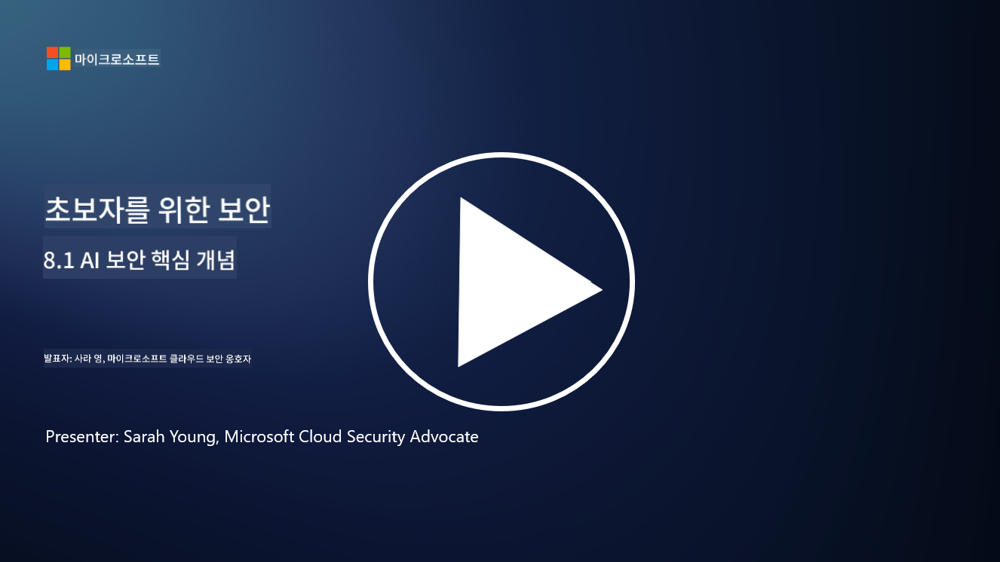

<!--
CO_OP_TRANSLATOR_METADATA:
{
  "original_hash": "66b61d96936cf25d20fcb411d4ce5227",
  "translation_date": "2025-09-03T18:07:33+00:00",
  "source_file": "8.1 AI security key concepts.md",
  "language_code": "ko"
}
-->
# AI 보안 주요 개념

## AI 보안은 기존 사이버 보안과 어떻게 다른가요?

AI 시스템을 보호하는 것은 AI의 학습 능력과 의사결정 과정의 특성 때문에 기존 사이버 보안과는 다른 고유한 과제를 제시합니다. 주요 차이점은 다음과 같습니다:

-   **데이터 무결성**: AI 시스템은 학습을 위해 데이터에 크게 의존합니다. [이 데이터의 무결성을 보장하는 것이 중요하며, 공격자가 데이터를 조작하여 AI의 행동에 영향을 미치는 데이터 중독(data poisoning)이라는 전술을 사용할 수 있습니다.
-   **모델 보안**: AI의 의사결정 모델 자체가 공격 대상이 될 수 있습니다. [공격자는 모델을 역설계하거나 약점을 악용하여 잘못된 또는 유해한 결정을 내리도록 시도할 수 있습니다.
-   **적대적 공격**: AI 시스템은 입력 데이터에 미세하고 종종 감지하기 어려운 변화를 주어 AI가 오류를 범하거나 잘못된 예측을 하게 만드는 적대적 공격에 취약할 수 있습니다.
-   **인프라 보안**: 기존 사이버 보안도 인프라 보호에 중점을 두지만, AI 시스템은 클라우드 기반 서비스나 특수 하드웨어와 같은 추가적인 복잡성을 포함할 수 있어 특정 보안 조치가 필요합니다.
-   **윤리적 고려사항**: 보안에서 AI를 사용하는 것은 프라이버시 문제와 의사결정에서의 편향 가능성과 같은 윤리적 고려사항을 가져오며, 이는 보안 전략에서 반드시 다루어야 합니다.

결론적으로, AI 시스템을 보호하려면 데이터, 모델, AI의 학습 과정을 보호하는 것뿐만 아니라 AI 배치의 윤리적 영향을 고려하는 등 AI 기술의 고유한 측면을 고려한 다른 접근 방식이 필요합니다.

AI 보안과 기존 사이버 보안은 많은 유사점을 공유하지만, 인공지능 시스템의 고유한 특성과 능력 때문에 몇 가지 뚜렷한 차이점도 존재합니다. 다음은 그 차이점입니다:

- **위협의 복잡성**: AI 시스템은 사이버 보안에 새로운 복잡성을 추가합니다. 기존 사이버 보안은 주로 악성코드, 피싱 공격, 네트워크 침입과 같은 위협을 다룹니다. 그러나 AI 시스템은 머신러닝 알고리즘 자체를 표적으로 삼는 적대적 공격, 데이터 중독, 모델 회피와 같은 공격에 취약할 수 있습니다.

- **공격 표면**: AI 시스템은 기존 시스템보다 더 넓은 공격 표면을 가질 수 있습니다. 이는 소프트웨어뿐만 아니라 데이터와 모델에도 의존하기 때문입니다. 공격자는 학습 데이터를 표적으로 삼거나 모델을 조작하거나 알고리즘 자체의 취약점을 악용할 수 있습니다.

- **위협의 적응성**: AI 시스템은 환경에서 학습하고 적응할 수 있어 적응적이고 진화하는 위협에 더 취약할 수 있습니다. 기존 사이버 보안 조치는 AI 시스템의 행동에 따라 끊임없이 진화하는 공격을 방어하기에 충분하지 않을 수 있습니다.

- **해석 가능성과 설명 가능성**: AI 시스템이 특정 결정을 내린 이유를 이해하는 것은 기존 소프트웨어 시스템보다 더 어려운 경우가 많습니다. 이러한 해석 가능성과 설명 가능성의 부족은 AI 시스템에 대한 공격을 효과적으로 탐지하고 완화하는 것을 어렵게 만들 수 있습니다.

- **데이터 프라이버시 문제**: AI 시스템은 대량의 데이터에 의존하는 경우가 많아 적절히 처리되지 않으면 프라이버시 위험을 초래할 수 있습니다. 기존 사이버 보안 조치는 AI 시스템에 특화된 데이터 프라이버시 문제를 충분히 해결하지 못할 수 있습니다.

- **규제 준수**: AI 보안을 위한 규제 환경은 아직 발전 중이며, AI 시스템이 제기하는 고유한 과제를 해결하기 위한 특정 규제와 표준이 등장하고 있습니다. 기존 사이버 보안 프레임워크는 이러한 새로운 규제에 대한 준수를 보장하기 위해 확장되거나 조정되어야 할 수 있습니다.

- **윤리적 고려사항**: AI 보안은 악의적인 공격으로부터 시스템을 보호하는 것뿐만 아니라 AI 시스템이 윤리적이고 책임감 있게 사용되도록 보장하는 것도 포함합니다. 이는 공정성, 투명성, 책임성과 같은 요소를 포함하며, 이는 기존 사이버 보안에서 덜 두드러질 수 있습니다.

## AI 보안은 기존 IT 시스템 보안과 어떻게 동일한가요?

AI 시스템을 보호하는 것은 기존 사이버 보안과 몇 가지 기본 원칙을 공유합니다:

-   **위협 보호**: AI와 기존 시스템 모두 무단 접근, 데이터 수정 및 파괴, 기타 일반적인 위협으로부터 보호되어야 합니다.
-   **취약점 관리**: 소프트웨어 버그나 잘못된 구성과 같은 기존 시스템에 영향을 미치는 많은 취약점이 AI 시스템에도 영향을 미칠 수 있습니다.
-   **데이터 보안**: 데이터 유출을 방지하고 기밀성을 보장하기 위해 처리된 데이터를 보호하는 것은 두 영역에서 모두 중요합니다.
-   **공급망 보안**: 두 시스템 모두 구성 요소가 손상되면 전체 시스템의 보안을 약화시킬 수 있는 공급망 공격에 취약합니다.

이러한 유사점은 AI 시스템이 새로운 보안 과제를 제시하지만, 기존 사이버 보안 관행을 적용하여 강력한 보호를 보장해야 한다는 점을 강조합니다. 이는 기존 보안 지식을 활용하면서 AI 기술의 고유한 측면에 적응하는 혼합 접근 방식입니다.

## 추가 읽을거리

- [Not with a Bug, But with a Sticker [Book] (oreilly.com)](https://www.oreilly.com/library/view/not-with-a/9781119883982/)
   
- [Intro to AI Security Part 1: AI Security 101 | by HarrietHacks | Medium](https://medium.com/@harrietfarlow/intro-to-ai-security-part-1-ai-security-101-b8662a9efe5)
   
- [Best practices for AI security risk management | Microsoft Security Blog](https://www.microsoft.com/en-us/security/blog/2021/12/09/best-practices-for-ai-security-risk-management/?WT.mc_id=academic-96948-sayoung)
   
- [OWASP AI Security and Privacy Guide | OWASP Foundation](https://owasp.org/www-project-ai-security-and-privacy-guide/)

---

**면책 조항**:  
이 문서는 AI 번역 서비스 [Co-op Translator](https://github.com/Azure/co-op-translator)를 사용하여 번역되었습니다. 정확성을 위해 최선을 다하고 있지만, 자동 번역에는 오류나 부정확성이 포함될 수 있습니다. 원본 문서의 원어 버전이 권위 있는 출처로 간주되어야 합니다. 중요한 정보의 경우, 전문적인 인간 번역을 권장합니다. 이 번역 사용으로 인해 발생하는 오해나 잘못된 해석에 대해 책임을 지지 않습니다.