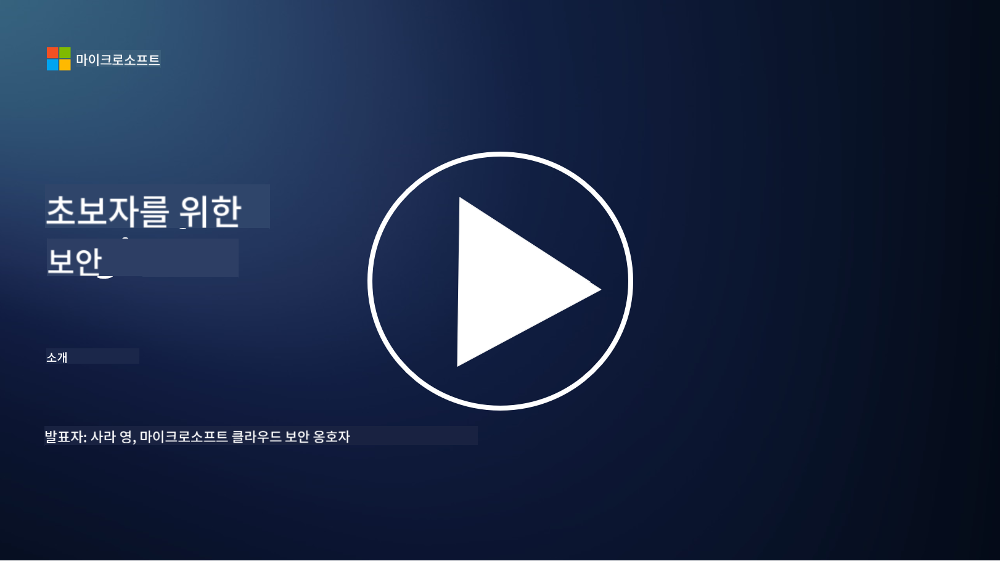

<!--
CO_OP_TRANSLATOR_METADATA:
{
  "original_hash": "79a7e63fa60f649eb3560e1cd7246272",
  "translation_date": "2025-11-18T17:14:32+00:00",
  "source_file": "README.md",
  "language_code": "ko"
}
-->
  
  
  
  
  
  

### 🌐 다국어 지원

#### GitHub Action을 통해 지원 (자동화 및 항상 최신 상태 유지)

<!-- CO-OP TRANSLATOR LANGUAGES TABLE START -->
[아랍어](../ar/README.md) | [벵골어](../bn/README.md) | [불가리아어](../bg/README.md) | [버마어 (미얀마)](../my/README.md) | [중국어 (간체)](../zh/README.md) | [중국어 (번체, 홍콩)](../hk/README.md) | [중국어 (번체, 마카오)](../mo/README.md) | [중국어 (번체, 대만)](../tw/README.md) | [크로아티아어](../hr/README.md) | [체코어](../cs/README.md) | [덴마크어](../da/README.md) | [네덜란드어](../nl/README.md) | [에스토니아어](../et/README.md) | [핀란드어](../fi/README.md) | [프랑스어](../fr/README.md) | [독일어](../de/README.md) | [그리스어](../el/README.md) | [히브리어](../he/README.md) | [힌디어](../hi/README.md) | [헝가리어](../hu/README.md) | [인도네시아어](../id/README.md) | [이탈리아어](../it/README.md) | [일본어](../ja/README.md) | [한국어](./README.md) | [리투아니아어](../lt/README.md) | [말레이어](../ms/README.md) | [마라티어](../mr/README.md) | [네팔어](../ne/README.md) | [나이지리아 피진어](../pcm/README.md) | [노르웨이어](../no/README.md) | [페르시아어 (파르시)](../fa/README.md) | [폴란드어](../pl/README.md) | [포르투갈어 (브라질)](../br/README.md) | [포르투갈어 (포르투갈)](../pt/README.md) | [펀자브어 (구르무키)](../pa/README.md) | [루마니아어](../ro/README.md) | [러시아어](../ru/README.md) | [세르비아어 (키릴)](../sr/README.md) | [슬로바키아어](../sk/README.md) | [슬로베니아어](../sl/README.md) | [스페인어](../es/README.md) | [스와힐리어](../sw/README.md) | [스웨덴어](../sv/README.md) | [타갈로그어 (필리핀)](../tl/README.md) | [타밀어](../ta/README.md) | [태국어](../th/README.md) | [터키어](../tr/README.md) | [우크라이나어](../uk/README.md) | [우르두어](../ur/README.md) | [베트남어](../vi/README.md)  
<!-- CO-OP TRANSLATOR LANGUAGES TABLE END -->

**추가 번역 언어를 지원받고 싶다면 [여기](https://github.com/Azure/co-op-translator/blob/main/getting_started/supported-languages.md)를 확인하세요.**

#### 커뮤니티에 참여하세요  

# 🚀 초보자를 위한 사이버 보안 – 커리큘럼

AI 기술이 빠르게 발전하는 시대에 IT 시스템을 안전하게 보호하는 방법을 이해하는 것이 더욱 중요해졌습니다. 이 과정은 보안 학습을 시작하기 위한 기본적인 사이버 보안 개념을 가르치기 위해 설계되었습니다. 특정 벤더에 의존하지 않으며, 약 30~60분 정도 소요되는 작은 단원으로 나뉘어 있습니다. 각 단원에는 간단한 퀴즈와 주제에 대해 더 깊이 탐구하고 싶을 경우 추가 읽기 자료 링크가 포함되어 있습니다.

이 과정에서 다루는 내용 📚

- 🔐 CIA 삼원론, 위험과 위협의 차이 등 기본적인 사이버 보안 개념
- 🛡️ 보안 통제가 무엇인지와 그 형태에 대한 이해
- 🌐 제로 트러스트가 무엇인지와 현대 사이버 보안에서 왜 중요한지에 대한 이해
- 🔑 정체성, 네트워킹, 보안 운영, 인프라 및 데이터 보안 전반에 걸친 주요 개념과 주제 이해
- 🔧 보안 통제를 구현하는 데 사용되는 도구의 예시 제공

이 과정에서 다루지 않는 내용 🙅‍♂️

- 🚫 특정 보안 도구 사용 방법
- 🚫 "해킹" 또는 레드 팀/공격 보안 수행 방법
- 🚫 특정 컴플라이언스 표준 학습

이 과정을 완료한 후에는 Microsoft Learn 모듈로 학습을 이어갈 수 있습니다. [Microsoft Security, Compliance, and Identity Fundamentals](https://learn.microsoft.com/training/paths/describe-concepts-of-security-compliance-identity/?WT.mc_id=academic-96948-sayoung)를 추천합니다.

궁극적으로는 [Exam SC-900: Microsoft Security, Compliance, and Identity Fundamentals exam](https://learn.microsoft.com/credentials/certifications/exams/sc-900/?WT.mc_id=academic-96948-sayoung)을 고려해볼 수 있습니다.

> 💁 이 과정에 대한 피드백이나 누락된 콘텐츠에 대한 제안이 있다면 언제든지 알려주세요!

## 모듈 개요 📝  
| **모듈 번호** | **모듈 이름**                           | **배우는 개념**                  | **학습 목표**                                                                                          |
|-------------------|-------------------------------------------|--------------------------------------|-----------------------------------------------------------------------------------------------------------------|
| **1.1**           | 기본 보안 개념                   | [CIA 삼원론](https://github.com/microsoft/Security-101/blob/main/1.1%20The%20CIA%20triad%20and%20other%20key%20concepts.md)                        | 기밀성, 가용성, 무결성에 대해 배우기. 또한 인증, 부인 방지 및 개인정보 보호에 대해 배우기. |
| **1.2**           | 기본 보안 개념                   | [일반적인 사이버 보안 위협](https://github.com/microsoft/Security-101/blob/main/1.2%20Common%20cybersecurity%20threats.md)        | 개인 및 조직이 직면하는 일반적인 사이버 보안 위협에 대해 배우기.                             |
| **1.3**           | 기본 보안 개념                   | [위험 관리 이해하기](https://github.com/microsoft/Security-101/blob/main/1.3%20Understanding%20risk%20management.md)       | 위험 평가 및 이해 – 영향/가능성과 통제 구현에 대해 배우기.                                                                                                               | |
| **1.4**           | 기본 보안 개념                   | [보안 관행 및 문서화](https://github.com/microsoft/Security-101/blob/main/1.4%20Security%20practices%20and%20documentation.md) | 정책, 절차, 표준 및 규정/법률의 차이에 대해 배우기.                         |
| **1.5**           | 기본 보안 개념                   | [제로 트러스트](https://github.com/microsoft/Security-101/blob/main/1.5%20Zero%20trust.md)                           | 제로 트러스트가 무엇이며 아키텍처에 어떤 영향을 미치는지 배우기. 심층 방어란 무엇인지 배우기.                   |
| **1.6**           | 기본 보안 개념                   | [공유 책임 모델](https://github.com/microsoft/Security-101/blob/main/1.6%20Shared%20responsibility%20model.md)                           | 공유 책임 모델이 무엇이며 사이버 보안에 어떤 영향을 미치는지 배우기.                  |
| **1.7**           | [모듈 종료 퀴즈](https://github.com/microsoft/Security-101/blob/main/1.7%20End%20of%20module%20quiz.md)                        |                                      |                                                                                                                 |
| **2.1**           | 정체성 및 접근 관리 기본 | [IAM 주요 개념](https://github.com/microsoft/Security-101/blob/main/2.1%20IAM%20key%20concepts.md)                     | 최소 권한 원칙, 업무 분리, IAM이 제로 트러스트를 지원하는 방법에 대해 배우기.               |
| **2.2**           | 정체성 및 접근 관리 기본 | [IAM 제로 트러스트 아키텍처](https://github.com/microsoft/Security-101/blob/main/2.2%20IAM%20zero%20trust%20architecture.md)          | 현대 IT 환경에서 정체성이 새로운 경계가 되는 이유와 이를 완화하는 위협에 대해 배우기.          |
| **2.3**           | 정체성 및 접근 관리 기본 | [IAM 기능](https://github.com/microsoft/Security-101/blob/main/2.3%20IAM%20capabilities.md)                     | 정체성을 보호하기 위한 IAM 기능 및 통제에 대해 배우기                                                  |
| **2.4**           | [모듈 종료 퀴즈](https://github.com/microsoft/Security-101/blob/main/2.4%20End%20of%20module%20quiz.md)                        |                                      |                                                                                                                 |
| **3.1**           | 네트워크 보안 기본             | [네트워킹 주요 개념](https://github.com/microsoft/Security-101/blob/main/3.1%20Networking%20key%20concepts.md)              | 네트워킹 개념 (IP 주소, 포트 번호, 암호화 등)에 대해 배우기.                                 |
| **3.2**           | 네트워크 보안 기본             | [네트워킹 제로 트러스트 아키텍처](https://github.com/microsoft/Security-101/blob/main/3.2%20Networking%20zero%20trust%20architecture.md)   | 네트워킹이 E2E ZT 아키텍처에 기여하는 방법과 이를 완화하는 위협에 대해 배우기.                  |
| **3.3**           | 네트워크 보안 기본             | [네트워크 보안 기능](https://github.com/microsoft/Security-101/blob/main/3.3%20Network%20security%20capabilities.md)        | 네트워크 보안 도구 – 방화벽, WAF, DDoS 보호 등에 대해 배우기.                                    |
| **3.4**           | [모듈 종료 퀴즈](https://github.com/microsoft/Security-101/blob/main/3.4%20End%20of%20module%20quiz.md)                        |                                      |                                                                                                                 |
| **4.1**           | 보안 운영 기본          | [SecOps 주요 개념](https://github.com/microsoft/Security-101/blob/main/4.1%20SecOps%20key%20concepts.md)                  | 보안 운영이 왜 중요한지와 일반 IT 운영 팀과 어떻게 다른지 배우기.                  |
| **4.2**           | 보안 운영 기본          | [SecOps 제로 트러스트 아키텍처](https://github.com/microsoft/Security-101/blob/main/4.2%20SecOps%20zero%20trust%20architecture.md)       | SecOps가 E2E ZT 아키텍처에 기여하는 방법과 이를 완화하는 위협에 대해 배우기.                      |
| **4.3**           | 보안 운영 기본          | [SecOps 기능](https://github.com/microsoft/Security-101/blob/main/4.3%20SecOps%20capabilities.md)                  | SecOps 도구 – SIEM, XDR 등에 대해 배우기.                                                                    |
| **4.4**           | [모듈 종료 퀴즈](https://github.com/microsoft/Security-101/blob/main/4.4%20End%20of%20module%20quiz.md)                        |                                      |                                                                                                                 |
| **5.1**           | 애플리케이션 보안 기본         | [AppSec 주요 개념](https://github.com/microsoft/Security-101/blob/main/5.1%20AppSec%20key%20concepts.md)                  | 설계에 의한 보안, 입력 검증 등 AppSec 개념에 대해 배우기.                                    |
| **5.2**           | 애플리케이션 보안 기본 사항              | [AppSec 기능](https://github.com/microsoft/Security-101/blob/main/5.2%20AppSec%20key%20capabilities.md)                  | AppSec 도구에 대해 배우기: 파이프라인 보안 도구, 코드 스캔, 비밀 스캔 등.                       |
| **5.3**           | [모듈 종료 퀴즈](https://github.com/microsoft/Security-101/blob/main/5.3%20End%20of%20module%20quiz.md)                        |                                      |                                                                                                                 |
| **6.1**           | 인프라 보안 기본 사항                    | [인프라 보안 주요 개념](https://github.com/microsoft/Security-101/blob/main/6.1%20Infrastructure%20security%20key%20concepts.md) | 시스템 강화, 패치, 보안 위생, 컨테이너 보안에 대해 배우기.                                  |
| **6.2**           | 인프라 보안 기본 사항                    | [인프라 보안 기능](https://github.com/microsoft/Security-101/blob/main/6.2%20Infrastructure%20security%20capabilities.md) | 인프라 보안을 지원하는 도구에 대해 배우기: 예를 들어 CSPM, 컨테이너 보안 등.            |
| **6.3**           | [모듈 종료 퀴즈](https://github.com/microsoft/Security-101/blob/main/6.3%20End%20of%20module%20quiz.md)                        |                                      |                                                                                                                 |
| **7.1**           | 데이터 보안 기본 사항                    | [데이터 보안 주요 개념](https://github.com/microsoft/Security-101/blob/main/7.1%20Data%20security%20key%20concepts.md)           | 데이터 분류 및 보존의 중요성과 조직에 미치는 영향에 대해 배우기.                     |
| **7.2**           | 데이터 보안 기본 사항                    | [데이터 보안 기능](https://github.com/microsoft/Security-101/blob/main/7.2%20Data%20security%20capabilities.md)           | 데이터 보안 도구에 대해 배우기 – DLP, 내부 위험 관리, 데이터 거버넌스 등.                          |
| **7.3**           | [모듈 종료 퀴즈](https://github.com/microsoft/Security-101/blob/main/7.3%20End%20of%20module%20quiz.md)                        |
| **8.1**           | AI 보안 기본 사항                        | [AI 보안 주요 개념](https://github.com/microsoft/Security-101/blob/main/8.1%20AI%20security%20key%20concepts.md)          | 전통적인 보안과 AI 보안의 차이점 및 유사점에 대해 배우기.                 |
| **8.2**           | AI 보안 기본 사항                        | [AI 보안 기능](https://github.com/microsoft/Security-101/blob/main/8.2%20AI%20security%20capabilities.md)           | AI를 보호하기 위해 사용할 수 있는 AI 보안 도구 및 제어에 대해 배우기.                         |
| **8.3**           | AI 보안 기본 사항                        | [책임 있는 AI](https://github.com/microsoft/Security-101/blob/main/8.3%20Responsible%20AI.md)          | 책임 있는 AI란 무엇인지와 보안 전문가가 알아야 할 AI 특정 위험에 대해 배우기.                          |
| **8.4**           | [모듈 종료 퀴즈](https://github.com/microsoft/Security-101/blob/main/8.4%20End%20of%20module%20quiz.md)     

## 🎒 기타 강좌 

우리 팀은 다른 강좌도 제공합니다! 확인해보세요:

<!-- CO-OP TRANSLATOR OTHER COURSES START -->
### Azure / Edge / MCP / Agents

---
 
### 생성형 AI 시리즈

[-9333EA?style=for-the-badge&labelColor=E5E7EB&color=9333EA)](https://github.com/microsoft/Generative-AI-for-beginners-dotnet?WT.mc_id=academic-105485-koreyst)
[-C084FC?style=for-the-badge&labelColor=E5E7EB&color=C084FC)](https://github.com/microsoft/generative-ai-for-beginners-java?WT.mc_id=academic-105485-koreyst)
[-E879F9?style=for-the-badge&labelColor=E5E7EB&color=E879F9)](https://github.com/microsoft/generative-ai-with-javascript?WT.mc_id=academic-105485-koreyst)

---
 
### 핵심 학습

---
 
### Copilot 시리즈

<!-- CO-OP TRANSLATOR OTHER COURSES END -->

## 도움 받기

AI 앱을 구축하다가 막히거나 질문이 있다면, MCP에 대한 토론에 참여하세요. 학습자와 경험 많은 개발자들이 함께하는 지원적인 커뮤니티로, 질문을 환영하며 지식을 자유롭게 공유합니다.

제품 피드백이나 빌드 중 오류가 있다면 다음을 방문하세요:

---

<!-- CO-OP TRANSLATOR DISCLAIMER START -->
**면책 조항**:  
이 문서는 AI 번역 서비스 [Co-op Translator](https://github.com/Azure/co-op-translator)를 사용하여 번역되었습니다. 정확성을 위해 최선을 다하고 있지만, 자동 번역에는 오류나 부정확성이 포함될 수 있습니다. 원본 문서의 원어 버전을 권위 있는 출처로 간주해야 합니다. 중요한 정보의 경우, 전문적인 인간 번역을 권장합니다. 이 번역 사용으로 인해 발생하는 오해나 잘못된 해석에 대해 책임지지 않습니다.
<!-- CO-OP TRANSLATOR DISCLAIMER END -->