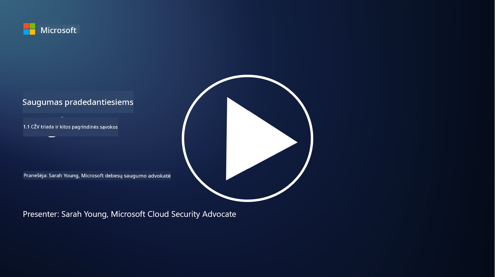
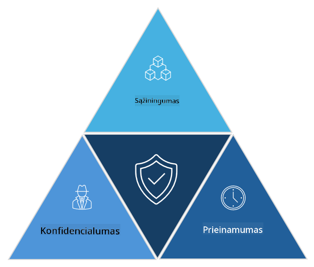

<!--
CO_OP_TRANSLATOR_METADATA:
{
  "original_hash": "16a76f9fa372fb63cffb6d76b855f023",
  "translation_date": "2025-09-03T17:39:18+00:00",
  "source_file": "1.1 The CIA triad and other key concepts.md",
  "language_code": "lt"
}
-->
# CIA triada ir kitos svarbios sąvokos

## Įvadas

Šioje pamokoje aptarsime:

 - Kas yra kibernetinis saugumas?
   
 
 - Kas yra kibernetinio saugumo CIA triada?

   

 - Kas yra autentiškumas, neatsakomumas ir privatumas kibernetinio saugumo kontekste?

## Kas yra kibernetinis saugumas?

Kibernetinis saugumas, dar vadinamas informacijos saugumu, yra praktika, skirta apsaugoti kompiuterines sistemas, tinklus, įrenginius ir duomenis nuo skaitmeninių atakų, neteisėtos prieigos, žalos ar vagystės. Pagrindinis kibernetinio saugumo tikslas yra užtikrinti skaitmeninių išteklių ir informacijos konfidencialumą, vientisumą ir prieinamumą. Kibernetinio saugumo specialistai kuria ir įgyvendina saugumo kontrolės priemones, kad apsaugotų išteklius, duomenis ir informaciją. Kadangi vis daugiau mūsų gyvenimo aspektų tampa skaitmenizuoti ir vyksta internete, kibernetinis saugumas tapo svarbia problema tiek privatiems asmenims, tiek organizacijoms.

## Kas yra kibernetinio saugumo CIA triada?

Kibernetinio saugumo triada reiškia modelį, kuris apima tris pagrindinius aspektus, susijusius su bet kokiu kibernetinio saugumo darbu ar sistemos/aplinkos kūrimu:

### Konfidencialumas

Tai aspektas, kurį dauguma žmonių sieja su terminu „kibernetinis saugumas“: konfidencialumas yra procesas, skirtas apsaugoti duomenis ir informaciją nuo neteisėtų prieigos bandymų, t. y. tik tie žmonės, kuriems reikia matyti informaciją, gali ją pasiekti. Tačiau ne visi duomenys yra vienodi, ir duomenys paprastai klasifikuojami bei saugomi atsižvelgiant į tai, kokią žalą sukeltų jų prieiga netinkamiems asmenims.

### Vientisumas

Tai reiškia duomenų tikslumo ir patikimumo apsaugą aplinkoje, neleidžiant duomenims būti pakeistiems ar koreguotiems neteisėtų asmenų. Pvz., studentas pakeičia savo gimimo datą vairuotojo įraše DMV sistemoje, kad atrodytų vyresnis ir galėtų gauti naują vairuotojo pažymėjimą su ankstesne gimimo data, kad galėtų pirkti alkoholį.

### Prieinamumas

Tai aspektas, svarbus visoje operatyvinėje IT veikloje, tačiau prieinamumas taip pat yra svarbus kibernetiniam saugumui. Yra specifinių atakų tipų, nukreiptų į prieinamumą, nuo kurių saugumo specialistai turi apsisaugoti (pvz., paskirstytos paslaugų atsisakymo – DDoS – atakos).

**Kibernetinio saugumo CIA triada**

## Kas yra autentiškumas, neatsakomumas ir privatumas kibernetinio saugumo kontekste?

Tai yra papildomos svarbios sąvokos, susijusios su sistemų ir duomenų saugumo bei patikimumo užtikrinimu:

**Autentiškumas** - reiškia užtikrinimą, kad informacija, komunikacija ar subjektas, su kuriuo bendraujate, yra tikras ir nebuvo pakeistas ar koreguotas neteisėtų asmenų.

**Neatsakomumas** - tai sąvoka, užtikrinanti, kad šalis negalėtų paneigti savo dalyvavimo ar transakcijos ar komunikacijos autentiškumo. Tai neleidžia kam nors teigti, kad jie nesiuntė žinutės ar neatliko tam tikro veiksmo, kai yra priešingų įrodymų.

**Privatumas** - reiškia jautrios ir asmeniškai identifikuojamos informacijos apsaugą nuo neteisėtos prieigos, naudojimo, atskleidimo ar manipuliavimo. Tai apima kontrolę, kas turi prieigą prie asmeninių duomenų ir kaip tie duomenys yra renkami, saugomi ir dalijami. 

## Papildoma literatūra

[Kas yra informacijos saugumas (InfoSec)? | Microsoft Security](https://www.microsoft.com/security/business/security-101/what-is-information-security-infosec#:~:text=Three%20pillars%20of%20information%20security%3A%20the%20CIA%20triad,as%20guiding%20principles%20for%20implementing%20an%20InfoSec%20plan.)

---

**Atsakomybės apribojimas**:  
Šis dokumentas buvo išverstas naudojant AI vertimo paslaugą [Co-op Translator](https://github.com/Azure/co-op-translator). Nors siekiame tikslumo, prašome atkreipti dėmesį, kad automatiniai vertimai gali turėti klaidų ar netikslumų. Originalus dokumentas jo gimtąja kalba turėtų būti laikomas autoritetingu šaltiniu. Kritinei informacijai rekomenduojama profesionali žmogaus vertimo paslauga. Mes neprisiimame atsakomybės už nesusipratimus ar klaidingus interpretavimus, atsiradusius naudojant šį vertimą.