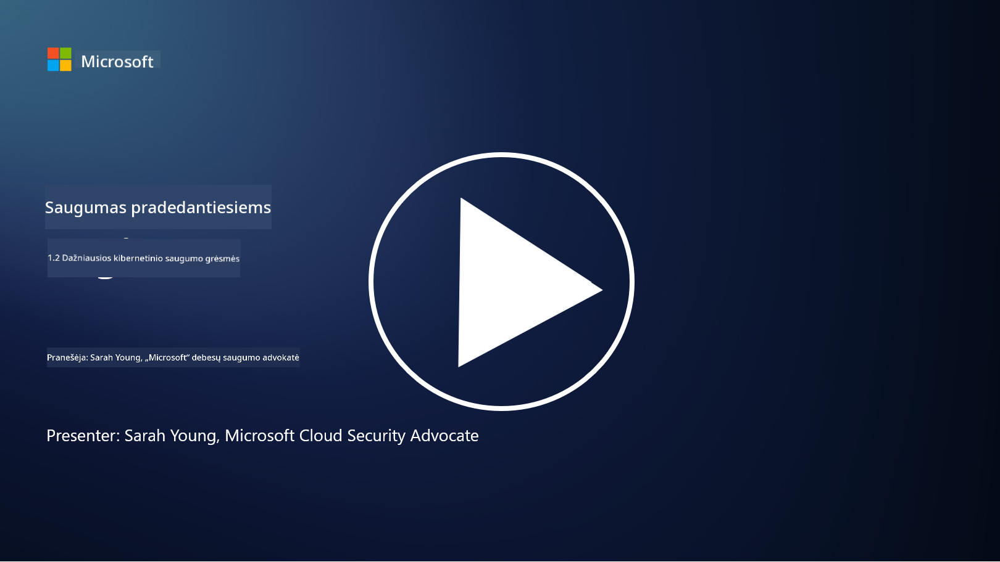

<!--
CO_OP_TRANSLATOR_METADATA:
{
  "original_hash": "6fc3030323139d7134a4ca9d03eccac9",
  "translation_date": "2025-09-03T17:08:54+00:00",
  "source_file": "1.2 Common cybersecurity threats.md",
  "language_code": "lt"
}
-->
# Dažniausios kibernetinio saugumo grėsmės

## Įvadas

Šioje pamokoje aptarsime:

- Kas yra kibernetinio saugumo grėsmė?

- Kodėl piktavaliai nori pažeisti duomenis ir IT sistemas?

- Kokios yra dažniausios kibernetinio saugumo grėsmių rūšys?

- Kas yra MITRE ATT&CK sistema?

- Kur galima sekti naujausias kibernetinio saugumo grėsmes?

## Kas yra kibernetinio saugumo grėsmė?

Kibernetinio saugumo grėsmė – tai bet kokia potenciali rizika ar pavojus, galintis pažeisti duomenų ar IT sistemų konfidencialumą, vientisumą ar prieinamumą. Šias grėsmes kelia piktavaliai, kurie siekia išnaudoti pažeidžiamumus, kad gautų neteisėtą prieigą, pavogtų jautrią informaciją, sutrikdytų veiklą ar padarytų žalos asmenims, organizacijoms ar net valstybėms. Kibernetinio saugumo grėsmės gali būti įvairių formų ir taikytis į skirtingus skaitmeninių sistemų bei duomenų aspektus.

## Kodėl piktavaliai nori pažeisti duomenis ir IT sistemas?

Piktavaliai pažeidžia duomenis ir IT sistemas dėl įvairių priežasčių, dažnai vedami asmeninės naudos, ideologinių motyvų ar noro sukelti sutrikimus. Supratimas apie šiuos motyvus gali padėti organizacijoms ir asmenims geriau apsisaugoti nuo kibernetinių grėsmių. Štai keletas dažniausių priežasčių, kodėl piktavaliai vykdo kibernetines atakas:

1. **Finansinė nauda**: Daugelis atakų yra skatinamos finansinio pelno siekimo. Piktavaliai gali pavogti jautrią informaciją, tokią kaip kreditinių kortelių numeriai, banko sąskaitų duomenys ar asmens tapatybės informacija, kad įvykdytų sukčiavimą, tapatybės vagystę, reikalautų išpirkos arba parduotų pavogtus duomenis tamsiajame internete.

2. **Šnipinėjimas**: Valstybės, konkurentai ar kiti subjektai gali vykdyti kibernetinį šnipinėjimą, siekdami pavogti jautrius vyriausybės, įmonių ar mokslinių tyrimų duomenis politinei, ekonominei ar karinei naudai gauti.

3. **Sutrikdymas ir sabotažas**: Kai kurios atakos siekia sutrikdyti svarbią infrastruktūrą, paslaugas ar veiklą dėl politinių ar ideologinių priežasčių. Tokios atakos gali sukelti plačiai paplitusią sumaištį, finansinius nuostolius ir reputacijos žalą.

4. **Ideologiniai motyvai**: „Hacktivistai“ ir grupės, turinčios ideologinių ar politinių motyvų, gali pažeisti sistemas, siekdami atkreipti dėmesį į tam tikras problemas, propaguoti savo įsitikinimus ar protestuoti prieš konkrečius veiksmus ar organizacijas.

5. **Netyčiniai veiksmai**: Ne visi piktavališki veiksmai yra tyčiniai; kai kurie asmenys gali netyčia prisidėti prie kibernetinių grėsmių, tapdami socialinės inžinerijos aukomis arba būdami dalimi pažeistos tinklo infrastruktūros.

Galų gale, motyvai pažeisti duomenis ir IT sistemas gali būti labai įvairūs, o tokių atakų poveikis gali būti rimtas. Svarbu, kad asmenys, organizacijos ir vyriausybės rimtai žiūrėtų į kibernetinį saugumą ir įgyvendintų priemones, skirtas apsisaugoti nuo šių grėsmių.

## Kokios yra dažniausios kibernetinio saugumo grėsmių rūšys?

Yra keletas dažniausiai pasitaikančių kibernetinių atakų tipų, kuriuos piktavaliai naudoja sistemoms pažeisti, duomenims pavogti ir sutrikimams sukelti. Štai keletas labiausiai paplitusių tipų:

1. **Phishing (sukčiavimas)**:

Phishing – tai apgaulingų el. laiškų ar žinučių siuntimas, kurie atrodo kaip iš patikimų šaltinių, siekiant apgauti gavėjus ir priversti juos atskleisti jautrią informaciją, pvz., slaptažodžius, kreditinių kortelių numerius ar asmeninius duomenis. Phishing taip pat gali nukreipti aukas į kenkėjiškas svetaines arba priversti atsisiųsti kenkėjišką programinę įrangą.

2. **Malware (kenkėjiška programinė įranga)**:

Malware apima įvairias kenkėjiškas programas, skirtas užkrėsti sistemas, pavogti duomenis ar padaryti žalą. Kenkėjiškos programinės įrangos tipai apima:

- **Ransomware**: Užšifruoja failus ir reikalauja išpirkos už jų atkūrimą.

- **Trojanai**: Užmaskuoti kaip teisėta programinė įranga, suteikia piktavaliams neteisėtą prieigą.

- **Virusai**: Savarankiškai plintančios programos, kurios prisijungia prie failų.

- **Kirminai (Worms)**: Savarankiškai plintančios programos, kurios plinta per tinklus.

3. **DoS ir DDoS atakos**:

DoS atakos perkrauna tikslinę sistemą, todėl ji tampa neprieinama vartotojams. DDoS atakos naudoja užkrėstų įrenginių tinklą, kad užtvindytų tikslą srautu, trukdydamos sistemai tinkamai veikti arba visiškai ją sustabdydamos.

4. **SQL injekcija**:

Šios atakos metu piktavaliai manipuliuoja žiniatinklio programos įvesties laukais, kad įterptų kenkėjiškas SQL užklausas, kurios gali suteikti neteisėtą prieigą prie duomenų bazių ir jautrių duomenų.

5. **Cross-Site Scripting (XSS)**:

Piktavaliai įterpia kenkėjiškus scenarijus į žiniatinklio programas, kurie vėliau vykdomi nieko neįtariančių vartotojų naršyklėse. Tai gali lemti vartotojo duomenų vagystę arba kenkėjiškos programinės įrangos plitimą.

6. **Socialinė inžinerija**:

Socialinė inžinerija išnaudoja žmogaus psichologiją, manipuliuodama asmenimis, kad jie atskleistų konfidencialią informaciją arba atliktų veiksmus, kurie pažeidžia saugumą.

7. **Zero-Day (0day) pažeidžiamumai**:

Šios atakos taikosi į programinės ar techninės įrangos pažeidžiamumus, kurie dar nėra žinomi tiekėjui ar visuomenei. Piktavaliai pasinaudoja šiais pažeidžiamumais, kol nėra sukurtos pataisos. Nors zero-day atakos kelia didelį nerimą, jos nėra tokios dažnos kaip kitos šiame sąraše paminėtos atakos. Kai zero-day pažeidžiamumas yra aptinkamas, saugumo tyrėjai greitai kuria pataisas, todėl šios atakos paprastai būna trumpalaikės.

8. **Tapatybės duomenų atakos**:

Šios atakos apima brutalią jėgą (brute force), kai piktavaliai nuolat spėlioja slaptažodžius, ir tapatybės duomenų naudojimą (credential stuffing), kai pavogti prisijungimo duomenys iš vienos svetainės naudojami bandant prisijungti prie kitų svetainių.

## Kas yra MITRE ATT&CK sistema?

[MITRE ATT&CK sistema](https://attack.mitre.org/) (Adversarial Tactics, Techniques, and Common Knowledge) – tai sistema, kataloguojanti ir klasifikuojanti taktikas, technikas ir procedūras (TTP), kurias piktavaliai naudoja kibernetinių atakų metu. Šią sistemą sukūrė MITRE Corporation – ne pelno siekianti organizacija, vykdanti mokslinių tyrimų ir plėtros centrus įvairioms vyriausybinėms agentūroms.

MITRE ATT&CK sistema suteikia standartizuotą būdą aprašyti ir analizuoti kibernetines grėsmes, leidžiant kibernetinio saugumo specialistams geriau suprasti ir apsisaugoti nuo įvairių atakų technikų. Ji plačiai naudojama saugumo komandų, grėsmių medžiotojų ir incidentų tyrėjų:

1. **Suprasti piktavalių elgseną**: Sistema dokumentuoja realaus pasaulio atakų elgseną, aprašydama žingsnius, kuriuos piktavaliai atlieka nuo pradinio įsiskverbimo iki tikslų pasiekimo. Ji apima platų atakų technikų spektrą, naudojamą skirtingų grėsmių grupių.

2. **Planuoti ir įgyvendinti gynybos strategijas**: Saugumo komandos gali naudoti sistemą, kad sukurtų proaktyvias gynybos strategijas, atitinkančias specifines taktikas ir technikas, kurias gali naudoti piktavaliai.

3. **Incidentų tyrimas ir grėsmių medžioklė**: Tiriant incidentus ar vykdant grėsmių medžioklę, saugumo specialistai gali remtis sistema, kad identifikuotų ir sumažintų specifines technikas, kurias naudoja piktavaliai.

MITRE ATT&CK sistema yra organizuota į matricas, kurios grupuoja atakų technikas pagal specifines platformas ir aplinkas, tokias kaip Windows, macOS, Linux ir debesų paslaugos. Kiekviena matrica yra padalinta į taktikas (aukšto lygio tikslus) ir technikas (konkrečius metodus, naudojamus šiems tikslams pasiekti). Kiekvienai technikai sistema pateikia informaciją apie jos veikimą, galimas apsaugos priemones ir nuorodas į realaus pasaulio grėsmių veikėjus, kurie naudojo šią techniką.

Sistema nuolat atnaujinama ir plečiama, kai surenkama nauja grėsmių žvalgybos informacija ir kibernetinio saugumo aplinka keičiasi. Tai vertingas šaltinis, padedantis stiprinti organizacijos kibernetinio saugumo būklę, leidžiantis giliau suprasti, kaip veikia piktavaliai, ir kaip apsisaugoti nuo jų taktikų.

## Kur galima sekti naujausias kibernetinio saugumo grėsmes?

Yra daug šaltinių, kuriuos galima naudoti norint sekti naujausias kibernetinio saugumo grėsmes. Štai keletas jų:

- [Open Web Application Security Project (OWASP) top 10 pažeidžiamumų](https://owasp.org/Top10/)
- [Common Vulnerabilities and Exposures (CVEs)](https://www.bing.com/ck/a?!&&p=53df6007f017bca2JmltdHM9MTY5MjU3NjAwMCZpZ3VpZD0zYmY4N2RiYS1jYWI1LTYwMDgtMWY1YS02ZmYyY2JjNjYxZWUmaW5zaWQ9NTc2OQ&ptn=3&hsh=3&fclid=3bf87dba-cab5-6008-1f5a-6ff2cbc661ee&psq=cve&u=a1aHR0cHM6Ly9iaW5nLmNvbS9hbGluay9saW5rP3VybD1odHRwcyUzYSUyZiUyZmN2ZS5taXRyZS5vcmclMmYmc291cmNlPXNlcnAtcnImaD1BZXN4S0VBWTNnbGhNZEFpd3daMlNSZkZQNTlrODhIUnYxRUtlSkY1RTk0JTNkJnA9a2tvZmZjaWFsd2Vic2l0ZQ&ntb=1 "Common Vulnerabilities and Exposures")
- [Microsoft Security Response Center tinklaraščiai](https://msrc.microsoft.com/blog/)
- [National Institute of Standards and Technology (NIST)](https://www.dhs.gov/topics/cybersecurity): NIST teikia išteklius, įspėjimus ir naujausią informaciją apie galimas kibernetinio saugumo grėsmes.
- [Cybersecurity and Infrastructure Security Agency (CISA)](https://www.cisa.gov/resources-tools/resources/free-cybersecurity-services-and-tools): CISA teikia kibernetinio saugumo išteklius ir geriausias praktikas verslui, vyriausybinėms agentūroms ir kitoms organizacijoms. CISA dalijasi naujausia informacija apie didelės įtakos saugumo veiklą, paveikiančią plačią bendruomenę, ir išsamia analize apie naujas ir besivystančias kibernetines grėsmes.
- [National Cybersecurity Center of Excellence (NCCoE)](https://www.dhs.gov/topics/cybersecurity): NCCoE yra centras, teikiantis praktinius kibernetinio saugumo sprendimus, kuriuos galima pritaikyti realiose situacijose.
- [US-CERT](https://www.cisa.gov/resources-tools/resources/free-cybersecurity-services-and-tools): Jungtinių Valstijų Kompiuterinio avarinio reagavimo komanda (US-CERT) teikia įvairius kibernetinio saugumo išteklius, įskaitant įspėjimus, patarimus ir kt.
- Jūsų šalies Kibernetinio reagavimo komanda (CERT).

---

**Atsakomybės apribojimas**:  
Šis dokumentas buvo išverstas naudojant AI vertimo paslaugą [Co-op Translator](https://github.com/Azure/co-op-translator). Nors siekiame tikslumo, prašome atkreipti dėmesį, kad automatiniai vertimai gali turėti klaidų ar netikslumų. Originalus dokumentas jo gimtąja kalba turėtų būti laikomas autoritetingu šaltiniu. Dėl svarbios informacijos rekomenduojama profesionali žmogaus vertimo paslauga. Mes neprisiimame atsakomybės už nesusipratimus ar klaidingus aiškinimus, atsiradusius naudojant šį vertimą.