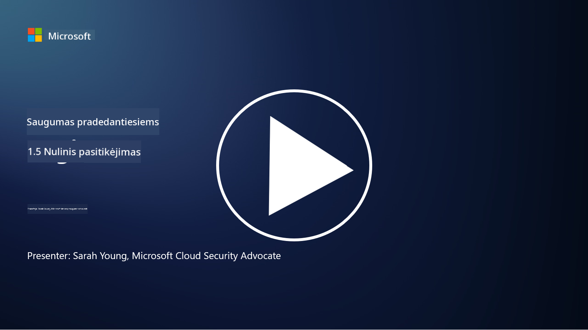
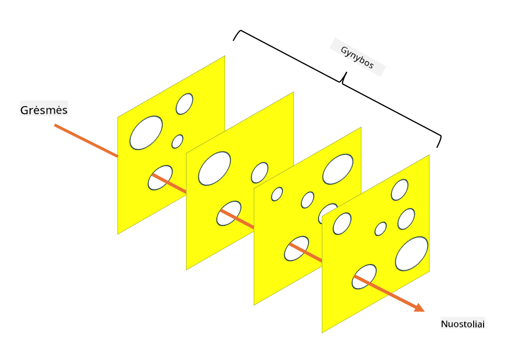

<!--
CO_OP_TRANSLATOR_METADATA:
{
  "original_hash": "75f77f972d2233c584f87c1eb96c983b",
  "translation_date": "2025-09-03T17:16:22+00:00",
  "source_file": "1.5 Zero trust.md",
  "language_code": "lt"
}
-->
# Zero Trust

„Zero trust“ – tai frazė, kuri pastaruoju metu dažnai vartojama saugumo srityje. Bet ką ji reiškia? Ar tai tik madingas žodis? Šioje pamokoje gilinsimės į tai, kas iš tikrųjų yra „zero trust“.

## Įvadas

 - Šioje pamokoje aptarsime:
   
   
 - Kas yra „zero trust“?

   
  

 - Kaip „zero trust“ skiriasi nuo tradicinių saugumo architektūrų?

   
   

 - Kas yra gynyba gyliais?

## Zero Trust

„Zero Trust“ – tai kibernetinio saugumo požiūris, kuris meta iššūkį tradiciniam „pasitikėk, bet patikrink“ principui, laikydamas, kad jokiam subjektui, nesvarbu, ar jis yra organizacijos tinklo viduje, ar išorėje, negalima iš anksto pasitikėti. Vietoj to, „Zero Trust“ skatina tikrinti kiekvieną vartotoją, įrenginį ir programą, kurie bando pasiekti išteklius, nepriklausomai nuo jų buvimo vietos. Pagrindinis „Zero Trust“ principas – sumažinti „atakos paviršių“ ir sumažinti saugumo pažeidimų poveikį.

„Zero Trust“ modelyje akcentuojami šie principai:

1. **Tapatybės patikrinimas**: Autentifikacija ir autorizacija griežtai taikoma visiems vartotojams ir įrenginiams, nepriklausomai nuo jų buvimo vietos. Atminkite, kad tapatybė nebūtinai yra žmogus – tai gali būti įrenginys, programa ir pan.

2. **Minimalūs privilegijos**: Vartotojams ir įrenginiams suteikiama tik minimali prieiga, reikalinga jų užduotims atlikti, taip sumažinant galimą žalą, jei jie būtų pažeisti.

3. **Mikrosegmentacija**: Tinklo ištekliai suskirstomi į mažesnius segmentus, kad būtų apribotas šoninis judėjimas tinkle pažeidimo atveju.

4. **Nuolatinis stebėjimas**: Vartotojų ir įrenginių elgesys nuolat stebimas ir analizuojamas, siekiant aptikti anomalijas ir galimas grėsmes. Naudojant šiuolaikinius stebėjimo metodus, taip pat pasitelkiamas mašininis mokymasis, dirbtinis intelektas ir grėsmių žvalgyba, kad stebėjimas būtų išsamesnis ir kontekstualus.

5. **Duomenų šifravimas**: Duomenys šifruojami tiek perduodant, tiek saugant, kad būtų užkirstas kelias neteisėtai prieigai.

6. **Griežta prieigos kontrolė**: Prieigos kontrolė taikoma atsižvelgiant į kontekstą, pvz., vartotojo vaidmenis, įrenginio būklę ir tinklo vietą.

„Microsoft“ „Zero Trust“ skirsto į penkis pagrindinius ramsčius, kuriuos aptarsime vėlesnėje pamokoje.

## Skirtumai nuo tradicinių saugumo architektūrų

„Zero Trust“ skiriasi nuo tradicinių saugumo architektūrų, tokių kaip perimetro modeliai, keliais aspektais:

1. **Perimetras vs. tapatybės centriškumas**: Tradiciniai modeliai orientuojasi į tinklo perimetro apsaugą ir mano, kad vidiniai vartotojai ir įrenginiai gali būti patikimi, kai jau yra viduje. „Zero Trust“, priešingai, mano, kad grėsmės gali kilti tiek iš tinklo vidaus, tiek iš išorės, ir taiko griežtą tapatybės pagrindu veikiančią kontrolę.

2. **Numanomas vs. aiškus pasitikėjimas**: Tradiciniai modeliai numanomai pasitiki tinklo viduje esančiais įrenginiais ir vartotojais, kol neįrodyta kitaip. „Zero Trust“ aiškiai tikrina tapatybes ir nuolat stebi anomalijas.

3. **Plokščias vs. segmentuotas tinklas**: Tradicinės architektūros dažnai apima plokščius tinklus, kuriuose vidiniai vartotojai turi plačią prieigą. „Zero Trust“ skatina tinklo segmentavimą į mažesnes, izoliuotas zonas, kad būtų apriboti galimi pažeidimai.

4. **Reaktyvus vs. proaktyvus**: Tradicinis saugumas dažnai remiasi reaktyviomis priemonėmis, tokiomis kaip perimetro ugniasienės ir įsilaužimų aptikimas. „Zero Trust“ taiko proaktyvų požiūrį, laikydamas, kad pažeidimai yra tikėtini, ir siekia sumažinti jų poveikį.

## Gynyba gyliais

Gynyba gyliais, dar vadinama sluoksniuotu saugumu, yra kibernetinio saugumo strategija, apimanti daugybės saugumo kontrolės ir priemonių diegimą, siekiant apsaugoti organizacijos turtą. Tikslas – sukurti persidengiančius apsaugos sluoksnius, kad, jei vienas sluoksnis būtų pažeistas, kiti vis dar galėtų užtikrinti apsaugą. Kiekvienas sluoksnis orientuojasi į skirtingą saugumo aspektą ir padidina bendrą organizacijos saugumo lygį.

Gynyba gyliais apima technines, procedūrines ir fizines saugumo priemones. Tai gali būti ugniasienės, įsilaužimų aptikimo sistemos, prieigos kontrolė, šifravimas, vartotojų mokymai, saugumo politikos ir kt. Idėja – sukurti daugybę barjerų, kurie kartu apsunkintų užpuolikams organizacijos sistemų ir tinklų pažeidimą. Tai taip pat kartais vadinama „šveicariško sūrio“ modeliu, kuris naudojamas nelaimių prevencijai kitose pramonės šakose (pvz., transporte).

## Papildoma literatūra

[Kas yra Zero Trust?](https://learn.microsoft.com/security/zero-trust/zero-trust-overview?WT.mc_id=academic-96948-sayoung)

[Evoliucionuojantis Zero Trust – Microsoft pozicijos dokumentas](https://query.prod.cms.rt.microsoft.com/cms/api/am/binary/RWJJdT?WT.mc_id=academic-96948-sayoung)

[Zero Trust ir BeyondCorp Google Cloud | Google Cloud tinklaraštis](https://cloud.google.com/blog/topics/developers-practitioners/zero-trust-and-beyondcorp-google-cloud)

---

**Atsakomybės apribojimas**:  
Šis dokumentas buvo išverstas naudojant AI vertimo paslaugą [Co-op Translator](https://github.com/Azure/co-op-translator). Nors siekiame tikslumo, prašome atkreipti dėmesį, kad automatiniai vertimai gali turėti klaidų ar netikslumų. Originalus dokumentas jo gimtąja kalba turėtų būti laikomas autoritetingu šaltiniu. Kritinei informacijai rekomenduojama profesionali žmogaus vertimo paslauga. Mes neprisiimame atsakomybės už nesusipratimus ar klaidingus interpretavimus, atsiradusius naudojant šį vertimą.