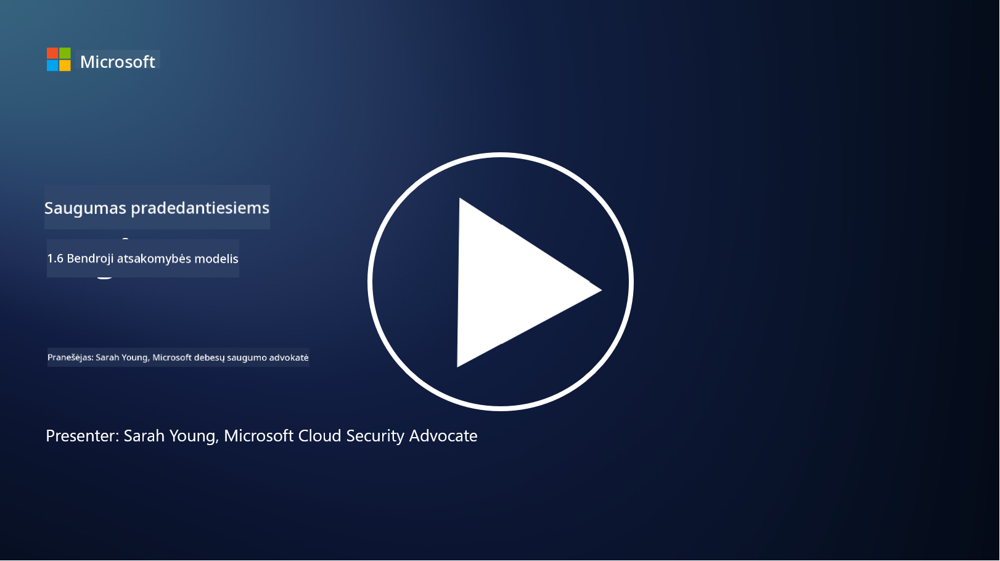

<!--
CO_OP_TRANSLATOR_METADATA:
{
  "original_hash": "a48db640d80c786b928ca178c414f084",
  "translation_date": "2025-09-03T17:26:52+00:00",
  "source_file": "1.6 Shared responsibility model.md",
  "language_code": "lt"
}
-->
# Bendroji atsakomybės modelis

Bendroji atsakomybė yra naujesnė IT sąvoka, atsiradusi kartu su debesų kompiuterijos plėtra. Kibernetinio saugumo požiūriu labai svarbu suprasti, kas užtikrina kokias saugumo priemones, kad būtų išvengta gynybos spragų.

## Įvadas

Šioje pamokoje aptarsime:

 - Kas yra bendroji atsakomybė kibernetinio saugumo kontekste?
   
 - Kuo skiriasi bendroji atsakomybė už saugumo priemones tarp IaaS, PaaS ir SaaS?

 - Kur galima sužinoti, kokias saugumo priemones teikia jūsų debesų platforma?

 - Kas yra „pasitikėk, bet tikrink“?

## Kas yra bendroji atsakomybė kibernetinio saugumo kontekste?

Bendroji atsakomybė kibernetiniame saugume reiškia saugumo atsakomybių pasidalijimą tarp debesų paslaugų teikėjo (CSP) ir jo klientų. Debesų kompiuterijos aplinkose, tokiose kaip infrastruktūra kaip paslauga (IaaS), platforma kaip paslauga (PaaS) ir programinė įranga kaip paslauga (SaaS), tiek CSP, tiek klientas turi savo vaidmenis užtikrinant duomenų, programų ir sistemų saugumą.

## Kuo skiriasi bendroji atsakomybė už saugumo priemones tarp IaaS, PaaS ir SaaS?

Atsakomybių pasidalijimas paprastai priklauso nuo naudojamos debesų paslaugos tipo:

 - **IaaS (infrastruktūra kaip paslauga)**: CSP teikia pagrindinę infrastruktūrą (serverius, tinklus, saugyklas), o klientas atsako už operacinių sistemų, programų ir saugumo konfigūracijų valdymą šioje infrastruktūroje.
   
 - **PaaS (platforma kaip paslauga):** CSP siūlo platformą, kurioje klientai gali kurti ir diegti programas. CSP valdo pagrindinę infrastruktūrą, o klientas koncentruojasi į programų kūrimą ir duomenų saugumą.

 - **SaaS (programinė įranga kaip paslauga):** CSP teikia visiškai veikiančias programas, prieinamas internetu. Šiuo atveju CSP atsako už programos ir infrastruktūros saugumą, o klientas valdo naudotojų prieigą ir duomenų naudojimą.

Suprasti bendrąją atsakomybę yra labai svarbu, nes tai padeda išsiaiškinti, kurios saugumo priemonės yra padengtos CSP, o kurias reikia užtikrinti klientui. Tai padeda išvengti nesusipratimų ir užtikrina, kad saugumo priemonės būtų įgyvendintos visapusiškai.

## Kur galima sužinoti, kokias saugumo priemones teikia jūsų debesų platforma?

Norėdami sužinoti, kokias saugumo priemones teikia jūsų debesų platforma, turite peržiūrėti debesų paslaugų teikėjo dokumentaciją ir išteklius. Tai apima:

 - **CSP svetainę ir dokumentaciją**: CSP svetainėje pateikiama informacija apie saugumo funkcijas ir priemones, kurios yra jų paslaugų dalis. CSP dažnai siūlo išsamią dokumentaciją, kurioje paaiškinamos jų saugumo praktikos, priemonės ir rekomendacijos. Tai gali apimti baltąsias knygas, saugumo vadovus ir techninę dokumentaciją.
   
 - **Saugumo vertinimai ir auditai**: dauguma CSP leidžia nepriklausomiems saugumo ekspertams ir organizacijoms įvertinti jų saugumo priemones. Šios apžvalgos gali suteikti įžvalgų apie CSP saugumo priemonių kokybę. Kartais tai lemia, kad CSP gauna saugumo atitikties sertifikatą (žr. kitą punktą).
   
 - **Saugumo atitikties sertifikatai**: dauguma CSP gauna tokius sertifikatus kaip ISO:27001, SOC 2, FedRAMP ir kt. Šie sertifikatai rodo, kad teikėjas atitinka tam tikrus saugumo ir atitikties standartus.

Atminkite, kad informacijos detalumas ir prieinamumas gali skirtis tarp debesų paslaugų teikėjų. Visada įsitikinkite, kad konsultuojatės su oficialiais ir naujausiais debesų paslaugų teikėjo pateiktais ištekliais, kad galėtumėte priimti pagrįstus sprendimus dėl savo debesų pagrindu veikiančių išteklių saugumo.

## Kas yra „pasitikėk, bet tikrink“?

Naudojant CSP, trečiųjų šalių programinę įrangą ar kitas IT saugumo paslaugas, organizacija gali iš pradžių pasitikėti teikėjo teiginiais apie saugumo priemones. Tačiau norint užtikrinti savo duomenų ir sistemų saugumą, būtina patikrinti šiuos teiginius atliekant saugumo vertinimus, įsiskverbimo testus ir peržiūrint išorinės šalies saugumo priemones prieš visiškai integruojant programinę įrangą ar paslaugą į savo veiklą. Visi asmenys ir organizacijos turėtų siekti pasitikėti, bet tikrinti saugumo priemones, už kurias jie nėra atsakingi.

## Bendroji atsakomybė organizacijos viduje

Atminkite, kad bendroji atsakomybė už saugumą organizacijos viduje taip pat turi būti įvertinta. Saugumo komanda retai pati įgyvendina visas priemones ir turi bendradarbiauti su operacijų komandomis, kūrėjais ir kitomis verslo dalimis, kad būtų įgyvendintos visos reikalingos saugumo priemonės organizacijos saugumui užtikrinti.

## Papildoma literatūra
- [Bendroji atsakomybė debesyje – Microsoft Azure | Microsoft Learn](https://learn.microsoft.com/azure/security/fundamentals/shared-responsibility?WT.mc_id=academic-96948-sayoung)
- [Kas yra bendroji atsakomybės modelis? – Apibrėžimas iš TechTarget.com](https://www.techtarget.com/searchcloudcomputing/definition/shared-responsibility-model)
- [Bendroji atsakomybės modelis paaiškintas ir ką jis reiškia debesų saugumui | CSO Online](https://www.csoonline.com/article/570779/the-shared-responsibility-model-explained-and-what-it-means-for-cloud-security.html)
- [Bendroji atsakomybė už debesų saugumą: ką reikia žinoti (cisecurity.org)](https://www.cisecurity.org/insights/blog/shared-responsibility-cloud-security-what-you-need-to-know)

---

**Atsakomybės apribojimas**:  
Šis dokumentas buvo išverstas naudojant AI vertimo paslaugą [Co-op Translator](https://github.com/Azure/co-op-translator). Nors siekiame tikslumo, prašome atkreipti dėmesį, kad automatiniai vertimai gali turėti klaidų ar netikslumų. Originalus dokumentas jo gimtąja kalba turėtų būti laikomas autoritetingu šaltiniu. Kritinei informacijai rekomenduojama naudoti profesionalų žmogaus vertimą. Mes neprisiimame atsakomybės už nesusipratimus ar klaidingus interpretavimus, atsiradusius dėl šio vertimo naudojimo.