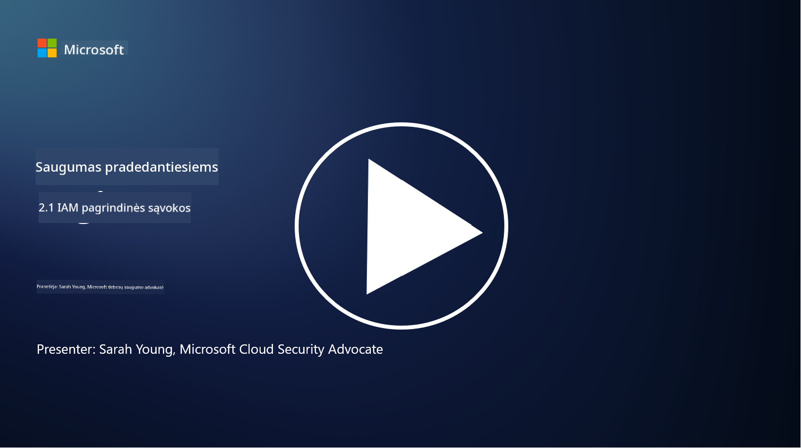

<!--
CO_OP_TRANSLATOR_METADATA:
{
  "original_hash": "2e3864e3d579f0dbb4ac2ec8c5f82acf",
  "translation_date": "2025-09-03T16:55:30+00:00",
  "source_file": "2.1 IAM key concepts.md",
  "language_code": "lt"
}
-->
# IAM pagrindinės sąvokos

Ar kada nors prisijungėte prie kompiuterio ar svetainės? Žinoma, kad taip! Tai reiškia, jog jau naudojotės tapatybės kontrolėmis savo kasdieniniame gyvenime. Tapatybės ir prieigos valdymas (IAM) yra svarbus saugumo ramstis, apie kurį sužinosime daugiau per ateinančias pamokas.

**Įvadas**

Šioje pamokoje aptarsime:

- Ką reiškia tapatybės ir prieigos valdymas (IAM) kibernetinio saugumo kontekste?

- Kas yra mažiausių privilegijų principas?

- Kas yra pareigų atskyrimas?

- Kas yra autentifikavimas ir autorizacija?

## Ką reiškia tapatybės ir prieigos valdymas (IAM) kibernetinio saugumo kontekste?

Tapatybės ir prieigos valdymas (IAM) apima procesų, technologijų ir politikų rinkinį, kuris užtikrina, kad tinkami asmenys turėtų atitinkamą prieigą prie organizacijos skaitmeninės aplinkos išteklių. IAM apima skaitmeninių tapatybių (vartotojų, darbuotojų, partnerių) valdymą ir jų prieigą prie sistemų, programų, duomenų ir tinklų. Pagrindinis IAM tikslas yra sustiprinti saugumą, supaprastinti vartotojų prieigą ir užtikrinti atitiktį organizacijos politikoms bei reglamentams. IAM sprendimai paprastai apima vartotojų autentifikavimą, autorizaciją, tapatybės suteikimą, prieigos kontrolę ir vartotojų gyvavimo ciklo valdymą (užtikrinant, kad paskyros būtų ištrintos, kai jos nebenaudojamos).

## Kas yra mažiausių privilegijų principas?

Mažiausių privilegijų principas yra pagrindinė koncepcija, kuri skatina suteikti vartotojams ir sistemoms tik minimalias privilegijas, būtinas jų užduotims ar vaidmenims atlikti. Šis principas padeda sumažinti galimą žalą, kuri gali kilti dėl saugumo pažeidimo ar vidinės grėsmės. Laikydamiesi mažiausių privilegijų principo, organizacijos sumažina atakos paviršių ir riziką, susijusią su neteisėta prieiga, duomenų pažeidimais ir netyčiniu privilegijų naudojimu. Praktikoje tai reiškia, kad vartotojams suteikiama prieiga tik prie konkrečių išteklių ir funkcijų, reikalingų jų darbo vaidmenims, ir nieko daugiau. Pavyzdžiui, jei jums reikia tik perskaityti dokumentą, būtų perteklinė suteikti jums pilnas administratoriaus privilegijas tam dokumentui.

## Kas yra pareigų atskyrimas?

Pareigų atskyrimas yra principas, skirtas užkirsti kelią interesų konfliktams ir sumažinti sukčiavimo bei klaidų riziką, paskirstant kritines užduotis ir atsakomybes skirtingiems asmenims organizacijoje. Kibernetinio saugumo kontekste pareigų atskyrimas reiškia, kad nė vienas asmuo neturėtų kontroliuoti visų kritinio proceso ar sistemos aspektų. Tikslas yra sukurti patikrinimų ir balansų sistemą, kuri neleistų vienam asmeniui atlikti tiek nustatymo, tiek patvirtinimo etapų procese. Pavyzdžiui, finansinėse sistemose tai gali reikšti, kad asmuo, kuris įveda operacijas į sistemą, neturėtų būti tas pats asmuo, kuris patvirtina tas operacijas. Tai sumažina riziką, kad neteisėti ar sukčiavimo veiksmai liks nepastebėti.

## Kas yra autentifikavimas ir autorizacija?

Autentifikavimas ir autorizacija yra dvi pagrindinės kibernetinio saugumo sąvokos, kurios atlieka svarbų vaidmenį užtikrinant kompiuterinių sistemų ir duomenų saugumą bei vientisumą. Jos dažnai naudojamos kartu, siekiant kontroliuoti prieigą prie išteklių ir apsaugoti jautrią informaciją.

**1. Autentifikavimas**: Autentifikavimas yra procesas, kurio metu patvirtinama vartotojo, sistemos ar subjekto, bandančio pasiekti kompiuterinę sistemą ar konkretų išteklių, tapatybė. Tai užtikrina, kad teigiama tapatybė yra tikra ir tiksli. Autentifikavimo metodai paprastai apima vieną ar daugiau iš šių veiksnių:

   a. Kažkas, ką žinote: Tai apima slaptažodžius, PIN kodus ar kitą slaptą informaciją, kurią turėtų žinoti tik įgaliotas vartotojas.

   b. Kažkas, ką turite: Tai apima fizinius žetonus ar įrenginius, tokius kaip išmaniosios kortelės, saugumo žetonai ar mobilieji telefonai, naudojami vartotojo tapatybei patvirtinti.

   c. Kažkas, kas esate: Tai apima biometrinius veiksnius, tokius kaip pirštų atspaudai, veido atpažinimas ar tinklainės skenavimas, kurie yra unikalūs asmeniui.

Autentifikavimo mechanizmai naudojami tam, kad būtų patvirtinta, jog vartotojas yra tas, kuo jis teigia esąs, prieš leidžiant prieigą prie sistemos ar išteklių. Tai padeda užkirsti kelią neteisėtai prieigai ir užtikrina, kad tik teisėti vartotojai galėtų atlikti veiksmus sistemoje.

**2. Autorizacija**: Autorizacija yra procesas, kurio metu autentifikuotiems vartotojams ar subjektams suteikiami arba atimami konkretūs leidimai ir privilegijos, kai jų tapatybė jau patvirtinta. Tai nustato, kokius veiksmus ar operacijas vartotojas gali atlikti sistemoje ar su konkrečiais ištekliais. Autorizacija dažnai grindžiama iš anksto nustatytomis politikomis, prieigos kontrolės taisyklėmis ir vartotojams priskirtais vaidmenimis.

Autorizaciją galima laikyti atsakymu į klausimą „Ką autentifikuotas vartotojas gali daryti?“ Ji apima prieigos kontrolės politikų apibrėžimą ir vykdymą, siekiant apsaugoti jautrius duomenis ir išteklius nuo neteisėtos prieigos ar pakeitimų.

**Apibendrinant:**

- Autentifikavimas nustato vartotojų ar subjektų tapatybę.
- Autorizacija nustato, kokius veiksmus ir išteklius autentifikuoti vartotojai gali pasiekti ar keisti.

## Papildoma literatūra

- [Describe identity concepts - Training | Microsoft Learn](https://learn.microsoft.com/training/modules/describe-identity-principles-concepts/?WT.mc_id=academic-96948-sayoung)
- [Introduction to identity - Microsoft Entra | Microsoft Learn](https://learn.microsoft.com/azure/active-directory/fundamentals/identity-fundamental-concepts?WT.mc_id=academic-96948-sayoung)
- [What is Identity Access Management (IAM)? | Microsoft Security](https://www.microsoft.com/security/business/security-101/what-is-identity-access-management-iam?WT.mc_id=academic-96948-sayoung)
- [What is IAM? Identity and access management explained | CSO Online](https://www.csoonline.com/article/518296/what-is-iam-identity-and-access-management-explained.html)
- [What is IAM? (auth0.com)](https://auth0.com/blog/what-is-iam/)
- [Security+: implementing Identity and Access Management (IAM) controls [updated 2021] | Infosec (infosecinstitute.com)](https://resources.infosecinstitute.com/certifications/securityplus/security-implementing-identity-and-access-management-iam-controls/)
- [least privilege - Glossary | CSRC (nist.gov)](https://csrc.nist.gov/glossary/term/least_privilege)
- [Security: The Principle of Least Privilege (POLP) - Microsoft Community Hub](https://techcommunity.microsoft.com/t5/azure-sql-blog/security-the-principle-of-least-privilege-polp/ba-p/2067390?WT.mc_id=academic-96948-sayoung)
- [Principle of least privilege | CERT NZ](https://www.cert.govt.nz/it-specialists/critical-controls/principle-of-least-privilege/)
- [Why is separation of duties required by NIST 800-171 and CMMC? - (totem.tech)](https://www.totem.tech/cmmc-separation-of-duties/)

---

**Atsakomybės apribojimas**:  
Šis dokumentas buvo išverstas naudojant AI vertimo paslaugą [Co-op Translator](https://github.com/Azure/co-op-translator). Nors siekiame tikslumo, prašome atkreipti dėmesį, kad automatiniai vertimai gali turėti klaidų ar netikslumų. Originalus dokumentas jo gimtąja kalba turėtų būti laikomas autoritetingu šaltiniu. Kritinei informacijai rekomenduojama profesionali žmogaus vertimo paslauga. Mes neprisiimame atsakomybės už nesusipratimus ar klaidingus interpretavimus, atsiradusius naudojant šį vertimą.