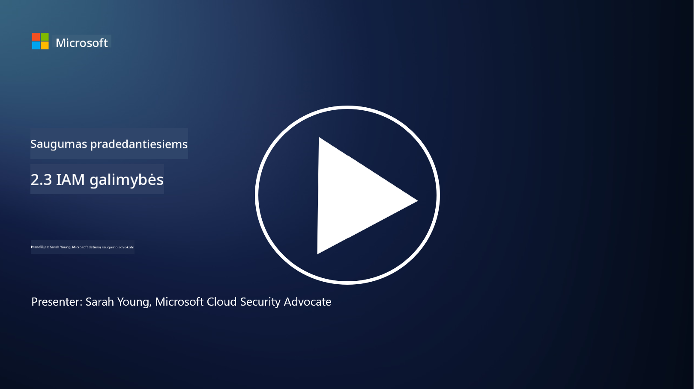

<!--
CO_OP_TRANSLATOR_METADATA:
{
  "original_hash": "bf0b8a54f2c69951744df5a94bc923f7",
  "translation_date": "2025-09-03T17:50:15+00:00",
  "source_file": "2.3 IAM capabilities.md",
  "language_code": "lt"
}
-->
# IAM galimybės

Šiame skyriuje aptarsime išsamiau pagrindinius įrankius ir galimybes, naudojamus tapatybės saugumui užtikrinti.

## Įvadas

Šioje pamokoje aptarsime:

 - Kas yra katalogų paslauga?
      
     
    
 - Kokios galimybės gali būti naudojamos tapatybėms apsaugoti?
>
>        Daugiafaktorė autentifikacija (MFA)
> 
>        Vieno prisijungimo sistema (SSO)
> 
>        Prieigos kontrolė pagal vaidmenis (RBAC)
> 
>        Adaptyvi autentifikacija
> 
>        Biometrinė autentifikacija
> 
>        Privilegijuotos prieigos valdymas (PAM)
> 
>        Tapatybės valdymas ir administravimas (IGA)
> 
>        Elgsenos analizė

## Kas yra katalogų paslauga?

Katalogų paslauga yra specializuota duomenų bazė, kuri saugo ir valdo informaciją apie tinklo išteklius, įskaitant vartotojus, grupes, įrenginius, programas ir kitus objektus. Ji veikia kaip centralizuotas tapatybės ir prieigos duomenų saugojimo šaltinis, leidžiantis organizacijoms efektyviai valdyti vartotojų autentifikaciją, autorizaciją ir kitus su saugumu susijusius uždavinius.

Katalogų paslaugos atlieka svarbų vaidmenį šiuolaikinėse IT aplinkose, suteikdamos pagrindą tapatybės ir prieigos valdymo (IAM) sprendimams. Jos palengvina saugų prieigą prie išteklių, užtikrina prieigos politikų laikymąsi ir supaprastina administracines užduotis. Viena iš geriausiai žinomų katalogų paslaugų yra „Microsoft Active Directory“, tačiau yra ir kitų sprendimų, tokių kaip LDAP (Lightweight Directory Access Protocol) katalogai, kurie atlieka panašias funkcijas.

Pagrindinės katalogų paslaugos funkcijos ir ypatybės kibernetinio saugumo kontekste:

 - **Vartotojų autentifikacija**: Katalogų paslaugos patikrina vartotojų kredencialus (pvz., vartotojo vardą ir slaptažodį), kad užtikrintų, jog prie tinklo ir jo išteklių gali prisijungti tik autorizuoti vartotojai.
 - **Vartotojų autorizacija**: Jos nustato, kokio lygio prieigą turi kiekvienas vartotojas, remiantis jų vaidmeniu, grupės naryste ir kitais atributais. Tai užtikrina, kad vartotojai galėtų pasiekti tik tuos išteklius, kuriems jie turi teisę.
 - **Grupių valdymas**: Katalogų paslaugos leidžia administratoriams organizuoti vartotojus į logines grupes, supaprastinant prieigos kontrolės valdymą. Leidimai gali būti priskirti grupėms, o ne atskiriems vartotojams.
 - **Slaptažodžių politikos**: Jos užtikrina slaptažodžių sudėtingumo ir galiojimo taisyklių laikymąsi, stiprinant vartotojų paskyrų saugumą.
 - **Vieno prisijungimo sistema (SSO)**: Kai kurios katalogų paslaugos palaiko SSO, leidžiant vartotojams pasiekti kelias programas ir paslaugas naudojant vieną kredencialų rinkinį.
 - **Centralizuotas vartotojų valdymas**: Katalogų paslaugos centralizuoja vartotojų informaciją, palengvindamos paskyrų, profilių ir atributų valdymą iš vienos vietos.
 - **Auditas ir registravimas**: Jos gali registruoti vartotojų autentifikacijos ir prieigos veiklas, padėdamos saugumo auditams ir atitikties užtikrinimui.

## Kokios galimybės gali būti naudojamos tapatybėms apsaugoti?

**Daugiafaktorė autentifikacija (MFA)**

MFA reikalauja, kad vartotojai pateiktų kelias patvirtinimo formas prieš suteikiant prieigą. Tai paprastai apima tai, ką vartotojas žino (slaptažodis), tai, ką vartotojas turi (išmanusis telefonas ar saugumo žetonas), ir tai, kas vartotojas yra (biometriniai duomenys, pvz., pirštų atspaudas ar veido atpažinimas).

**Vieno prisijungimo sistema (SSO)**

SSO leidžia vartotojams pasiekti kelias programas ir sistemas naudojant vieną kredencialų rinkinį. Tai pagerina vartotojo patirtį ir sumažina riziką, susijusią su daugybės slaptažodžių valdymu.

**Prieigos kontrolė pagal vaidmenis (RBAC)**

RBAC priskiria leidimus pagal iš anksto nustatytus vaidmenis. Vartotojams suteikiama prieiga remiantis jų vaidmenimis organizacijoje.

**Adaptyvi autentifikacija**

Adaptyvi autentifikacija vertina rizikos veiksnius, tokius kaip vieta, įrenginys, prieigos laikas ir vartotojo elgsena, kad dinamiškai pritaikytų reikiamą autentifikacijos lygį. Jei užklausa atrodo įtartina, gali būti aktyvuoti papildomi autentifikacijos žingsniai.

**Biometrinė autentifikacija**

Biometrinė autentifikacija naudoja unikalius biologinius požymius, tokius kaip pirštų atspaudai, veido bruožai, balso modeliai ir net elgsenos ypatybės, pvz., spausdinimo greitis, tapatybės patvirtinimui.

**Privilegijuotos prieigos valdymas (PAM)**

PAM orientuojasi į prieigos prie kritinių sistemų ir duomenų apsaugą, taikant griežtą kontrolę privilegijuotoms paskyroms. Tai apima funkcijas, tokias kaip prieiga „tik laiku“ ir sesijų stebėjimas.

**Tapatybės valdymas ir administravimas (IGA)**

IGA sprendimai valdo vartotojų tapatybes ir jų prieigą prie išteklių viso jų gyvavimo ciklo metu. Tai apima įdarbinimą, teikimą, prieigos kontrolę pagal vaidmenis ir paskyrų panaikinimą.

**Elgsenos analizė**

Elgsenos analizė stebi vartotojų elgseną ir nustato bazinius modelius. Nukrypimai nuo normos gali sukelti įspėjimus tolimesniam tyrimui.

# Papildoma literatūra
- [Azure Active Directory pagrindų dokumentacija - Microsoft Entra | Microsoft Learn](https://learn.microsoft.com/azure/active-directory/fundamentals/?WT.mc_id=academic-96948-sayoung)
- [Kas yra Azure Active Directory? - Microsoft Entra | Microsoft Learn](https://learn.microsoft.com/azure/active-directory/fundamentals/whatis?WT.mc_id=academic-96948-sayoung)
- [Valdykite savo daugiadebesinę tapatybės infrastruktūrą su Microsoft Entra - YouTube](https://www.youtube.com/watch?v=9qQiq3wTS2Y&list=PLXtHYVsvn_b_gtX1-NB62wNervQx1Fhp4&index=18)

---

**Atsakomybės apribojimas**:  
Šis dokumentas buvo išverstas naudojant AI vertimo paslaugą [Co-op Translator](https://github.com/Azure/co-op-translator). Nors stengiamės užtikrinti tikslumą, prašome atkreipti dėmesį, kad automatiniai vertimai gali turėti klaidų ar netikslumų. Originalus dokumentas jo gimtąja kalba turėtų būti laikomas autoritetingu šaltiniu. Dėl svarbios informacijos rekomenduojama profesionali žmogaus vertimo paslauga. Mes neprisiimame atsakomybės už nesusipratimus ar klaidingus interpretavimus, atsiradusius naudojant šį vertimą.