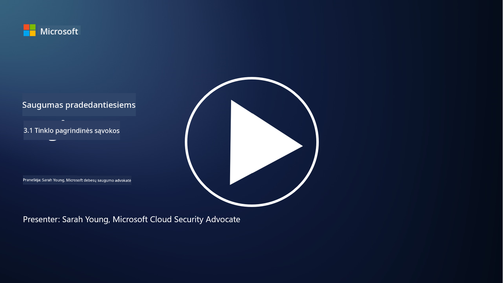
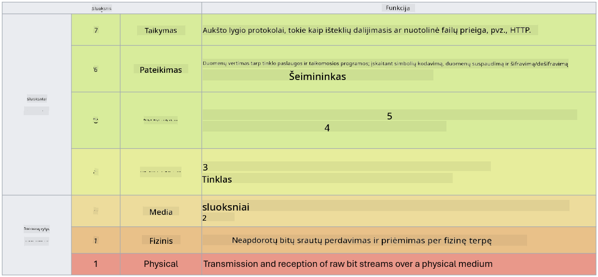

<!--
CO_OP_TRANSLATOR_METADATA:
{
  "original_hash": "252724eceeb183fb9018f88c5e1a3f0c",
  "translation_date": "2025-09-03T17:48:00+00:00",
  "source_file": "3.1 Networking key concepts.md",
  "language_code": "lt"
}
-->
# Pagrindinės tinklų sąvokos

Jei dirbote IT srityje, tikėtina, kad susidūrėte su tinklų sąvokomis. Nors šiuolaikinėje aplinkoje tapatybė yra pagrindinė apsaugos priemonė, tai nereiškia, kad tinklo kontrolės priemonės yra nereikalingos. Nors tai labai plati tema, šiame pamokoje aptarsime keletą pagrindinių tinklų sąvokų.

Šioje pamokoje aptarsime:

- Kas yra IP adresavimas?

- Kas yra OSI modelis?

- Kas yra TCP/UDP?

- Kas yra prievadų numeriai?

- Kas yra duomenų šifravimas saugojimo metu ir perdavimo metu?

## Kas yra IP adresavimas?

IP adresavimas, arba interneto protokolo adresavimas, yra skaitmeninis identifikatorius, priskiriamas kiekvienam įrenginiui, prijungtam prie kompiuterių tinklo, kuris naudoja interneto protokolą komunikacijai. Jis veikia kaip unikalus įrenginio identifikatorius tinkle, leidžiantis siųsti ir gauti duomenis per internetą ar kitus sujungtus tinklus. Yra dvi pagrindinės IP adresavimo versijos: IPv4 (interneto protokolo versija 4) ir IPv6 (interneto protokolo versija 6). IP adresas paprastai pateikiamas IPv4 formatu (pvz., 192.168.1.1) arba IPv6 formatu (pvz., 2001:0db8:85a3:0000:0000:8a2e:0370:7334).

## Kas yra OSI modelis?

OSI (Open Systems Interconnection) modelis yra konceptualus pagrindas, standartizuojantis komunikacijos sistemos funkcijas į septynis atskirus sluoksnius. Kiekvienas sluoksnis atlieka specifines užduotis ir bendrauja su gretimais sluoksniais, kad užtikrintų efektyvų ir patikimą duomenų perdavimą tarp įrenginių tinkle. Sluoksniai, nuo apačios iki viršaus, yra šie:

1. Fizinis sluoksnis

2. Duomenų ryšio sluoksnis

3. Tinklo sluoksnis

4. Transporto sluoksnis

5. Sesijos sluoksnis

6. Pateikimo sluoksnis

7. Programų sluoksnis

OSI modelis suteikia bendrą pagrindą suprasti, kaip tinklų protokolai ir technologijos sąveikauja, nepriklausomai nuo konkrečių techninės ar programinės įrangos įgyvendinimų.

_ref: https://en.wikipedia.org/wiki/OSI_model_

## Kas yra TCP/UDP?

TCP (Transmission Control Protocol) ir UDP (User Datagram Protocol) yra du pagrindiniai transporto sluoksnio protokolai, naudojami kompiuterių tinkluose, kad palengvintų komunikaciją tarp įrenginių per internetą ar vietinį tinklą. Jie atsakingi už duomenų suskaidymą į paketus perdavimui ir šių paketų surinkimą į originalius duomenis gavimo pusėje. Tačiau jie skiriasi savo savybėmis ir naudojimo atvejais.

**TCP (Transmission Control Protocol)**:

TCP yra ryšio orientuotas protokolas, užtikrinantis patikimą ir tvarkingą duomenų perdavimą tarp įrenginių. Jis užmezga ryšį tarp siuntėjo ir gavėjo prieš pradedant duomenų mainus. TCP užtikrina, kad duomenų paketai atvyktų teisinga tvarka ir gali pakartotinai perduoti prarastus paketus, kad garantuotų duomenų vientisumą ir pilnumą. Tai daro TCP tinkamu programoms, kurioms reikalingas patikimas duomenų perdavimas, pvz., naršymui internete, el. paštui, failų perdavimui (FTP) ir duomenų bazių komunikacijai.

**UDP (User Datagram Protocol)**:

UDP yra ryšio nesusijęs protokolas, siūlantis greitesnį duomenų perdavimą, tačiau neužtikrinantis tokio patikimumo kaip TCP. Jis neužmezga oficialaus ryšio prieš siunčiant duomenis ir neturi mechanizmų prarastų paketų patvirtinimui ar pakartotiniam perdavimui. UDP tinkamas programoms, kuriose greitis ir efektyvumas yra svarbesni nei garantuotas pristatymas, pvz., realaus laiko komunikacijai, medijos transliacijai, internetiniams žaidimams ir DNS užklausoms.

Apibendrinant, TCP prioritetą teikia patikimumui ir tvarkingam pristatymui, todėl jis tinkamas programoms, kurioms reikalingas duomenų tikslumas, o UDP akcentuoja greitį ir efektyvumą, todėl jis tinkamas programoms, kuriose nedidelis duomenų praradimas ar tvarkos pakeitimas yra priimtinas mainais už mažesnį vėlavimą. Pasirinkimas tarp TCP ir UDP priklauso nuo konkrečių programos ar paslaugos reikalavimų.

## Kas yra prievadų numeriai?

Tinkluose prievado numeris yra skaitmeninis identifikatorius, naudojamas atskirti skirtingas paslaugas ar programas, veikiančias viename įrenginyje tinkle. Prievadai padeda nukreipti gaunamus duomenis į tinkamą programą. Prievadų numeriai yra 16 bitų sveikieji skaičiai, kurie svyruoja nuo 0 iki 65535. Jie skirstomi į tris diapazonus:

- Gerai žinomi prievadai (0-1023): Rezervuoti standartinėms paslaugoms, tokioms kaip HTTP (prievadas 80) ir FTP (prievadas 21).

- Registruoti prievadai (1024-49151): Naudojami programoms ir paslaugoms, kurios nėra gerai žinomų prievadų diapazone, bet yra oficialiai registruotos.

- Dinaminiai/privatūs prievadai (49152-65535): Galimi laikinam ar privačiam naudojimui programoms.

## Kas yra duomenų šifravimas saugojimo metu ir perdavimo metu?

Šifravimas yra procesas, kurio metu duomenys paverčiami saugiu formatu, kad būtų apsaugoti nuo neteisėtos prieigos ar pakeitimo. Šifravimas gali būti taikomas duomenims tiek „saugojimo metu“ (kai jie saugomi įrenginyje ar serveryje), tiek „perdavimo metu“ (kai jie perduodami tarp įrenginių ar per tinklus).

Šifravimas saugojimo metu: Tai apima duomenų šifravimą, kurie saugomi įrenginiuose, serveriuose ar saugojimo sistemose. Net jei užpuolikas gauna fizinę prieigą prie saugojimo laikmenos, jis negali pasiekti duomenų be šifravimo raktų. Tai labai svarbu apsaugant jautrius duomenis nuo įrenginių vagystės, duomenų nutekėjimo ar neteisėtos prieigos.

Šifravimas perdavimo metu: Tai apima duomenų šifravimą, kai jie keliauja tarp įrenginių ar per tinklus. Tai apsaugo nuo duomenų perėmimo ir neteisėto peržiūrėjimo perdavimo metu. Dažniausiai naudojami protokolai šifravimui perdavimo metu yra HTTPS interneto komunikacijai ir TLS/SSL įvairių tipų tinklo srautui apsaugoti.

## Papildoma literatūra
- [Kaip veikia IP adresai? (howtogeek.com)](https://www.howtogeek.com/341307/how-do-ip-addresses-work/)
- [IP adresų supratimas: Įvadinis vadovas (geekflare.com)](https://geekflare.com/understanding-ip-address/)
- [Kas yra OSI modelis? 7 OSI sluoksniai paaiškinti (techtarget.com)](https://www.techtarget.com/searchnetworking/definition/OSI)
- [OSI modelis – 7 tinklų sluoksniai paaiškinti paprasta kalba (freecodecamp.org)](https://www.freecodecamp.org/news/osi-model-networking-layers-explained-in-plain-english/)
- [TCP/IP protokolai - IBM dokumentacija](https://www.ibm.com/docs/en/aix/7.3?topic=protocol-tcpip-protocols)
- [Dažniausių prievadų apgaulės lapas: Galutinis prievadų ir protokolų sąrašas (stationx.net)](https://www.stationx.net/common-ports-cheat-sheet/)
- [Azure duomenų šifravimas saugojimo metu - Azure saugumas | Microsoft Learn](https://learn.microsoft.com/azure/security/fundamentals/encryption-atrest?WT.mc_id=academic-96948-sayoung)

---

**Atsakomybės apribojimas**:  
Šis dokumentas buvo išverstas naudojant AI vertimo paslaugą [Co-op Translator](https://github.com/Azure/co-op-translator). Nors siekiame tikslumo, prašome atkreipti dėmesį, kad automatiniai vertimai gali turėti klaidų ar netikslumų. Originalus dokumentas jo gimtąja kalba turėtų būti laikomas autoritetingu šaltiniu. Kritinei informacijai rekomenduojama profesionali žmogaus vertimo paslauga. Mes neprisiimame atsakomybės už nesusipratimus ar klaidingus interpretavimus, atsiradusius naudojant šį vertimą.