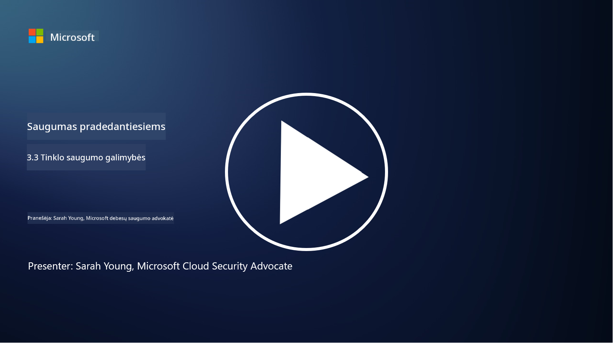

<!--
CO_OP_TRANSLATOR_METADATA:
{
  "original_hash": "c3aba077bb98eebc925dd58d870229ab",
  "translation_date": "2025-09-03T17:12:08+00:00",
  "source_file": "3.3 Network security capabilities.md",
  "language_code": "lt"
}
-->
# Tinklo saugumo galimybės

Šioje pamokoje sužinosime apie šias galimybes, kurios gali būti naudojamos tinklo saugumui užtikrinti:

 - Tradicinės ugniasienės
 - Žiniatinklio programų ugniasienės
 - Debesų saugumo grupės
 - CDN
 - Apkrovos balansavimo įrenginiai
 - Bastiono serveriai
 - VPN
 - DDoS apsauga

## Tradicinės ugniasienės

Tradicinės ugniasienės yra saugumo įrenginiai, kurie kontroliuoja ir stebi įeinantį bei išeinantį tinklo srautą pagal iš anksto nustatytas saugumo taisykles. Jos veikia kaip barjeras tarp patikimo vidinio tinklo ir nepatikimų išorinių tinklų, filtruodamos srautą, kad būtų išvengta neteisėtos prieigos ir galimų grėsmių.

## Žiniatinklio programų ugniasienės

Žiniatinklio programų ugniasienės (WAF) yra specializuotos ugniasienės, skirtos apsaugoti žiniatinklio programas nuo įvairių atakų, tokių kaip SQL injekcijos, tarpsvetaininis scenarijų vykdymas ir kitos pažeidžiamumo formos. Jos analizuoja HTTP užklausas ir atsakymus, siekdamos nustatyti ir blokuoti kenkėjišką srautą, nukreiptą į žiniatinklio programas.

## Debesų saugumo grupės

Saugumo grupės yra pagrindinė tinklo saugumo funkcija, kurią teikia debesų paslaugų tiekėjai. Jos veikia kaip virtualios ugniasienės, kontroliuojančios įeinantį ir išeinantį srautą į ir iš debesų išteklių, tokių kaip virtualios mašinos (VM) ir instancijos. Saugumo grupės leidžia organizacijoms nustatyti taisykles, kurios apibrėžia, kokio tipo srautas yra leidžiamas ar draudžiamas, taip suteikiant papildomą apsaugos sluoksnį debesų diegimams.

## Turinio pristatymo tinklas (CDN)

Turinio pristatymo tinklas yra paskirstytas serverių tinklas, išdėstytas įvairiose geografinėse vietovėse. CDN padeda pagerinti svetainių našumą ir prieinamumą, talpindamas turinį ir pateikdamas jį iš serverių, esančių arčiau naudotojo. Jie taip pat suteikia tam tikrą apsaugą nuo DDoS atakų, paskirstydami srautą per kelias serverių vietas.

## Apkrovos balansavimo įrenginiai

Apkrovos balansavimo įrenginiai paskirsto įeinantį tinklo srautą tarp kelių serverių, siekiant optimizuoti išteklių naudojimą, užtikrinti aukštą prieinamumą ir pagerinti programų našumą. Jie padeda išvengti serverių perkrovos ir palaiko efektyvų atsako laiką, didindami tinklo atsparumą.

## Bastiono serveriai

Bastiono serveriai yra labai saugūs ir izoliuoti serveriai, kurie suteikia kontroliuojamą prieigą prie tinklo iš išorinio, nepatikimo tinklo (pvz., interneto). Jie veikia kaip įėjimo taškai administratoriams, leidžiant saugiai pasiekti vidines sistemas. Bastiono serveriai paprastai konfigūruojami su stipriomis saugumo priemonėmis, siekiant sumažinti atakų paviršių.

## Virtualūs privatūs tinklai (VPN)

VPN sukuria užšifruotus tunelius tarp naudotojo įrenginio ir nuotolinio serverio, užtikrindami saugų ir privatų ryšį per potencialiai nesaugius tinklus, tokius kaip internetas. VPN dažnai naudojami suteikti nuotolinę prieigą prie vidinių tinklų, leidžiant naudotojams pasiekti išteklius taip, tarsi jie būtų fiziškai tame pačiame tinkle.

## DDoS apsaugos įrankiai

DDoS (paskirstytos paslaugų trikdymo) apsaugos įrankiai ir paslaugos yra sukurti siekiant sumažinti DDoS atakų poveikį, kai keli užkrėsti įrenginiai užtvindo tinklą ar paslaugą, siekdami ją perkrauti. DDoS apsaugos sprendimai identifikuoja ir filtruoja kenkėjišką srautą, užtikrindami, kad teisėtas srautas vis tiek pasiektų savo tikslą.

## Papildoma literatūra

- [Kas yra ugniasienė? - Cisco](https://www.cisco.com/c/en/us/products/security/firewalls/what-is-a-firewall.html#~types-of-firewalls)
- [Ką iš tikrųjų daro ugniasienė? (howtogeek.com)](https://www.howtogeek.com/144269/htg-explains-what-firewalls-actually-do/)
- [Kas yra ugniasienė? Kaip veikia ugniasienės ir jų tipai (kaspersky.com)](https://www.kaspersky.com/resource-center/definitions/firewall)
- [Tinklo saugumo grupė - kaip ji veikia | Microsoft Learn](https://learn.microsoft.com/azure/virtual-network/network-security-group-how-it-works)
- [Įvadas į „Azure“ turinio pristatymo tinklą (CDN) - Mokymai | Microsoft Learn](https://learn.microsoft.com/training/modules/intro-to-azure-content-delivery-network/?WT.mc_id=academic-96948-sayoung)
- [Kas yra turinio pristatymo tinklas (CDN)? - Azure | Microsoft Learn](https://learn.microsoft.com/azure/cdn/cdn-overview?WT.mc_id=academic-96948-sayoung)
- [Kas yra apkrovos balansavimas? Kaip veikia apkrovos balansavimo įrenginiai (nginx.com)](https://www.nginx.com/resources/glossary/load-balancing/)
- [Bastiono serveriai vs. VPN · Tailscale](https://tailscale.com/learn/bastion-hosts-vs-vpns/)
- [Kas yra VPN? Kaip jis veikia, VPN tipai (kaspersky.com)](https://www.kaspersky.com/resource-center/definitions/what-is-a-vpn)
- [Įvadas į „Azure“ DDoS apsaugą - Mokymai | Microsoft Learn](https://learn.microsoft.com/training/modules/introduction-azure-ddos-protection/?WT.mc_id=academic-96948-sayoung)
- [Kas yra DDoS ataka? | Microsoft Security](https://www.microsoft.com/security/business/security-101/what-is-a-ddos-attack?WT.mc_id=academic-96948-sayoung)

---

**Atsakomybės apribojimas**:  
Šis dokumentas buvo išverstas naudojant AI vertimo paslaugą [Co-op Translator](https://github.com/Azure/co-op-translator). Nors siekiame tikslumo, prašome atkreipti dėmesį, kad automatiniai vertimai gali turėti klaidų ar netikslumų. Originalus dokumentas jo gimtąja kalba turėtų būti laikomas autoritetingu šaltiniu. Kritinei informacijai rekomenduojama profesionali žmogaus vertimo paslauga. Mes neprisiimame atsakomybės už nesusipratimus ar klaidingus interpretavimus, atsiradusius dėl šio vertimo naudojimo.