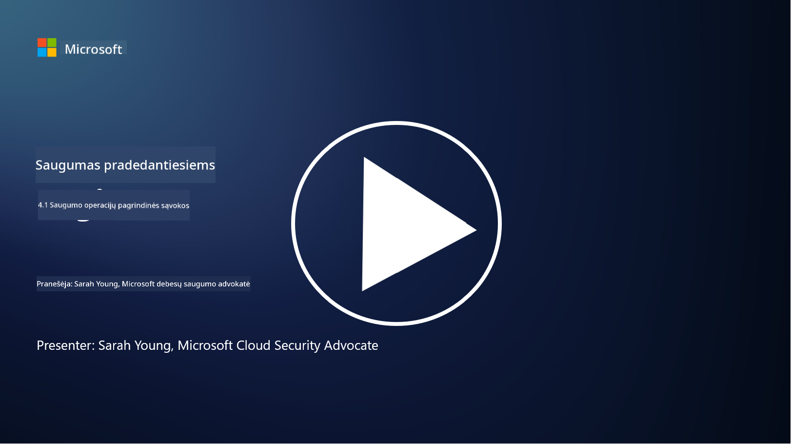

<!--
CO_OP_TRANSLATOR_METADATA:
{
  "original_hash": "6a55b31df9eebf550d040cef0ef7dff3",
  "translation_date": "2025-09-03T17:52:10+00:00",
  "source_file": "4.1 SecOps key concepts.md",
  "language_code": "lt"
}
-->
# Saugos operacijų pagrindinės sąvokos

Saugos operacijos yra svarbi organizacijos bendros saugumo funkcijos dalis. Šioje pamokoje sužinosime daugiau apie tai:

 - Kas yra saugos operacijų funkcija versle?
   
 - Kokias formas gali turėti saugos operacijos?
   
   - Kaip saugos operacijos skiriasi nuo tradicinių IT operacijų?

## Kas yra saugos operacijų funkcija versle?

Saugos operacijų funkcija versle reiškia specializuotą komandą ar departamentą, atsakingą už kibernetinių grėsmių ir incidentų stebėjimą, aptikimą, tyrimą ir reagavimą. Pagrindinis saugos operacijų funkcijos tikslas yra užtikrinti organizacijos skaitmeninio turto konfidencialumą, vientisumą ir prieinamumą, aktyviai identifikuojant ir mažinant saugumo rizikas bei efektyviai reaguojant į saugumo incidentus.

## Kokias formas gali turėti saugos operacijos?

Saugos operacijos gali turėti įvairias formas, priklausomai nuo organizacijos dydžio ir sudėtingumo. Dažniausios formos yra:

**Saugos operacijų centras (SOC):** Centralizuota komanda, atsakinga už 24/7 stebėjimą, analizę ir reagavimą į saugumo įvykius. SOC dažnai naudoja pažangius įrankius ir technologijas, kad realiu laiku identifikuotų ir reaguotų į grėsmes.

**Incidentų reagavimo komanda:** Specializuota komanda, orientuota į saugumo incidentų ir pažeidimų sprendimą. Jie atlieka tyrimus, koordinuoja reagavimo veiksmus ir palengvina atsigavimą.

**Grėsmių paieškos komanda:** Komanda, kuri aktyviai ieško pažangių grėsmių ir paslėptų pažeidžiamumų, kurių tradiciniai saugumo įrankiai gali neaptikti.

**Raudonoji komanda/Mėlynoji komanda:** Raudonoji komanda simuliuoja atakas, kad identifikuotų pažeidžiamumus, o mėlynoji komanda gina nuo šių atakų. Abi komandos dirba kartu, kad pagerintų saugumo priemones.

**Valdomų saugumo paslaugų teikėjas (MSSP):** Kai kurios organizacijos perduoda savo saugos operacijas trečiosioms šalims, kurios specializuojasi saugumo stebėjime ir incidentų sprendime.

## Kaip saugos operacijos skiriasi nuo tradicinių IT operacijų?

Saugos operacijos ir tradicinės IT operacijos yra susijusios, tačiau skirtingos funkcijos:

**Fokusas:** IT operacijos orientuojasi į organizacijos IT infrastruktūros valdymą ir palaikymą, užtikrinant jos funkcionalumą ir prieinamumą. Saugos operacijos, priešingai, prioritetą teikia saugumo rizikų identifikavimui ir mažinimui bei reagavimui į incidentus.

**Atsakomybės:** IT operacijos apima užduotis, tokias kaip sistemos priežiūra, programinės įrangos atnaujinimai ir vartotojų palaikymas. Saugos operacijos apima grėsmių aptikimą, incidentų sprendimą, pažeidžiamumų valdymą ir saugumo stebėjimą.

**Laiko svarba:** IT operacijos pabrėžia momentinį sistemos prieinamumą ir našumą. Saugos operacijos orientuojasi į grėsmių identifikavimą ir šalinimą, kas ne visada sutampa su momentiniu prieinamumu.

**Įgūdžių rinkinys:** Saugos operacijoms reikalingi specializuoti įgūdžiai, tokie kaip grėsmių analizė, incidentų sprendimas ir kibernetinio saugumo įrankių naudojimas. IT operacijoms reikalinga ekspertizė sistemos administravime, tinklo valdyme ir programų palaikyme.

## Incidentų sprendimo darbo eiga

NIST kibernetinio saugumo pagrindinių funkcijų sąrašas apima penkias pagrindines funkcijas, kurios turėtų būti nuolat atliekamos kaip organizacijos operacinės aplinkos dalis, siekiant sumažinti kibernetinio saugumo riziką.

Svarbu suprasti, kad šios veiklos turėtų būti integruotos į platesnį organizacijos kibernetinio saugumo procesų ratą ir su jais suderintos.

**Pastaba:** Daugiau apie NIST kibernetinio saugumo pagrindus galite skaityti [https://www.nist.gov/cybersecurity](https://www.nist.gov/cybersecurity)

## Papildoma literatūra

- [Saugos operacijos | Microsoft Learn](https://learn.microsoft.com/security/operations/overview?WT.mc_id=academic-96948-sayoung)
- [Saugos operacijų procesų įgyvendinimas | Microsoft Learn](https://learn.microsoft.com/security/operations/?WT.mc_id=academic-96948-sayoung)
- [Kas yra saugos operacijų centras (SOC)? | Microsoft Security](https://www.microsoft.com/security/business/security-101/what-is-a-security-operations-center-soc?WT.mc_id=academic-96948-sayoung)
- [Kas yra saugos operacijų centras | Kibernetinis saugumas | CompTIA](https://www.comptia.org/content/articles/what-is-a-security-operations-center)

---

**Atsakomybės apribojimas**:  
Šis dokumentas buvo išverstas naudojant AI vertimo paslaugą [Co-op Translator](https://github.com/Azure/co-op-translator). Nors siekiame tikslumo, prašome atkreipti dėmesį, kad automatiniai vertimai gali turėti klaidų ar netikslumų. Originalus dokumentas jo gimtąja kalba turėtų būti laikomas autoritetingu šaltiniu. Kritinei informacijai rekomenduojama profesionali žmogaus vertimo paslauga. Mes neprisiimame atsakomybės už nesusipratimus ar klaidingus interpretavimus, atsiradusius naudojant šį vertimą.