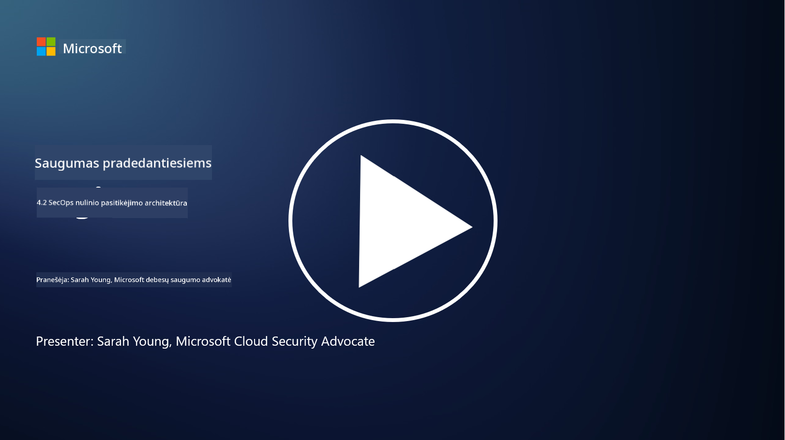

<!--
CO_OP_TRANSLATOR_METADATA:
{
  "original_hash": "45bbdc114e70936816b0b3e7c40189cf",
  "translation_date": "2025-09-03T17:32:11+00:00",
  "source_file": "4.2 SecOps zero trust architecture.md",
  "language_code": "lt"
}
-->
# SecOps nulinio pasitikėjimo architektūra

Saugumo operacijos sudaro dvi nulinio pasitikėjimo architektūros dalis, ir šiame pamokoje sužinosime apie abi:

- Kaip IT architektūros turi būti sukurtos, kad būtų galima centralizuotai rinkti žurnalus?

- Kokios yra geriausios saugumo operacijų praktikos šiuolaikinėse IT aplinkose?

## Kaip IT architektūros turi būti sukurtos, kad būtų galima centralizuotai rinkti žurnalus?

Centralizuotas žurnalų rinkimas yra esminė šiuolaikinių saugumo operacijų dalis. Tai leidžia organizacijoms surinkti žurnalus ir duomenis iš įvairių šaltinių, tokių kaip serveriai, programos, tinklo įrenginiai ir saugumo įrankiai, į centrinį saugyklą analizei, stebėjimui ir incidentų valdymui. Štai keletas geriausių praktikų, kaip kurti IT architektūras, palaikančias centralizuotą žurnalų rinkimą:

1. **Žurnalų šaltinių integracija**:

- Užtikrinkite, kad visi svarbūs įrenginiai ir sistemos būtų sukonfigūruoti generuoti žurnalus. Tai apima serverius, ugniasienes, maršrutizatorius, komutatorius, programas ir saugumo įrenginius.

- Sujunkite žurnalų šaltinius taip, kad jie perduotų žurnalus į centralizuotą žurnalų rinkimo ar valdymo sistemą.

2. **Pasirinkite tinkamą SIEM (Saugumo informacijos ir įvykių valdymo) įrankį**:

- Pasirinkite SIEM sprendimą, kuris atitinka jūsų organizacijos poreikius ir mastą.

- Užtikrinkite, kad pasirinktas sprendimas palaikytų žurnalų rinkimą, agregavimą, analizę ir ataskaitų teikimą.

3. **Mastelio didinimas ir atsparumas**:

- Sukurkite architektūrą, kuri būtų pritaikyta augančiam žurnalų šaltinių skaičiui ir didėjančiam žurnalų kiekiui.

- Įgyvendinkite atsparumo mechanizmus, kad užtikrintumėte aukštą prieinamumą ir išvengtumėte trikdžių dėl aparatūros ar tinklo gedimų.

4. **Saugus žurnalų perdavimas**:

- Naudokite saugius protokolus, tokius kaip TLS/SSL ar IPsec, žurnalų perdavimui iš šaltinių į centralizuotą saugyklą.

- Įgyvendinkite autentifikavimo ir prieigos kontrolės mechanizmus, kad tik įgalioti įrenginiai galėtų siųsti žurnalus.

5. **Normalizavimas**:

- Standartizuokite žurnalų formatus ir normalizuokite duomenis, kad būtų užtikrintas nuoseklumas ir lengvesnė analizė.

6. **Saugojimas ir išlaikymas**:

- Nustatykite tinkamą žurnalų saugojimo laikotarpį pagal atitikties ir saugumo reikalavimus.

- Saugokite žurnalus saugiai, apsaugodami juos nuo neteisėtos prieigos ir klastojimo.

## Kokios yra geriausios saugumo operacijų praktikos šiuolaikinėse IT aplinkose?

Be centralizuoto žurnalų rinkimo, štai keletas geriausių saugumo operacijų praktikų šiuolaikinėse IT aplinkose:

1. **Nuolatinis stebėjimas**: Įgyvendinkite nuolatinį tinklo ir sistemų veiklos stebėjimą, kad realiuoju laiku aptiktumėte ir reaguotumėte į grėsmes.

2. **Grėsmių žvalgyba**: Nuolat sekite naujas grėsmes ir pažeidžiamumus, naudodamiesi grėsmių žvalgybos kanalais ir paslaugomis.

3. **Vartotojų mokymai**: Reguliariai vykdykite saugumo sąmoningumo mokymus darbuotojams, kad sumažintumėte socialinės inžinerijos ir sukčiavimo riziką.

4. **Incidentų valdymo planas**: Sukurkite ir išbandykite incidentų valdymo planą, kad užtikrintumėte greitą ir veiksmingą reagavimą į saugumo incidentus.

5. **Saugumo automatizavimas**: Naudokite saugumo automatizavimo ir orkestravimo įrankius, kad supaprastintumėte incidentų valdymą ir pasikartojančias užduotis.

6. **Atsarginės kopijos ir atkūrimas**: Įgyvendinkite patikimus atsarginių kopijų ir atkūrimo sprendimus, kad užtikrintumėte duomenų prieinamumą praradimo ar išpirkos reikalavimo atakų atveju.

## Papildoma literatūra

- [Microsoft Security Best Practices module: Security operations | Microsoft Learn](https://learn.microsoft.com/security/operations/security-operations-videos-and-decks?WT.mc_id=academic-96948-sayoung)
- [Security operations - Cloud Adoption Framework | Microsoft Learn](https://learn.microsoft.com/azure/cloud-adoption-framework/secure/security-operations?WT.mc_id=academic-96948-sayoung)
- [What is Security Operations and Analytics Platform Architecture? A Definition of SOAPA, How It Works, Benefits, and More (digitalguardian.com)](https://www.digitalguardian.com/blog/what-security-operations-and-analytics-platform-architecture-definition-soapa-how-it-works#:~:text=All%20in%20all%2C%20security%20operations%20and%20analytics%20platform,become%20more%20efficient%20and%20operative%20with%20your%20security.)

---

**Atsakomybės atsisakymas**:  
Šis dokumentas buvo išverstas naudojant AI vertimo paslaugą [Co-op Translator](https://github.com/Azure/co-op-translator). Nors siekiame tikslumo, prašome atkreipti dėmesį, kad automatiniai vertimai gali turėti klaidų ar netikslumų. Originalus dokumentas jo gimtąja kalba turėtų būti laikomas autoritetingu šaltiniu. Kritinei informacijai rekomenduojama naudoti profesionalų žmogaus vertimą. Mes neprisiimame atsakomybės už nesusipratimus ar neteisingus aiškinimus, atsiradusius dėl šio vertimo naudojimo.